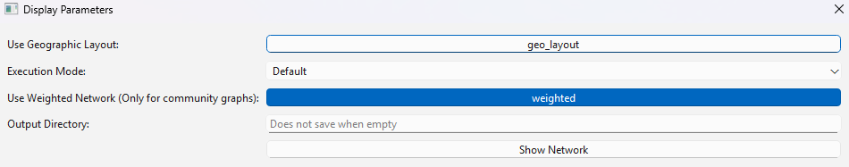
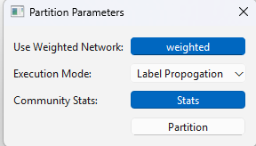
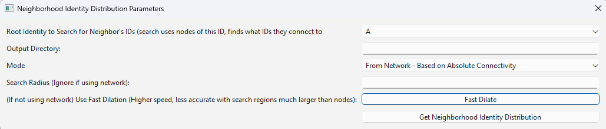
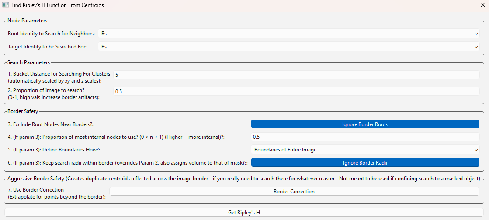
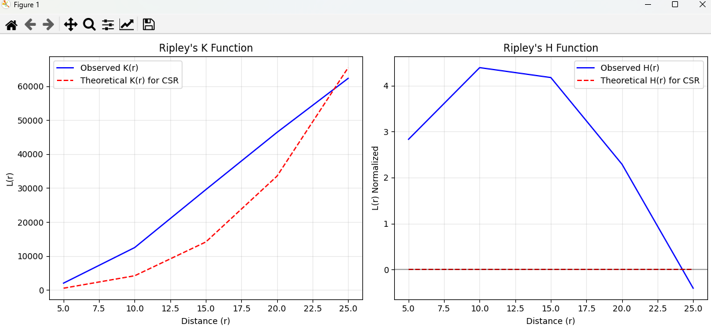
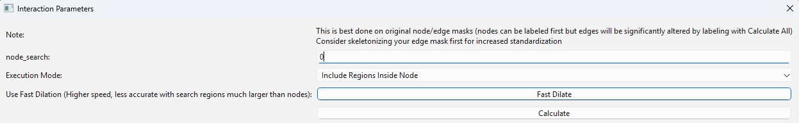
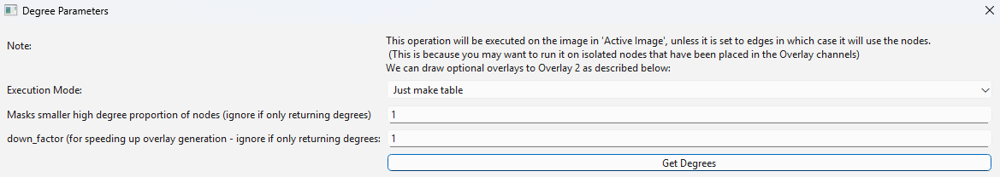

.. _analyze_menu:

==========
All Analyze Menu Options
==========

The Analyze Menu offers options for creating graphs and statistical tables.

* The first submenu is the network menu, which has functions for visualizing networks and analyzing network communities.

'Analyze -> Network -> Show Network'
-------------------------------

* Use this function to visualize the method in an interactable matplotlib graph.
* Note that this window will be very slow for graphs with a huge number of nodes.
* Selecting this displays the following menu:

Parameter Explanations
~~~~~~~~~~~~~~~

1. Enable the 'geo_layout' button to have nodes be placed in representative regions of their 3D location.
    * Their XY position in the graph will correspond to the image, while the node size will represent their Z-position (with larger nodes representing smaller Z-vals, ie. closer to the viewer).
    * Note that this method may run rather slowly on graphs with a huge number of nodes.
    * Keeping this unselected will group nodes using the NetworkX spring layout.
2. Execution Mode (Menu Includes the following options):
    1. Default:
        * All nodes are represented by their numerical ID, and nothing else.
    2. Community Coded (Uses Current...)
        * Colors nodes by their community, assuming they have already been community partitioned. Will prompt the user to partition if not.
    3. Node-ID Coded
        * Display nodes color-coded by their node ID (if it exists).
3. Output directory
    * If a string path is included to a directory, the resulting graph will be autosaved there.
    * Note these graphs can be saved in the matplotlib window anyway.
* Press Show Network to open a new matplotlib window displaying the graph.

'Analyze -> Network -> Generic Network Report'
-------------------------------

* This option will have the program report some basic things about the current Network 3D Objects.
* This includes the number of nodes, the number of edges, the number of nodes per 'node identity' property category, and the number of nodes per 'community' (if assigned).
* The report will go in the upperright table.

'Analyze -> Network -> Community Partition + Generic Network Stats'
-------------------------------
* Use this function to partition the nodes into communities.
* Node communities will be saved and loaded with any 'Save/Load Network3D object' options.
* Selecting this displays the following menu:

Parameter Explanations
~~~~~~~~~~~~~~~

1. Use Weighted Network
    * Enabling this option has the community partition consider graph weights.
    * By default, generated networks aquire weights when two or more discrete node objects join objects together.
    * Objects joined by heavily weighted edges will be more likely to be grouped into the same community.
2. Execution Mode (Menu Includes the following options):
    1. Label Propogation
        * Partition the network using NetworkX's label propogation algorithm.
    2. Louvain
        * Partition the network using NetworkX's louvain algorithm.
    * Both of these options are quick, efficient ways to group networks. Label propogation is a bit faster but more variable.
    * Note that network community detection in general (and in these cases) has some degree of randomness in how it decides to group objects (based on what nodes it starts from).
3. Community Stats
    * Whether or not to calculate community-based stats for the graph
    * If yes, these are the stats that are returned, referring to the entire network:
        * Modularity Entire Network
        * Number of Communities
        * Community Sizes
        * Average Community Size 
        * Number of Iterations (Louvain only - the number of iterations the algorithm ran)
        * Global Clustering Coefficient (NetworkX)
        * Assortativity (NetworkX)
        * Inter-community Edges (How many edges exist between communities)
        * Mixing Parameter (ratio of external to total edges for nodes)
    * And for each discrete community, these stats are returned:
        * Density (NetworkX)
        * Conductance (NetworkX)
        * Average Clustering (NetworkX)
        * Degree Centrality (NetworkX)
        * Average Shortest Path Length
    * These stats come from the NetworkX. Please see the below documentation for more information:
    * networkx documentation: https://networkx.org/
4. Seed (int): Sets the random seed for the community partition to use (since the starting point effects the outcome). You should use the same seed each time for reproducibility, or vary the seed to see how it effects partitioning. Leaving the seed empty will just use the seed of the rand (and numpy random) modules, which is initialized at program start.
* Press partition to seperate the nodes into communities based on the selected parameters. In addition to setting the node_communities property, tables showing the community for each node and the stats will be generated in the tabulated data widget.

'Analyze -> Network -> Identity Makeup of Network Communities (And UMAP)'
-------------------------------
* This method is designed to be run on groups of nodes that have been community partitioned and have associated 'node_identities' property, to evaluate their general compositions.
* It can yield compositional proportions of node identities per community or a weighted average of the compositions of all communities.
    * For the latter option, the communities are weighted by size, so larger communities contribute to this value more.
* It can also generate a UMAP for the communities. Within the UMAP, communities that are in close proximity have more similar identity compositions.
* This method can be a good way to characterize what communities in the network consist of. For example, if I have grouped neighborhoods of different cell types and am wondering what a generic community looks like.

Parameter Explanations
~~~~~~~~~~~~~~~

#. Mode
    * The dropdown menu has two options:
        1. Average Identities per community - This option provides compositional info on all communities.
        2. Weighted Average Identity of All Communities - This option provides compositional info of all communities, weighted by community size. (Does not support UMAP)
#. Generate UMAP
    * Select this option to generate a UMAP comparing the community compositions.
#. If Using Above - Label UMAP points?
    * This option labels the communities within the UMAP by their numerical label. Deselect this option to avoid these labels showing up on the graph.

* Press 'Get Community ID Info' to populate the data to the upper right tabulated data widget, and to show the UMAP if selected.

Algorithm Explanation
~~~~~~~~~~~~~~~~~~~~

* If not using the weighted average of all communities:
1. Simply finds the proportion of each identity per community.

* If generating the UMAP (with the umap module):
1. Extract community data by getting community IDs and stacking their community composition arrays (from above) into a matrix
2. Initialize UMAP reducer and random seed (42) for reproducible dimensionality reduction
3. Transform compositions using UMAP to reduce high-dimensional cluster vectors to 2D coordinates
4. Create scatter plot with points colored by cluster ID.
5. Print composition analysis showing the raw data and identifying the two most dominant classes per community

* If using the weighted average for all communities (does not support UMAP):
1. Groups nodes by their community ID
2. For each community, counts the number of nodes with each identity type
3. Weights these counts by the size of the community
4. Sums these weighted counts across all communities
5. Normalizes the results twice: first by the total number of nodes, then to ensure all proportions sum to 1
6. Returns a dictionary mapping each identity type to its weighted proportion in the network

'Analyze -> Network -> Convert Network Communities Into Neighborhoods'
-------------------------------

* This method finds the average of compositions of all communities (assuming 'node_identities' exist - then uses the above function), then groups similar communities into 'neighborhoods'.
* The purpose of this is to let the user crunch communities into a smaller set of neighborhoods for analysis of similar domains across the image.
* The number of neighborhoods assigned is up to the user.
* Running this method will also show a heatmap graph of what 'node_identity' is prominant in what neighborhood.
* Running this method will reassign the 'communities' property to these neighborhoods instead, so be sure to save the former first.
    * This is so the user can use all community-associated functions on the new neighborhoods instead.
    * However during an active session, this method will always run on the original communities and not the neighborhoods (it stores it in another temp property only for that purpose). This lets the user run this method with different params to evaluate different neighborhoods, but note that these temp communities are not used for anything else.

Parameter Explanations
~~~~~~~~~~~~~~~

#. Num Neighborhoods
    * The number of neighborhoods the user wants to group communities into. Presumably, you would want the number of communities to be larger by a logical amount than the number of new neighborhoods.
#. Clustering Seed
    * The random seed (int) used for neighborhood assignment. By default this is 42.
#. Min Community Size to be grouped...
    * If empty, this param does nothing.
    * If an int is entered, any communities with nodes fewer than this val will be assigned to 'Neighborhood 0' — since we might not care about small, insignificant communities.

Algorithm Explanation
~~~~~~~~~~~~~~~~~~~~

* This method primarily uses the sklearn.cluster KMeans algorithm: https://scikit-learn.org/stable/modules/generated/sklearn.cluster.KMeans.html
1. Finds the composition of all communities using 'Analyze -> Network -> Identity Makeup of Communities' logic.
2. Converts compositions to numpy array to prepare data for scikit-learn clustering algorithm
3. Applies K-means clustering with specified number of neighborhoods and random seed

'Analyze -> Network -> Create Communities Based on Cuboidal Proximity Cells?'
-------------------------------

* This method splits the image into cells (of user-defined size) and assigns nodes to be in communities based on whether they share a cell.
* It doesn't have anything to do with the network but is an alternate way to group the nodes into communities, with a greater spatial focus.

Parameter Explanations
~~~~~~~~~~~~~~~

#. Cell Size
    * The volume of a cell (Can be 2D or 3D). The cells will always be cubes (or squares).
#. xy scale
    * The 2D plane scaling of the image.
#. z scale
    * The 3D voxel depth scaling of the image.

* The latter two params will scale the cell to be cuboidal based on provided scaling (ie its side lengths will be the same in true units).
* Press 'Get Communities' to assign the communities based on cells.

* The second submenu is 'Stats', and is primarily used to create tables and graphs about the network or image morphology.

'Analyze -> Stats -> Calculate Generic Network Stats'
-----------------------------------------
* This function simply generates and displays (in the tabulated data widget) a number of generic stats about the network.
* The following stats will be generated:
    * num_nodes
    * num_edges
    * density
    * is_directed (Note that networks currently will always be undirected)
    * is_connected
    * num_connected_components
    * largest_component_size
    * avg_degree
    * max_degree
    * min_degree
    * avg_betweenness_centrality
    * avg_closeness_centrality
    * avg_eigenvector_centrality
    * avg_clustering_coefficient
    * transitivity
    * diameter
    * avg_shortest_path_length
    * is_tree
    * num_triangles
    * degree_assortativity
    * Unconnected nodes (left out from node image)
* These stats are all more or less generated by networkx.
* Please see networkx documentation for more information: https://networkx.org/

'Analyze -> Stats -> Calculate Generic Network Histograms'
-----------------------------------------
* This function simply generates and displays (as matplotlib histos and in the tabulated data widget) a number of generic histograms about distributions of node properties in the network.
* The histograms displayed were taken verbatim from this networkx analysis example page: https://networkx.org/nx-guides/content/exploratory_notebooks/facebook_notebook.html (Please use this reference for information about the histograms)

'Analyze -> Stats -> Radial Distribution Analysis'
-----------------------------------------
* This method creates a graph showing the average number of neighboring nodes (of any given node) on the y axis and the distance from any given node in the x axis.
* Use this method to evaluate how far apart your connected nodes tend to be in 3D space, and how those relationships are distributed.
* For example, we would typically expect more efficient networks to mostly have an abundance of short connections and a minority of long connections.

Parameter Explanations
~~~~~~~~~~~~~~~

1. Bucket Distance...
    * This is the distance that will be used as a step size while searching outward from nodes in the graph to evaluate how close in 3D space their neighbors are.
2. Output Directory
    * If a string path is included to a directory, the resulting graph will be autosaved there.
    * Note these graphs can be saved in the matplotlib window anyway.

* Press 'Get Radial Distribution' to open a new matplotlib window showing the graph, and also place the obtained data in as a new table in the tabulated data widget.

'Analyze -> Stats -> Degree Distribution Analysis'
-----------------------------------------
* This method creates a graph showing the degree (of any given node) on the x axis and the total proportion of nodes with that degree in the network on the y axis. (Note that degree = the number of neighbors a node has).
* Use this method to evaluate how connected the network is, and how meaningful those connections tend to be.
* For example, we would typically expect more efficient networks to mostly have an abundance of low-degree nodes and a minority of high degree nodes.
* The only parameter it asks for is an output directory (If a string path is included to a directory, the resulting graph will be autosaved there).
* Press 'Get Degree Distribution' to open a new matplotlib window showing the graph, and also place the obtained data in as a new table in the tabulated data widget.

'Analyze -> Stats -> Identity Distribution of Neighbors'
-----------------------------------------
* This method allows us to explore what kinds of nodes (as categorized by their node_identities) tend to be located nearby/connected to nodes of some desired ID.
* Use this method when you want to characterize what interacts with what, for example, if I have cellular neighborhoods and want to know what's near what.
* Selecting this displays the following menu:

Parameter Explanations
~~~~~~~~~~~~~~~

1. Root Identity to Search...
    * This is the identity of the sorts of nodes we will search outward from. The neighborhoods of these nodes will be characterized.
2. Output Directory
    * If a string path is included to a directory, the resulting outputs will be autosaved there.
3. Mode (Menu Includes the following options):
    1. From Network - Based on Absolute Connectivity
        * Reveals information about neighors based on the connectivity of the network.
    2. Use Labeled Nodes - Based on Morphological Densities 
        * Reveals information about neighors based on what sorts of nodes are physically in the vicinity.
4. Search Radius (if using Mode 2)
    * The distance that nodes will search to characterize their neighborhoods. Option one currently will always just search for immediate network neighbors.
5. Fast dilation option (if using Mode 2)
    * If disabled, searching will be done with perfect distance transforms. If enabled, searching will be done with with psuedo-3D kernels which may be faster but less accurate. For more information on this algorithm, see :ref:`dilation`.

* Press 'Get Neighborhood Identity Distribution' to display a few matplotlib barcharts, with associated data tables being added to the tabulated data widget.
* The following tables (and corresponding graphs) will appear:
* If using mode 1:
    1. Neighborhood Distribution of Nodes in Network from Nodes: 'X'
        * Shows how many total neighbors of each ID that nodes of ID 'X' have (including other type 'X').
    2. Neighborhood Distribution of Nodes in Network from Nodes 'X' as a proportion of total nodes of that ID.
        * For each ID category, shows what proportion of that node type in the network are neighbors of nodes of ID 'X' (including other type 'X')
* If using mode 2:
    1. Volumetric Neighborhood Distribution of Nodes in image that are 'y' distance from nodes: 'X'
        * Shows the total volumes of nodes of each ID within distance 'y' from nodes of ID 'X' (does not include other type 'X')
    2. Density Distribution of Nodes in image that are 'y' from Nodes 'X' as a proportion of totaly node volume of that ID.
        * For each ID category, shows what proportion of the volume of that node type are within distance 'y' from nodes of ID 'X' (does not include other type 'X')
    3. Clustering Factor of Node Identities within 'y' from nodes 'X'
        * For each ID category, shows the volumetric density of nodes of that ID type within distance 'y' from nodes of ID 'X', divided by the densities of nodes of that ID type in the entire image. (does not include other type 'X')
        * This is also known as relative density. Essentially, a val greater than 1 means said node ID is unevenly distributed to be closer to nodes of ID 'X', while a val less than 1 means they are preferentially avoiding nodes of ID 'X'.

Algorithm Explanation
~~~~~~~~~~~~~~~~~~~~

1. Mode 1 just counts neighbors that are immediate neighbors in the network of the desired node ID.
2. Mode 2 searches using either a distance transform or psuedo-3D binary dilation. It searches outward from nodes of the desired ID type, and hence does not actually include them. This is why this option never evaluates its own clustering.

'Analyze -> Stats -> Ripley Clustering Analysis'
-----------------------------------------
* This method generates a Ripley's K curve, which is a function that compares relative object clustering to distance r from some random node.
* It is a good way to identify if objects are clustering or dispersed, and how that varies through an image.
* This method can evaluate if a node of some identity is clustered around a node of another identity type, or just if nodes of one type are clustered with themselves. 
* This method can be run with labeled nodes, or just node centroids themselves. It will prompt for node centroids if they do not exist. Since it uses centroids, it says nothing about the actual shapes of nodes.
* Selecting this option displays the following menu:

Parameter Explanations
~~~~~~~~~~~~~~~
#. Root Identity to Search for Neighbors
    * This is the node identity type whose neighborhood you want to evaluate for clustered objects.
#. Targ Identity to be Searched For
    * This is the node identity who will be evaluated for cluster behavior around param 1.
    * Note that param 1 and 2 only appear if identities are assigned. Otherwise, all nodes will just evaluate clustering against themselves.
#. Bucket Distance for Searching For Clusters...
    * This is the bucket distance for each iteration of r. It is auto-scaled for your image, so enter a true distance here if you have scaling properties set.
    * Note that smaller buckets will slow down processing time (in exchange for higher fidelity).
#. Proportion of image to search...
    * A 0-1 float representing the proportion of the image to search from each node.
    * A value of 1 will have each node try to evaluate the clustering of every other node in the image, while values closer to 0 will restrict the function calculation to just the immediate neighborhood.
    * Note that higher values will increase border artifacts (Since the method can't 'see' nodes beyond the image borders so it presumes those regions to be empty, decreasing clustering appraisal).
#. Use Border Correction...
    * As mentioned in param 4, search regions near the border will result in reduced appraisal. 
    * Activating this method has NetTracer3D approximate how much of the search region is in-bounds and extrapolate how many extra clustered neighbors it'd inspect in the full search region. Note that this will increase computation time.
    * In short, this will increase the clustering appraisal at higher r values, however it is not an exact calculation. Additionally, edge effects will become extreme with very narrow dimensions, for example a short z-stack.
    * In such a situation, try z-projecting to force a 2D calculation instead.
#. Exclude Root Nodes Near Borders?
    * As an alternative to param 5, enabling this method will avoid searching from any nodes within 25% of your image borders.
    * This avoids requiring as much extrapolation, however keep in mind that search regions can still get clipped if param 4 > 0.25.
    * Params 5 and 6 can be combined, which can result in even stronger border-corrections.

* Press "Get Ripley's H" to have the program calculate both the Ripley's K function and Ripley's H function for your dataset. Tables for each will populate the tabulated data widget, while some form of the following graph will appear:

*In this case, the x axis represents the distance from any random node, and the y, a factor representing the clustering intensity observed around nodes at that distance. The blue line is our observed line, while the red line represents expected behaviors from a Poisson distribution of nodes. Essentially, regions above the red dotted line are unexpectedly clustered, while those below are unexpectedly dispersed. The right graph is a normalized version of the left, to have a straight center line. Note that due the possibility of border artifacts in the datasets, it might be best to compare between multiple datasets or with a dataset of randomly-seeded nodes, rather than directly to the red line*

Algorithm Explanations
~~~~~~~~~~~~~~~
* This algorithm is an implementation of the Ripley's K function. See 10.1016/j.bpj.2009.05.039
#. We take two sets of points: root points and target points (these can be the same set)
#. We build a KDTree from the root points for efficient nearest-neighbor searches
#. We calculate the volume/area of the study region
#. We compute the intensity (λ) as number of reference points divided by volume
#. For each root point at each distance in our bucketed r_values, we find Neighbors using KDTree and record how many target points are within this radius
#. Edge Correction (if enabled), if the point is near a boundary:
    * For 2D:
        * Check distance to all four boundaries (left, right, top, bottom)
        * For each boundary closer than r, apply a correction factor
        * The correction reduces the "proportion_in" (percentage of the circle that falls inside the study area)
        * The reduction follows a simple linear approximation: 0.5 * (1 - distance/r)
        * Add a small boost if the point is near a corner (where two boundaries are close)
    * For 3D:
        * Same concept, but check all six boundaries (±x, ±y, ±z)
        * Each boundary reduces proportion_in by 0.25 * (1 - distance/r)
        * Count how many boundaries are close, apply stronger corner correction for points near multiple boundaries
#. Calculate weight as 1.0 / proportion_in (Weights only exist for border correction). Multiply the neighbor count by this weight. This adjusts for the "missing" area/volume outside the boundaries
#. If we're comparing a set to itself, remove self-counts to avoid counting points as their own neighbors.
#. Sum all the weighted counts and normalize by:
    * Number of subset points (n_subset)
    * Point intensity (λ)
#. Return the array of K values for each radius value
#. K values can then be normalized to H values by 'h_values = np.sqrt(k_values / np.pi) - r_values' (in 2D), or 'h_values = np.cbrt(k_values / (4/3 * np.pi)) - r_values' (in 3D)
#. These are plotted versus the theoretical functions 'theo_k = np.pi * r_values**2' (2D) or 'theo_k = (4/3) * np.pi * r_values**3' (3D), while theoretical H values are just 0.

'Analyze -> Stats -> Community Cluster Heatmap'
-----------------------------------------

* This method plots the nodes into a 2D or 3D graph, with a color corresponding to community density.
* Red nodes are higher density than expected in a community, blue ones are lower density than expected.

Parameter Explanations
~~~~~~~~~~~~~~~

#. (Optional) - Total Number of Nodes
    * The total number of nodes is used to decide how many nodes belong in a community on average.
    * If unassigned, the program will just get the number of nodes that exist in the current properties.
    * This is here in case the nodes in the active session are a subset (ie some number of nodes have been filtered out with the excel helper). In that case, the user can still enter the number of nodes that belong in the dataset if the filtering had not occurred.
#. Use 3D Plot...
    * By default, the program will graph the heatmap in 3D.
    * Disable this if your data is 2D. Do not disable if it is 3D as the program will get confused.
#. Overlay
    * If enabled, the heatmapped will be returned as an RGB image overlay that goes into Overlay2, rather than a matplotlib graph.

* Press 'Run' to show the heatmap graph, and yield a table showing community id vs density intensity.
* It will require you to get 'node_centroids' and 'communities' properties if unassigned.

Algorithm Explanations:
~~~~~~~~~~~~~~~

1. Determine total nodes by trying multiple fallback sources: network nodes, centroids, identities, or unique node array values.
2. Calculate baseline density as the expected nodes per community if randomly distributed (total nodes / num communities).
3. Compute heat values using natural log ratio of actual community size to expected random size.
4. Generate heatmap visualization with matplotlib.

'Analyze -> Stats -> Average Nearest Neighbors'
-----------------------------------------

* This method will provide information about the nearest neighbors of your nodes.
* If node identities are assigned, the nearest neighbor information can be specific about the relationship between two identity types. Otherwise, it will just look at all the nodes together.
* The output can be the distribution of nearest neighbor values (+ their average), or it can be the average of all identity combinations (for bulk processing).
* This method can also yield heatmaps for nearest neighbor relationships as either graphs or image overlays.

Parameter Explanations
~~~~~~~~~~~~~~~

#. Root Identity... (If node identities property exists) - Identities of this node type will be evaluated for nearest neighbors of some other node type.
#. Neighbor identities... (If node identities property exists) - Identities of this node type will be searched for. Can be the same as param 1, or can include all nodes except param 1.
#. Number of Nearest Neighbors... - Default set to 1. This is the number of nearest neighbors each node will find. If 1, it just looks for its closest neighbor distance. Increasing this value will have each node instead get the average distance to that many nearest neighbors. (This value will cause the program to return if it is greater than the number of possible neighbors).
#. Heatmap - Enabling this will cause a heatmap to be generated. Red nodes will be closer on average to their nearest neighbor, while blue nodes will be further.
#. 3D - If generating a matplotlib heatmap, enabling this will make the graph 3D. Disabling it will make it 2D.
#. Overlay - If enabled, the heatmap will be created as an image overlay in Overlay2 channel instead of a graph.

* Pressing 'Get Distribution' will yield a table of every 'root' node paired to its average distance to the desired number of nearest neighbors. It will also create a heatmap if selected.
* (If node identities property exists) - Pressing 'Get All Averages' will yield a table of the average nearest neighbor distance (for the desired number of nearest neighbor) across all nodes for every identity vs identity combination available. This can be a fast way to query the dataset, but it does not yield distributions and heatmaps, which need to be individually obtained.
* Note that this method automatically applies the xy_scale and z_scale set in the current properties. To ensure property distances, please make sure those are correct in Image -> Properties. By default, they are 1. 

Algorithm Explanations:
~~~~~~~~~~~~~~~

1. Depending on the desired identities, the nodes are broken into a root set and a neighbor set.
2. The centroids of the neighbor set are used to build a KDTree, which is a points-based data structure good for querying distance relationships. https://docs.scipy.org/doc/scipy/reference/generated/scipy.spatial.KDTree.html
3. For each point in the root set, the desired number of nearest neighbors are obtained by querying the KDTree. These values are averaged per point and returned. The total average for the set is also returned.
4. When generating the heatmap, color intensity is centered around the average distance to neighbors in the set, with ln(average dist / dist of point) being used to create the color scale.

'Analyze -> Stats -> Calculate Volumes'
-----------------------------------------
* This method finds the volumes of all objects in the 'Active Image'.
* The volumes are scaled by the axis scalings and returned as a table in the tabulated data widget.
* Algorithm explanation: This method uses the np.bincount() method to count each label and then just multiplies the outputs by the scalings.

'Analyze -> Stats -> Calculate Radii'
-----------------------------------------
* This method finds the largest radii of all objects in the 'Active Image'.
* It may be good to use, for example, on labeled branches to evaluate how thick the branches are.

Parameter Explanation
~~~~~~~~~~~~~~~~~~~~
* This method has one parameter, 'GPU'
* If you enable it, the system will attempt to attempt to use the GPU to calculate. Note that this is only possible with a working CUDA toolkit.

Algorithm Explanation
~~~~~~~~~~~~~~~~~~~~

1. The scipy.ndimage.find_objects() method is used to get bounding boxes around all the labeled objects.
2. For each object, a subarray is cut out around it using its bounding box, with padding on all sides.
3. The object in question is boolen indexed within its subarray.
4. The scipy.ndimage.distance_transform_edt() method is used to get a distance transform for the object, with the maximum value (ie, furthest from the background) representing the largest radii.
5. This process is paralellized across all available CPU cores. It *will* hog your entire machine if given a big task.

'Analyze -> Stats -> Calculate Node < > Edge Interactions'
-----------------------------------------
* This method will provide information about the volume of positive 'edge' image surrounding each labeled object in your 'node' image.
* You would essentially use it for a basic measurement of how much the edge channel image is surrounding each node.
* This measurement is performed for every node in the image individually.
* When you select this option, you will see this menu:

Parameter Explanations
~~~~~~~~~~~~~~~

1. node_search:
    * This value represents the distance one would like to search outwards from the nodes image to quantify edge interactions, and is scaled with the current image scalings.
2. Execution Mode:
    * This dropdown menu has two options:
        1. 'Include regions inside node' will include the node itself in the search region.
        2. 'Exclude regions inside node' will have the node only use the regions outside of it to search.
3. Use Fast Dilation...
    * If disabled, searching will be done with perfect distance transforms.
    * If enabled, searching will be done with psuedo-3D kernels, which may be faster but imperfect at measuring.
    * For more information on this algorithm, see :ref:`dilation`.

* Press Calculate to run the method with the desired parameters. The output data will be used to create a new table in the tabulated data widget.

Algorithm Explanation
~~~~~~~~~~~~~~~~~~~~

1. The scipy.ndimage.find_objects() method is used to get bounding boxes around all the labeled objects in the nodes channel.
2. For each object, a subarray is cut out around it using its bounding box, that includes the object plus any additional space that it will need to perform a search/dilation.
3. The same subarray is cut out of the edges channel (for neighborhood comparison).
4. The node object in question is boolen indexed within its subarray.
5. If not using the fast dilation option, then the scipy.ndimage.distance_transform_edt() method is used to get a distance transform for the object. This distance transform is thresholded based on the desired distance away from the node we want, then binarized.
6. If using fast dilation, the above is performed using psuedo-3D binary kernels without having to take a dt.
7. If internal regions are being excluded, an inverted boolean array of the original shape is used to 'cut out' the core from the dilated binary mask. The binary dilated mask is then multiplied against the edge subarray to isolate edges specific to the dilated region.
8. These edges are then counted, scaled volumetrically (by multiplying the three axis dimensions by the counted number), then added to a label:volume dictionary that will be eventually returned.
9. This process is paralellized across all available CPU cores. It *will* hog your entire machine if given a big task.

* The third submenu, 'Data/Overlays', has hybrid functions that both produce data while generating Overlays for the Image Viewer Window

'Analyze -> Data/Overlays -> Get Degree Information'
--------------------------------------
* This method can be used to extract information about the degrees of nodes in the image, while generating Overlays representing the same.

* When you select this option, you will see this menu:

Parameter Explanations
~~~~~~~~~~~~~~~

1. Execution Mode
    * This dropdown menu has three options:
        1. 'Just make table' - places a table with the ID of each node and its degree in the tabulated data widget, without generating any overlays.
        2. 'Draw Degree of Node as Overlay...' - This method creates an overlay where the degree value of each node is literally drawn onto its centroid as an overlay (ie, a node of degree 5 has a 5 drawn at its centroid). This can be used to quickly eyeball node connectivity.
        3. 'Label Nodes by Degree...' - This method takes each node label and reassigns its label to its degree. The idea would be to export the image and do downstream analysis elsewhere while thresholding for specific degree values.
            * Note this thresholding can be done in NetTracer3D by using the intensity thresholder.
        4. Create Heatmap of Degrees - Places in Overlay 2 an RGB heatmap of degrees. Degrees higher than average are more red while those lower than average are more blue.
2. Proportion of high degree nodes to keep...
    * By default this is set to 1 (meaning all nodes). Set this to a smaller float val between 0-1 to return that sub-proportion of nodes, prioritizing, high-degree ones. For example, a value of 0.1 would return the top 10% highest degree nodes in the output overlay only.
3. down_factor... 
    * Temporarily downsamples the image to speed up overlay creation. Downsampling is done in all three dimensions by the inputed factor.

* Press 'Get Degrees' to run the method with the desired parameters. The output data will be used to create a new table in the tabulated data widget. The overlay will go into the Overlay 2 channel.

'Analyze -> Data/Overlays -> Get Hub Information'
--------------------------------------
* This method can be used to extract information about hub nodes, which are the nodes that are the fewest degrees of seperation from any other node. 

Parameter Explanations
~~~~~~~~~~~~~~~
* This method only has two parameters.

1. Make Overlay.
    * If enabled, this method will create an overlay isolating the hub nodes.
2. 'Proportion of most connected hubs to keep...'
    * A 0-1 float val that tells the program how many 'nodes' you want back in the output. For example, 0.10 would return the top 10% nodes with the fewest degrees of separation. 1 would just return all the nodes.

* Press 'Get hubs' to run the method with the desired parameters. The output data will be used to create a new table in the tabulated data widget. The overlay will go into the Overlay 2 channel.
* Note that the hubs are considered independently for each seperate, distinct network component. Additionally, components that have too few nodes will not return any hubs if the upper proportion threshold is particularly small.

'Analyze -> Data/Overlays -> Get Mother Nodes'
--------------------------------------
* This method can be used to extract information about 'mother nodes', which are we define as those nodes that contain connections between one community and another.
* This method would be used to identify what nodes enable interaction between seperate communities.

Parameter Explanations
~~~~~~~~~~~~~~~
* This method only has one parameter.

1. Make Overlay.
    * If enabled, this method will create an overlay isolating the mother nodes.

* Press 'Get Mothers' to run the method with the desired parameters. The output data will be used to create a new table in the tabulated data widget. The overlay will go into the Overlay 1 channel.

'Analyze -> Data/Overlays -> Code Communities'
--------------------------------------
* This method can be used to generate an overlay that shows what nodes belong to which community.

Parameter Explanations
~~~~~~~~~~~~~~~
* This method only has two parameters.

1. down_factor
    * Temporarily downsamples the image to speed up overlay creation. Downsampling is done in all three dimensions by the inputed factor. This is particularly useful for the color overlay.
2. Execution Mode:
    * This dropdown menu has two options:
        1. 'Color Coded' - Create an RGB color overlay where each node is colored according to its community. This overlay is great for easily visualizing communities.
        2. 'Grayscale Coded' - Create a grayscale overlay where each node is labeled by the community number it was assigned in the node_communities parameter. The purpose of this overlay is to create an image where nodes can then be thresholded by their community, for more specific analysis.

* Press 'Community Code' to run the method with the desired parameters. The overlay will go into the Overlay 2 channel. Additionally, a legend displaying what label belongs to which community will be placed into the tabulated data widget.

'Analyze -> Data/Overlays -> Code Identities'
--------------------------------------
* This method can be used to generate an overlay that shows what nodes belong to which identity.

Parameter Explanations
~~~~~~~~~~~~~~~
* This method only has two parameters.

1. down_factor
    * Temporarily downsamples the image to speed up overlay creation. Downsampling is done in all three dimensions by the inputed factor. This is particularly useful for the color overlay.
2. Execution Mode:
    * This dropdown menu has two options:
        1. 'Color Coded' - Create an RGB color overlay where each node is colored according to its identity. This overlay is great for easily visualizing identities.
        2. 'Grayscale Coded' - Create a grayscale overlay where each node is labeled by numerical identities (with the number corresponding each to one of the identity subtypes). The purpose of this overlay is to create an image where nodes can then be thresholded by their identity, for more specific analysis.

* Press 'Identity Code' to run the method with the desired parameters. The overlay will go into the Overlay 2 channel. Additionally, a legend displaying what label belongs to which identity will be placed into the tabulated data widget.

* The last submenu is 'Randomize', and is used to generate random variants of data.

'Analyze -> Randomize -> Generate Equivalent Random Network'
-----------------------------------------
* This method allows us to generate a random network with an equivalent number of edges and nodes as the current network.
* The purpose of this method is a quick way to compare our network to a similar random one, which can be used to demonstrate presence of non-randomness, for example.   
* The only parameter is 'weighted'. If selected, edges in the random network will be allowed to stack into weighted edges.
    * Note if my network is weighted, weights are included in total edge counts for the purpose of this method, so three nodes with one edge of weight one and one edge of weight two will allow three connections to be made in the corresponding random network.
    * The weighted param just tells the random network whether its allowed to use these total edges to make weighted edges (a weighted edge of 2 would *cost* the random network 2 of its available edges, so to speak).
    * The weighted param does not tell the random network to ignore weights in the original network. To do that, first de-weight the network with 'Process -> Modify Network'.
* Press 'Generate Random Network' to place the random network in the 'Selection' network table. From here, it can be right clicked to either save it or to swap it into the active network.
    * Note that swapping the random network to active runs the risk of overriding the old active network if a new selection is made, so be sure to save it first.

'Analyze -> Randomize -> Scramble Nodes (Centroids)'
-------------------------------------------------------------
* This method allows us to randomize our node locations, for the purposes of comparing our dataset to a random one.
* This method uses our node centroids and randomizes the centroids themselves - 3D node objects are not included for this purpose.
* Selecting this option will display a window with a single parameter, 'Mode'. Its dropdown menu includes the following option.
    1. Anywhere - The nodes can go anywhere in the image bounds.
    2. Within Dimensional Bounds of Nodes - The nodes can go anywhere within the min/max boundaries of the current nodes (In the bounding box).
    3. Within Masked Bounds of Edges - The nodes can go anywhere the edge channel is non-zero.
    4. Within Masked Bounds of Overlay1 - The nodes can go anywhere the Overlay1 channel is non-zero.
    5. Within Masked Bounds of Overlay2 - The nodes can go anywhere the Overlay2 channel is non-zero.

* If a nodes channel image exists, it will be overrided by a equivalently-sized image.
* If a nodes channel image does not exist, no new image will be loaded and only the centroids will be randomized.
    * These centroids will be randomized within the bounds of any other available image channel. If there are none, they will use the min/max bounds of the current centroids.
* The purpose of params 3-5 is to allow creation of arbitrary boundary regions, for example by dilating data of interest, to allow the nodes to populate.

Next Steps
---------
This concludes the explanations of the analyze functions. Next, proceed to :doc:`process_menu` for information on the process menu functions.