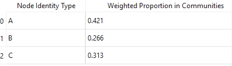

.. _analyze_menu:

==========
All Analyze Menu Options
==========

The Analyze Menu offers options for creating graphs and statistical tables.

* The first submenu is the network menu, which has functions for visualizing networks and analyzing network communities.

'Analyze -> Network -> Show Network'
-------------------------------

* Use this function to visualize the method in an interactable matplotlib graph.
* Note that this window will be very slow for graphs with a huge number of nodes.
* Selecting this displays the following menu:

.. image:: _static/analyze_1.png
   :width: 300px
   :alt: Network Vis Menu

Parameter Explanations
~~~~~~~~~~~~~~~

1. Enable the 'geo_layout' button to have nodes be placed in representative regions of their 3D location.
    * Their XY position in the graph will correspond to the image, while the node size will represent their Z-position (with larger nodes representing smaller Z-vals, ie. closer to the viewer).
    * Note that this method may run rather slowly on graphs with a huge number of nodes.
    * Keeping this unselected will group nodes using the NetworkX spring layout.
2. Execution Mode (Menu Includes the following options):
    1. Default:
        * All nodes are represented by their numerical ID, and nothing else.
    2. Community Coded (Uses Current...)
        * Colors nodes by their community, assuming they have already been community partitioned.
    3. Community Coded (Redo Label Propogation...)
        * Re-partition nodes using label propogation, then display them color-coded by their community.
    4. Community Coded (Redo Louvain...)
        * Re-partition nodes using louvain, then display them color-coded by their community.
    5. Node-ID Coded
        * Display nodes color-coded by their node ID (if it exists).
3. Output directory
    * If a string path is included to a directory, the resulting graph will be autosaved there.
    * Note these graphs can be saved in the matplotlib window anyway.
* Press Show Network to open a new matplotlib window displaying the graph.

'Analyze -> Network -> Community Partition+ Generic Network Stats'
-------------------------------
* Use this function to partition the nodes into communities.
* Node communities will be saved and loaded with any 'Save/Load Network3D object' options.
* Selecting this displays the following menu:

.. image:: _static/analyze2.png
   :width: 300px
   :alt: Com Menu

Parameter Explanations
~~~~~~~~~~~~~~~

1. Use Weighted Network
    * Enabling this option has the community partition consider graph weights.
    * By default, generated networks aquire weights when two or more discrete node objects join objects together.
    * Objects joined by heavily weighted edges will be more likely to be grouped into the same community.
2. Execution Mode (Menu Includes the following options):
    1. Label Propogation
        * Partition the network using NetworkX's label propogation algorithm.
    2. Louvain
        * Partition the network using python-louvain's louvain algorithm.
    * Both of these options are quick, efficient ways to group networks. Label propogation is a bit faster but more variable.
    * Note that network community detection in general (and in these cases) has some degree of randomness in how it decides to group objects (based on what nodes it starts from).
3. Community Stats
    * Whether or not to calculate community-based stats for the graph
    * If yes, these are the stats that are returned, referring to the entire network:
        * Modularity Entire Network (From python-louvain when louvain, or NetworkX when label propogation.)
        * Number of Communities
        * Community Sizes
        * Average Community Size 
        * Number of Iterations (Louvain only - the number of iterations the algorithm ran)
        * Global Clustering Coefficient (NetworkX)
        * Assortativity (NetworkX)
        * Inter-community Edges (How many edges exist between communities)
        * Mixing Parameter (ratio of external to total edges for nodes)
    * And for each discrete community, these stats are returned:
        * Density (NetworkX)
        * Conductance (NetworkX)
        * Average Clustering (NetworkX)
        * Degree Centrality (NetworkX)
        * Average Shortest Path Length
    * Many of these stats come from the NetworkX or python-louvain packages (specified above). Please see the below documentation for more information:
    * python-louvain documentation: https://python-louvain.readthedocs.io/en/latest/api.html#
    * networkx documentation: https://networkx.org/
* Press partition to seperate the nodes into communities based on the selected parameters. In addition to setting the node_communities property, tables showing the community for each node and the stats will be generated in the tabulated data widget.

'Analyze -> Network -> Identity Makeup of Network...'
-------------------------------
* This method is designed to be run on groups of nodes that have been community partitioned.
* When selected, it will give a weighted average out of one that represents what proportion of nodes of some ID (as defined in the node_identities property) exist in any random community.
* The communities are weighted by size, so larger communities contribute to this value more.
* When selected, this method will create a table with the results that looks like this:

* This method can be a good way to characterize what communities in the network consist of. For example, if I have grouped neighborhoods of different cell types and am wondering what a generic community looks like.

Algorithm Explanation
~~~~~~~~~~~~~~~~~~~~
This algorithm:

1. Groups nodes by their community ID
2. For each community, counts the number of nodes with each identity type
3. Weights these counts by the size of the community
4. Sums these weighted counts across all communities
5. Normalizes the results twice: first by the total number of nodes, then to ensure all proportions sum to 1
6. Returns a dictionary mapping each identity type to its weighted proportion in the network

* The second submenu is 'Stats', and is primarily used to create tables and graphs about the network or image morphology.

'Analyze -> Stats -> Calculate Generic Network Stats'
-----------------------------------------
* This function simply generates and displays (in the tabulated data widget) a number of generic stats about the network.
* The following stats will be generated:
    * num_nodes
    * num_edges
    * density
    * is_directed (Note that networks currently will always be undirected)
    * is_connected
    * num_connected_components
    * largest_component_size
    * avg_degree
    * max_degree
    * min_degree
    * avg_betweenness_centrality
    * avg_closeness_centrality
    * avg_eigenvector_centrality
    * avg_clustering_coefficient
    * transitivity
    * diameter
    * avg_shortest_path_length
    * is_tree
    * num_triangles
    * degree_assortativity
    * Unconnected nodes (left out from node image)
* These stats are all more or less generated by networkx.
* Please see networkx documentation for more information: https://networkx.org/

'Analyze -> Stats -> Radial Distribution Analysis'
-----------------------------------------
* This method creates a graph showing the average number of neighboring nodes (of any given node) on the y axis and the distance from any given node in the x axis.
* Use this method to evaluate how far apart your connected nodes tend to be in 3D space, and how those relationships are distributed.
* For example, we would typically expect more efficient networks to mostly have an abundance of short connections and a minority of long connections.

Parameter Explanations
~~~~~~~~~~~~~~~

1. Bucket Distance...
    * This is the distance that will be used as a step size while searching outward from nodes in the graph to evaluate how close in 3D space their neighbors are.
2. Output Directory
    * If a string path is included to a directory, the resulting graph will be autosaved there.
    * Note these graphs can be saved in the matplotlib window anyway.

* Press 'Get Radial Distribution' to open a new matplotlib window showing the graph, and also place the obtained data in as a new table in the tabulated data widget.

'Analyze -> Stats -> Degree Distribution Analysis'
-----------------------------------------
* This method creates a graph showing the degree (of any given node) on the x axis and the total proportion of nodes with that degree in the network on the y axis. (Note that degree = the number of neighbors a node has).
* Use this method to evaluate how connected the network is, and how meaningful those connections tend to be.
* For example, we would typically expect more efficient networks to mostly have an abundance of low-degree nodes and a minority of high degree nodes.
* The only parameter it asks for is an output directory (If a string path is included to a directory, the resulting graph will be autosaved there).
* Press 'Get Degree Distribution' to open a new matplotlib window showing the graph, and also place the obtained data in as a new table in the tabulated data widget.

'Analyze -> Stats -> Identity Distribution of Neighbors'
-----------------------------------------
* This method allows us to explore what kinds of nodes (as categorized by their node_identities) tend to be located nearby/connected to nodes of some desired ID.
* Use this method when you want to characterize what interacts with what, for example, if I have cellular neighborhoods and want to know what's near what.
* Selecting this displays the following menu:

.. image:: _static/analyze4.png
   :width: 200px
   :alt: NeighborID Menu

Parameter Explanations
~~~~~~~~~~~~~~~

1. Root Identity to Search...
    * This is the identity of the sorts of nodes we will search outward from. The neighborhoods of these nodes will be characterized.
2. Output Directory
    * If a string path is included to a directory, the resulting outputs will be autosaved there.
3. Mode (Menu Includes the following options):
    1. From Network - Based on Absolute Connectivity
        * Reveals information about neighors based on the connectivity of the network.
    2. Use Labeled Nodes - Based on Morphological Densities 
        * Reveals information about neighors based on what sorts of nodes are physically in the vicinity.
4. Search Radius (if using Mode 2)
    * The distance that nodes will search to characterize their neighborhoods. Option one currently will always just search for immediate network neighbors.
5. Fast dilation option (if using Mode 2)
    * If disabled, searching will be done with perfect distance transforms. If enabled, searching will be done with with psuedo-3D kernels which may be faster but less accurate. For more information on this algorithm, see :ref:`dilation`.

* Press 'Get Neighborhood Identity Distribution' to display a few matplotlib barcharts, with associated data tables being added to the tabulated data widget.
* The following tables (and corresponding graphs) will appear:
* If using mode 1:
    1. Neighborhood Distribution of Nodes in Network from Nodes: 'X'
        * Shows how many total neighbors of each ID that nodes of ID 'X' have (including other type 'X').
    2. Neighborhood Distribution of Nodes in Network from Nodes 'X' as a proportion of total nodes of that ID.
        * For each ID category, shows what proportion of that node type in the network are neighbors of nodes of ID 'X' (including other type 'X')
* If using mode 2:
    1. Volumetric Neighborhood Distribution of Nodes in image that are 'y' distance from nodes: 'X'
        * Shows the total volumes of nodes of each ID within distance 'y' from nodes of ID 'X' (does not include other type 'X')
    2. Density Distribution of Nodes in image that are 'y' from Nodes 'X' as a proportion of totaly node volume of that ID.
        * For each ID category, shows what proportion of the volume of that node type are within distance 'y' from nodes of ID 'X' (does not include other type 'X')
    3. Clustering Factor of Node Identities within 'y' from nodes 'X'
        * For each ID category, shows the volumetric density of nodes of that ID type within distance 'y' from nodes of ID 'X', divided by the densities of nodes of that ID type in the entire image. (does not include other type 'X')
        * This is also known as relative density. Essentially, a val greater than 1 means said node ID is unevenly distributed to be closer to nodes of ID 'X', while a val less than 1 means they are preferentially avoiding nodes of ID 'X'.

Algorithm Explanation
~~~~~~~~~~~~~~~~~~~~

1. Mode 1 just counts neighbors that are immediate neighbors in the network of the desired node ID.
2. Mode 2 searches using either a distance transform or psuedo-3D binary dilation. It searches outward from nodes of the desired ID type, and hence does not actually include them. This is why this option never evaluates its own clustering.

'Analyze -> Stats -> Generate Equivalent Random Network'
-----------------------------------------
* This method allows us to generate a random network with an equivalent number of edges and nodes as the current network.
* The purpose of this method is a quick way to compare our network to a similar random one, which can be used to demonstrate presence of non-randomness, for example.   
* The only parameter is 'weighted'. If selected, edges in the random network will be allowed to stack into weighted edges.
    * Note if my network is weighted, weights are included in total edge counts for the purpose of this method, so three nodes with one edge of weight one and one edge of weight two will allow three connections to be made in the corresponding random network.
    * The weighted param just tells the random network whether its allowed to use these total edges to make weighted edges (a weighted edge of 2 would *cost* the random network 2 of its available edges, so to speak).
    * The weighted param does not tell the random network to ignore weights in the original network. To do that, first de-weight the network with 'Process -> Modify Network'.
* Press 'Generate Random Network' to place the random network in the 'Selection' network table. From here, it can be right clicked to either save it or to swap it into the active network.
    * Note that swapping the random network to active runs the risk of overriding the old active network if a new selection is made, so be sure to save it first.

'Analyze -> Stats -> Calculate Volumes'
-----------------------------------------
* This method finds the volumes of all objects in the 'Active Image'.
* The volumes are scaled by the axis scalings and returned as a table in the tabulated data widget.
* Algorithm explanation: This method uses the np.bincount() method to count each label and then just multiplies the outputs by the scalings.

'Analyze -> Stats -> Calculate Radii'
-----------------------------------------
* This method finds the largest radii of all objects in the 'Active Image'.
* It may be good to use, for example, on labeled branches to evaluate how thick the branches are.

Parameter Explanation
~~~~~~~~~~~~~~~~~~~~
* This method has one parameter, 'GPU'
* If you enable it, the system will attempt to attempt to use the GPU to calculate. Note that this is only possible with a working CUDA toolkit.

Algorithm Explanation
~~~~~~~~~~~~~~~~~~~~

1. The scipy.ndimage.find_objects() method is used to get bounding boxes around all the labeled objects.
2. For each object, a subarray is cut out around it using its bounding box, with padding on all sides.
3. The object in question is boolen indexed within its subarray.
4. The scipy.ndimage.distance_transform_edt() method is used to get a distance transform for the object, with the maximum value (ie, furthest from the background) representing the largest radii.
5. This process is paralellized across all available CPU cores. It *will* hog your entire machine if given a big task.

'Analyze -> Stats -> Calculate Node < > Edge Interactions'
-----------------------------------------
* This method will provide information about the volume of positive 'edge' image surrounding each labeled object in your 'node' image.
* You would essentially use it for a basic measurement of how much the edge channel image is surrounding each node.
* This measurement is performed for every node in the image individually.
* When you select this option, you will see this menu:

.. image:: _static/analyze5.png
   :width: 800px
   :alt: edgenode Menu

Parameter Explanations
~~~~~~~~~~~~~~~

1. node_search:
    * This value represents the distance one would like to search outwards from the nodes image to quantify edge interactions, and is scaled with the current image scalings.
2. Execution Mode:
    * This dropdown menu has two options:
        1. 'Include regions inside node' will include the node itself in the search region.
        2. 'Exclude regions inside node' will have the node only use the regions outside of it to search.
3. Use Fast Dilation...
    * If disabled, searching will be done with perfect distance transforms.
    * If enabled, searching will be done with psuedo-3D kernels, which may be faster but imperfect at measuring.
    * For more information on this algorithm, see :ref:`dilation`.

* Press Calculate to run the method with the desired parameters. The output data will be used to create a new table in the tabulated data widget.

Algorithm Explanation
~~~~~~~~~~~~~~~~~~~~

1. The scipy.ndimage.find_objects() method is used to get bounding boxes around all the labeled objects in the nodes channel.
2. For each object, a subarray is cut out around it using its bounding box, that includes the object plus any additional space that it will need to perform a search/dilation.
3. The same subarray is cut out of the edges channel (for neighborhood comparison).
4. The node object in question is boolen indexed within its subarray.
5. If not using the fast dilation option, then the scipy.ndimage.distance_transform_edt() method is used to get a distance transform for the object. This distance transform is thresholded based on the desired distance away from the node we want, then binarized.
6. If using fast dilation, the above is performed using psuedo-3D binary kernels without having to take a dt.
7. If internal regions are being excluded, an inverted boolean array of the original shape is used to 'cut out' the core from the dilated binary mask. The binary dilated mask is then multiplied against the edge subarray to isolate edges specific to the dilated region.
8. These edges are then counted, scaled volumetrically (by multiplying the three axis dimensions by the counted number), then added to a label:volume dictionary that will be eventually returned.
9. This process is paralellized across all available CPU cores. It *will* hog your entire machine if given a big task.

* The third submenu, 'Data/Overlays', has hybrid functions that both produce data while generating Overlays for the Image Viewer Window

'Analyze -> Data/Overlays -> Get Degree Information'
--------------------------------------
* This method can be used to extract information about the degrees of nodes in the image, while generating Overlays representing the same.

* When you select this option, you will see this menu:

.. image:: _static/analyze6.png
   :width: 800px
   :alt: edgenode Menu

Parameter Explanations
~~~~~~~~~~~~~~~

1. Execution Mode
    * This dropdown menu has three options:
        1. 'Just make table' - places a table with the ID of each node and its degree in the tabulated data widget, without generating any overlays.
        2. 'Draw Degree of Node as Overlay...' - This method creates an overlay where the degree value of each node is literally drawn onto its centroid as an overlay (ie, a node of degree 5 has a 5 drawn at its centroid). This can be used to quickly eyeball node connectivity.
        3. 'Label Nodes by Degree...' - This method takes each node label and reassigns its label to its degree. The idea would be to export the image and do downstream analysis elsewhere while thresholding for specific degree values.
            * Note this thresholding can be done in NetTracer3D by using the intensity thresholder.
2. Proportion of high degree nodes to keep...
    * By default this is set to 1 (meaning all nodes). Set this to a smaller float val between 0-1 to return that sub-proportion of nodes, prioritizing, high-degree ones. For example, a value of 0.1 would return the top 10% highest degree nodes in the output overlay only.
3. down_factor... 
    * Temporarily downsamples the image to speed up overlay creation. Downsampling is done in all three dimensions by the inputed factor.

* Press 'Get Degrees' to run the method with the desired parameters. The output data will be used to create a new table in the tabulated data widget. The overlay will go into the Overlay 2 channel.

'Analyze -> Data/Overlays -> Get Hub Information'
--------------------------------------
* This method can be used to extract information about hub nodes, which are the nodes that are the fewest degrees of seperation from any other node. 

Parameter Explanations
~~~~~~~~~~~~~~~
* This method only has two parameters.

1. Make Overlay.
    * If enabled, this method will create an overlay isolating the hub nodes.
2. 'Proportion of most connected hubs to keep...'
    * A 0-1 float val that tells the program how many 'nodes' you want back in the output. For example, 0.10 would return the top 10% nodes with the fewest degrees of separation. 1 would just return all the nodes.

* Press 'Get hubs' to run the method with the desired parameters. The output data will be used to create a new table in the tabulated data widget. The overlay will go into the Overlay 2 channel.

'Analyze -> Data/Overlays -> Get Mother Nodes'
--------------------------------------
* This method can be used to extract information about 'mother nodes', which are we define as those nodes that contain connections between one community and another.
* This method would be used to identify what nodes enable interaction between seperate communities.

Parameter Explanations
~~~~~~~~~~~~~~~
* This method only has one parameter.

1. Make Overlay.
    * If enabled, this method will create an overlay isolating the mother nodes.

* Press 'Get Mothers' to run the method with the desired parameters. The output data will be used to create a new table in the tabulated data widget. The overlay will go into the Overlay 1 channel.

'Analyze -> Data/Overlays -> Code Communities'
--------------------------------------
* This method can be used to generate an overlay that shows what nodes belong to which community.

Parameter Explanations
~~~~~~~~~~~~~~~
* This method only has two parameters.

1. down_factor
    * Temporarily downsamples the image to speed up overlay creation. Downsampling is done in all three dimensions by the inputed factor. This is particularly useful for the color overlay.
2. Execution Mode:
    * This dropdown menu has two options:
        1. 'Color Coded' - Create an RGB color overlay where each node is colored according to its community. This overlay is great for easily visualizing communities.
        2. 'Grayscale Coded' - Create a grayscale overlay where each node is labeled by the community number it was assigned in the node_communities parameter. The purpose of this overlay is to create an image where nodes can then be thresholded by their community, for more specific analysis.

* Press 'Community Code' to run the method with the desired parameters. The overlay will go into the Overlay 2 channel. Additionally, a legend displaying what label belongs to which community will be placed into the tabulated data widget.

'Analyze -> Data/Overlays -> Code Identities'
--------------------------------------
* This method can be used to generate an overlay that shows what nodes belong to which identity.

Parameter Explanations
~~~~~~~~~~~~~~~
* This method only has two parameters.

1. down_factor
    * Temporarily downsamples the image to speed up overlay creation. Downsampling is done in all three dimensions by the inputed factor. This is particularly useful for the color overlay.
2. Execution Mode:
    * This dropdown menu has two options:
        1. 'Color Coded' - Create an RGB color overlay where each node is colored according to its identity. This overlay is great for easily visualizing identities.
        2. 'Grayscale Coded' - Create a grayscale overlay where each node is labeled by numerical identities (with the number corresponding each to one of the identity subtypes). The purpose of this overlay is to create an image where nodes can then be thresholded by their identity, for more specific analysis.

* Press 'Identity Code' to run the method with the desired parameters. The overlay will go into the Overlay 2 channel. Additionally, a legend displaying what label belongs to which identity will be placed into the tabulated data widget.

Next Steps
---------
This concludes the explanations of the analyze functions. Next, proceed to :doc:`process_menu` for information on the process menu functions.