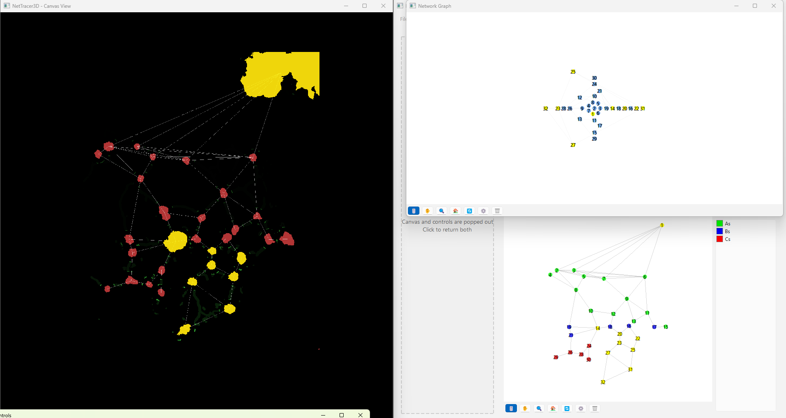
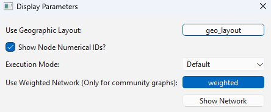
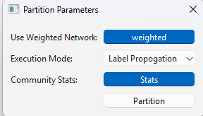
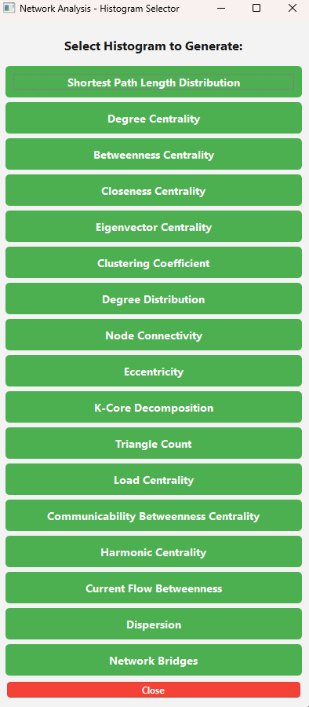
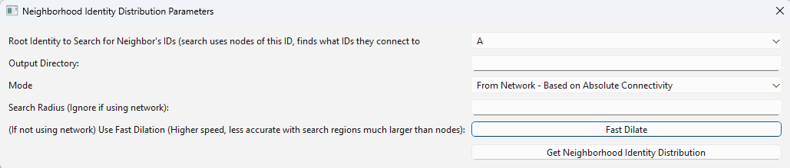
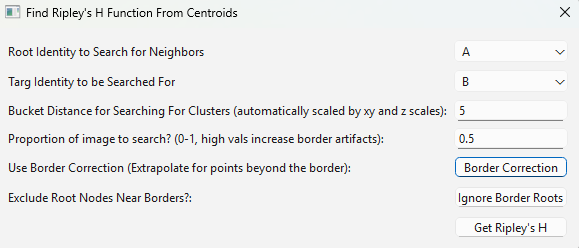
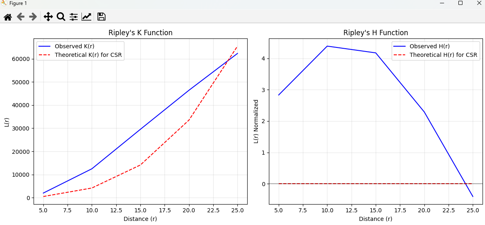
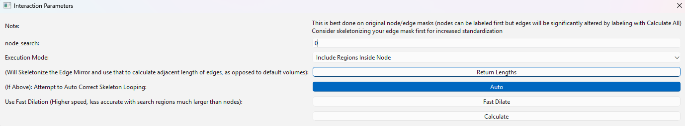
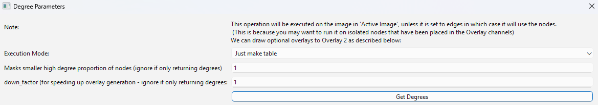

.. _analyze_menu:

========================
All Analyze Menu Options
========================

The analyze menu provides options for creating graphs and statistical tables. The
first submenu, **Network**, contains functions for visualizing networks and
analyzing network communities. The second, **Stats**, is used primarily to create
tables and graphs describing the network or image morphology.

.. contents:: On this page
   :local:
   :depth: 2

Analyze → Network → Show Network
--------------------------------

Visualizes the current network as an interactive graph. This view is also
embedded in the lower right widget by default, but this version can be opened
fullscreen and supports two simultaneous layouts.

The generated graph is linked to both the image viewer window and the default
network graph viewer in the bottom right: selecting a node in one selects it in
the others.

*All the graphs are linked, making it easy to locate nodes of significance.*

Depending on the chosen view, rendering may be slow for very large networks,
though loading occurs on a separate thread and does not freeze the display.
Selecting this option displays the following menu:

Parameter explanations
~~~~~~~~~~~~~~~~~~~~~~

#. **Render mode** — determines where nodes are located in the graph.

   * **Spring layout** — places clusters of interconnected nodes together. Useful
     for evaluating what is connected to what, but loses clarity with very large
     numbers of nodes.
   * **Centroid layout** — places nodes to reflect their position in the actual
     image. Requires node centroids to have been computed, after which it loads
     almost instantly regardless of graph size. Useful for correlating nodes in
     the graph with nodes in the image.
   * **Component layout spring** — as the spring layout, but lays out each
     connected component separately. In large graphs with many disconnected
     components, the default spring layout may place them on top of one another,
     obscuring what is connected to what; this layout avoids that.
   * **Component layout shell** — also lays out each component separately, using a
     shell layout. The most central node of each component is placed in the
     middle, its immediate neighbors in the next circular shell, their neighbors
     in the next, and so on. Useful for eyeballing shortest path length or how
     dependent a graph is on its central node, though harder to interpret when a
     component contains very many nodes.

#. **Execution Mode**

   1. **Default** — all nodes are blue circles.
   2. **Community Coded** — colors nodes by community, assuming the network has
      been community partitioned. You are prompted to partition if it has not.
   3. **Node-ID Coded** — colors nodes by their node ID, where one exists.

#. **Node/Edge Rendering** — optionally sets the edge color to gray or black, and
   sets the sizes of nodes and edges in the render.
#. **Show Node Numerical IDs** — labels each node on the graph with its internal
   label value from the image. Useful for finding specific nodes, but may clutter
   the visualization.
#. **Draw weighted edges** — draws weighted edges more thickly. Nodes that find
   repeat, distinct connections in connectivity networks acquire weights, as do
   manually added repeat node connections.
#. **For Centroid Layout...** — when using the centroid layout, renders nodes with
   lower z values larger, allowing 3D location to be judged visually on a 2D
   graph. Deselect to render all nodes at the same size.

Press **Show Network** to open a new window displaying the interactive graph.

Analyze → Network → Generic Network Report
------------------------------------------

Reports basic information about the current Network3D object: the number of
nodes, the number of edges, the number of nodes per ``node_identities`` category,
and the number of nodes per community where assigned, along with the proportions
of each. Reports are placed in the upper right table.

Analyze → Network → Create Communities Based on Network
-------------------------------------------------------

Partitions nodes into communities based on network structure. This form of
community clustering is well suited to finding functional units in the network,
or spatial aggregates in proximity networks; for cells, consider neighborhood-
based clustering instead. Node communities are saved and loaded with the
Save/Load Network3D object options.

Parameter explanations
~~~~~~~~~~~~~~~~~~~~~~

1. **Use Weighted Network** — has the community partition consider graph weights.
   Generated networks acquire weights when two or more discrete node objects join
   objects together, and objects joined by heavily weighted edges are more likely
   to be grouped into the same community.

2. **Execution Mode**

   1. **Label Propagation** — partitions using NetworkX's label propagation
      algorithm.
   2. **Louvain** — partitions using NetworkX's Louvain algorithm.
   3. **Leiden** — partitions using the Leiden algorithm, an enhanced Louvain.
      This requires the optional ``leidenalg`` package (``pip install
      leidenalg``), which is not installed by default.

   These are all quick, efficient ways to group networks; label propagation is
   somewhat faster but more variable. Network community detection carries some
   degree of randomness in how it groups objects, depending on which nodes it
   starts from.

3. **Community Stats** — whether to calculate community-based statistics for the
   graph. For the entire network:

   * Modularity Entire Network
   * Number of Communities
   * Community Sizes
   * Average Community Size
   * Number of Iterations (Louvain only — the number of iterations run)
   * Global Clustering Coefficient (NetworkX)
   * Assortativity (NetworkX)
   * Inter-community Edges (how many edges exist between communities)
   * Mixing Parameter (ratio of external to total edges for nodes)

   And for each discrete community:

   * Density (NetworkX)
   * Conductance (NetworkX)
   * Average Clustering (NetworkX)
   * Degree Centrality (NetworkX)
   * Average Shortest Path Length

   These statistics come from NetworkX; see https://networkx.org/ for details.

4. **Seed (int)** — sets the random seed for the community partition, since the
   starting point affects the outcome. Use the same seed each time for
   reproducibility, or vary it to see how partitioning is affected. Leaving it
   empty uses the seed of the ``rand`` and numpy random modules, initialized at
   program start.

Press **Partition** to separate the nodes into communities. In addition to
setting the ``node_communities`` property, tables showing the community for each
node and the associated statistics are generated in the tabulated data widget.

Analyze → Network → Create Communities Based on Node's Immediate Neighbors
--------------------------------------------------------------------------

Evaluates the distribution of node identities around each node and clusters those
that appear similar. With many identities assigned from multichannel data, this
option detects meaningful regions in the image, making it the usual choice for
multiplexed cellular data. It generally uses a proximity network to evaluate node
neighbors.

Parameter explanations
~~~~~~~~~~~~~~~~~~~~~~

#. **Num communities** — the number of communities to create.
#. **Clustering Algorithm** - Choose between KMeans (which is good for neighborhood vectors of binary classified identities) or Leiden clustering.
#. **Clustering Seed** — an integer changing the initial seed, producing a
   slightly different output.
#. **Min Neighbor Count** — the minimum number of neighbors a node must have to
   be considered for grouping. Setting a value here avoids including isolated
   nodes in the output.
#. **N Nearest Neighbors** — optional. Normally a proximity network tying
   neighbors together is generated first, in which case this can be skipped.
   Otherwise, enter a number of nearest neighbors for each node to find, creating
   a new proximity network for this function.
#. **Max Distance** — optional, and similar to the above. Restricts the new
   proximity network to connecting nodes within a specified distance, which
   prevents different regions from connecting across gaps they should not. The
   distance is scaled by the ``xy_scale`` and ``z_scale`` properties.
#. **Community UMAP** — returns a UMAP of how similar the node neighborhoods are.
   The UMAP is interactive: use a lasso to select groups of nodes, then right
   click in the main window to assign them to their own communities. Several
   unique rendering options are available. These interactive UMAPs can be saved
   and later reloaded using the folder icon that loads spreadsheets in the top
   right, skipping the embedding computation.
#. **Neighborhood Heatmaps** — returns a heatmap showing the compositions of the
   neighborhoods used to cluster the nodes. This does not specify the composition
   of the resulting communities — use **Analyze → Network → Calculate Composition
   of Network Communities (And UMAP)** for that — although the data will be
   similar.
#. **Treat Multi-Identity Nodes as Unique Identities** — across many channels,
   nodes will likely acquire multiple identities. By default this function
   clusters on the distribution of each unique identity; enabling this treats any
   unique combination of identities as its own group. With many combinations this
   massively increases the computational load, so skipping it is generally
   recommended.

Press **Get Communities** to assign communities based on neighborhoods.

Algorithm explanation
~~~~~~~~~~~~~~~~~~~~~

The method evaluates the neighbors of each node in the network, arranges those as
proportions out of 1 in a one-dimensional array, and clusters those arrays with
sklearn's K-means clusterer or leidenalg's leiden methods.

Analyze → Network → Create Communities Based on Hexagonal/Rhomboid Proximity Cells
----------------------------------------------------------------------------------

Splits the image into cells of user-defined size and assigns nodes to communities
based on whether they share a cell. Parameters cover the hexagon side length and
whether hexagonal prisms or dodecahedrons are preferred in 3D; 2D always uses
hexagons.

This has nothing to do with the network, and is an alternative way to group nodes
into communities without a network or nearest-neighbor focus. The resulting cells
can be further grouped into supercommunities to find neighborhood motifs, though
this is weaker than node neighborhood community assignment where sufficient
channels are available.

Parameter explanations
~~~~~~~~~~~~~~~~~~~~~~

#. **Cell Size** — the volume of a cell, in 2D or 3D. Cells are always cubes or
   squares.
#. **xy scale** — the 2D plane scaling of the image.
#. **z scale** — the 3D voxel depth scaling of the image.

The latter two parameters scale the cell to be cuboidal, so that its side lengths
are equal in true units. Press **Get Communities** to assign communities based on
cells.

Analyze → Network → Calculate Composition of Network Communities (And UMAP)
---------------------------------------------------------------------------

Designed to run on groups of nodes that have been community partitioned and carry
a ``node_identities`` property, this evaluates their general compositions. It
yields either compositional proportions of node identities per community, or a
weighted average of the compositions of all communities — in the latter case
weighted by size, so that larger communities contribute more.

It can also generate a UMAP for the communities, in which communities positioned
close together have more similar identity compositions. This is a good way to
characterize what communities consist of — for example, when neighborhoods of
different cell types have been grouped and the question is what a generic
community looks like.

Parameter explanations
~~~~~~~~~~~~~~~~~~~~~~

#. **Mode**

   1. **Average Identities per community** — compositional information on all
      communities.
   2. **Weighted Average Identity of All Communities** — compositional
      information on all communities weighted by community size. Does not support
      UMAP.

#. **Generate UMAP** — generates a UMAP comparing the community compositions.
#. **Label UMAP Points How?**

   * **No Label** — points are not labeled.
   * **By Community** — assigns each point its numerical label.
   * **By Supercommunity** — colors communities by the supercommunity they belong
     to, assuming one has been assigned via **Analyze → Network → Convert Network
     Communities...**

#. **Min Community Size to be grouped...** — does nothing if empty. If an integer
   is entered, communities with fewer nodes than this value are excluded from the
   UMAP, which is useful for ignoring small, insignificant communities.
#. **Return Node Type Distribution Robust UMAP** — normally communities are
   grouped in the UMAP by their proportional compositions of node types. With
   this selected, they are instead grouped by how much they *overrepresent*
   specific node types, where overrepresentation means the proportion of nodes of
   that type in the community, relative to all nodes of that type, exceeds the
   proportion of all nodes within that community relative to all nodes in the
   image.

Press **Get Community ID Info** to populate the data to the upper right tabulated
data widget and, if selected, show the UMAP.

Algorithm explanation
~~~~~~~~~~~~~~~~~~~~~

Without the weighted average of all communities, the method simply finds the
proportion of each identity per community.

When generating the UMAP, using the umap module:

1. Extract community data by collecting community IDs and stacking their
   composition arrays into a matrix.
2. Initialize the UMAP reducer and random seed (42) for reproducible
   dimensionality reduction.
3. Transform compositions with UMAP to reduce high-dimensional cluster vectors to
   2D coordinates.
4. Create a scatter plot with points colored by cluster ID.
5. Print composition analysis showing the raw data and identifying the two most
   dominant classes per community.

When using the weighted average for all communities, which does not support UMAP:

1. Group nodes by their community ID.
2. For each community, count the number of nodes with each identity type.
3. Weight these counts by the size of the community.
4. Sum the weighted counts across all communities.
5. Normalize twice: first by the total number of nodes, then so that all
   proportions sum to 1.
6. Return a dictionary mapping each identity type to its weighted proportion in
   the network.

Analyze → Network → Convert Network Communities Into Supercommunities
----------------------------------------------------------------------

*Also returns compositional heatmaps.*

Finds the average composition of all communities, assuming ``node_identities``
exist, using the logic of the function above, then groups similar communities
into supercommunities. This allows communities to be crunched into a smaller set
for analysis of similar domains across the image. The number of supercommunities
is set by the user.

Running this also displays a heatmap of which ``node_identity`` is prominent in
which supercommunity. Supercommunities are assigned by size, with 1 the largest
group and n the smallest, so relative sizes can be compared easily.

.. warning::

   Running this method reassigns the ``communities`` property to the
   supercommunities, so save the original communities first. This is done so that
   all community-associated functions can be used on the new supercommunities.
   During an active session the method always runs on the original communities
   rather than the supercommunities, storing them in a separate temporary
   property, which allows the method to be re-run with different parameters.
   These temporary communities are not used for anything else.

Parameter explanations
~~~~~~~~~~~~~~~~~~~~~~

#. **Num Supercommunities** — the number of supercommunities to group communities
   into; the number of communities should presumably be larger than this by some
   logical margin. Arbitrary counts apply only to K-means clustering, as DBSCAN
   always decides the count itself. K-means also guesses a suitable count if
   nothing is entered.
#. **Clustering Seed** — the random seed used for supercommunity assignment,
   42 by default.
#. **Min Community Size to be grouped...** — does nothing if empty. If an integer
   is entered, communities with fewer nodes than this value are assigned to
   Supercommunity 0, which is useful for ignoring small, insignificant
   communities.
#. **Return Node Type Distribution Robust Heatmaps** — the method always returns
   a heatmap showing the proportional composition of each supercommunity for each
   ID type. Enabling this returns two additional heatmaps:

   * The second shows, in each cell, the proportion of that node type in that
     supercommunity relative to the total available nodes of that type.
   * The third divides the second by the proportion of total nodes, of any type,
     comprising that supercommunity. This shows which node types are
     overrepresented in a supercommunity, since each node type would be expected
     to have the same proportional representation relative to all nodes of that
     type as the supercommunity's overall representation. Cells above 1
     overrepresent that node type and cells below 1 underrepresent it, which
     makes compositional anomalies easy to spot.

#. **Mode** — selects the clustering algorithm.

   * **KMeans** — K-means clustering. Generally recommended.
   * **DBSCAN** — DBSCAN clustering, somewhat experimental. DBSCAN tends to
     assign low-appearing groups as outliers, which in the current implementation
     are assigned to Supercommunity 0, alongside any communities thresholded out
     by size.
   * **Leiden** - Uses leiden clustering which may be slower but does not require a community count input.

Press **Get Supercommunities** to group the nodes and generate the heatmaps. This
also returns several tables to the tabulated data widget, including tabulated
versions of all heatmaps, the proportion of total nodes in the network for each
supercommunity, and a nodes-to-supercommunity ID table.

Algorithm explanation
~~~~~~~~~~~~~~~~~~~~~

The method primarily uses the sklearn KMeans algorithm
(https://scikit-learn.org/stable/modules/generated/sklearn.cluster.KMeans.html):

1. Find the composition of all communities using **Analyze → Network → Identity
   Makeup of Communities** logic.
2. Convert compositions to a numpy array to prepare data for scikit-learn
   clustering.
3. Apply K-means clustering with the specified number of supercommunities and
   random seed.

Alternatively the sklearn DBSCAN algorithm can be used
(https://scikit-learn.org/stable/modules/generated/sklearn.cluster.DBSCAN.html):

1. Calculate ``min_samples``, the minimum neighbors a point needs to be a core
   point: ``max(3, sqrt(n_samples) * 0.2)``.
2. Estimate ``eps``, the supercommunity radius, using the 80th percentile of
   4th-nearest-neighbor distances. Non-core points within ``eps`` of core points
   become border points of that cluster.
3. Run DBSCAN with the calculated parameters.
4. Points that are neither core points nor within ``eps`` of core points become
   outliers.

The Leiden algorithm meanwhile will be based on the leidenalg and igraph python packages.

If using KMeans with no supercommunity count provided:

1. Supercommunity counts from 1 to 20 are temporarily generated.
2. Each is graded on its Calinski-Harabasz score
   (https://scikit-learn.org/stable/modules/generated/sklearn.metrics.calinski_harabasz_score.html).
3. The count with the highest score is used.

Analyze → Stats → Network Related → Calculate Generic Network Stats
-------------------------------------------------------------------

Generates and displays a number of generic statistics about the network in the
tabulated data widget:

* num_nodes
* num_edges
* density
* is_directed (networks are currently always undirected)
* is_connected
* num_connected_components
* largest_component_size
* avg_degree
* max_degree
* min_degree
* avg_betweenness_centrality
* avg_closeness_centrality
* avg_eigenvector_centrality
* avg_clustering_coefficient
* transitivity
* diameter
* avg_shortest_path_length
* is_tree
* num_triangles
* degree_assortativity
* Unconnected nodes (left out from node image)

These statistics are generated largely by NetworkX; see https://networkx.org/ for
more information.

Analyze → Stats → Network Related → Network Statistics Histograms
------------------------------------------------------------------

Generates and displays histograms of the distributions of node properties in the
network, as matplotlib figures and in the tabulated data widget. The histograms
are generated using NetworkX functions; see
https://networkx.org/nx-guides/content/exploratory_notebooks/facebook_notebook.html
for information about them.

With a network calculated, selecting this option displays the following menu:

*Selecting any of the green button options generates a graph of the corresponding
distribution and exports the data to the tabulated data widget.*

Parameter explanations
~~~~~~~~~~~~~~~~~~~~~~

#. **Degree Distribution** — the count of connections per node across the
   network. Identifies network architecture: power-law distributions indicate
   hub-based networks, while normal distributions show egalitarian connectivity.
#. **Shortest Path Length Distribution** — the minimum number of steps between
   all node pairs. Assesses network efficiency: narrow peaks at low values
   indicate efficient small-world networks.
#. **Degree Centrality** — direct influence through immediate connections.
   Identifies nodes with the most direct reach.
#. **Betweenness Centrality** — critical bridge nodes connecting different
   network regions. Finds bottlenecks and assesses vulnerability to node removal.
#. **Closeness Centrality** — how quickly each node can reach all others.
   Identifies nodes optimally positioned for information spreading.
#. **Eigenvector Centrality** — prestige, weighting connections to
   highly-connected nodes. Identifies nodes connected to important hubs, favoring
   quality of connections over quantity.
#. **Harmonic Centrality** — a robust version of closeness centrality that
   handles disconnected components. Use where the network may have isolated
   clusters.
#. **Load Centrality** — the traffic burden each node would carry in network
   flow. Identifies potential communication bottlenecks and workload
   distribution.
#. **Current Flow Betweenness** — models flow using electrical circuit
   principles, considering all paths rather than only the shortest. Gives a more
   realistic assessment of node importance in flow networks.
#. **Communicability Betweenness** — bridging importance based on walks of all
   lengths. Identifies nodes important for sustained, multi-step communication.
#. **Clustering Coefficient** — how interconnected each node's immediate
   neighbors are. Distinguishes tight-knit communities from sparse, tree-like
   regions.
#. **Triangle Count** — triangular connections, meaning three mutually connected
   nodes, per node. Assesses local group cohesion and community strength.
#. **K-Core Decomposition** — nested dense subgroups in which all nodes have a
   minimum degree k. Reveals hierarchical community structure and dense network
   cores.
#. **Eccentricity** — the maximum distance from each node to any other reachable
   node. Identifies peripheral versus central nodes and assesses network
   compactness.
#. **Node Connectivity** — the minimum number of nodes needed to disconnect each
   node's neighborhood. Assesses local network robustness around individual
   nodes.
#. **Average Dispersion** — how scattered each node's neighbors are from one
   another. Distinguishes bridge nodes, with high dispersion, from
   community-centered nodes, with low dispersion.
#. **Network Bridges** — edges whose removal would disconnect network components.
   Finds critical connections essential for network cohesion.
#. **Compute All Analyses and Export to CSV** — batch computes all of the above
   and saves them, along with PNGs of the associated histograms, to a chosen
   directory. Useful for rapid comparison across datasets when it is unclear
   which statistics may be significant, and for large networks where computation
   is slow — load only the network in a separate instance of NetTracer3D and run
   the batch computation as a background task.

Analyze → Stats → Network Related → Radial Distribution Analysis
-----------------------------------------------------------------

Creates a graph showing the average number of neighboring nodes for any given
node on the y axis against distance from that node on the x axis. This evaluates
how far apart connected nodes tend to be in 3D space and how those relationships
are distributed — more efficient networks would typically be expected to have an
abundance of short connections and a minority of long ones.

Parameter explanations
~~~~~~~~~~~~~~~~~~~~~~

1. **Bucket Distance** — the step size used when searching outward from nodes in
   the graph to evaluate how close their neighbors are in 3D space.

Press **Get Radial Distribution** to open a new matplotlib window showing the
graph and to place the obtained data in a new table in the tabulated data widget.

Analyze → Stats → Network Related → Network Nearest Neighbors
--------------------------------------------------------------

Finds statistics on the number of steps in the shortest paths between objects of
interest in the network, and renders overlays of those shortest paths and
heatmaps of which objects are closer within the network. It can find nearest
neighbors between selected elements in the network, between elements bearing a
given ``node_identity``, or a combination of the two.

Parameter explanations
~~~~~~~~~~~~~~~~~~~~~~

#. **Root Identity to Search for Neighbor IDs** — the node types searching for
   shortest paths to the target type. Set to the highlighted nodes by default,
   but can start from nodes of one of your node identity types.
#. **Neighbor Identities to Search For?** — the node types being searched for by
   the root type. Set to the highlighted nodes by default, but can search for
   nodes of one of your node identity types.
#. **Generate Heatmap** — renders a heatmap overlay in Overlay2 where closer
   nodes are red and further nodes blue. The color scheme is based on the average
   number of steps a node must take to reach the target nodes, with root nodes
   requiring more steps rendered bluer and those requiring fewer rendered redder.
#. **Subgraph Computation** — a dropdown of minimized subgraphs that can be
   rendered to Overlay1 to show direct connections between objects.

   * **No Overlay1** — the default; does nothing.
   * **Generate Shortest Path Overlay** — renders an overlay in Overlay1 showing
     the nodes and edges yielding the shortest path between your root and target
     nodes. Where a connectivity network was calculated using prelabeled edges,
     this is an interesting way to find the shortest path through a structure
     such as blood vessels or nerves.
   * **Compute Minimal Connecting Subgraph** — where the selected objects are
     connected somehow, even with unselected nodes between them, this finds and
     renders all those shortest connections, producing a fully connected,
     small-world optimized subgraph. Unlike the shortest paths option, this
     forces every node that can connect to do so, with selected nodes separated
     by other selected nodes routed through those intermediaries. In effect it
     evaluates all the best routes between groups of selected nodes. Uniquely,
     this option also returns the subgraph to the selection table, which can then
     be visualized or swapped into the main table.
   * **Compute Steiner Subgraph** — computes the Steiner subgraph which, like the
     minimal connecting subgraph, forces all nodes to be connected where a path
     exists, but renders a single snaking short path between all the nodes in
     question rather than every shortest path.

Click **Get Nearest Network Neighbors** to yield the nearest neighbor
distribution for your root nodes, returned as a table, along with any selected
overlays. Click **Get Average Nearest All ID Combinations** to yield the average
nearest distance for all unique combinations of node identities; this provides no
distributions or overlays, but returns a matrix graph visualizing all
combinations.

Analyze → Stats → Network Related → Community Cluster Heatmap
--------------------------------------------------------------

Plots the nodes into a 2D or 3D graph, colored by community density. Red nodes
are higher density than expected in a community and blue nodes lower.

Parameter explanations
~~~~~~~~~~~~~~~~~~~~~~

#. **(Optional) Total Number of Nodes** — used to decide how many nodes belong in
   a community on average. If unassigned, the program uses the number of nodes
   present in the current properties. This parameter exists for cases where the
   nodes in the active session are a subset — where some have been filtered out
   with the excel helper, for example — allowing the pre-filtering node count to
   be entered instead.
#. **Use 3D Plot...** — the heatmap is graphed in 3D by default. Disable this for
   2D data; do not disable it for 3D data, as the program will get confused.
#. **Overlay** — returns the heatmap as an RGB image overlay in Overlay2 rather
   than a matplotlib graph.

Press **Run** to show the heatmap graph and yield a table of community ID against
density intensity. The ``node_centroids`` and ``communities`` properties are
required, and you will be prompted for them if unassigned.

Algorithm explanation
~~~~~~~~~~~~~~~~~~~~~

1. Determine total nodes by trying multiple fallback sources: network nodes,
   centroids, identities, or unique node array values.
2. Calculate baseline density as the expected nodes per community if randomly
   distributed — total nodes divided by number of communities.
3. Compute heat values using the natural log ratio of actual community size to
   expected random size.
4. Generate the heatmap visualization with matplotlib.

Analyze → Stats → Spatial → Identity Distribution of Neighbors
---------------------------------------------------------------

Explores which kinds of nodes, as categorized by ``node_identities``, tend to be
located near or connected to nodes of a given identity. Use this to characterize
what interacts with what — for example, to determine what sits near what within
cellular neighborhoods.

Parameter explanations
~~~~~~~~~~~~~~~~~~~~~~

#. **Root Identity to Search...** — the identity of the nodes searched outward
   from. The neighborhoods of these nodes are characterized.
#. **Mode**

   1. **From Network** — quantifies neighbors based on adjacent network
      connections, revealing information based on the connectivity of the
      network.
   2. **Use Labeled Nodes** — quantifies the volume of neighbors within the
      search region, revealing which sorts of nodes are physically in the
      vicinity.

#. **Quantify Nodes or Edges?**

   1. **Quantify Node Counts** — counts the nodes of each identity available
      within the search space from your chosen identity.
   2. **Quantify Edge Counts** — counts edges instead. Two nodes sharing the same
      five neighbors have ten edges between them, since unique connections are
      being quantified, where the node count option would return five.

#. **Search Radius** (mode 2 only) — the distance nodes search to characterize
   their neighborhoods. Mode 1 always searches for immediate network neighbors.
#. **Use Fast Dilation...** (mode 2 with a search radius) — attempts to solve the
   dilation in parallel using the ``edt`` module. If ``edt`` is unavailable or
   fails, the scipy method is used as a fallback. When disabled, the scipy
   ``distance_transform_edt`` method is used, which may be slower.

The following parameters apply to network mode only:

#. **Run Comparative Random Simulation?** — scrambles the node centroids into
   random locations and returns data about the random distribution for comparison
   against the observed one.
#. **Null Model** - Allows control if you prefer label permutation or centroid scramble. By default it is set to scramble
   labels, which shuffles the set of node identities belonging to each node and reevaluates the data based on the
   scrambled dataset, without altering the network whatsoever. This is the preferred setting to evaluate for randomness
   in a space with inherently fixed locations, such as cells in a tissue. You can change this to instead scramble all
   centroids and regenerate the network for each random simulation, which also involves the 'Centroid Scramble Only' parameters. 
#. **Number of Random Iterations to Run?** — the number of random iterations
   compared against the observed data, of which the average values are used.
   Defaults to 1; increasing it improves accuracy at the cost of computation
   time.
#. **Arrange Random Nodes How?** — where a bounding mask defines the region nodes
   can realistically occupy, such as the boundaries of a tissue, place it in a
   channel other than the nodes channel and select that channel here. Random
   networks are then scrambled only within that mask.
#. **Number of Neighbors to Connect for Simulated Network** — must match the
   value used to generate your original proximity network, so that the random
   proximity networks behave the same way.
#. **Network Connection Distance for Simulated Network (Scaled)** — likewise must
   match any distance cap placed on your original proximity network. This
   automatically uses the ``xy_scale`` and ``z_scale`` parameters where set.

Press **Get Neighborhood Identity Distribution** to display several matplotlib
bar charts, with the associated data tables added to the tabulated data widget.

Press **Batch: All Network Combinations...** to compute neighbor information for
all available identity combinations. This returns a matrix, as both a graph and
tables, giving the number of times each identity finds at least one neighbor of
another identity. Three are produced: raw sums, their natural logs, and
percentile-based data — with identities A, B, and C, the last reports the
percentage of A's neighbor interactions that are A-B and the percentage that are
A-C, excluding self pairing. This batch calculation is best combined with
proximity networks to describe the border compositions between objects at an
arbitrary distance.

Outputs
~~~~~~~

In mode 1:

1. *Neighborhood Distribution of Nodes in Network from Nodes: 'X'* — how many
   total neighbors of each ID that nodes of ID X have, including other type X.
2. *Neighborhood Distribution of Nodes in Network from Nodes 'X' as a proportion
   of total nodes of that ID* — for each ID category, the proportion of that node
   type in the network that are neighbors of nodes of ID X, including other type
   X.

In mode 2:

1. *Volumetric Neighborhood Distribution of Nodes in image that are 'y' distance
   from nodes: 'X'* — the total volumes of nodes of each ID within distance y of
   nodes of ID X, excluding other type X.
2. *Density Distribution of Nodes in image that are 'y' from Nodes 'X' as a
   proportion of total node volume of that ID* — for each ID category, the
   proportion of the volume of that node type within distance y of nodes of ID X,
   excluding other type X.
3. *Clustering Factor of Node Identities within 'y' from nodes 'X'* — for each ID
   category, the volumetric density of nodes of that ID within distance y of
   nodes of ID X, divided by the density of nodes of that ID across the entire
   image, excluding other type X. This is also known as relative density: a value
   greater than 1 means that node ID is unevenly distributed closer to nodes of
   ID X, while a value less than 1 means they preferentially avoid nodes of ID X.

With the random simulation computed, a further graph and table give the observed
values divided by the simulated values for the computed relationships, where
values greater than 1 correspond to greater than random.

Algorithm explanation
~~~~~~~~~~~~~~~~~~~~~

1. Mode 1 counts neighbors that are immediate network neighbors of the desired
   node ID.
2. Mode 2 searches using either a distance transform or pseudo-3D binary
   dilation. It searches outward from nodes of the desired ID type and therefore
   does not include them, which is why this option never evaluates its own
   clustering.

Analyze → Stats → Spatial → Ripley Clustering Analysis
--------------------------------------------------------

Generates a Ripley's K curve, a function comparing relative object clustering to
distance r from a random node. This identifies whether objects are clustered or
dispersed and how that varies through an image. It can evaluate whether nodes of
one identity cluster around nodes of another, or whether nodes of one type
cluster with themselves.

The method runs on labeled nodes or on node centroids alone, prompting for node
centroids if they do not exist. Because it uses centroids, it says nothing about
the actual shapes of nodes.

Parameter explanations
~~~~~~~~~~~~~~~~~~~~~~

#. **Root Identity to Search for Neighbors** — the node identity whose
   neighborhood is evaluated for clustered objects.
#. **Targ Identity to be Searched For** — the node identity evaluated for
   clustering behaviour around parameter 1. Parameters 1 and 2 appear only when
   identities are assigned; otherwise all nodes evaluate clustering against
   themselves.
#. **Bucket Distance for Searching For Clusters...** — the bucket distance for
   each iteration of r, auto-scaled for your image, so enter a true distance
   where scaling properties are set. Smaller buckets increase fidelity at the
   cost of processing time.
#. **Proportion of image to search...** — a float from 0 to 1 giving the
   proportion of the image searched from each node. A value of 1 has each node
   evaluate the clustering of every other node in the image, while values closer
   to 0 restrict the calculation to the immediate neighborhood. Higher values
   increase border artifacts, since the method cannot see nodes beyond the image
   borders and presumes those regions empty, decreasing the clustering appraisal.
#. **Exclude Root Nodes Near Borders?** — for border safety, prevents nodes near
   the image boundaries from searching for neighbors. The degree of exclusion is
   set by the following parameter.
#. **Proportion of most internal nodes to use...?** — where the above is enabled,
   a float between 0 and 1 giving the proportion of most internal nodes to use;
   higher values exclude more of the border. Setting this to 0.9 includes only
   the 10% most internal space of the array when finding nodes to search from. If
   no nodes fall within these bounds, the analysis is not performed.
#. **Define boundaries how?** — when restricting analysis within borders, this
   sets what counts as a boundary. By default the boundaries of the entire array
   are used. Where the image is, for example, a piece of tissue surrounded by
   background and the search should stay within the tissue volume, first create a
   binary mask of your foreground, place it in a channel other than nodes, and
   select that channel here. The easiest way to obtain a foreground mask is to
   threshold by intensity and then run **Process → Image → Fill Holes** if
   desired; for 2D tissue, the foreground may also be traced with the pen tool
   before filling holes.
#. **Keep search radii within border...?** — forces nodes to keep their search
   radii within those borders, automatically calculating the minimum distance
   from the most external nodes under consideration to the borders and using that
   as the search radius. This should generally be enabled when masking within
   tissue boundaries, or when neither masking nor using parameter 9. It overrides
   parameter 4.
#. **Use Border Correction...** — for use when root nodes are not masked but
   search radii extend beyond the image borders. To compensate for edge
   artifacts, centroids are cloned by reflection over the array borders, forcing
   the space beyond the array to mimic the space within it. This does not work
   well when analysis is confined to a tissue mask, as the reflection is designed
   for the boundaries of a rectanguloid image rather than an irregular mask
   shape.

Press **Get Ripley's H** to calculate both the Ripley's K and Ripley's H
functions for your dataset. (You can also use the 'Batch' button below this to 
compute it for all identity perumutations, although note this may be slow).
Tables for each populate the tabulated data widget,
and a graph of the following form appears:

*The x axis represents the distance from any random node and the y axis a factor
representing the clustering intensity observed around nodes at that distance. The
blue line is the observed line; the red line represents expected behaviour from a
Poisson distribution of nodes. Regions above the red dotted line are unexpectedly
clustered and those below unexpectedly dispersed. The right graph is a normalized
version of the left, giving a straight center line. Given the possibility of
border artifacts, comparison between multiple datasets, or against a dataset of
randomly seeded nodes, may be preferable to comparison against the red line
directly.*

Algorithm explanation
~~~~~~~~~~~~~~~~~~~~~

This is an implementation of the Ripley's K function; see
10.1016/j.bpj.2009.05.039.

#. Take two sets of points, root and target, which may be the same set.
#. Build a KDTree from the root points for efficient nearest-neighbor searches.
#. Calculate the volume or area of the study region.
#. Compute the intensity (λ) as the number of reference points divided by volume.
#. For each root point at each distance in the bucketed r values, find neighbors
   using the KDTree and record how many target points fall within that radius.
#. When comparing a set to itself, remove self-counts to avoid counting points as
   their own neighbors.
#. Sum all weighted counts and normalize by the number of subset points
   (``n_subset``) and the point intensity (λ).
#. Return the array of K values for each radius value.
#. K values are normalized to H values by ``h_values = np.sqrt(k_values / np.pi)
   - r_values`` in 2D, or ``h_values = np.cbrt(k_values / (4/3 * np.pi)) -
   r_values`` in 3D.
#. These are plotted against the theoretical functions ``theo_k = np.pi *
   r_values**2`` (2D) or ``theo_k = (4/3) * np.pi * r_values**3`` (3D);
   theoretical H values are simply 0.

For border correction:

#. Restricting to internal nodes across the whole image is done by checking
   whether nodes lie beyond the requested distance from the border.
#. Where internal nodes must remain within a masked space, the distance transform
   to the background of the mask is obtained and thresholded to contain only the
   requested internal proportion. Root nodes within that volume are considered
   valid.
#. Where the node reflection option is used:

   * 2D creates 8 potential mirror regions: 4 edges and 4 corners.
   * 3D creates 26 potential mirror regions: all adjacent cubes minus the center.
   * Each region is defined by direction vectors (-1, 0, +1 for each dimension).
   * For each mirror region, points within ``max_r`` of the relevant boundaries
     are found. A point needs mirroring if it is close enough to a boundary that
     analysis might miss neighbors.
   * Qualifying points are copied using the reflection formula ``new_coord = 2 ×
     boundary - old_coord``, applied only to the dimensions where mirroring is
     needed and preserving other coordinates unchanged.
   * The original points plus all mirrored copies are returned.

Analyze → Stats → Spatial → Average Nearest Neighbors (With Clustering Heatmaps)
---------------------------------------------------------------------------------

Provides information about the nearest neighbors of your nodes. Where node
identities are assigned, this can be specific to the relationship between two
identity types; otherwise all nodes are considered together. The output is either
the distribution of nearest neighbor values and their average, or the average of
all identity combinations for bulk processing. Heatmaps of nearest neighbor
relationships can also be produced, as graphs or image overlays.

Parameter explanations
~~~~~~~~~~~~~~~~~~~~~~

#. **Root Identity...** (where the node identities property exists) — nodes of
   this identity are evaluated for nearest neighbors of another type.
#. **Neighbor identities...** (where the node identities property exists) — nodes
   of this identity are searched for. May be the same as parameter 1, or may
   include all nodes except parameter 1.
#. **Number of Nearest Neighbors...** — the number of nearest neighbors each node
   finds, 1 by default, in which case only the closest neighbor distance is
   found. Higher values give each node the average distance to that many nearest
   neighbors. The program returns without result if this exceeds the number of
   possible neighbors.
#. **Use Centroids?** — whether to find neighbors from centroids or from entire
   objects. Centroids are faster but work well only for spheroids. Entire objects
   do not support averaging across multiple nearest neighbors, and always set the
   parameter above to 1.
#. **Heatmap** — generates a heatmap in which red nodes are closer on average to
   their nearest neighbor and blue nodes further. May be set to an overlay or a
   matplotlib graph.
#. **Quantifiable Overlay** — generates a grayscale image in Overlay1 in which
   each node is assigned a value equal to its calculated nearest neighbor
   distance.

The remaining parameters govern how the heatmap is colored and allow node
distances to be compared against a random simulation. Click **Do Comparative
Simulation** to obtain this data; it is always enabled when creating a heatmap,
as it is required to color it correctly.

#. **Bound Theoretical Point Distribution How?** — set to **Anywhere** by
   default, which considers the distances that would arise if points were
   uniformly distributed throughout the entire image. Where the image contains
   background and only the foreground should be considered, create a binary mask
   of the foreground, place it in a channel other than nodes, and select that
   channel here. The easiest way to obtain a foreground mask is to threshold by
   intensity and then run **Process → Image → Fill Holes** if desired; for 2D
   tissue, the foreground may also be traced with the pen tool before filling
   holes.
#. **Arrange Theoretical Point Distribution How?** — **random** arranges nodes
   randomly, which is more accurate but requires some number of replicates to
   become fully accurate. **uniform** compares against a distribution in which
   points are maximally separated in space, which measures against maximum
   available separation rather than randomness, so anything beyond it is
   especially isolated.
#. **Number of seed points to query neighbors** — applies mainly when **random**
   is selected, where a node may end up coincidentally very close to others by
   chance. Increasing the number of nodes used to query neighbors reduces the
   likelihood of such values. This may be left unset, in which case a reasonable
   default is used.
#. **Number of replicates?** — increases the number of random replicates when
   **random** is selected, improving the accuracy of the simulated output.
#. **Random Seed for Batch Simulation?** — changes the random seed.

The final parameter allows for the nearest neighbor analysis to be restricted to individual components of a separate channel mask. If you create a mask around specific regions of the image and assign its components different labels
(such as with the 'Label Objects' process function), you can run nearest neighbor analysis within each mask, without allowing for neighbor detection between masked regions,
then yielding a combined output for the data.

#. **Restrict neighbor search to each labeled region of:** — set to **No Mask** by
   default, which utilizes the default behavior without attempting to restrict analysis to
   masks. Change this to the channel with your masks if you desire to get a combined, iterated,
   mask-restricted analysis. In the simulation, if you set the same mask here as for 'Bound theoretical point distribution...',
   any resultant heatmap will also have its data specific to each individual mask (as opposed to a global average); use
   different masks in both if this is not desired.

Press **Get Average Nearest Neighbor...** to yield a table pairing every root
node with its average distance to the requested number of nearest neighbors, plus
a heatmap or quantifiable overlay if selected.

Where the node identities property exists, **Get All Averages** yields a table of
the average nearest neighbor distance across all nodes for every available
identity-versus-identity combination. This is a fast way to query the dataset,
but yields no distributions or heatmaps, which must be obtained individually, and
should not be used where the number of identities would make it cumbersome. It
also returns a two-dimensional matrix graph showing the distance for every
combination, which is useful for rapid evaluation.

.. note::

   This method automatically applies the ``xy_scale`` and ``z_scale`` set in the
   current properties, both of which default to 1. Ensure they are correct in
   **Image → Properties** for accurate distances.

If the random simulation was run, data about the simulated values is also
returned, along with the ratio of simulated to observed distances, where higher
numbers correspond to greater than randomly expected closeness of objects.

Algorithm explanation
~~~~~~~~~~~~~~~~~~~~~

1. Depending on the desired identities, nodes are split into a root set and a
   neighbor set.
2. The centroids of the neighbor set — or, where centroids are not used, entire
   object borders obtained from the skimage ``find_boundaries`` method — are used
   to build a KDTree, a points-based data structure suited to querying distance
   relationships
   (https://docs.scipy.org/doc/scipy/reference/generated/scipy.spatial.KDTree.html).
3. For each point in the root set, the requested number of nearest neighbors is
   obtained by querying the KDTree. These values are averaged per point and
   returned, along with the total average for the set.
4. When generating the heatmap, color intensity is based on whether the object is
   closer than would be expected in a uniform distribution, using ``ln(approx
   expected dist in a uniform distribution / actual dist of point)`` to create the
   color scale.
5. To measure the theoretical distance in a uniform distribution, the image is
   cloned as a numpy array and all target points are uniformly distributed
   throughout it, or throughout the masked area where one is set. The most
   central of these points is selected and used with the same KDTree method under
   the same parameters as the actual analysis. Because one of the target points
   is used to search, it is skipped, as its distance to itself is 0; if the number
   of nearest neighbors searched for equals the number of available target
   points, the furthest distance is approximated as the second-furthest distance.

Analyze → Stats → Spatial → Calculate Node ↔ Edge Interactions
---------------------------------------------------------------

Provides information about the volume of positive edge image surrounding each
labeled object in the nodes image, giving a basic measurement of how much the
edge channel surrounds each node. The measurement is performed individually for
every node in the image.

Parameter explanations
~~~~~~~~~~~~~~~~~~~~~~

#. **Node Search** — the distance nodes search outward when quantifying nearby
   edge amounts.
#. **Execution Mode**

   1. **Include Regions Inside Node** — edges passing directly through the node
      are quantified together with those in the search space.
   2. **Exclude Regions Inside Node** — only edges in the search space are
      considered.

#. **Return lengths** — nodes return the volume of adjacent edge by default;
   enabling this returns the lengths of nearby edges instead. Volume and length
   calculations are scaled by the ``xy_scale`` and ``z_scale`` properties set in
   **Image → Properties**.
#. **Attempt to correct skeleton looping** (where the above is enabled) — an
   extra algorithmic step to improve skeletonization of thick objects in 3D,
   enabled by default. See the section on skeletonization for details.

Algorithm explanation
~~~~~~~~~~~~~~~~~~~~~

1. ``scipy.ndimage.find_objects()`` obtains bounding boxes around all labeled
   nodes.
2. For each object, a subarray is cut out using its bounding box, padded on all
   sides in proportion to the desired search region.
3. The search region is calculated for each node in parallel using dilation; see
   the section on dilation for details.
4. The edges in the desired search regions are obtained by boolean indexing for
   each node.
5. Edge and search region volumes are obtained by counting pixels and scaling
   them by the scaling parameters.
6. Where lengths are used instead, the edges are skeletonized as specified,
   skeleton coordinates are obtained, and the distance formula is applied between
   each adjacent coordinate, scaled by the scaling parameters.

Analyze → Stats → Morphological → Calculate Volumes
----------------------------------------------------

Finds the volumes of all objects in the active image. Volumes are scaled by the
axis scalings and returned as a table in the tabulated data widget.

**Algorithm explanation:** the ``np.bincount()`` method counts each label, and
the outputs are multiplied by the scalings.

Analyze → Stats → Morphological → Calculate Radii
---------------------------------------------------

Finds the largest radii of all objects in the active image. This is useful, for
example, on labeled branches, to evaluate branch thickness. You can set the radius algorithm to 
either use the 'Most Internal Point' which is fast and provides a decent approximation but can be
inconsistent for oddly shaped tubes that taper/expand at points. This can be changed to 'Using Medial Axis',
which instead finds the medial axis of each label using its skeleton and then finds the radius of that cross section
(Note this will only appear if you have the 'xs3d' package).

Algorithm explanation
~~~~~~~~~~~~~~~~~~~~~

**By default**:
1. ``scipy.ndimage.find_objects()`` obtains bounding boxes around all labeled
   objects.
2. For each object, a subarray is cut out using its bounding box, padded on all
   sides.
3. The object is boolean indexed within its subarray.
4. ``scipy.ndimage.distance_transform_edt()`` obtains a distance transform for
   the object, whose maximum value — furthest from the background — represents
   the largest radius.

**Alternate Option**:
1. Uses the xs3d package to detect the medial axis of the skeleton, find its cross section, and return that area.

Analyze → Stats → Morphological → Calculate Surface Area
----------------------------------------------------------

Finds the surface area of all objects in the active image by applying the Crofton formula from integral geometry. 
Instead of treating images as collections of jagged voxel cubes—which over-appraises the area—this approach uses a system 
of multi-directional linear probes to estimate the true, smooth surface boundary of the objects. The calculation automatically 
scales the results using the image's xy_scale and z_scale properties.

Analyze → Stats → Morphological → Calculate Sphericities
----------------------------------------------------------

Finds the sphericities of all objects in the active image — a value from 0 to 1
describing how spherical each object is, where an ideal sphere scores 1 and less
spherical objects approach 0. The calculation uses the ``xy_scale`` and
``z_scale`` properties.

**Algorithm explanation:** finds the volumes and surface areas of objects as
described above, then applies the sphericity formula ``pi^(1/3) * (6 *
volume)^(2/3)) / surface area``.

Analyze → Stats → Morphological → Calculate Branch Stats
----------------------------------------------------------

Finds the tortuosities and lengths of all labeled branches in the active image,
presuming they were labeled with **Process → Generate → Label Branches**. These
statistics are generally better calculated in tandem with branch labeling, where
they are offered as an option, but this allows recalculation if branches have
changed. The calculation uses the ``xy_scale`` and ``z_scale`` properties.

Parameter explanations
~~~~~~~~~~~~~~~~~~~~~~

For the branch statistics to correspond correctly, these parameters should match
the skeletonization used to label the branches initially.

#. **Remove Branches Pixel Length...** — the length, in unscaled pixels or
   voxels, of terminal branches or spines to remove from the skeleton output.
   Only terminal branches are removed; internal branches are never affected
   regardless of how large this value is. Branches removed entirely do not produce
   a branchpoint, making this an effective way to handle artifacts caused by spiny
   skeletons.
#. **Spine removal mode**

   * **External spines only** — removes all spines below the designated length,
     provided they are not deep to other skeleton structures.
   * **Can remove deeper spines** — removes spines beyond external ones, provided
     the involved vertices can be reached from any external segment. This chews
     further down, so a meshed skeleton protruding at points along a main filament
     can be cleaned away while retaining the main filament.

#. **Attempt to Auto-Correct Skeleton Looping...** — the skeletonize algorithm
   used here tends to leave fat loop artifacts in thick regions. Enabling this has
   NetTracer3D attempt to remove those artifacts and replace them with simple
   medial skeletons. Leaving it enabled is generally recommended.

Algorithm explanation
~~~~~~~~~~~~~~~~~~~~~

Branch lengths are calculated by applying the distance formula between adjacent
voxels along the skeleton for each labeled branch, scaled by the ``xy_scale`` and
``z_scale`` properties.

Tortuosities are calculated from those distances divided by the distance between
the endpoints of each branch. A perfectly straight branch has a tortuosity of 1,
which increases as the branch becomes more convoluted.

Analyze → Stats → Identity Coexpression Matrix
------------------------------------------------

Computes a table showing which identities are co-expressed with which others on
your nodes, assuming nodes carry multiple identities each. This is useful when
analysing cellular data in which cells express multiple things, such as RNA
transcripts or markers.

Analyze → Stats → Significance Testing
----------------------------------------

Opens a GUI for significance testing, for example on data obtained within
NetTracer3D.

1. Arrange the desired data into an excel file on a columnar basis.
2. Drag the file into the **Data Staging Area**. Its contents appear in the
   **Data Display**.
3. Drag the headers of the desired columns into the **Data Selection Area**. Each
   column dragged here should represent a distribution; the contents of each are
   what the significance test compares.
4. Under **Statistical Test Selection**, choose the test to run. Options include
   paired and unpaired Student's t tests, paired and unpaired Welch's t tests,
   one-way ANOVA, the Mann-Whitney U (ranksums) test, the Pearson test, the
   Shapiro-Wilk normality test, and a chi-squared test.
5. Press **Execute Statistical Test**. The **Test Results** window displays
   output including p-values and test statistic values.

Each test runs the respective ``scipy.stats`` function on the input data; see
https://docs.scipy.org/doc/scipy/reference/stats.html for details.

Analyze → Stats → Cellular-Esque Analysis
-------------------------------------------

Visualizes normalized violin plots and UMAPs for nodes assigned identities via
multiple channel markers through **File → Images → Node Identities → Assign Node
Identities from Overlap with Other Images**.

That identity assignment function produces a table showing the average intensity
of each node for each marker. Save this table from the upper right data tables, as
it is the only data natively compatible with this function. On running, you are
prompted to retrieve it as a ``.csv`` or ``.xlsx`` file; ideally it should be the
table created during node assignment, with the node identities themselves also
derived from that function.

This method also groups nodes into communities based on their shared intensity
expression profiles across channels, which is a good way to evaluate what unique
phenotypes or flavors of nodes exist in the image.

Parameter explanations
~~~~~~~~~~~~~~~~~~~~~~

**Violin plot menu**

1. **Identity Violin Plots?** — **None** by default. Selecting one of the current
   node identities yields a violin plot displaying the normalized intensity
   expression for each channel across all nodes of that identity, which shows
   which other channels a particular identity is generally positive in.
2. **Neighborhood/Community Violin Plots?** — **None** by default. Selecting one
   of the current communities — or supercommunities, where communities have been
   grouped into them — yields a violin plot displaying the normalized intensity
   expression for each channel across all nodes in that community, showing which
   channels constitute it.
3. **Format** — the default, **Z-score Like**, sets the 0 value of the violin
   plots to the lowest minimum expression of each identity and channel as defined
   during thresholding. **Z-Score** returns true Z-scores instead. The former
   makes shared expression easier to compare visually between channels, while the
   latter may suit other analysis applications.

**UMAP menu**

The UMAP is interactive: use a lasso to select groups of nodes, then right click
in the main window to assign them to their own communities. Several unique
rendering options are available. These interactive UMAPs can be saved and later
reloaded using the folder icon that loads spreadsheets in the top right, skipping
the embedding computation.

**Label Mode...** dictates how the UMAP labels nodes:

1. **Label UMAP By Identity** — each node is labeled by its identity value, or
   randomly by one of them where it carries several.
2. **Label UMAP by Community** — each node bears the label of its assigned
   community or neighborhood. Useful where supercommunities were assigned based
   on overlapped intensity values.
3. **Label with Identity Plan Heatmap** — uses the information from the selected
   identities, per the parameters below, to make nodes more red or more blue.
   Redness denotes more characteristics fitting the combinations of positive and
   negative identity gates. The center point for redness is based on your minimum
   assigned threshold for each identity, or the median where none was assigned.

**Identity planning menu**

1. **Plan Identities...** — limits the number of node identities shown in the
   UMAPs and violin plots. This affects the thresholding option below.
2. **Threshold type** — by default, thresholds nodes with a simple histogram that
   scores nodes resembling your identity combination more highly; identities can
   also be given weights so that certain ones affect the score more. With two
   identities selected, this can be changed to **Flow Cyto-Like Graph** to show
   both identities on an axis and select nodes in the desired score range with
   the lasso.

**Clustering menu**

Performs clustering using Z-score values, for example to find cell phenotypes based on marker expression.

1. **Method** — **Cluster by Expression Profile** clusters each node into groups
   based on the Z-scores of its intensity for each channel or identity.
   **Cluster by Neighbor Expression Profile** instead clusters nodes by the
   average expression profile of their network neighbors, which requires a
   proximity network to have been assigned first.
2. **Num Communities** — how many communities to partition the nodes into, based
   on their similarity in intensity across channels. If left empty, the program
   predicts a number; for leiden clustering, leaving this empty is often a good idea. For kmeans,
   this prediction will test 2-20 communities, which may be computationally slow and biased towards lower values, so it is better to 
   instead give kmeans an arbitrary number.
3. **Clustering Algorithm** - By default, this is set to 'Leiden', which is the preferred algorithm for grouping cells by marker intensities. This can be changed to 'kmeans', which is faster but will return less finely partitioned communities.
4. **Generate Intensity Heatmap** — returns a heatmap showing the differing
   relative expression in marker intensity between channels for each community.
5. **Reassign Identities Based on Clustering Results?** — offers the opportunity
   to rename each community while assigning them, in case they represent
   something more significant than the default names of 1, 2, 3, and so on. For
   each community, the violin plot of its intensity profile is shown to assist
   the decision.

**Running the function**

* **Show Z-score-like Violin** displays any designated violin plots and populates
  the corresponding data to the upper right data tables.
* **Show Z-score UMAP** displays a UMAP of the intensity Z-score for each node
  relative to the identity of each channel. This is the same UMAP available at
  the end of **File → Images → Node Identities → Assign Node Identities from
  Overlap with Other Images**.
* **Run Identity Plan Phenotyping** creates the identity combination thresholder
  or flow cyto-like graph.
* **Run Neighborhoods Via Kmeans Clustering** enacts the community assignment.

Algorithm explanation
~~~~~~~~~~~~~~~~~~~~~

1. For both violin-plot producing methods, the data table is first normalized in
   a Z-score-like fashion: for all nodes belonging to each unique identity, the
   minimum of those nodes is obtained, and the table values are normalized using
   a Z-score centered around the minimum valid intensity for that identity as it
   corresponds to each channel — a CD31 channel, for instance, is centered about
   the minimum of nodes with the CD31 identity.

   The purpose is for values in the table to reflect how far the nodes in that
   channel deviate from what the user designated as a true example of a node
   bearing that identity. When evaluating channel identity overlap, any other
   channels with violin values greater than 0 represent some amount of valid
   overlap; when evaluating communities or neighborhoods, violins above 0 mean
   that neighborhood has nodes expressing the corresponding valid amount of that
   marker. Where a column cannot be matched to an identity, the median of the
   entire column is used as the normalizing point rather than the minimum of the
   valid points.
2. The normalized data table is masked to contain only the nodes of the specified
   identity, neighborhood, or community.
3. These data yield the violin plots, with each channel corresponding to a violin
   and the normalized node intensities within the masked data forming it.
4. UMAP generation instead uses standard Z-scores, normalizing each node's
   intensity in each channel against the Z-scores of all available nodes rather
   than a user-defined baseline. This uses sklearn's StandardScaler, and the UMAP
   itself is created with the Python umap module.
5. Neighborhood assignment uses leiden clustering (via the leidenalg and igraph packages) or K-means clustering, normalized as for the UMAP,
   with sklearn's KMeans performing the cluster assignment. Despite this differing
   normalization strategy, the user-defined baseline is still used when viewing
   the violin plots of these neighborhoods, for ease of evaluation.

Analyze → Data/Overlays → Get Degree Information
--------------------------------------------------

The third submenu, **Data/Overlays**, contains hybrid functions that produce data
while generating overlays for the image viewer window.

This method extracts information about the degrees of nodes in the image while
generating overlays representing the same.

Parameter explanations
~~~~~~~~~~~~~~~~~~~~~~

1. **Execution Mode**

   1. **Just make table** — places a table of each node ID and its degree in the
      tabulated data widget, without generating overlays.
   2. **Draw Degree of Node as Overlay...** — draws the degree value of each node
      onto its centroid, so that a node of degree 5 has a 5 drawn at its
      centroid. This allows node connectivity to be judged quickly. Entering a
      downsample into the corresponding parameter enlarges the rendered numbers.
   3. **Label Nodes by Degree...** — reassigns each node's label to its degree,
      intended for exporting the image and thresholding for specific degree
      values in downstream analysis. This thresholding can also be done within
      NetTracer3D using the intensity thresholder.
   4. **Create Heatmap of Degrees** — places an RGB heatmap of degrees in
      Overlay2, with degrees higher than average rendered redder and those lower
      than average bluer.

2. **Proportion of high degree nodes to keep...** — 1 by default, meaning all
   nodes. A smaller float between 0 and 1 returns that sub-proportion,
   prioritising high-degree nodes; 0.1 returns only the top 10% highest degree
   nodes in the output overlay.
3. **down_factor** — temporarily downsamples the image in all three dimensions by
   the entered factor to speed up overlay creation.

Press **Get Degrees** to run the method. The output data creates a new table in
the tabulated data widget, and the overlay is placed in Overlay2.

Analyze → Data/Overlays → Get Hub Information
-----------------------------------------------

Extracts information about hub nodes — those the fewest degrees of separation
from any other node.

Parameter explanations
~~~~~~~~~~~~~~~~~~~~~~

1. **Make Overlay** — creates an overlay isolating the hub nodes.
2. **Proportion of most connected hubs to keep...** — a float between 0 and 1
   setting how many nodes are returned; 0.10 returns the top 10% of nodes with
   the fewest degrees of separation, while 1 returns all nodes.

Press **Get Hubs** to run the method. The output data creates a new table in the
tabulated data widget, and the overlay is placed in Overlay2.

Hubs are considered independently for each separate, distinct network component.
Components with too few nodes return no hubs where the upper proportion threshold
is particularly small.

Analyze → Data/Overlays → Get Transcommunity Nodes
----------------------------------------------------

Extracts information about transcommunity nodes, defined as nodes containing
connections between one community and another. Use this to identify which nodes
enable interaction between separate communities.

Parameter explanations
~~~~~~~~~~~~~~~~~~~~~~

1. **Make Overlay** — creates an overlay isolating the transcommunity nodes.

Press **Get Transcommunity Nodes** to run the method. The output data creates a
new table in the tabulated data widget, and the overlay is placed in Overlay1.

Analyze → Data/Overlays → Code Communities
--------------------------------------------

Generates an overlay showing which nodes belong to which community.

Parameter explanations
~~~~~~~~~~~~~~~~~~~~~~

1. **down_factor** — temporarily downsamples the image in all three dimensions by
   the entered factor to speed up overlay creation, which is particularly useful
   for the color overlay.
2. **Execution Mode**

   1. **Color Coded** — creates an RGB overlay coloring each node according to
      its community, which is excellent for visualizing communities.
   2. **Grayscale Coded** — creates a grayscale overlay labeling each node by the
      community number assigned in the ``node_communities`` parameter, producing
      an image in which nodes can be thresholded by community for more specific
      analysis.
   3. **Use Alternative Color Scheme** — uses a different color scheme from
      option one, making node colors more distinct from one another though less
      striking.
   4. **Color Blind Schema** - Uses another color scheme option that avoids nearby reds/greens for color blind users.
   5. **Custom Color Scheme** - Opens a menu where you can manually configure what identity is what color.
   6. **Match Previous Color Scheme** - Attempts to match the colors to whatever color scheme was most recently used (either here or in the widgets that also show colored identities, such as the network graph). 

Press **Community Code** to run the method. The overlay is placed in the Overlay2
channel, and a legend showing which label belongs to which community is placed in
the tabulated data widget.

Analyze → Data/Overlays → Code Identities
-------------------------------------------

Generates an overlay showing which nodes belong to which identity.

Parameter explanations
~~~~~~~~~~~~~~~~~~~~~~

1. **down_factor** — temporarily downsamples the image in all three dimensions by
   the entered factor to speed up overlay creation, which is particularly useful
   for the color overlay.
2. **Execution Mode**

   1. **Color Coded** — creates an RGB overlay coloring each node according to
      its identity, which is excellent for visualizing identities.
   2. **Grayscale Coded** — creates a grayscale overlay labeling each node by
      numerical identity, each number corresponding to one of the identity
      subtypes, producing an image in which nodes can be thresholded by identity
      for more specific analysis.
   3. **Use Alternative Color Scheme** — uses a different color scheme from
      option one, making node colors more distinct from one another though less
      striking.
   4. **Color Blind Schema** - Uses another color scheme option that avoids nearby reds/greens for color blind users.
   5. **Custom Color Scheme** - Opens a menu where you can manually configure what identity is what color.
   6. **Match Previous Color Scheme** - Attempts to match the colors to whatever color scheme was most recently used (either here or in the widgets that also show colored identities, such as the network graph). 

Press **Identity Code** to run the method. The overlay is placed in the Overlay2
channel, and a legend showing which label belongs to which identity is placed in
the tabulated data widget.

Analyze → Data/Overlays → Centroid UMAP
-----------------------------------------

Creates a UMAP clustering nodes by the similarity of their centroids, making it
easy to judge what sits next to what. It is most useful for 3D data, since a
similar impression can be gained from 2D data simply by looking at the image.

Where ``node_identities`` exist, nodes are colored by identity, and unassigned
nodes are labeled *Unknown*. This method has no parameters — simply run it to
show the UMAP.

Analyze → Randomize → Generate Equivalent Random Network
----------------------------------------------------------

The final submenu, **Randomize**, generates random variants of data.

This method generates a random network with an equivalent number of edges and
nodes to the current network, providing a quick comparison against a similar
random network — useful for demonstrating the presence of non-randomness.

The only parameter is **weighted**, which allows edges in the random network to
stack into weighted edges. Where the original network is weighted, weights are
included in total edge counts for this purpose, so three nodes with one edge of
weight one and one edge of weight two allow three connections in the
corresponding random network. The parameter governs only whether the random
network may use these total edges to make weighted edges, where a weighted edge
of 2 costs the random network 2 of its available edges. It does not tell the
random network to ignore weights in the original network — to do that, first
de-weight the network with **Process → Modify Network**.

Press **Generate Random Network** to place the random network in the selection
network table, from where it can be right clicked to save it or swap it into the
active network. Swapping it in risks overriding the old active network if a new
selection is made, so save first.

Analyze → Randomize → Scramble Nodes (Centroids)
--------------------------------------------------

Randomizes node locations for comparison against a random dataset. This uses node
centroids and randomizes the centroids themselves; 3D node objects are not
included.

The single parameter, **Mode**, offers:

1. **Anywhere** — nodes may go anywhere within the image bounds.
2. **Within Dimensional Bounds of Nodes** — nodes may go anywhere within the
   minimum and maximum boundaries of the current nodes, in the bounding box.
3. **Within Masked Bounds of Edges** — nodes may go anywhere the edge channel is
   non-zero.
4. **Within Masked Bounds of Overlay1** — nodes may go anywhere the Overlay1
   channel is non-zero.
5. **Within Masked Bounds of Overlay2** — nodes may go anywhere the Overlay2
   channel is non-zero.

Options 3–5 allow arbitrary boundary regions to be created for the nodes to
populate, for example by dilating data of interest.

Where a nodes channel image exists, it is overridden by an equivalently sized
image. Where none exists, no new image is loaded and only the centroids are
randomized, within the bounds of any other available image channel; if there are
none, the minimum and maximum bounds of the current centroids are used.

Next Steps
----------

This concludes the analyze menu. Next, proceed to :doc:`process_menu` for
information on the process menu functions.
