.. _branches:

==========
Labeling Branches and Branch Networks
==========

Labeling Branches
----------------

To demonstrate branch labeling, I will use a cartoon depiction of a neuron. 

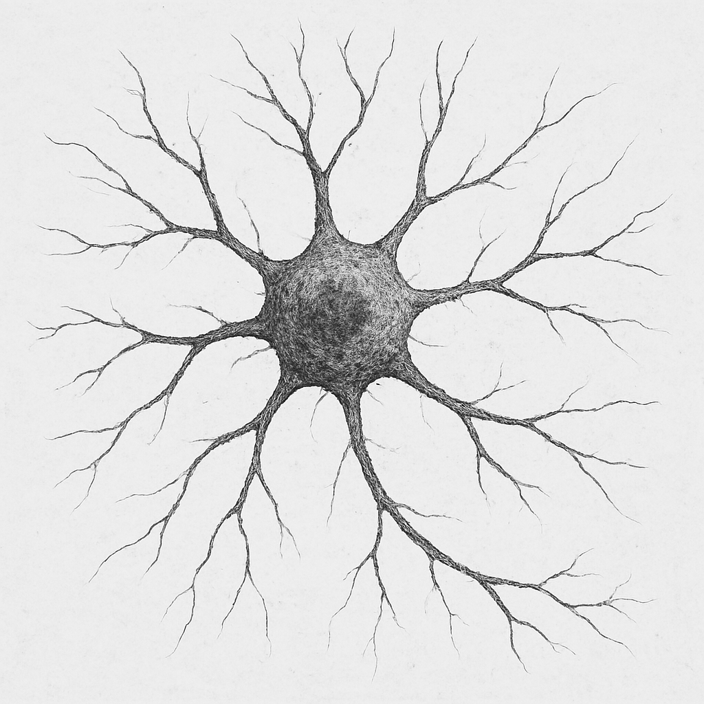

1. First, I load my image into the nodes channel and segment the image into a binary mask with the ML-segmenter. 
2. Next, I save the binary mask and reload it into the edges channel. The edges channel is the staging channel for all branch labeling.
3. Next, I run 'Process -> Generate -> Label Branches'
4. I am prompted by a window and select 'Run Branch Label' to use the default settings. I am prompted by a second window and select 'Run Node Generation' to use its default settings (this is a sub-algorithm that the former uses).

With these default settings, my labeled branches look like this:

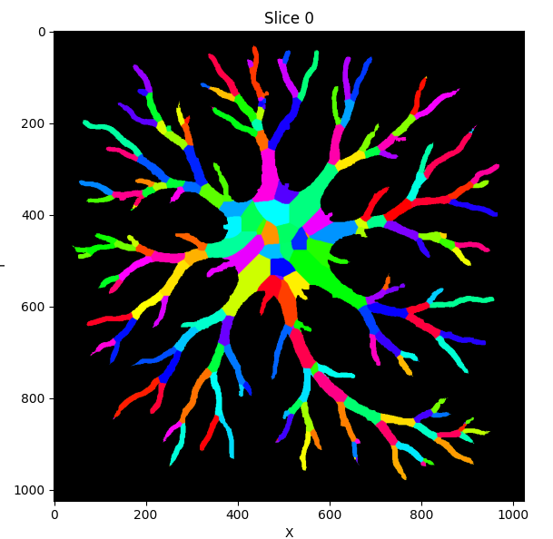
*Note branch labeling will put a grayscale value into your edges channel. I generated this colorful one for visualization using 'Image -> Overlays -> Color Nodes (or Edges)'*

We can see this image has succesfully identified the majority of the branches here. In many cases, a labeling schematic like this will be sufficient and we can proceed. 

Examples of Tweaking Branch Labels (Optional)
----------------

However, in this instance, there are several areas that may be worth addressing for a more accurate labeling, which I will discuss below:
There are three issues I will address:

1. The body of the neuron has been divided into a plethora of branches. (The algorithm optimally handles branch-structures and tends to get confused over bulbous ones).
2. There are little branches at the end of some of the dendrites that do not belong there. (In this case, this is due to segmentation artifacts not fully fusing the ends of the dendrites in the segmentation).
3. Some branches share a label. (This can occur due to how this algorithm works at a fundamental level [although it can be addressed in post] because the system is *guessing* so to speak what constitutes a unique branch. See the section on this algorithm for more information.)

Luckily NetTracer3D offers a suite of tools for improving segmentations in post. 

Handling over-labeled globs
~~~~~~~~~~~~~~~~~~~

To address the first one, I save my labeled branches and redo the branch labeling algorithm:

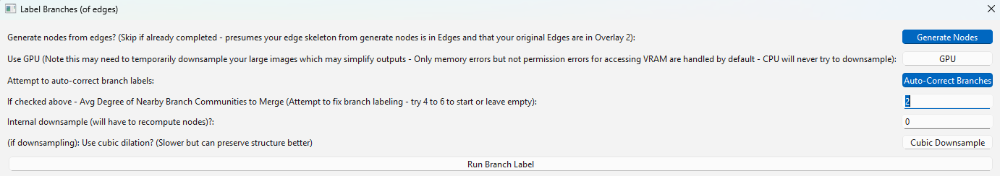

This time instead of using the default settings, I enable 'auto correct branches' and set its corresponding value below from 4 to 2 (2 just happened to do what I needed in my testing).
This enables an optional sub-algorithm that evaluates groups of branches and decides if it should collapse over-abundant regions into a single branch.
When I run the labeler with the new settings, I get this image:

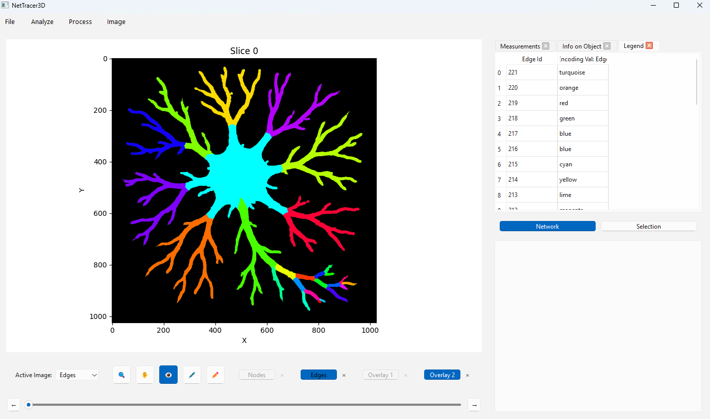

As we can see, this time it grouped branches together into much larger branches, and correctly identified the soma.
But we'll assume that what I want is the abundance of branches in the first image, together with the soma.
We'll save this new, broadly labeled branch image and set it aside while we return to the original labeling strategy.

Handling spine artifacts
~~~~~~~~~~~~~~~~~~~

Reloading my binary image of a neuron into edges, I once more run the branch labeler, this time not enabling 'auto correct branches'. However, recalling my second issue, I would like to avoid those small, wrongly labeled terminal branches from slipping through.
To do this, I want to decide what length of spine to remove from the image skeleton (which is used to label branches). This choice can be informed by skeletonizing my image with 'Process -> Image -> Skeletonize', then measuring the length of these terminal branches by right-clicking in the Image Viewer Window and placing measurement points:

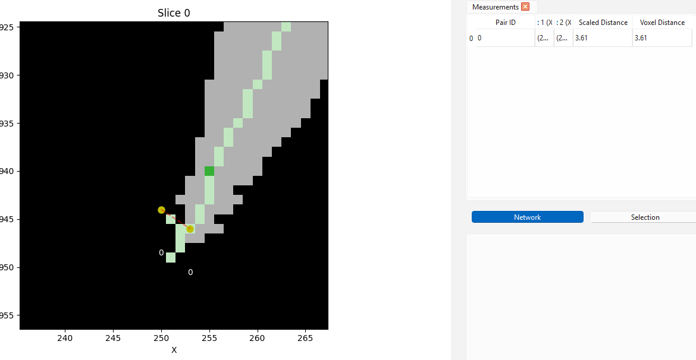
*Here we are at the end of a dendrite. We can see that the skeleton has incorrectly split - this is the source of those little branches. Use direct measurement for an accurate estimate of what spine lengths to remove*

when prompted with the second menu, I enable a new optional setting:

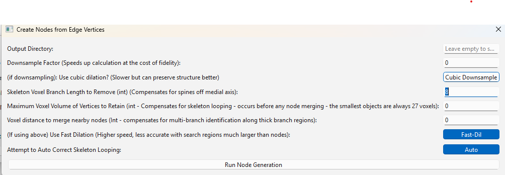
*Here, I set 'Skeleton Branch Length to Remove' to '8'*

Now when I run my labeler, it ignores all *terminal* branches below that length. Note this algorithm will only remove branches starting from an endpoint, until reaching a parent branch. Therefore, more internal branches that do not have endpoints themselves are always safe from removal, allowing us to use larger numbers without risk of major changes to the image.

Handling split labels
~~~~~~~~~~~~~~~~~~~
In the labeled output placed in the segmentation channel, I also want to address issue 3. To do this, I right click the image and choose 'Select All -> Edges'. Once everything is higlighted, I right click again and choose 'Selection -> Split non touching labels'.
This causes all non-touching labels to take on unique identities, handling issue 3.

Putting it all together
~~~~~~~~~~~~~~~~~~~
Finally, to get the large soma label into this new many-branch image, I load the broadly labeled branch image (generated above) back into the nodes channel. With 'nodes' as my 'active image', I click on the soma to select it. Finally, I choose 'Selection -> Override Channel with Selection'.
In the window that appears, I tell it to use my nodes selected region (from the nodes channel) to override my edges channel (selecting to place the output in the edges channel). This takes the labels from my nodes channel in the highlighted region, transposes them to not overlap with current labels in my edges channel, and stamps that region into my edges channel, effectively moving the soma label while keeping the rest of the branch labels.
Our final branch labeled neuron looks like this:

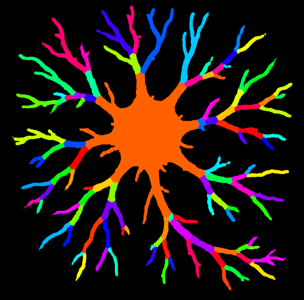

Although we could have grouped the soma manually, I demonstrated this algorithmically to show how this could be scaled up. If we were labeling many neurons and wanted each to look like this, the above steps will allow us to do it without rote selection (only, you would use the volume-based thresholder to select the somas).

Branch Adjacency Network
----------------
To create a network showing adjacent branches, first move the labeled branches into the nodes channel (either by saving and reloading it, or with 'Image -> Overlays -> Shuffle').
Using the branches as nodes, create a proximity network using 'Process -> Calculate -> Calculate Proximity Network', using 1 voxel as the search param and searching from morphological shape rather than centroids. This will result in the generation of a network showing adjacent branches. The final product is shown below:

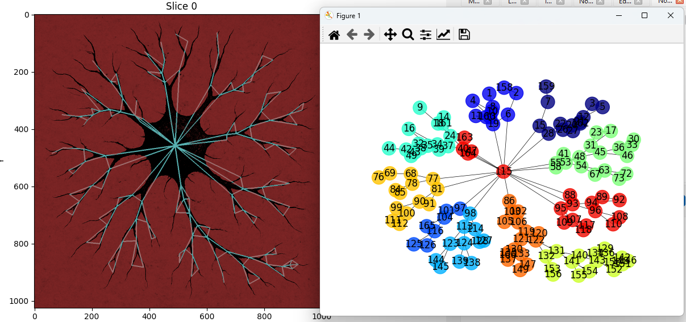
*Using networks, we have abstracted down the image of this neuron into a very simple data structure*

Using Branch Labels as Nodes
----------------
One interesting use of branch labeling is its ability to 'node-ify' structures that are otherwise not seperable into discrete regions. Once we label an image's branches, we can use those as nodes to generate a connectivity network.
For example, in the below image, I label the bronchi on this 3D image of a mouse lung to see how they are innervated by a set of nearby nerves:

.. image:: _static/branch8.png
   :width: 500px
   :alt: Bronchi Image
*This lovely dataset was provided by Rebecca Salamon from UC San Diego. Please use 'Image -> Show 3D' to call a Napari window that will automatically load active NetTracer3D datasets for 3D visualization.*

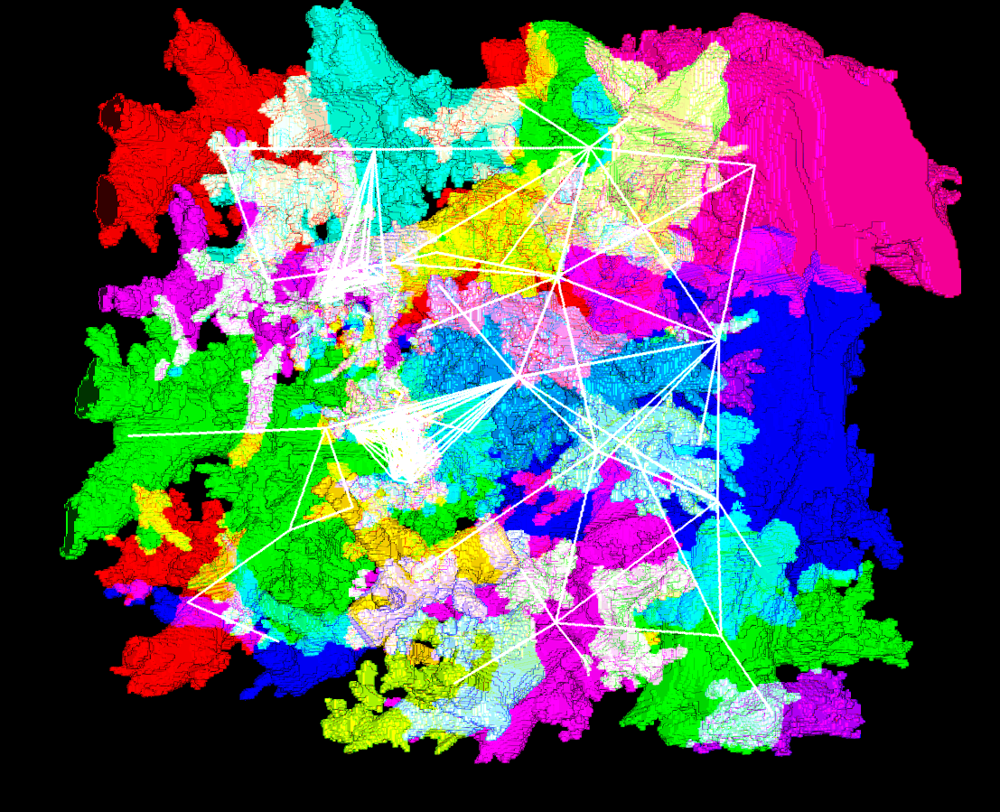
*Same image but with the alogrithmically-derived branches displayed. Using branch labeling, we can split up biological objects into meaningful domains*

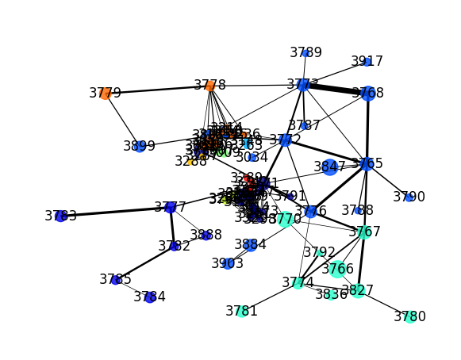
*And of course, the network itself*

.. _branchpoint:

Branchpoint Networks
----------------
Another option for creating networks from branched objects is connecting the branchpoints rather than the branches themselves. To accomplish this, load your branchy image into edges and select 'Process -> Generate -> Generate Nodes from Edge Vertices'.
You will be prompted by the same window that appears second in the branch-labeler algorithm. This is because the branch labeler actually uses the gennodes algorithm as an internal step, but executing it alone will give us nodes at branchpoints of the image skeleton without proceeding to the labeling step.
We can then use that set of branchpoint nodes together with the image skeleton (which gennodes will transform your edges into) to create a connectivity network.
Simply use 'Process -> Calculate -> Calculate Connectivity Network' after gennodes is finished. In the set of params that appear, **set 'Node Search' parameter to 2**. You must do this for accurate results, as this algorithm must dilate your edges a single time to see what neighbors they overlap with, and if your node vertices are too small, the edges will pass over that node and create a hub rather than a simple connection.
In the below example, I segment, then create a branchpoint network from a 3D image of lymph nodes.

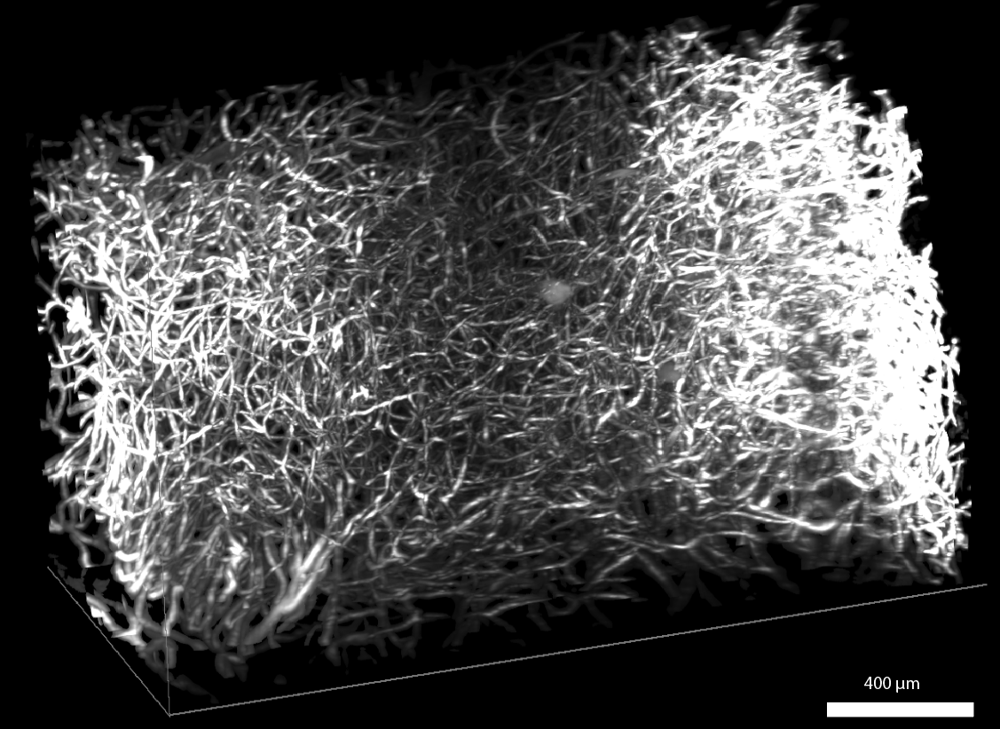
*The raw image (background masked). This original image was downloaded from the HuBMAP portal from an image captured by the University of Florida TMC*

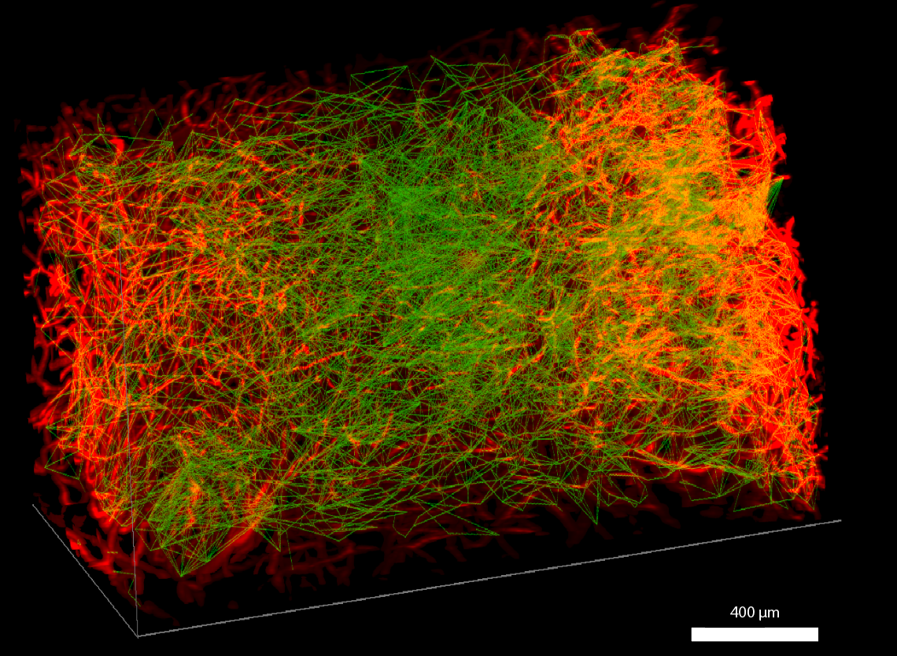
*Same image with its network overlay superimposed*

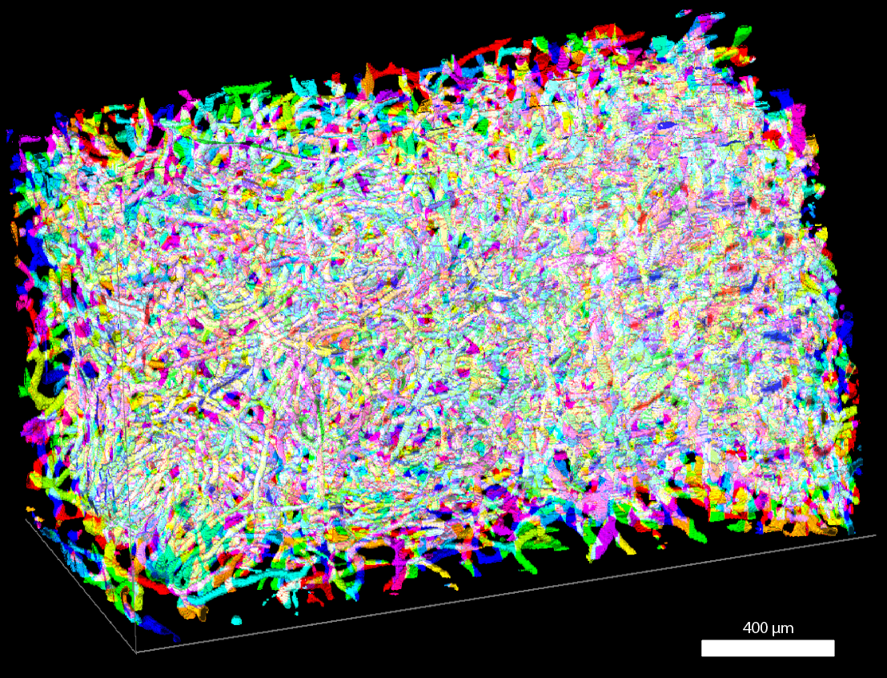
*Not related to the network, but here are its labeled branches*

Labeling branchpoint networks is an additional way to explore networks of branched objects. Branchpoint networks, for example, show the discrete connections between branches better than branch adjacency networks. However they come with the downside of not being able to access some of the higher level branch-editing options, such as the auto-correction based on grouping.

Next Steps
---------
For the final part of this tutorial, you may want to read :doc:`properties` to learn about what information is saved and loaded in Network3D Objects.