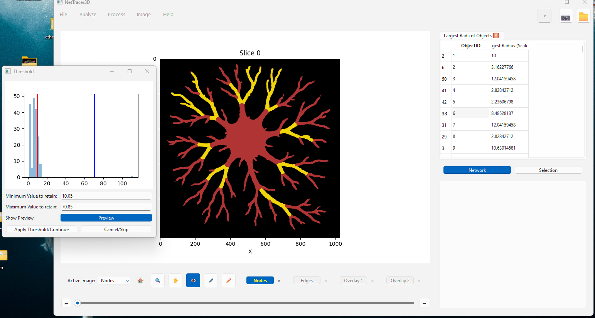

.. _branches:

==========
Labeling Branches and Branch Networks
==========

Labeling Branches
----------------

Step 1: Segmenting
~~~~~~~~~~~~~~~~~~~~

To demonstrate branch labeling, I will use a cartoon depiction of a neuron. 

.. image:: _static/branch0.png
   :width: 500px
   :alt: Neuron

* First, I load my image into the nodes channel and segment the image into a binary mask with the ML-segmenter. 

.. image:: _static/segmented_neuron.png
   :width: 500px
   :alt: Segmented Neuron
*This is a binary mask for this neuron thing that I made*

Step 2: Cleaning my Segmentation
~~~~~~~~~~~~~~~~~~~~

* Next, it is important that I clean up my segmentation. This can be very relevant as the branch labeler is quite sensitive to even little branches that might exist, so you want to make sure you get rid of any noise and address any gap-like artifacts.
* You can use 'Process -> Image -> Clean Segmentation' to get to some useful options for this. Here is the menu it shows:

.. image:: _static/clean_segmentation.png
   :width: 400px
   :alt: clean menu

* Some useful options are 'fill holes' to automatically fill any holes in the segmentation, or 'Threshold Noise' to remove small objects.
* The one that will probably be most relevant to branched images though is 'Trace Filaments' This will filter out noise while also joining branches that look like they should be the same branch but have an artifactual gap in their segmentation.
* I call trace filaments and get the following menu:

.. image:: _static/filament_menu.png
   :width: 600px
   :alt: filament menu

* This menu has a lot of parameters that you can read about in the 'Process -> Generate -> Trace Filaments' section. However, it is usually fine to run on default settings. I didn't do it for this neuron, but here is what it looks like for a segmentation from a real nervous dataset:

.. image:: _static/nerveseg1.png
   :width: 800px
   :alt: nerve before
*Above: My raw segmentation of these nerves*

.. image:: _static/nerveseg2.png
   :width: 800px
   :alt: nerve after
*Above: My segmentation after running trace filaments*

* As you can see, trace filaments is usually a decent way to just clean up these filament segmentations without having to get into any nitty-gritty. If you want to vary the parameters, you can alter them and recompute with cached-computation to rapidly alter the output based on the input parameters.

Step 3: Labeling Branches
~~~~~~~~~~~~~~~~~~~~

* Next, I save the binary mask and reload it into the edges channel. The edges channel is the staging channel for all branch labeling.
* I run 'Process -> Generate -> Label Branches'
* I am prompted by a window and select 'Run Branch Label' to use the default settings. 

.. image:: _static/process6.png
   :width: 500px
   :alt: Default Menu Settings

* I am prompted by a second window and select 'Run Node Generation' to use its default settings (this is a sub-algorithm that the former uses).

With these default settings, my labeled branches look like this:

.. image:: _static/branch1.png
   :width: 500px
   :alt: Neuron default
*Note branch labeling will put a grayscale value into your edges channel. I generated this colorful one for visualization using 'Image -> Overlays -> Color Nodes (or Edges)'*

We can see this image has succesfully identified the majority of the branches here. In many cases, a labeling schematic like this will be sufficient and we can proceed. 

Examples of Tweaking Branch Labels (Optional)
----------------

However, in this instance, there are few areas that may be worth addressing for a more accurate labeling.

* Mainly, that there are little branches at the end of some of the dendrites that do not belong there. (In this case, this is due to segmentation artifacts making the edges appear to have really small branches).

Luckily NetTracer3D's branch labelling algorithm has a good variety of auto-correcting tools when labeling branches. Here are a few that are enabled by default that I generally recommend:

1. By default, two auto-correct options are enabled in the branch labeler. The first option collapses any internal labels and forces them to merge with neighbors bordering the background. Otherwise, the middle of the neuron here (the soma) would likely have obtained a mosaic-looking set of labels. The second auto-attempts to correct any branch labels that may not be contiguous in space. It is recommended to keep these settings enabled, although they can be disabled for increased speed in exchange form some minor inaccuracies.

2. For 3D images, 'Attempt to Auto-Correct Skeleton Looping' is auto-enabled. This option attempts to convert any polyp-looking artifacts that show up in the internal skeletonization step back to single filaments (generally recommend).
 * However, this is not enabled for 2D, so my neuron did not use it. Mainly this is because in 2D, it cannot tell the difference between an artifactual and a real loop, but in this case we don't have any real loops so we'll use it.

Handling spine artifacts
~~~~~~~~~~~~~~~~~~~

Reloading my binary image of a neuron into edges, I once more run the branch labeler. I would like to avoid those small, wrongly labeled terminal branches from slipping through.
To do this, I want to decide what length of spine to remove from the image skeleton (which is used to label branches). This choice can be informed by skeletonizing my image with 'Process -> Image -> Skeletonize', then measuring the length of these terminal branches by right-clicking in the Image Viewer Window and placing measurement points:

.. image:: _static/branch2.png
   :width: 500px
   :alt: Measuring Spines
*Here we are at the end of a dendrite. We can see that the skeleton has incorrectly split - this is the source of those little branches. Use direct measurement for an accurate estimate of what spine lengths to remove*

when prompted with the second menu, I enable a new optional setting:

.. image:: _static/branch4.png
   :width: 500px
   :alt: Branch Grouped
*Here, I set 'Skeleton Branch Length to Remove' to '8'*

There are some other correction options you can read about in 'Process -> Generate -> Label Branches', but this spine one is all we will use here.
Now when I run my labeler, it ignores all *terminal* branches below that length. Note this algorithm will only remove branches starting from an endpoint, until reaching a parent branch. Therefore, more internal branches that do not have endpoints themselves are always safe from removal, allowing us to use larger numbers without risk of major changes to the image.

With Corrections
~~~~~~~~~~~~~~~~~~~
Our final branch labeled neuron looks like this:

.. image:: _static/branch6.png
   :width: 500px
   :alt: Branch Final
*Branches smaller than 8 voxels long have joined their neighbors*

Branch Merging Corrections
~~~~~~~~~~~~~~~~~~~
* Although I did not use it for this specific case, another potentially useful correction option to enable is 'Reunify Main Branches', available from the branch labeling menu shown above.
* By default, branches are labeled as segments existing between branch points. But selecting this will have the program do some additional processing to evaluate if any branches traveling in a similar direction, with a similar radius, ought to be re-joined back into a single long branch.
* For my neuron, this feature does not handle the 'Soma' very well since it's technically not a branch, but just to show what it can do for some of the other branches, here is the labeling with this option enabled:

.. image:: _static/union.png
   :width: 500px
   :alt: Union
*Note how branches such as the big orange one at the bottom now get labeled over longer ranges. In this case, I changed the 'Auto Correct Internal Labels' option to 'Merge Internal Labels with Non-Branch-Like External Neighbors', which tends to handle these branch mergers better so that multiple new long branches don't merge with the central soma structure, although it has caused the soma to become more mosaic-looking. This correction is quite strong for branches themselves, if you are interested in longer branches.*

Morphological Analysis
~~~~~~~~~~~~~~~~~~~~~~~~
* Beyond just networks, NetTracer3D offers a suite of options for morphological and/or spatial analysis that doesn't even pertain to the network itself.
* For example here, I use 'Analyze -> Stats -> Calculate Radii', then use the radii table to threshold my branches by radius, shown below.
* Any calculation done on the nodes can be used to threshold the nodes from the table, generally speaking, which makes NetTracer3D very useful at tying analytics back into spatial analysis.

*Note that thresholding with the tables always applies on the nodes, but labelling branches puts them in the edges channel by default sometimes. You can use 'Image -> Overlays -> Shuffle' to move images around to where you want them.

Branch Adjacency Network
----------------
* The simplest way to create a branch adjacency network is to run 'Process -> Calculate Network -> Calculate Branch Adjacency Network (of edges)'
* This can be run on a binary image in the 'edges' channel.
* It simply labels the branches with the same options as above, then calls the proximity network to find neighbors a distance of 1 voxel away.
* Of course, it could also be accomplished by labeling the branches, moving them to the nodes channel, and manually running a proximity network.

.. image:: _static/branch7.png
   :width: 500px
   :alt: Branch Network
*Using networks, we have abstracted down the image of this neuron into a very simple data structure*

Using Branch Labels as Nodes
----------------
One interesting use of branch labeling is its ability to 'node-ify' structures that are otherwise not seperable into discrete regions. Once we label an image's branches, we can use those as nodes to generate a connectivity network.
For example, in the below image, I label the bronchi on this 3D image of a mouse lung to see how they are innervated by a set of nearby nerves:

.. image:: _static/branch8.png
   :width: 500px
   :alt: Bronchi Image
*This dataset was shared by Rebecca Salamon from UC San Diego. Please use 'Image -> Show 3D' to call a Napari window that will automatically load active NetTracer3D datasets for 3D visualization.*

.. image:: _static/branch9.png
   :width: 500px
   :alt: Bronchi Render
*Same image but with the alogrithmically-derived branches displayed. Using branch labeling, we can split up biological objects into meaningful domains*

.. image:: _static/branch10.png
   :width: 500px
   :alt: Bronchi Network
*And of course, the network itself*

.. _branchpoint:

Branchpoint Networks
----------------
* Another option for creating networks from branched objects is connecting the branchpoints rather than the branches themselves. To accomplish this, the easiest way is to run 'Process -> Calculate Network -> Calculate Branchpoint Network'
* This can be run on a binary image in the 'edges' channel.
* It simply assign nodes to branchpoints using the 'Process -> Generate -> Generate4 Nodes From Edge Vertices' option, then assigns neighbors based on which edges interact with which node.
* Although not *exactly* the same, this can be accomplished by running the aforementioned methods to generate the nodes, then manually linking them with a connectivity network. (But note that if done this way, some level of node-search is required, which would probably be slower).

In the below example, I segment, then create a branchpoint network from a 3D image of lymph nodes.

.. image:: _static/lymph1.png
   :width: 500px
   :alt: Lymph
*The raw image (background masked). This original image was downloaded from the HuBMAP portal from an image captured by the University of Florida TMC*

.. image:: _static/lymph2.png
   :width: 500px
   :alt: Lymph Network
*Same image with its network overlay superimposed*

.. image:: _static/lymph3.png
   :width: 500px
   :alt: Lymph Render
*Not related to the network, but here are its labeled branches*

Labeling branchpoint networks is an additional way to explore networks of branched objects. Branchpoint networks, for example, show the discrete connections between branches better than branch adjacency networks. However they come with the downside of not being able to access some of the higher level branch-editing options, such as the auto-correction based on grouping.

Next Steps
---------
Next, you may want to read :doc:`properties` to learn about what information is saved and loaded in Network3D Objects.