.. _branches:

=====================================
Labeling Branches and Branch Networks
=====================================

.. contents:: On this page
   :local:
   :depth: 2

Labeling Branches
-----------------

Step 1: Segmenting
~~~~~~~~~~~~~~~~~~

Branch labeling is demonstrated here on a cartoon depiction of a neuron.

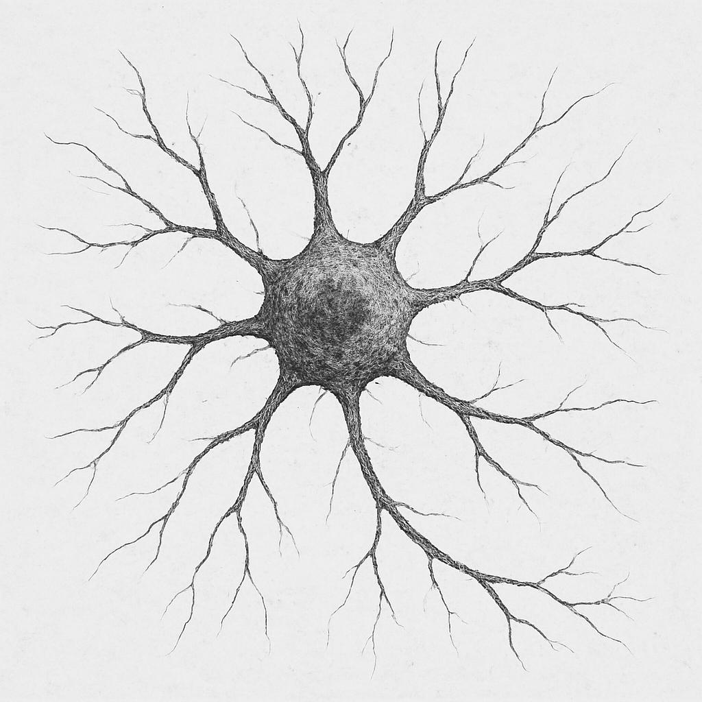

Load the image into the nodes channel and segment it into a binary mask with the
ML segmenter.

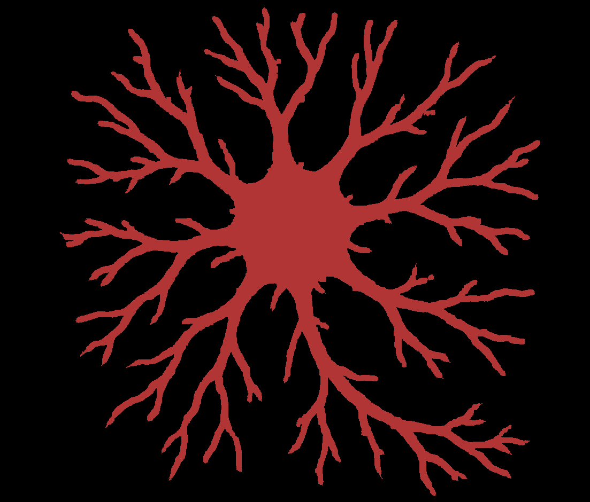

*The resulting binary mask.*

Step 2: Cleaning the Segmentation
~~~~~~~~~~~~~~~~~~~~~~~~~~~~~~~~~

Cleaning the segmentation is important, as the branch labeler is sensitive even
to very small branches. Remove any noise and address gap-like artifacts before
proceeding. **Process → Image → Clean Segmentation** provides the relevant
options:

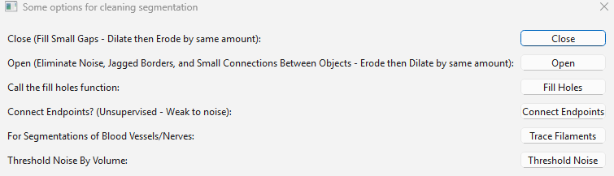

**Fill Holes** automatically fills holes in the segmentation and **Threshold
Noise** removes small objects. For branched images, the most relevant option is
**Trace Filaments**, which filters out noise while joining branches that should
be continuous but are separated by an artifactual gap in the segmentation.
Calling it opens the following menu:

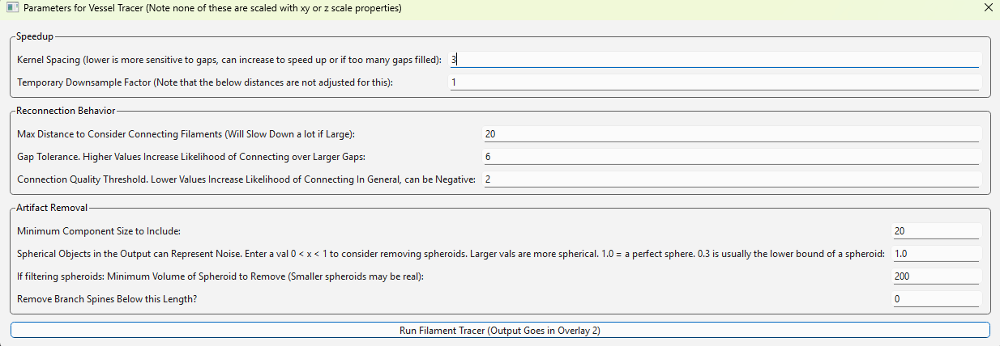

The parameters are described under **Process → Generate → Trace Filaments**, but
the defaults are usually adequate. It was not applied to this neuron; the example
below shows its effect on a segmentation from a real nervous dataset:

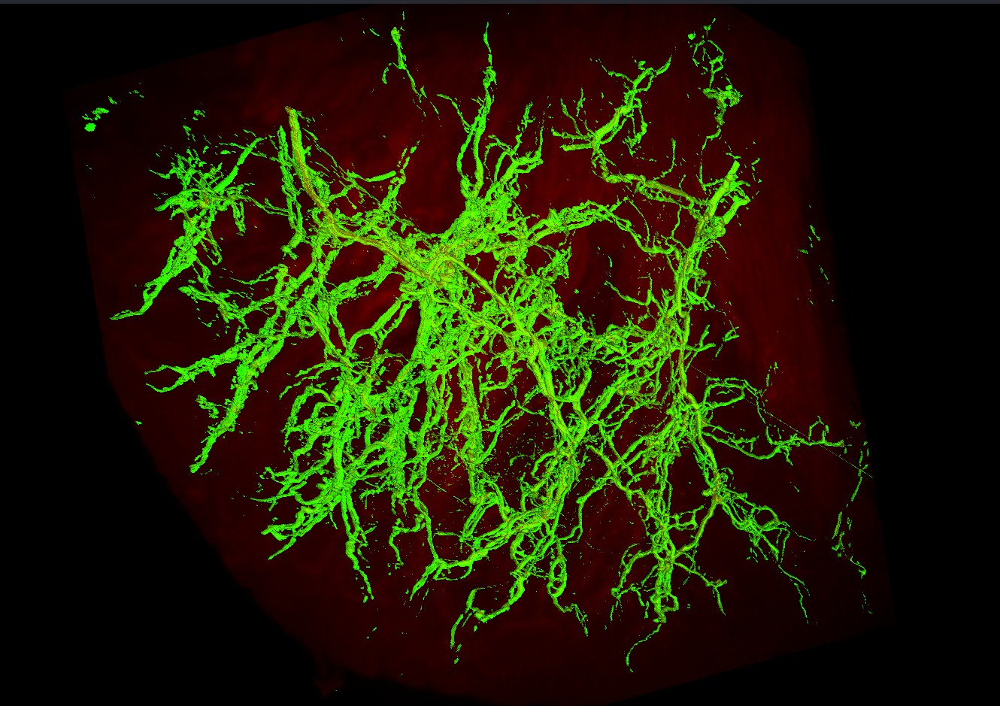

*Above: the raw segmentation of these nerves.*

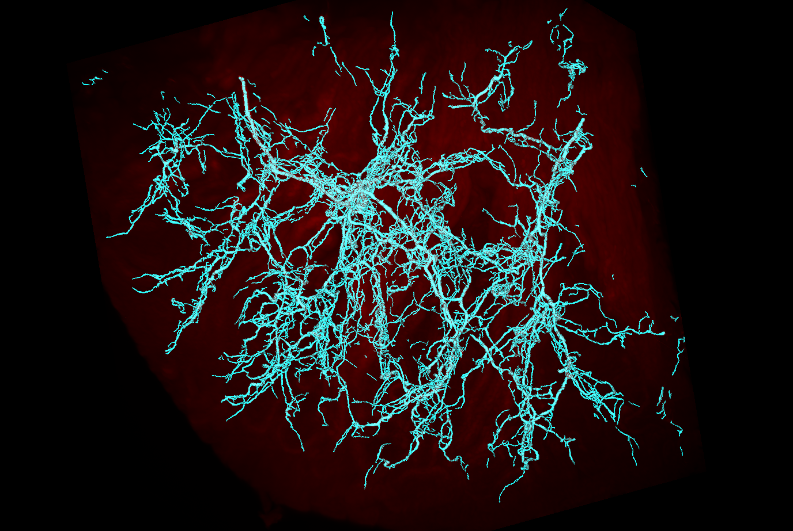

*Above: the same segmentation after running trace filaments.*

Trace filaments is generally an effective way to clean up filament segmentations
without detailed adjustment. To vary the parameters, alter them and recompute
using cached computation, which rapidly updates the output for a given set of
inputs.

Step 3: Labeling Branches
~~~~~~~~~~~~~~~~~~~~~~~~~

Save the binary mask and reload it into the edges channel, which is the staging
channel for all branch labeling. Run **Process → Generate → Label Branches** and
select **Run Branch Label** to use the default settings.

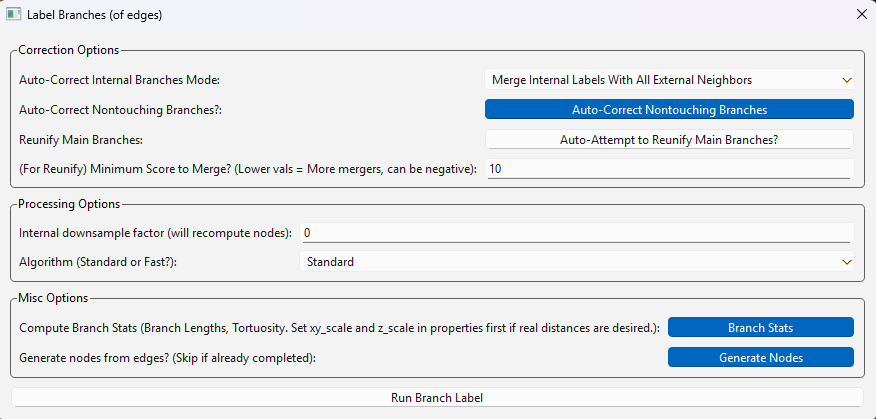

A second window then prompts for **Run Node Generation**, a sub-algorithm used by
the labeler; its defaults are also used here.

With these settings, the labeled branches appear as follows:

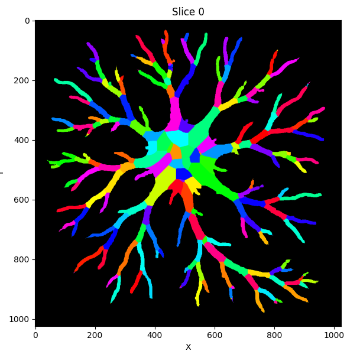

*Branch labeling writes a grayscale value into the edges channel. The colorful
rendition here was generated for visualization using 'Image → Overlays → Color
Nodes (or Edges)'.*

The majority of branches have been identified successfully. In many cases a
labeling scheme like this is sufficient to proceed.

Tweaking Branch Labels (Optional)
---------------------------------

In this instance, a few areas are worth addressing for more accurate labeling —
chiefly the small branches at the ends of some dendrites that do not belong
there, caused by segmentation artifacts making the edges appear to have very
small branches.

NetTracer3D's branch labeling algorithm offers a variety of auto-correcting
tools. Two are recommended and enabled by default:

1. Two auto-correct options in the branch labeler. The first collapses internal
   labels and forces them to merge with neighbors bordering the background;
   without it, the soma at the center of this neuron would likely acquire a
   mosaic-looking set of labels. The second attempts to correct branch labels
   that are not contiguous in space. Keeping both enabled is recommended, though
   disabling them increases speed at the cost of minor inaccuracies.

2. For 3D images, **Attempt to Auto-Correct Skeleton Looping** is enabled
   automatically. This converts polyp-like artifacts arising in the internal
   skeletonization step back into single filaments, and is generally recommended.
   It is not enabled for 2D, because in 2D the algorithm cannot distinguish an
   artifactual loop from a real one. Since this neuron contains no real loops, it
   is enabled here.

Handling spine artifacts
~~~~~~~~~~~~~~~~~~~~~~~~

Reload the binary neuron image into edges and run the branch labeler again, this
time avoiding the small, wrongly labeled terminal branches. This requires
deciding what length of spine to remove from the image skeleton used to label
branches. Inform that choice by skeletonizing the image with **Process → Image →
Skeletonize**, then measuring the terminal branches by right-clicking in the
image viewer window and placing measurement points:

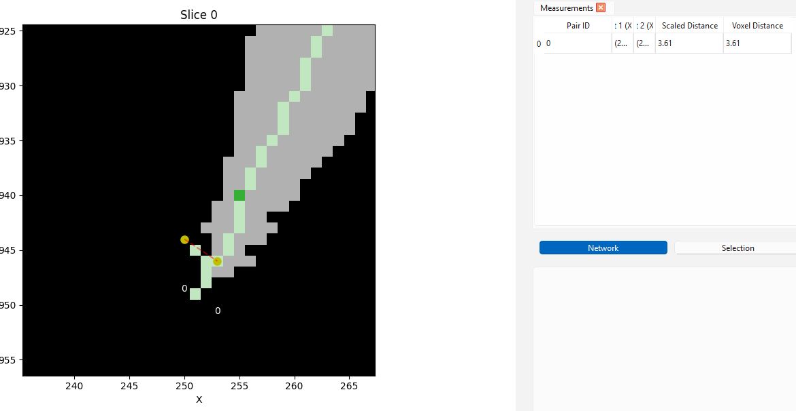

*At the end of a dendrite, the skeleton has incorrectly split — the source of
those small branches. Direct measurement gives an accurate estimate of the spine
lengths to remove.*

At the second menu, enable the corresponding optional setting:

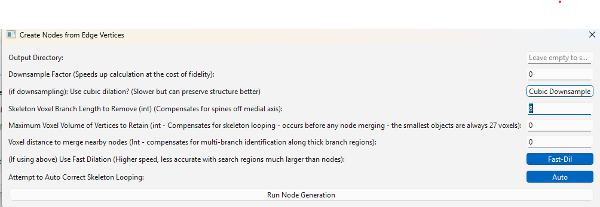

*Here, 'Skeleton Branch Length to Remove' is set to 8.*

Further correction options are described under **Process → Generate → Label
Branches**; only the spine option is used here. The labeler now ignores all
*terminal* branches below that length. Because the algorithm only removes
branches starting from an endpoint and stops on reaching a parent branch, more
internal branches without endpoints are always safe from removal — larger values
can therefore be used without risking major changes to the image.

With corrections
~~~~~~~~~~~~~~~~

The final branch-labeled neuron:

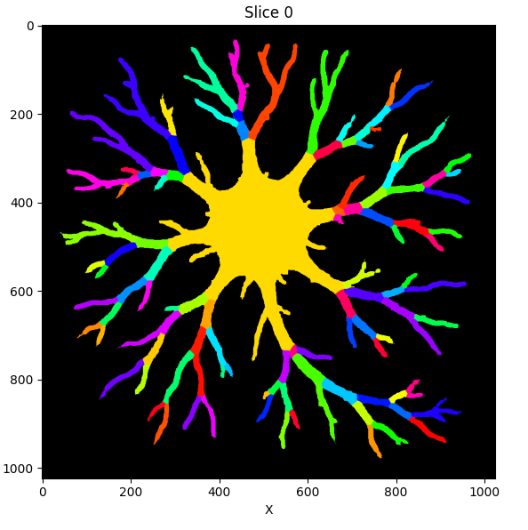

*Branches shorter than 8 voxels have joined their neighbors.*

Branch merging corrections
~~~~~~~~~~~~~~~~~~~~~~~~~~

**Reunify Main Branches**, available from the branch labeling menu shown above,
is another useful correction, though it was not used in this case. By default
branches are labeled as the segments between branch points; this option adds
processing to evaluate whether branches travelling in a similar direction with a
similar radius should be rejoined into a single long branch.

For this neuron the feature does not handle the soma well, since the soma is not
technically a branch, but the effect on the other branches is shown below:

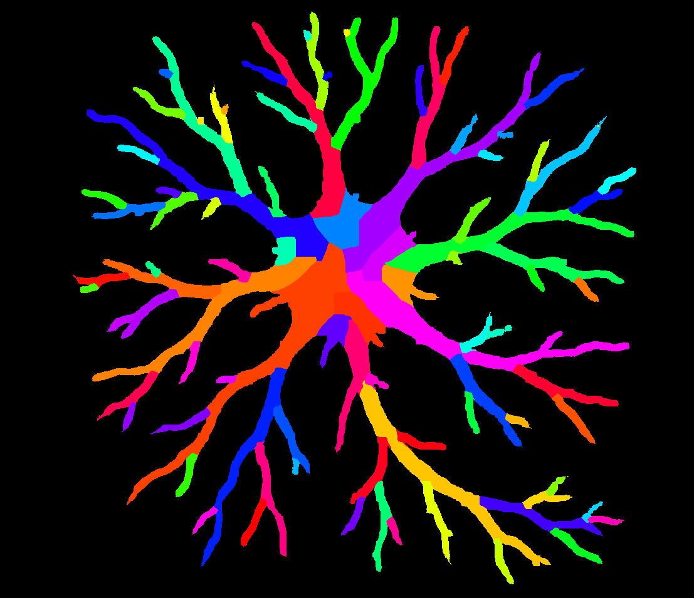

*Branches such as the large orange one at the bottom are now labeled over longer
ranges. The 'Auto Correct Internal Labels' option was changed to 'Merge Internal
Labels with Non-Branch-Like External Neighbors', which handles these mergers
better so that multiple new long branches do not merge with the central soma
structure — although it has made the soma more mosaic-looking. This correction is
quite strong for branches themselves if longer branches are of interest.*

Morphological analysis
~~~~~~~~~~~~~~~~~~~~~~

Beyond networks, NetTracer3D offers a suite of options for morphological and
spatial analysis independent of the network itself. In the example below,
**Analyze → Stats → Calculate Radii** produces a radii table, which is then used
to threshold branches by radius. Any calculation performed on the nodes can
generally be used to threshold them from the table, which makes NetTracer3D
effective at tying analytics back into spatial analysis.

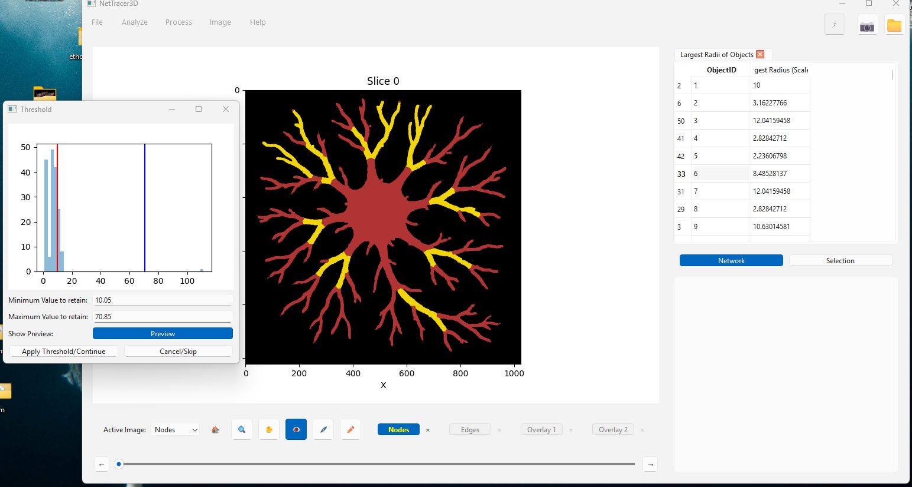

*Thresholding from tables always applies to the nodes, but branch labeling
sometimes places results in the edges channel by default. Use 'Image → Overlays →
Shuffle' to move images between channels as needed.*

Branch Adjacency Network
------------------------

The simplest way to create a branch adjacency network is **Process → Calculate
Network → Calculate Branch Adjacency Network (of edges)**, run on a binary image
in the edges channel. It labels the branches with the same options described
above, then calls the proximity network to find neighbors one voxel away. The
same result can be obtained by labeling the branches, moving them to the nodes
channel, and running a proximity network manually.

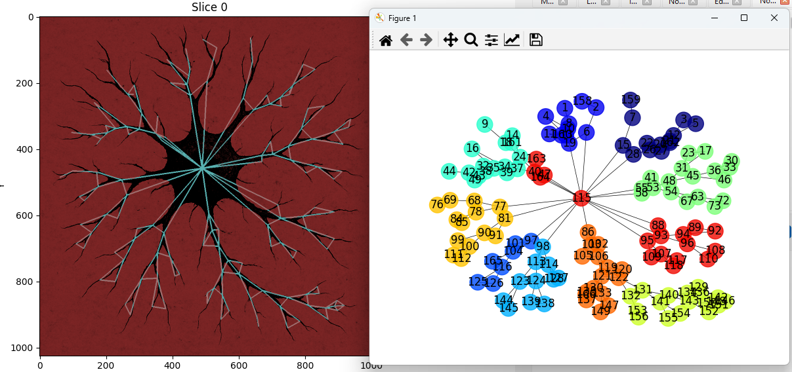

*The image of this neuron has been abstracted into a very simple data structure.*

Using Branch Labels as Nodes
----------------------------

Branch labeling can node-ify structures that are otherwise not separable into
discrete regions. Once an image's branches are labeled, they can serve as nodes
for a connectivity network. In the example below, the bronchi in a 3D image of a
mouse lung are labeled to examine how they are innervated by a set of nearby
nerves:

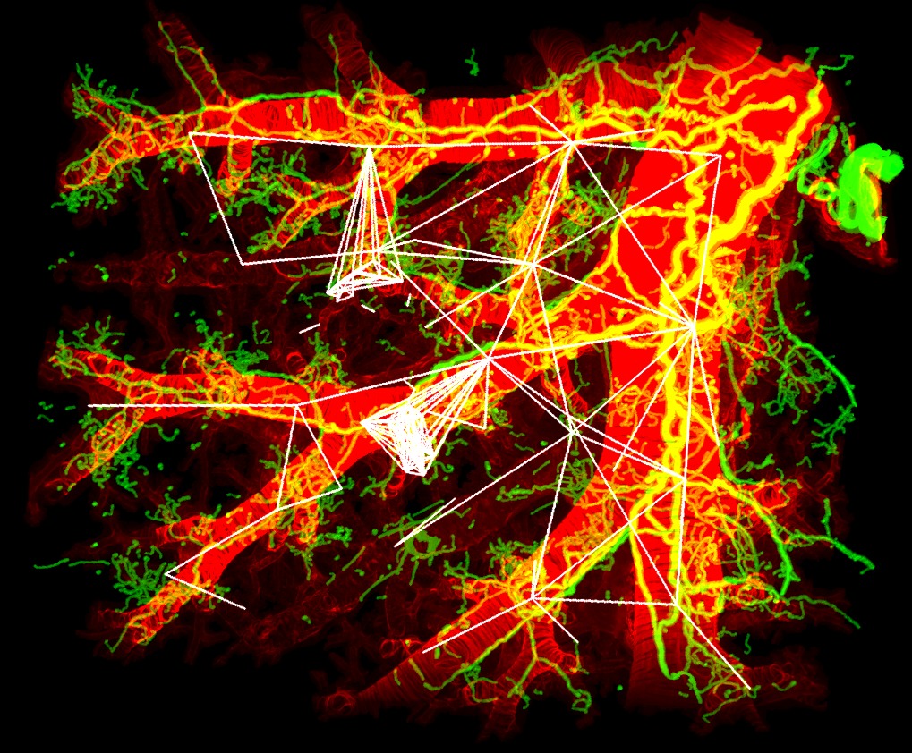

*This dataset was shared by Rebecca Salamon from UC San Diego. Use 'Image → Show
3D' to open a Napari window that automatically loads active NetTracer3D datasets
for 3D visualization.*

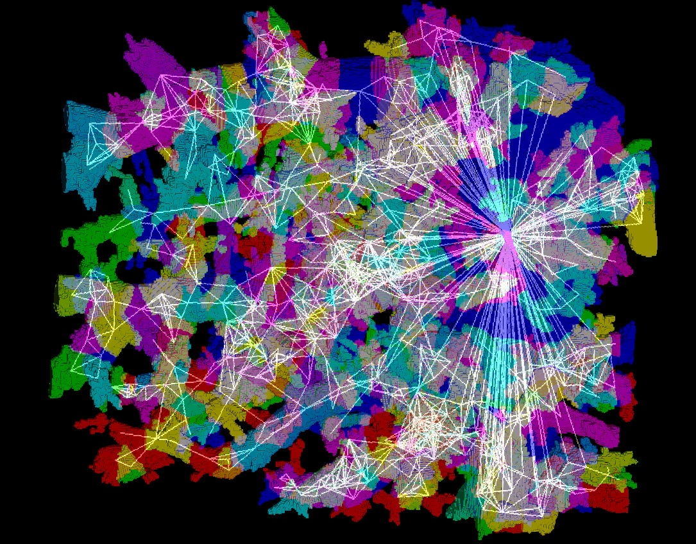

*The same image with the algorithmically derived branches displayed. Branch
labeling splits biological objects into meaningful domains.*

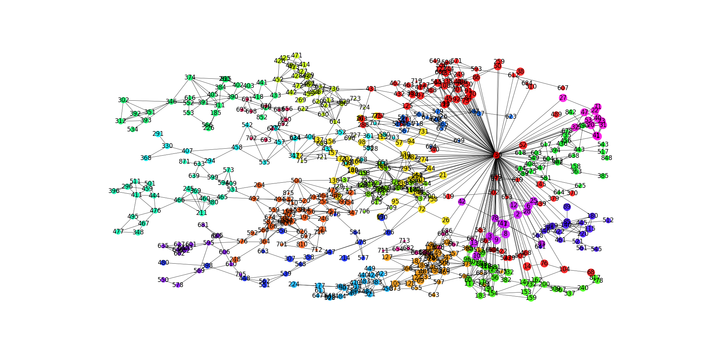

*The network itself.*

.. _branchpoint:

Branchpoint Networks
--------------------

Networks can also be built from branched objects by connecting the branchpoints
rather than the branches. The simplest route is **Process → Calculate Network →
Calculate Branchpoint Network**, run on a binary image in the edges channel. It
assigns nodes to branchpoints using **Process → Generate → Generate4 Nodes From
Edge Vertices**, then assigns neighbors based on which edges interact with which
node.

Although not *exactly* equivalent, this can also be accomplished by generating
the nodes with the methods above and linking them manually with a connectivity
network — though that route requires some level of node search and is likely
slower.

The example below segments a 3D image of lymph nodes and creates a branchpoint
network from it.

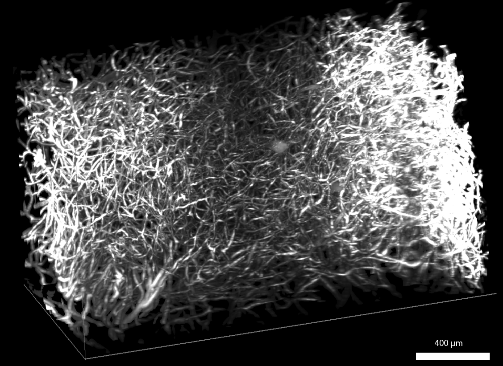

*The raw image with background masked. The original was downloaded from the
HuBMAP portal, captured by the University of Florida TMC.*

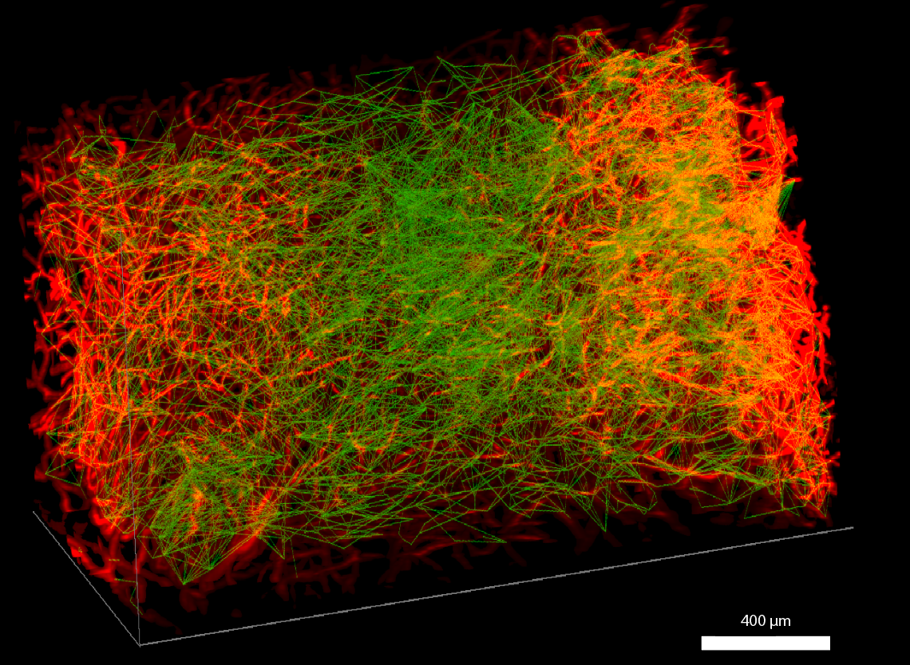

*The same image with its network overlay superimposed.*

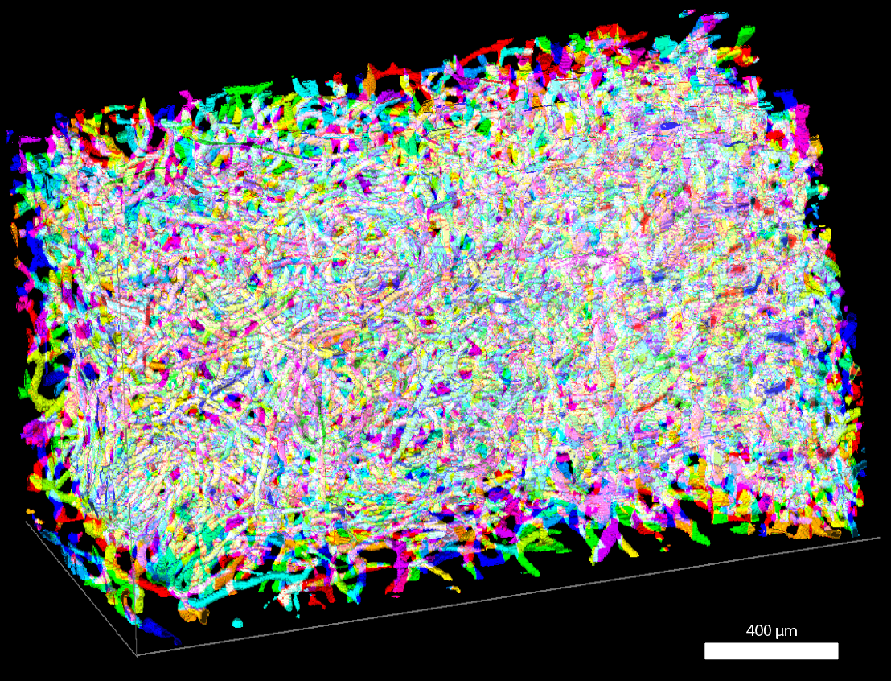

*Unrelated to the network, but here are its labeled branches.*

Branchpoint networks show the discrete connections between branches better than
branch adjacency networks. The trade-off is that some higher-level branch-editing
options, such as auto-correction based on grouping, are not available.

Next Steps
----------

Next, read :doc:`properties` to learn what information is saved and loaded in
Network3D objects.
