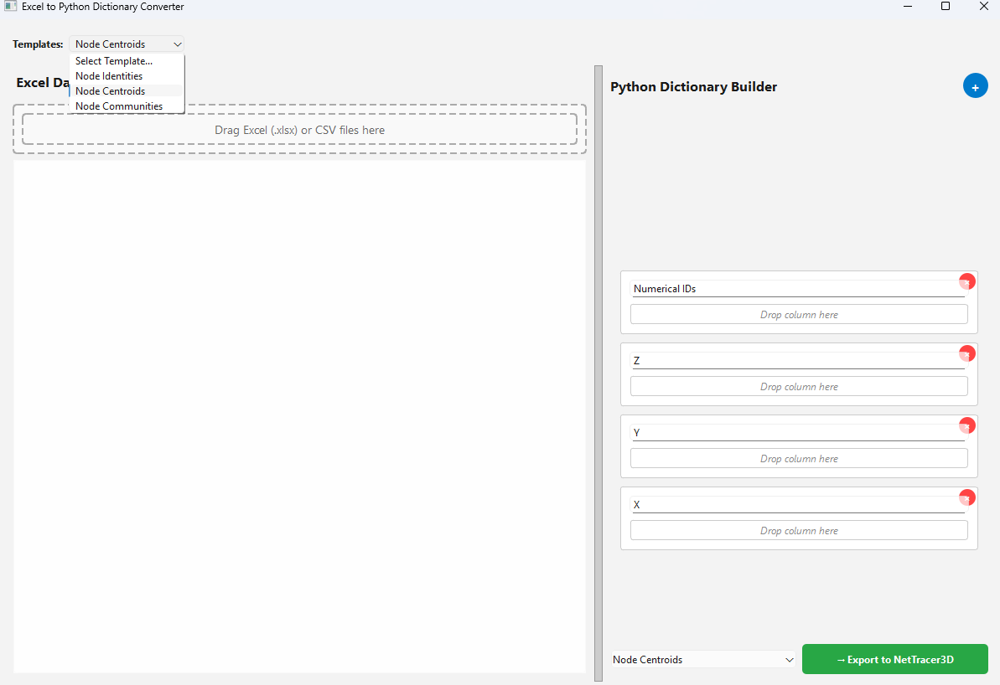
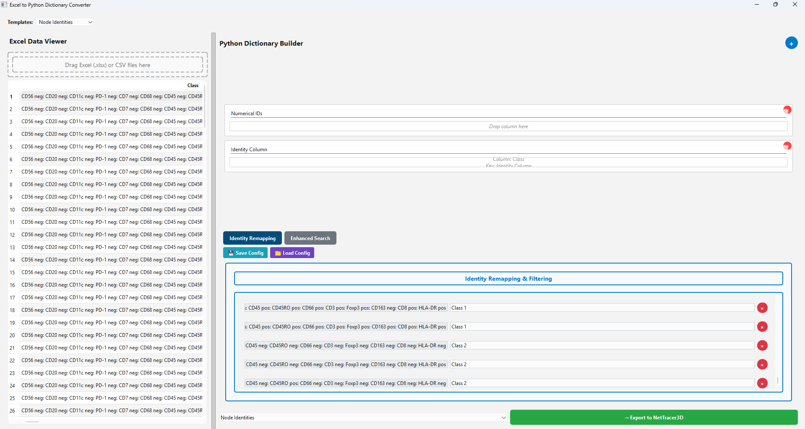

.. _excel_helper:

============
Using the Spreadsheet Loader
============

* The excel helper is a small GUI to help the user import data from excel (.xlsx or .csv) spreadsheets and convert them directly to NetTracer3D properties.
* It is designed specifically for QuPath spreadsheet outputs, specfically for handling multitudinous cell phenotypes.

Opening the Excel Helper
---------

* Use 'File -> Load -> Load From Excel From Helper' to open the Excel Helper. You will get this window:

* On the left, where it says 'Drag Excel (.xlsx) or CSV files here', dragging said spreadsheet there will open the spreadsheet in the widget.
    * This tool expects said spreadsheet to organize the data in columns, with column headers indicating what the data entry refers to (not rows at the moment).
* Use the dropdown that says 'Templates' in the top left to open an entry in the right to help build a NetTracer3D Property.
    * As of now, only exporting data from these template designs will work. Custom exports are not built in the backend.
    * Supported properties are 'Node Centroids', 'Node Identities', and 'Node Communities'.
* The cells on the right that appear feature a header (referring to what NetTracer3D expects the data placed there to refer to), and a lower box that says 'Drop Column Here'.
    * After an excel spreadsheet has been imported, entire columns can be lifted and dropped into that space. This will tell NetTracer3D that the associated rightside header refers to that column's data.
    * The columns themselves should refer to the same object in their row. (i.e., here I want centroids, so if I have a spreadsheet of cell centroids, the 'X', 'Y', etc, entries from the columns should refer to the same cell within a row).
* Certain right-sided cells will be autopopulated if nothing is placed there but the data is exported.
    * If 'Numerical IDs' is not populated (for any of the properties), it will auto-assume that the IDs begin with 1 and extend to the row length for the other columns.
    * For centroids, if 'Z' is not populated, it will assume the data is 2D and just assign all Z's to '1'.
* This tool is specifically for 'node identities' to help reclassify extrated phenotype-organized data to NetTracer3D Node IDs. Using the 'node identities' template will show this instead:

.. image:: _static/excel_helper_2.png
   :width: 800px
   :alt: Excel Helper 2

* In this case, I've opened some data on the left side featuring some cell phenotypes I'm interested in, with a QuPath exported spreadsheet.
* I picked up the data under 'Class' on the left and dragged it to 'Identity Column' on the right.
* In the bottom right is a new widget specific to IDs. This is to help us reassign IDs if we want. On the left is the original IDs (built from the unique set of the 'Identity Column').
    * In the middle under 'New ID' there are spots to enter new identities that we want the entry on the left to be reassigned to. 
    * Alternatively, by clicking the red X on the right, we can just have any objects associated with that original class/identity not be included in the export to NetTracer3D.
* Whenever you are ready to send the data to NetTracer3D, click 'Export to NetTracer3D' on the bottom right. The command prompt window will let you know if the export succeeded.
* In some cases, the amount of unique class permutations may be overwelming for manual assignment. To deal with that, click the button that says 'enhanced search' to yield the following menu:

.. image:: _static/excel_helper_3.png
   :width: 800px
   :alt: Excel Helper 2

* In enhanced search, we can add classifiers to help sort through abundant strings to automatively assign IDs to new classes that we want.
* After adding a new classifier, in the substrings textbox, add specific chunks of text that you want to be assigned to a new class (if that text exists in any 'original ID' the identity remapping window).
    * The substring search is inclusive for all substrings that the user adds. Any 'original ID' that contains (anywhere in its text) that exact group of substrings (in whatever order) will be assigned a new ID by the classifier.
* For any 'original ID' deemed a match by a classifier, enter the new ID you want it to be assigned in the 'New ID' text window.
    * In this case, I'm assigning any 'original IDs' that contain 'CD45 pos' and 'CD20 neg' to 'Class 1', while the reverse is being assigned to 'Class 2'
* Class assignment is hierarchal. The lower number classes are assigned first (ie any 'original id' that matches classifier 1 will be reassigned first and thereafter not be considered for later classifiers).
    * Because of this, categories with larger groups of specific markers (say that match multiple subphenotypes) would want to be assigned to lower number classifiers, while those more specific subphenotypes would want to be assigned later.
    * Similarly, broad categories (with less specific matches) should be assigned later.
    * Unmatched 'Original IDs' will be kicked out by default. To prevent this, an empty classifier at the end of the classifier lists can be used to catch anything that doesn't match.
* Within a classifier, the up and down arrow buttons can be used to change its order in the hierarchy. Additionally, the green copy button will duplicate a classifier (say to make a more stringent version).
* Press 'Preview Classification' to use the classifiers to label all the 'Original IDs' in the 'Identity Remapping' window.
* Afterwards, we can press 'Identity Remapping' to see how the 'Original IDs' have been auto-assigned 'New IDs'. (Reload your data to the identity column to start over):

* To reuse identity and classifier configurations, use the save and load buttons to save or load a json file containing the configuration.

Next Steps
---------
Next, you may want to read :doc:`keyboard_shortcuts` to learn about the avaible keyboard shortcuts.
