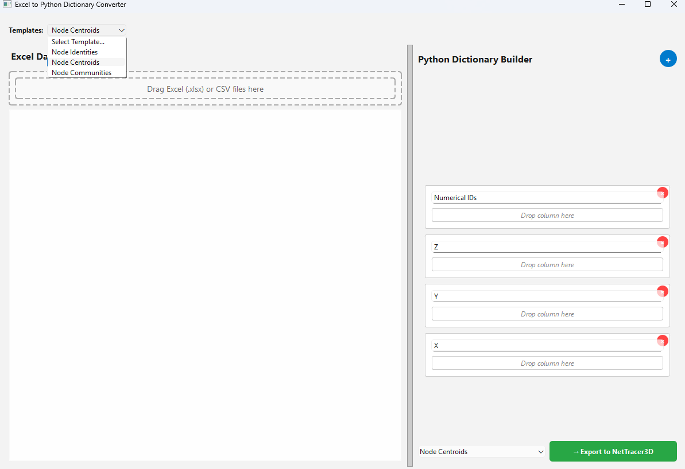
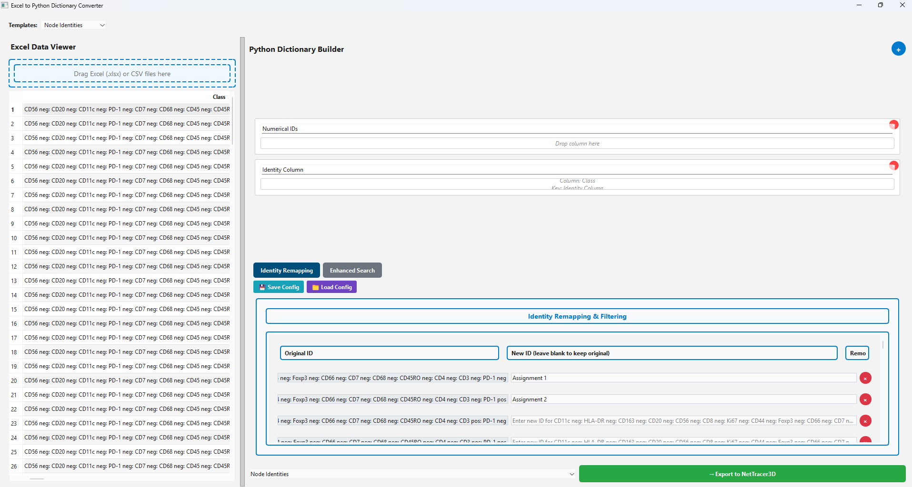
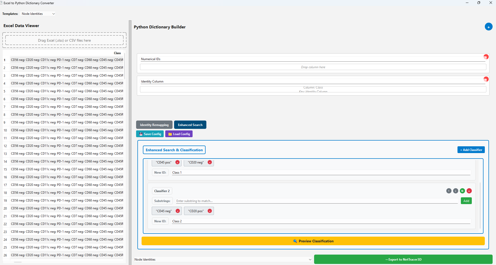
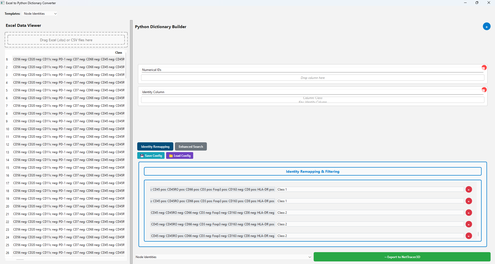

.. _excel_helper:

============================
Using the Spreadsheet Loader
============================

The excel helper is a small GUI for importing data from ``.xlsx`` or ``.csv``
spreadsheets and converting it directly into NetTracer3D properties. It is
designed specifically for QuPath spreadsheet outputs — or those of similar
software such as Xenium — and for handling large numbers of cell phenotypes.

Opening the Excel Helper
------------------------

Use **File → Load → Load From Excel From Helper** to open the tool:

Drag a spreadsheet onto the panel on the left marked *Drag Excel (.xlsx) or CSV
files here* to open it in the widget. The tool expects data organised in columns,
with column headers indicating what each entry refers to; row-organised data is
not currently supported.

Use the **Templates** dropdown in the top left to open an entry on the right for
building a NetTracer3D property. Only exports from these template designs are
supported — custom exports are not implemented in the backend. Supported
properties are **Node Centroids**, **Node Identities**, and **Node Communities**.

Each cell that appears on the right has a header, indicating what NetTracer3D
expects the data placed there to refer to, and a lower box marked *Drop Column
Here*. Once a spreadsheet has been imported, entire columns can be lifted and
dropped into that space, telling NetTracer3D that the associated header refers to
that column's data. Columns must refer to the same object within a given row —
for centroids, for example, the X and Y entries in a row must belong to the same
cell.

Certain fields are auto-populated if left empty at export:

* If **Numerical IDs** is not populated, for any property, IDs are assumed to
  begin at 1 and extend to the row length of the other columns.
* For centroids, if **Z** is not populated, the data is assumed to be 2D and all
  Z values are assigned 1.

Reclassifying Node Identities
-----------------------------

The **Node Identities** template additionally helps reclassify extracted,
phenotype-organised data to NetTracer3D node IDs:

In this example, a QuPath-exported spreadsheet containing cell phenotypes has
been opened on the left, and the **Class** data dragged into **Identity Column**
on the right.

The widget in the bottom right assists with reassigning IDs. The original IDs,
built from the unique set of the identity column, appear on the left. Under **New
ID** in the middle are fields for the identities they should be reassigned to.
Clicking the red **X** on the right instead excludes any objects associated with
that original class from the export.

When ready, click **Export to NetTracer3D** in the bottom right. The command
prompt window reports whether the export succeeded.

Enhanced Search
---------------

Where the number of unique class permutations is too large for manual
assignment, click **Enhanced Search**:

.. note::

   Using classifiers here is no longer the preferred way to reassign identities;
   this is now handled primarily through **Process → Modify Network/Properties →
   Change/Remove Identities**. The options below remain available, but importing
   identities directly and changing them in the GUI is recommended.

Enhanced search adds classifiers that sort through abundant strings to assign IDs
to new classes automatically. After adding a classifier, enter in the substrings
textbox the specific chunks of text to be assigned to a new class, where that
text exists in any original ID in the identity remapping window.

The substring search is inclusive for all substrings added: any original ID
containing that exact group of substrings anywhere in its text, in any order, is
assigned a new ID by the classifier. Enter the target identity in the **New ID**
text window. In the example shown, original IDs containing both ``CD45 pos`` and
``CD20 neg`` are assigned to *Class 1*, while the reverse is assigned to *Class
2*.

**Hierarchal** determines assignment order:

* When checked, lower-numbered classes are assigned first — any original ID
  matching classifier 1 is reassigned first and is not considered by later
  classifiers. Categories with larger groups of specific markers, such as those
  matching multiple subphenotypes, should be given lower classifier numbers,
  while more specific subphenotypes are assigned later. Broad categories with
  less specific matches should likewise be assigned later.
* When unchecked, nodes are assigned multiple identities.
* Unmatched original IDs are discarded by default. To prevent this, place an
  empty classifier at the end of the classifier list to catch anything that does
  not match.

If no number column is dragged into the **Numerical IDs** area, IDs are assigned
ascending labels starting from 1, overriding any current node labels in the
program. Checking the small plus sign beside the export button instead appends
auto-generated ascending labels to the current highest label, assuming nodes are
already labeled.

Within a classifier, the up and down arrows change its position in the hierarchy,
and the green copy button duplicates it — useful for creating a more stringent
version.

Press **Preview Classification** to label all original IDs in the identity
remapping window using the classifiers, then **Identity Remapping** to review how
the original IDs have been assigned their new IDs. To start over, reload your
data into the identity column.

Identity and classifier configurations can be saved to, and loaded from, a JSON
file using the save and load buttons.

Next Steps
----------

Next, read :doc:`keyboard_shortcuts` for a summary of the available keyboard
shortcuts.
