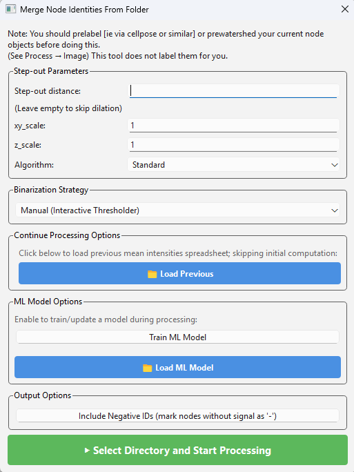

.. _file_menu:

=====================
All File Menu Options
=====================

The file menu is used exclusively for saving and loading. Networks should be
saved from the network table in the bottom right rather than from here.

.. contents:: On this page
   :local:
   :depth: 2

New Session
-----------
Selecting 'New Session' will give a confirmation prompt asking to make sure your current session is saved. If you proceed, the session will be reset.

Save
----

The save menu writes everything to the active directory — as referenced by the
command window running the program — using generic names, making it suitable for
quick saves.

1. **Save Current Session** — saves all active core NetTracer3D properties (see
   :doc:`properties`) into the current session folder, prompting you to create
   one if none exists.
2. **Save Nodes** — saves the nodes channel into the current session folder as
   ``labelled_nodes.tif``.
3. **Save Edges** — saves the edges channel into the current session folder as
   ``labelled_edges.tif``.
4. **Save Overlay 1** — saves Overlay 1 into the current session folder as
   ``overlay_1.tif``.
5. **Save Overlay 2** — saves Overlay 2 into the current session folder as
   ``overlay_2.tif``.
6. **Save Highlight Overlay** — saves the highlight overlay into the current
   session folder as ``Highlighted_Element.tif``.

Save As
-------

The save as menu prompts for a filename and directory.

1. **Save Current Session As** — prompts for a new folder in which to dump all
   properties of the current session (see :doc:`properties`). This folder can
   later reload the session, provided the filenames within are unchanged.
2. **Save Nodes As** — saves the nodes channel as a ``.tif``.
3. **Save Edges As** — saves the edges channel as a ``.tif``.
4. **Save Overlay 1 As** — saves Overlay 1 as a ``.tif``.
5. **Save Overlay 2 As** — saves Overlay 2 as a ``.tif``.
6. **Save Highlight Overlay As** — saves the highlight overlay as a ``.tif``.
7. **Save Misc Property** - Use to save the node_identities as both a ``.csv`` and ``.json``, the node_centroids as a ``.csv``, or the node communities as a ``.csv``.

.. tip::

   Ending any ``.tif`` save name with ``compressed.tif`` writes a compressed
   version, which can be considerably smaller for labeled images while remaining
   readable by most TIFF readers.

Load
----

The load menu prompts for files to open.

.. note::

   NetTracer3D does not handle channels of differing dimensions well. Attempting
   to load one prompts to auto-resize the image to match the dimensions of those
   already in the image viewer window. Accepting is advised; declining risks
   crashing the program.

#. **Load Previous Session** — prompts for a folder containing saved outputs from
   a previous session, typically generated by **Save (As) Network3D Object**. When
   assembling the Network3D object, the program looks for the generic filenames
   assigned by that function, or by the generic Save options; files under other
   names are ignored.
#. **Load Nodes** — loads a ``.tif``/``.tiff``/``.nii``/``.jpg``/``.jpeg``/
   ``.png`` image into the nodes channel. Grayscale only; color images are
   converted.
#. **Load Edges** — loads a ``.tif``/``.tiff``/``.nii``/``.jpg``/``.jpeg``/
   ``.png`` image into the edges channel. Grayscale only; color images are
   converted.
#. **Load Overlay 1** — loads a ``.tif``/``.tiff``/``.nii``/``.jpg``/``.jpeg``/
   ``.png`` image into the Overlay 1 channel. Supports color images.
#. **Load Overlay 2** — loads a ``.tif``/``.tiff``/``.nii``/``.jpg``/``.jpeg``/
   ``.png`` image into the Overlay 2 channel. Supports color images.
#. **Load Full Sized Highlight Overlay** — loads a ``.tif``/``.tiff``/``.nii``/
   ``.jpg``/``.jpeg``/``.png`` image into the highlight overlay.

   For sufficiently large images, the highlight overlay is rendered only on the
   visible plane rather than as a full 3D image, though the full overlay is
   rendered for any method requiring it, such as 3D visualization. In such cases,
   if a highlight overlay referencing the nodes exists and something else is
   loaded into the nodes channel, the overlay is altered to reference the new
   nodes. Loading the desired overlay directly with this function bypasses the
   plane-based overlay — useful for 3D visualization.
#. **Load Network** — loads a ``.csv``/``.xlsx`` file containing network data in
   the structure NetTracer3D expects, which is the same structure it saves to.
#. **Load From Excel Helper** — opens the excel helper, a separate GUI for
   converting less-structured ``.csv`` or ``.xlsx`` spreadsheets obtained
   elsewhere into NetTracer3D properties (see :doc:`excel_helper`). Currently
   supports **Node Centroids**, **Node Identities**, and **Node Communities**.
#. **Load Misc Properties → Load Node IDs** — loads a ``.json``/``.csv``/
   ``.xlsx`` file containing node IDs in the structure NetTracer3D expects. You
   are then asked whether to update/merge or replace the existing node IDs.
   Updating adds any new, unique IDs to each node's identity list, which is
   useful for combining identities encoded for the same nodes across different
   sessions. Replacing overwrites what is present, matching the behaviour when a
   new session is loaded.
#. **Load Misc Properties → Load Node Centroids** — loads a ``.csv``/``.xlsx``
   file containing node centroids in the structure NetTracer3D expects.
#. **Load Misc Properties → Load Edge Centroids** — loads a ``.csv``/``.xlsx``
   file containing edge centroids in the structure NetTracer3D expects.
#. **Load Misc Properties → Load Node Communities** — loads a ``.csv``/``.xlsx``
   file containing network communities in the structure NetTracer3D expects.

.. _merge_nodes:

Images → Node Identities
------------------------

Merge Nodes
~~~~~~~~~~~

Prompts for a ``.tif``/``.tiff`` file corresponding to an additional labeled
nodes image to merge with the current nodes channel. A directory containing a set
of ``.tif``/``.tiff`` images may be selected instead to merge many at once.

This allows nodes from several types of images — heterogeneous structures or cell
types, for example — to be compared. Images are generally segmented and labeled
individually before merging.

* Labels cannot currently overlap, as they are being combined into a single
  image.
* To mitigate this, you are prompted to generate centroids for each image prior
  to merging. Select this to have each image's true centroid enter NetTracer3D
  regardless of the appearance of the merged output. An optional downsample
  factor finds centroids on a downsampled image before transposing the result,
  at the risk of losing especially small nodes.
* Merging auto-assigns node IDs based on the name of the ``.tif``/``.tiff`` being
  merged, while the original nodes acquire the name ``root_nodes``. These IDs
  cannot be changed within NetTracer3D — save the node IDs as described above,
  reassign the names with the excel helper or directly in spreadsheet software,
  then reload with **Load → Load Misc Properties → Load Node IDs**.

Assign Node Identities From Overlap With Other Images
~~~~~~~~~~~~~~~~~~~~~~~~~~~~~~~~~~~~~~~~~~~~~~~~~~~~~

This is the main route for assigning node identities in multichannel data. Either
segment your cells or create hexagon nodes from the generate menu, place all
desired channels in a folder, and run this function. It iterates through the
channels in the folder, assigning cells an identity based on minimum and maximum
thresholds of that cell's fluorescent intensity.

With labeled nodes loaded into the nodes channel, running this opens the
following menu:

**Search region expansion**

1. **Step-out distance** — the distance node markers search outwards for overlap,
   estimating a cell radius. This can also be precomputed in **Process → Image →
   Dilate**.
2. **xy_scale** — the true scale of the xy plane of the image.
3. **z_scale** — the true scale of the z-step size of the image. With parameters
   2 and 3 entered correctly, parameter 1 should be given as a true biological
   distance.

**Binarization Strategy**

Controls how the system decides to assign an identity to a node.

1. **Auto-Binarize** — suitable for pre-binarized channels or particularly good
   SNR. For pre-binarized data, segment every channel for what you consider real
   and arrange the segmented channels in the target folder. Any non-binary data
   encountered has its foreground predicted with Otsu's algorithm, which will not
   necessarily give ideal results.
2. **Manual** — the default setting and the primary way to use this function.
   Each channel is loaded into the GUI in turn, allowing thresholds to be
   manipulated to choose which cells receive an identity. See the proximity
   networks tutorial for details.
3. **Auto with ML Predictor** — requires a neural network model trained on a
   prior dataset, loaded back into this window. The network then predicts the
   threshold bounds from its training data.
4. **Using Previous Thresholds** — reapplies thresholds from an earlier session
   for a set of channels by loading back the spreadsheet NetTracer3D generates at
   the end of a thresholding session.

**Load Previous**

Loads a table from a previous session containing the average intensity expression
for every cell. This normally has to be calculated for every channel of interest,
after which you are prompted to save the resulting spreadsheet. Reloading it here
skips preprocessing for channels that already have data, which is worthwhile when
reapplying thresholds or adding channels to a previous session. You are prompted
to save a new spreadsheet at the end containing both old and new data.

**ML model training**

The model is currently a neural network trained to associate the shape of the
histogram curve with your preferred thresholds; this may be adjusted in future.

1. The top button enables training a model for this session. After training on
   all channels, you are prompted to save the model. Combined with a previously
   loaded model, training builds on top of the old one.
2. The bottom button loads a previous model, saved as a ``.pkl`` file. Once
   loaded, the model can predict every threshold as described above, or manual
   thresholding can continue with a new option to have the system make an initial
   guess for each.

   .. warning::

      Do not load ``.pkl`` files from untrusted sources — they can execute
      arbitrary code on your system.

**Include Negative IDs**

Assigns nodes a negative ID for each channel they lack, in addition to those they
have. This can bloat the data considerably and is not usually necessary, but is
available where that level of detail is wanted.

**Running the function**

Click **Select Directory and Start Processing** and navigate to the directory
containing your channels, stored as serial 2D or 3D TIFFs rather than a single
combined TIFF. If node identities already exist, new ones from this thresholding
session are added to them, allowing further channels to be added to previous
sessions. Channels present in both the existing identities and the current
session are overridden by the new thresholds, which allows past mistakes to be
corrected.

Next Steps
----------

This concludes the file menu. Next, proceed to :doc:`analyze_menu` for
information on the analyze menu functions.
