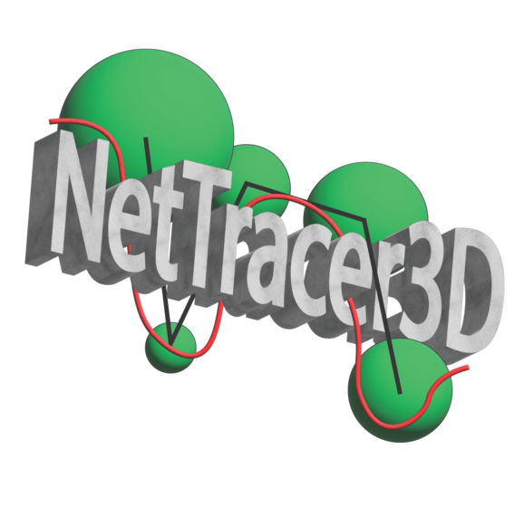

.. NetTracer3D documentation master file, created by
   sphinx-quickstart on Fri Apr 11 17:39:20 2025.
   You can adapt this file completely to your liking, but it should at least
   contain the root `toctree` directive.

NetTracer3D documentation
=========================

Welcome to NetTracer3D
---------------------

NetTracer3D is a powerful tool for 2D and 3D analysis of microscopic/medical images. It supports generation of 3D networks showing relationships between objects in three dimensional space, either by proximity, grouped by interactivity with another object such as nerves, or between branches of objects like vessels or nerves.

Key Features
-----------

* Algorithms to group objects into three-dimensional networks, abstracting big data into a manageable form for analysis.
* Segmentation using machine learning 
* Fully functional, user friendly GUI supporting interactive 2D and 3D displays.
* A plethora of tools for 3D image analysis and modification, such as branch labeling and 3D watershedding.
* A suite of tools for analyzing and exporting network data.

Getting Started
-------------

To get started with NetTracer3D, check out the :doc:`installation` guide and then proceed to the :doc:`quickstart` tutorial. 

A youtube tutorial on installing and using the program can be found here: https://www.youtube.com/watch?v=_4uDy0mzG94&list=PLsrhxiimzKJMZ3_gTWkfrcAdJQQobUhj7

.. toctree::
   :maxdepth: 2
   :caption: User Guide:

   installation
   quickstart
   proximity
   branches
   properties
   excel_helper
   keyboard_shortcuts

.. toctree::
   :maxdepth: 2
   :caption: Detailed Function Guide:

   right_clicking
   file_menu
   analyze_menu
   process_menu
   image_menu

.. toctree::
   :maxdepth: 1
   :caption: Development:

   contact
   changelog
   roadmap
   about
   usage