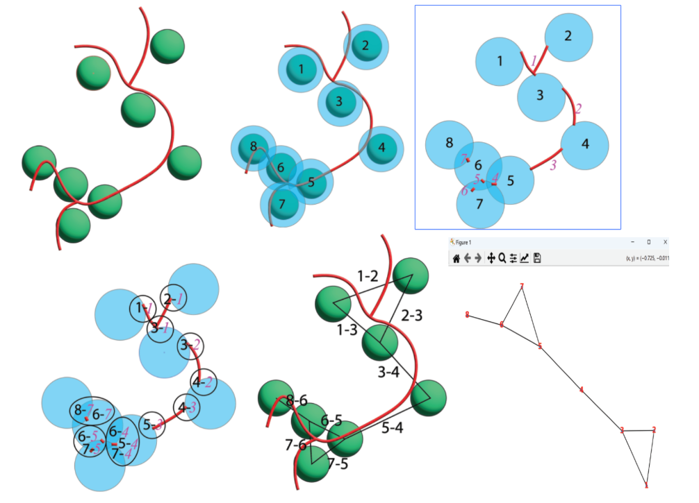
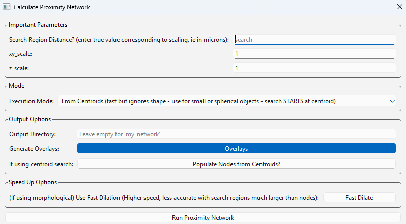
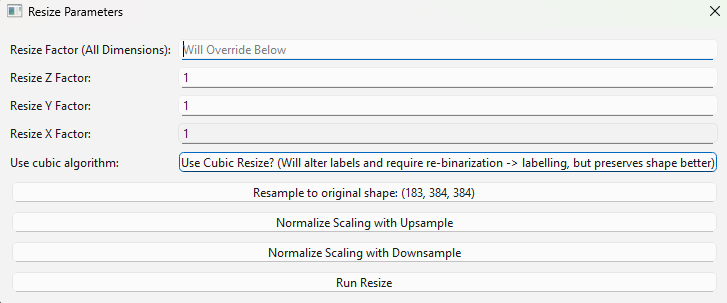
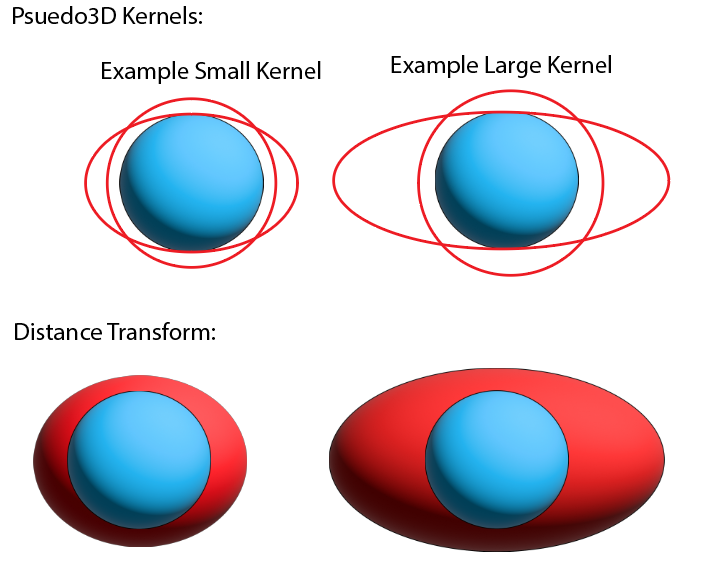
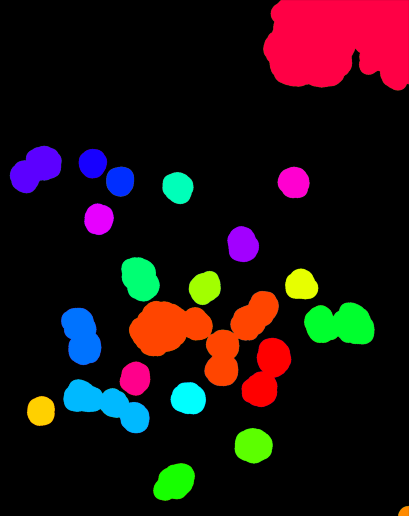
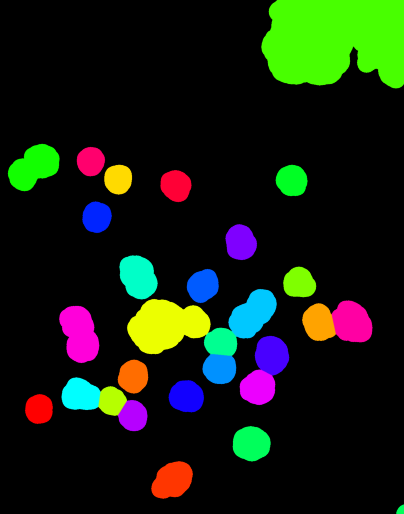
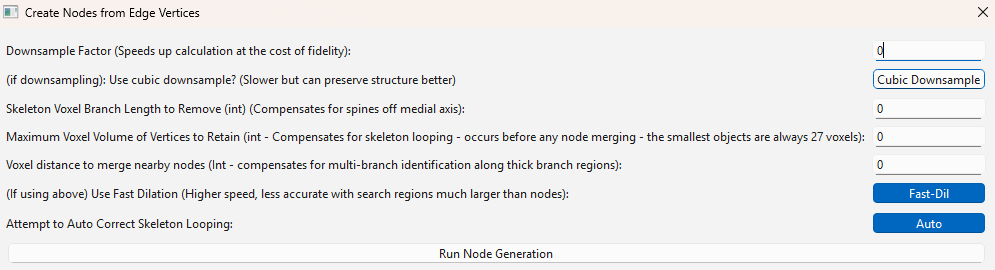
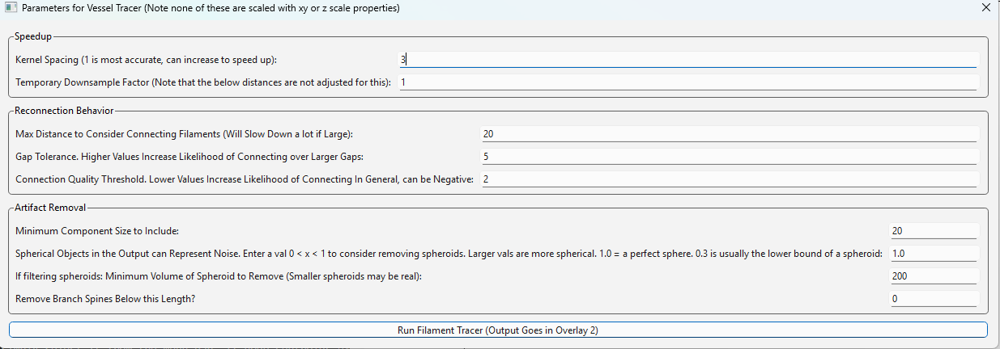
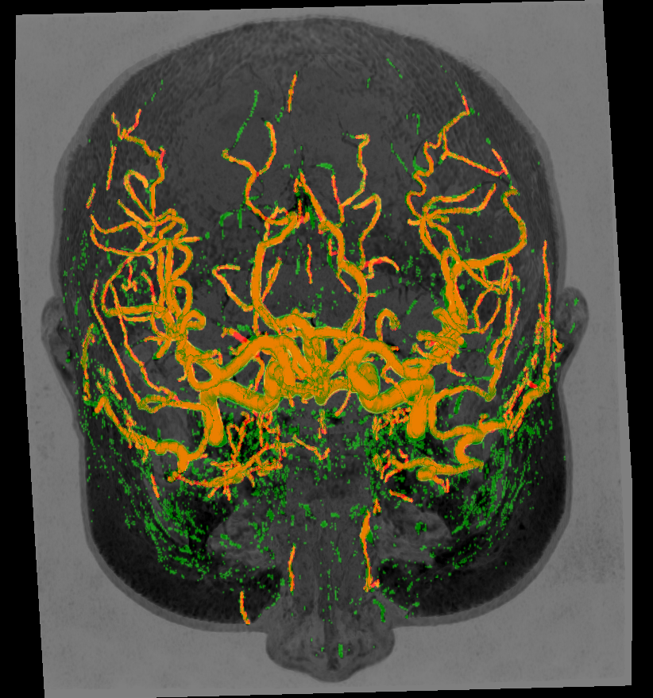
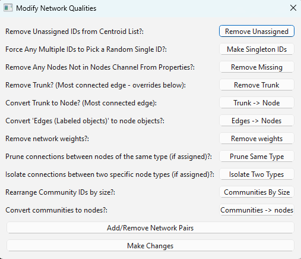

.. _process_menu:

========================
All Process Menu Options
========================

The process menu provides options for calculating networks and altering image
contents. The first submenu, **Calculate Network**, contains functions for
calculating networks and their properties. The second, **Image**, contains
functions that transform images.

.. contents:: On this page
   :local:
   :depth: 2

.. _connectivity_network:

Process → Calculate Network → Calculate Connectivity Network
-------------------------------------------------------------

Connects objects in the nodes channel via objects in the edges channel. See
:doc:`quickstart` for a detailed walkthrough. The vast majority of the parameters
are optional, though a few warrant consideration on each execution.

.. image:: _static/connectivity_network_menu.png
   :width: 800px
   :alt: Connectivity Network Menu

Parameter explanations
~~~~~~~~~~~~~~~~~~~~~~

#. **xy_scale** — a float setting the X/Y 2D plane pixel scaling to a real-world
   value, such as 5 microns per pixel. Presumed to be 1 by default.
#. **z_scale** — a float setting the Z 3D voxel depth to a real-world value, such
   as 5 microns per voxel. Presumed to be 1 by default.
#. **Node Search (float)** — the distance nodes search the corresponding edge
   image for connections to other nodes. This value is scaled by the ``xy_scale``
   and ``z_scale`` parameters, so where those are set correctly it can be treated
   as a real value such as microns. It is 0 by default, which connects only nodes
   that edges literally pass through.
#. **Edge Reconnection Distance (float)** — the distance edges dilate, likewise
   scaled by ``xy_scale`` and ``z_scale``.

   This parameter exists for segmented edges that are not continuous structures
   because of holes from imaging or segmentation artifacts. Edges that are wholly
   discrete in 3D space will not join nodes through that pathway, and inflating
   them fills those holes. Note that all edges are inflated, so two edges ten
   microns apart will merge if a value of 5 microns is entered. This method only
   dilates and never erodes, which also enables edges to search slightly further
   than the node search parameter suggests, since they can then enter a node's
   search space.

   There is an inherent trade-off in using dilation to fill hole artifacts, as it
   risks merging nearby edges that should not be merged. A small value is
   reasonable where holes exist, but running the filament tracer is a more
   elegant solution, as it fills gaps in filaments without excessive merging. The
   value is 0 by default and should remain so where edges have no hole artifacts
   or those have already been corrected.
#. **Re-Label Nodes...** — labels objects in the nodes channel with a simple
   adjacency-labeling scheme, so that every discrete object in space acquires a
   unique number. **Disable this if your nodes were already labeled elsewhere.**

Parameters 6–9 represent different ways of handling trunks. Trunks are edges
connecting an excessive number of nodes, common in anatomical structures where
nerves and vessels increasingly merge toward an originating central location.
Having every node connect through the trunk into a single giant glob may be
neither desirable nor statistically valid.

#. **Times to remove Edge Trunks (int)** — removes the edge trunk prior to
   network calculation, as many times as the integer entered: a value of 1
   removes the fattest trunk, 2 also removes the second fattest, and so on.

   This occurs after NetTracer3D has discretized the edges, and functions
   similarly to — but not identically with — removing the trunk from the network
   afterwards. This option removes the highest-volume edge, whereas post-hoc
   removal takes out the most interconnected edge. The result is often the same,
   but not always, so make sure you are using the version you intend.
#. **Auto-Simplify Trunk Elements** — removing the trunk entirely is one way to
   ignore it and evaluate more legitimate local connections, but local
   connectivity through the trunk may still be of interest, provided it does not
   connect everything from one end of the image to the other. This option forces
   the trunk to prefer local connections over longer ones, while still permitting
   distant connections where no closer nodes are available along the path.

   It works by recomputing the entire connectivity network with the node search
   regions maxed out, causing all nodes to systematically partition the trunk by
   proximity. Connections made in this enlarged search that do not exist at your
   original search distance are then dropped, returning a result valid for your
   desired search regions but with a simplified trunk.

   Because of the recomputation, this at minimum doubles processing time.
   Furthermore, fast search is not used for the maxed-out computation, since the
   parallel distance transform into flood labeling is both less accurate and slow
   at massive dilations; the single-core ``scipy.ndimage.distance_transform_edt``
   is used instead to obtain a perfect voronoi diagram and bypass flood labeling.
#. **Use pre-labeled edges...** — a niche parameter. To examine how nodes
   interact with specific branches in the edges, first label the branches with
   **Process → Generate → Label Branches**, then load the nodes and labeled
   branches and enable this feature. Rather than connecting the nodes directly,
   the labeled edges also become nodes, and the original nodes form a network
   between themselves and all the labeled branches. Original nodes and new
   edge-branch nodes receive distinct identities and remain differentiable.

   The output tends to be a very dense network in which the original node objects
   may not be especially statistically relevant, but it does allow evaluation of
   how nodes interact with discrete branch elements.
#. **Edge → Node** — the most robust trunk-handling parameter, and the one to
   prefer when handling trunks across different images in a statistically
   consistent manner. Rather than connecting nodes directly, edges are treated as
   nodes, so trunks become hub nodes rather than dense webs of connection. This
   is preferable to simply removing the trunk because it carries no bias about
   what a trunk actually is.

   The downside is that it may alter network dynamics: the network is forced to
   be less clustered, as groups of nodes that might be considered connected — and
   would therefore bear a high degree — instead each connect to the edge joining
   them, each gaining a single degree. Keep this in mind when appraising network
   statistics. This option can also be run afterwards from the modify network
   menu.
#. **Downsample for Centroids (int)** — temporarily downsamples the image during
   the centroid calculation step to speed it up, which can otherwise be slow on
   very large images. The downsample is applied across all three dimensions.

   Centroids calculated on downsampled images must be approximated back to the
   full-size version, so they may not correspond perfectly, though they are
   generally close enough. Nodes whose smallest dimension is smaller than the
   downsample factor risk being removed from the downsampled image entirely,
   meaning no centroid is found for them, so use a downsample that corresponds to
   your node sizes. For larger images, some downsampling is generally advisable
   provided the nodes can afford it.

   This value also enlarges the overlays produced by this method, which may be
   desirable for visualization. Smaller overlays can still be generated from
   **Image → Overlays...** if not.
#. **Use fast search...** — attempts to use a faster search algorithm, achieving
   search regions and edge dilation through parallelization via the ``edt``
   module rather than scipy. This requires ``edt`` to be installed and working;
   see :doc:`installation`.

   Once search regions are obtained they are labeled by flooding with the skimage
   watershed function, which yields slightly rougher search regions along
   adjacent searching borders, though not enough to make much practical
   difference to the output. Leaving this disabled uses scipy's
   ``distance_transform_edt`` to solve the search region, giving an exact
   voxel-to-voxel labeling scheme, but calculated on a single CPU core and
   therefore potentially slow for larger images. The program always falls back to
   this if the parallel calculation fails.
#. **Generate Overlays** — executes **Image → Overlay → Create Network Overlay**
   and **Image → Overlay → Create ID Overlay**, overriding Overlay1 and Overlay2
   respectively.
#. **Update Node/Edge in NetTracer3D** — while calculating the edges and nodes,
   NetTracer3D transforms them somewhat according to these parameters and to
   discretize the edges. Enabling this replaces the current contents of the nodes
   and edges channels with the new versions. Edges in particular may be reloaded
   looking somewhat chopped up and altered, though mostly the same.

   Enabling this is generally recommended, as it ensures the image data matches
   the network, which several NetTracer3D functions require. Save your inputs
   first.

Algorithm explanation
~~~~~~~~~~~~~~~~~~~~~

The basic premise of the algorithm is shown in this diagram:

1. Nodes are expanded by their search distance, using a distance transform that
   assigns outer shell regions a label corresponding to the internal labeled node
   they are closest to.
2. The search region splits the edges: edges outside it become outer edges and
   those inside become inner edges. The edge pieces acquire unique labels
   conveying their identity.
3. Where parameter 5 is not used, outer edges are still dilated once to force
   them to overlap the search region by a single voxel. Each node's search region
   can then be evaluated for which outer edge it interacts with.
4. Since inner edges may course through many search regions, an additional step
   finds their node-to-node connections. The border of the search region is
   acquired with the skimage ``find_boundaries`` method; these node borders are
   extracted and used to isolate the inner edge pieces within them, which all
   acquire unique label IDs. Dilating those pieces once reveals which nodes touch
   them.
5. The group of edges each node interacts with is sorted through, and any nodes
   interacting with the same edge are connected.
6. The connections create a NetworkX graph object for network analysis.

Press **Run Calculate All** to run the method. Output data populates the relevant
areas — the four image channels for images, or the right-hand table widgets for
spreadsheet-style properties.

.. _proximity_network:

Process → Calculate Network → Calculate Proximity Network
-----------------------------------------------------------

Connects objects in the nodes channel based on whether they fall within a
user-defined distance of one another. These networks are useful for
neighborhood-based analysis of cells. See :doc:`proximity` for a brief
walkthrough.

Parameter explanations
~~~~~~~~~~~~~~~~~~~~~~

#. **Search Region Distance...** — the distance nodes search for other nodes to
   connect to, scaled by the ``xy_scale`` and ``z_scale`` parameters, so where
   those are set correctly it can be treated as a real value such as microns.
   This may be skipped in favour of a number of nearest neighbors when using
   centroids, or the two may be combined to find the n nearest neighbors within a
   distance.
#. **xy_scale** — a float setting the X/Y 2D plane pixel scaling to a real-world
   value, such as 5 microns per pixel. Presumed to be 1 by default.
#. **z_scale** — a float setting the Z 3D voxel depth to a real-world value, such
   as 5 microns per voxel. Presumed to be 1 by default.
#. **Execution Mode**

   1. **From Centroids...** — searches from centroids for other centroids. This
      algorithm is faster for larger datasets and is ideal where nodes are well
      represented by centroids, such as small or relatively homogeneous
      spheroids. Because centroids are used, this option runs without any nodes
      image at all, provided the ``node_centroids`` property was loaded — useful
      when importing data already extracted from an image elsewhere as a set of
      centroids.
   2. **From Morphological Shape...** — searches from each node's border in 3D
      space. Slower, but better suited to non-homogeneous or oddly shaped nodes.
   3. **Morphological — Using Distance Transform...** — as above, but does not
      allow nodes to connect across the search regions of other nodes. Nodes find
      their immediate neighbors within the specified distance, producing a
      simpler network than option 2.

#. **Create Networks only from a specific Node Identity?** — appears only when
   the ``node_identities`` property is assigned, offering a dropdown of your
   defined node identity subtypes. Where one is selected, only nodes of that
   subtype are used to make network connections, though they may connect to any
   other node type. Use this to simplify network structures when only one
   subtype's relationship to the rest is of interest.
#. **Generate Overlays** — executes **Image → Overlay → Create Network Overlay**
   and **Image → Overlay → Create ID Overlay**, overriding Overlay1 and Overlay2
   respectively.
#. **Downsample factor for drawing overlays...?** (where the above is enabled) —
   a positive integer greater than 1 renders the overlays that many times larger.
#. **Populate Nodes from Centroids?** (centroid search only) — uses the centroids
   to create a new nodes image, placed in the nodes channel. The image starts at
   0 in each dimension and is bounded by the highest-value centroid in each
   dimension. Since the centroid search requires only that ``node_centroids`` be
   loaded, this allows an image to be created from centroids extracted elsewhere,
   opening up the other functions.
#. **Max number of closest neighbors...** (centroid search only) — restricts
   nodes to that number of connections, connecting to their n nearest neighbors
   within the search region. This is a useful way to simplify dense networks. It
   is available only from the centroid search, and the search parameter may be
   skipped entirely in favour of this nearest neighbor search.
#. **Use Fast Search...?** (distance transform morphological only) — calculates
   the distance transform in parallel, followed by flood filling to expand
   labeled regions. Requires the ``edt`` package. Search regions along connecting
   boundaries may be slightly rougher.

Algorithm explanation
~~~~~~~~~~~~~~~~~~~~~

Using the centroid searcher:

#. Centroids are normalized by the xy and z scalings where these differ.
#. Centroids are searched directly for connections, optimized via the
   ``scipy.spatial`` KDTree class, a highly efficient data structure for
   exploring distances between points
   (https://docs.scipy.org/doc/scipy/reference/generated/scipy.spatial.KDTree.html).
#. This tends to be very fast, and for very large data is likely the most
   feasible way to obtain networks.

Using the morphological searcher:

#. ``scipy.ndimage.find_objects()`` obtains bounding boxes around all labeled
   objects in the nodes channel.
#. For each object, a subarray is cut out using its bounding box, including the
   object plus any additional space needed to perform the search or dilation.
#. The node object is boolean indexed within its subarray.
#. ``scipy.ndimage.distance_transform_edt()`` obtains a distance transform for
   the object, which is thresholded at the desired distance from the node and
   binarized.
#. The binary dilated mask is multiplied against the original, non-indexed
   subarray to isolate other nodes specific to the dilated region.
#. These other nodes are stored in a growing node:neighbors dictionary used to
   build the network.
#. The process is parallelized across all available CPU cores, and will occupy
   the entire machine when given a large task.

Press **Run Proximity Network** to run the method. Output data populates the
relevant areas — the four image channels for images, or the right-hand table
widgets for spreadsheet-style properties.

Process → Calculate Network → Calculate Branchpoint Network
-------------------------------------------------------------

Connects the branchpoints of a branchy binary segmented image, such as blood
vessels, converting them into network nodes. The binary image must begin in the
edges channel, since nodes are generated at the branchpoints.

This brings up the menu to generate nodes from edge vertices. Once nodes are
created, they search their immediate 3×3×3 neighborhood and assign connections
based on which edges they encounter.

The method forks the node generation from edges method with suggested defaults
preselected; see :ref:`generate nodes` for parameter and algorithm explanations.

Process → Calculate Network → Calculate Branch Adjacency Network
------------------------------------------------------------------

Connects the adjacent branches of a branchy binary segmented image, such as blood
vessels, converting the branches themselves — rather than the branchpoints — into
network nodes. The binary image must begin in the edges channel.

This brings up the menu to label branches, followed by a proximity network of
distance 1. The method forks the branch labeling method with suggested defaults
preselected; see :ref:`label branches` for parameter and algorithm explanations.

Process → Calculate Network → Calculate Centroids
---------------------------------------------------

Calculates and sets the node or edge centroid properties. A centroid is the
center of mass of an object, and provides a low-memory way to track its general
location.

Parameter explanations
~~~~~~~~~~~~~~~~~~~~~~

#. **Downsample Factor** — temporarily downsamples the image in all three
   dimensions by the entered factor to speed up centroid calculation. Centroids
   are normalized back to the full-size image afterwards and, while not perfectly
   accurate, are close enough for most purposes. Some level of downsampling is
   generally recommended for larger images, provided the nodes can afford it.

   Nodes with dimensions smaller than the downsample factor risk being removed
   from the image during calculation, resulting in no centroid assignment, so use
   a downsample appropriate to your node size.
#. **Execution Mode**

   1. **Nodes and Edges** — finds centroids for both the node and edge channels.
   2. **Nodes** — finds centroids for the nodes channel only.
   3. **Edges** — finds centroids for the edges channel only.

#. **Skip Node Centroids Without Identity Property?** — when checked, nodes
   without an identity receive no centroid, which is useful where those nodes are
   not of interest.

Press **Run Calculate Centroids** to run the method. Output data is added to the
tabulated data widget in the top right and sets the respective centroids
property. The method runs on whichever channel is designated the active image in
the bottom left.

Many methods requiring centroids automatically prompt to run this method if none
have been calculated; running it in such cases is advised, or the other method
may not run properly.

Algorithm explanation
~~~~~~~~~~~~~~~~~~~~~

1. The array is subdivided across all CPU cores for parallel processing.
2. The indices of all objects in each array are found via ``np.argwhere()``.
3. The centroid for each labeled object is obtained by taking the mean of its
   indices.

Process → Image → Resize
--------------------------

Resizes the image. Downsampling is especially useful for speeding up many process
functions where resolution loss is not a major issue, and upsampling can restore
an image to its original dimensions.

Parameter explanations
~~~~~~~~~~~~~~~~~~~~~~

#. **Resize Factor (All Dimensions)** — a float greater than 0 resizing the image
   in all three dimensions by that factor.

   .. note::

      Most functions ask for a *downsample factor*, where a value greater than 1
      applies a downsample. This function instead expects a decimal between 0 and
      1 for downsamples, and values above 1 apply an upsample. A value of 0.33
      downsamples the image in all dimensions by a factor of 3, while 3 upsamples
      by a factor of 3.
#. **Resize Z Factor** — as the resize factor, but applied only in the Z
   dimension, leaving X and Y unchanged. Any value entered in parameter 1
   overrides this.
#. **Resize Y Factor** — as the resize factor, but applied only in the Y
   dimension, leaving X and Z unchanged. Any value entered in parameter 1
   overrides this.
#. **Resize X Factor** — as the resize factor, but applied only in the X
   dimension, leaving Y and Z unchanged. Any value entered in parameter 1
   overrides this.

   .. warning::

      Many NetTracer3D functions do not produce accurate results on images scaled
      differently in the x and y dimensions, as equal scaling in the 2D plane is
      assumed.
#. **Downsample Algorithm** - can be used to change from the default algorithm (which is quick and ideal for raw data and segmented images where the structures aren't overly small). Options include using a sparse downsample instead. Sparse downsample
   will downsample the background while attempting to not eliminate labeled objects, which is ideal if you have a clean segmentation that you would like to preserve
   the shapes and locations of elements within while downsampling. Sparse downsampling, however, should not be used on raw datasets or on noisy segmentations (as it can enhance noise). 
   The other option is the 'cubic' algorithm, which is slower and may better preserve shapes for
   visualization purposes only; it does not preserve labeling and should not be
   used on data intended for quantification.
#. **Normalize Scaling with upsample** — automatically runs an upsample along the
   low-resolution dimension to normalize the resolution. Appears only where
   ``xy_scale`` and ``z_scale`` differ.
#. **Normalize Scaling with downsample** — as above, but downsamples the
   high-resolution axis to normalize the resolution. Appears only where
   ``xy_scale`` and ``z_scale`` differ.
#. **Resample to original shape** — NetTracer3D tracks the shape of the
   pre-downsampled image, and this returns the images to that shape — useful, for
   example, after downsampling to speed up overlay generation.

   This option appears only where images of different shapes have been loaded
   during one session, and may not always track the correct shape if many
   heterogeneous images are loaded in and out. The same result can be achieved by
   reloading the original-sized image, loading the resampled image into another
   channel, and accepting the option to resize the new channel to match.

Press **Run Resize** to run the method; pressing parameters 6, 7, or 8 also
executes it as described. Because NetTracer3D does not support differently sized
images across its channels, this method runs on all channels currently in use.

Algorithm explanation
~~~~~~~~~~~~~~~~~~~~~

All resize algorithms use the ``scipy.ndimage.zoom`` method:
https://docs.scipy.org/doc/scipy/reference/generated/scipy.ndimage.zoom.html

Process → Image → Clean Segmentation
--------------------------------------

A small window collecting methods useful for cleaning up segmentations.

Parameter explanations
~~~~~~~~~~~~~~~~~~~~~~

#. **Close** — calls dilation followed by erosion; see their respective sections.
   Useful for filling small gaps that are not literal holes in a mask, at the
   risk of creating false connections and disfiguring the image at very large
   values.
#. **Open** — the reverse, eroding before dilating. Useful for eliminating noise,
   smoothing object borders, and severing small connections between objects that
   may not exist, at the risk of eliminating true small objects and disfiguring
   the image at very large values.
#. **Connect Endpoints** — prompts for a distance, then connects all endpoints in
   the segmentation, as appraised by 3D skeletonization, within that distance.
   The connection is a tapered cylinder of the same radii as the branches it
   merges. This is less capable than **Trace Filaments**, as it merges any
   endpoints within its distance, but is conceptually simpler and may suffice for
   some uses.
#. **Fill Holes** — calls the fill holes method. Holes are gaps completely
   enveloped by a mask from the perspective of the 2D stack; see the fill holes
   algorithm section.
#. **Trace Filaments** — calls the filament tracer, normally at **Process →
   Generate → Trace Filaments**, which cleans up segmentations of filamentous
   objects such as nerves or vessels.
#. **Threshold Noise by Volume** — brings up the threshold window to filter
   objects by volume range, for example to remove small noise. See the
   thresholding section.

.. _dilation:

Process → Image → Dilate
--------------------------

Expands the objects in an image. Several variants are available. This is
generally how NetTracer3D evaluates neighborhoods starting from morphological
objects, so many functions fork this method.

Parameter explanations
~~~~~~~~~~~~~~~~~~~~~~

#. **Dilation Radius** — the amount to dilate, or expand, the nodes by in each
   dimension. This value is scaled according to the scalings in your image, or
   those assigned within the dilate window. For a 1-to-1 correspondence with
   voxels, set both scalings to 1 in the window; to correspond to a true distance
   such as microns, enter the scalings for your image and give the radius in that
   unit.
#. **xy_scale** — the per-pixel scaling in the 2D xy plane applied to parameter 1.
   This auto-populates with the ``xy_scale`` property set for the images, but any
   number entered is always used regardless of the property.
#. **z_scale** — the per-voxel depth in the 3D z plane applied to parameter 1.
   This auto-populates with the ``z_scale`` property set for the images, but any
   number entered is always used regardless of the property.
#. **Execution mode**

   1. **Parallel Distance Transform Based** — attempts to compute the dilation in
      parallel on the CPU using the ``edt`` module. Falls back to option 4 if
      ``edt`` is not installed or the parallel computation fails.
   2. **Preserve Labels** — dilates objects without binarizing them, preserving
      labels. A window of additional parameters opens; see below.
   3. **Pseudo3D Binary Kernels** — dilates in 2D across the XY and XZ planes to
      simulate a 3D dilation, binarizing the image first. This is intended for
      visualization rather than quantification, at small-to-medium dilations. It
      saves time but does not produce a perfect dilation, as it cannot see
      diagonally. For dilations that are particularly large relative to the
      starting objects, it may actually be slower than the distance transform.
   4. **Distance-Transform Based (Non-Parallel)** — dilates via a distance
      transform, allowing more perfect dilations but often more slowly.

Press **Run Dilate** to run the method. The channel set as the active image is
dilated, and the output is returned there.

Using **Preserve Labels** opens an additional window:

#. **Fast Dilation** — attempts a faster gray dilation. Binary dilation is
   achieved through parallelization via the ``edt`` module rather than scipy,
   which requires ``edt`` to be installed and working; see :doc:`installation`.

   Once binary dilation regions are obtained they are labeled by flooding with
   the skimage watershed function, giving slightly rougher search regions along
   adjacent borders, which may not be desirable. Leaving this disabled uses
   scipy's ``distance_transform_edt`` to solve the gray dilation, yielding an
   exact voxel-to-voxel labeling scheme but calculated on a single CPU core and
   therefore potentially slow on larger images. The program always falls back to
   this if the parallel calculation fails.

Algorithm explanation
~~~~~~~~~~~~~~~~~~~~~

**The pseudo-3D kernel method**

1. Serial dilations in the XY and XZ planes are combined to simulate a 3D
   dilation. The distance to search in the X, Y, and Z dimensions is determined
   from the scalings for each.
2. That distance generates dilation kernels expanding the pixels until they
   encompass the search region. In the XY plane this kernel is a circle, with the
   search distance as its radius, since x and y scalings are assumed equal. In
   the XZ plane, where x and z scalings differ, the kernel is an ellipse, with
   the short axis the shorter search distance and the long axis the longer —
   which avoids the need to normalize resolutions.
3. The image is chopped along the Z axis so 2D dilations can run in parallel
   until all XY planes have been dilated, using the highly optimized OpenCV2
   dilate algorithm
   (https://opencv24-python-tutorials.readthedocs.io/en/latest/py_tutorials/py_imgproc/py_morphological_ops/py_morphological_ops.html).
4. A copy of the image is chopped along the Y axis so 2D dilations can run in
   parallel until all XZ planes have been dilated, again with OpenCV2.
5. These outputs are combined to produce the pseudo-3D dilation.

Two exceptions apply:

1. For a 2D array, the method always hands off to a distance transform instead,
   since most distance transform algorithms perform well in 2D and are often
   faster than 2D dilation.
2. Where the search region is explicitly 1 voxel in all dimensions, the method
   hands off to ``scipy.ndimage.binary_dilation()``
   (https://docs.scipy.org/doc/scipy/reference/generated/scipy.ndimage.binary_dilation.html)
   with a simple 3×3×3 cubic kernel. This can be slow but generally handles small
   dilations with simple kernels well.

.. note::

   The pseudo-3D kernel method handles dilation regions much larger than the
   original node poorly. An earlier alternative recursively called the method to
   perform serial dilations, but it was removed as redundant against the distance
   transform method, since pseudo-3D kernels produce large error at large
   dilations regardless.

Conceptually, the pseudo-3D kernel turns voxels like ``·········`` into
``++++++++`` en masse.

**The distance transform method**

A distance transform converts an image into a map conveying how far each non-zero
pixel is from zero. It was added to obtain perfect dilations in lieu of true 3D
kernel-based dilating, since the scipy 3D dilation option was already slow.

#. Inverting an image and obtaining the distance transform of the inversion gives
   how far each background voxel is from the objects, via
   ``scipy.ndimage.distance_transform_edt()``.
#. That transform becomes an essentially perfect binary dilation through boolean
   indexing.

The downside is speed, though the slowness is independent of dilation size: on
images of around 3 GB this may take twenty minutes depending on your CPU. It
therefore exists as the accuracy-first option, while pseudo-3D kernels suit small
dilations where small error regions do not matter, or where the question is
merely whether other objects are in the general vicinity.

*Top left: an object (cyan sphere) with its expansion kernel (red) for a small
pseudo-3D kernel dilation. This is not exactly what the output looks like —
imagine these kernels applied to every voxel in the image. To the right is the
same kernel with a large dilation in a space with different scalings, which
produces greater error, since regions diagonal to the sphere are inevitably
excluded. Below is the same scenario with a distance transform, which gives a
more or less perfect expansion.*

**If preserving labels**

Preserving labels adds a step referred to as *smart dilate*:

1. The same binary dilation as above is determined.
2. With the distance transform method, the indices of the distance transform of
   the inverted array are also returned, populating each index with the index of
   the background value it was closest to. This structure is more cumbersome than
   a plain distance transform and occupies three times the RAM, but allows any
   index in the array to be queried for which node it belongs to, since in the
   inverted image the nodes became the background.
3. The dilated regions are obtained by subtracting the original binary nodes from
   the binary dilated image. These shell regions are split up and parallelized
   across all CPU cores.
4. The indices of all shell regions are searched, the index of the node each
   belongs to is obtained from the distance transform index image, the label of
   that node is found, and the binary index in the dilated image is reassigned to
   its proper label.
5. The chunks are recombined to give the label-dilated array.

Process → Image → Erode
-------------------------

Shrinks objects in an image, essentially reversing dilation.

Parameter explanations
~~~~~~~~~~~~~~~~~~~~~~

#. **Erosion Radius** — the amount to erode, or shrink, the nodes by in each
   dimension. This value is scaled according to the scalings in your image, or
   those assigned within the window. For a 1-to-1 correspondence with voxels, set
   both scalings to 1; to correspond to a true distance such as microns, enter
   the scalings for your image and give the radius in that unit.
#. **xy_scale** — the per-pixel scaling in the 2D xy plane applied to parameter 1.
   This auto-populates with the ``xy_scale`` property set for the images, but any
   number entered is always used regardless of the property.
#. **z_scale** — the per-voxel depth in the 3D z plane applied to parameter 1.
   This auto-populates with the ``z_scale`` property set for the images, but any
   number entered is always used regardless of the property.
#. **Execution mode**

   1. **Parallel Distance-Transform Based** — erodes objects via a distance
      transform calculated in parallel with the ``edt`` module, falling back to
      the scipy version if ``edt`` is not installed or the parallel calculation
      fails.
   2. **Distance-Transform Based (Non-Parallel)** — uses the scipy non-parallel
      distance transform.
   3. **Preserve Labels (Parallel)** — uses ``edt`` to erode while maintaining
      object labels. Borders shared between labeled objects are eroded as well.
   4. **Preserve Labels (Non-Parallel)** — uses the scipy non-parallel distance
      transform to erode while preserving labels.

Press **Run Erode** to run the method. The channel set as the active image is
eroded, and the output is returned there.

Algorithm explanation
~~~~~~~~~~~~~~~~~~~~~

Erosion is accomplished by calculating the distance transform and thresholding at
the desired erosion distance. Where labels are kept, the skimage
``find_borders`` method boolean thresholds out the borders so that the resulting
distance transform tells the labeled objects to move away from one another.

Erosion can be combined with dilation to perform an open or close operation. An
open operation — erosion followed by an equivalent dilation — is a cheap way to
split apart objects that are barely touching while eliminating noise, though it
can disfigure masks at large values. A close operation — dilation followed by an
equivalent erosion — fuses nearby objects while keeping the mask a similar shape
and size, which is useful in NetTracer3D for fixing segmentation artifacts such
as holes without touching the ``diledge`` parameter in the main method. Both are
available from the **Clean Segmentation** function.

Process → Image → Fill Holes
------------------------------

Fills holes in an image, typically a binary segmentation, to eliminate artifacts.

Parameter explanations
~~~~~~~~~~~~~~~~~~~~~~

1. **Only Use 2D Slicing Dimensions** — when disabled, the algorithm attempts to
   fill holes in all three dimensional planes; when enabled, only in the XY
   plane. Enabling this may produce unusual artifacts in some segmentations,
   since they were likely segmented from a 2D XY perspective, though these can
   usually be removed by opening.
2. **Fill Small Holes Along Borders** — when enabled, hole-like regions on the
   image border are filled as long as the border they share with the image is
   less than 8% of the length of that border. When disabled, no holes on the
   image border are filled.
3. **Place Hole Mask in Overlay 2...** — places the hole mask in Overlay2 rather
   than filling directly. The mask can then be thresholded or selected
   arbitrarily for more specific holes and relayed back to the image by selecting
   the result (right click → select all) and imposing it onto the original image
   (right click with selection → selection → override channel with selection).

Press **Run Fill Holes** to run the method. The channel set as the active image
is filled, and the output is returned there.

Algorithm explanation
~~~~~~~~~~~~~~~~~~~~~

1. The algorithm iterates through the 2D planes of an image — XY only by default,
   plus YZ and XZ where parameter 1 is enabled.
2. For each plane, the 2D image is inverted and ``scipy.ndimage.label()`` finds
   contiguous regions
   (https://docs.scipy.org/doc/scipy/reference/generated/scipy.ndimage.label.html).
3. Regions that do not share a border are designated holes and filled.
4. Regions that share a border are filled if they share less than 8% of the
   length of that border, unless parameter 2 is disabled.
5. The output image is always binary.

Process → Image → Binarize
----------------------------

Binarizes an image, setting all foreground regions to 255 — the 8-bit maximum —
and background regions to 0.

Parameter explanations
~~~~~~~~~~~~~~~~~~~~~~

**Method**

1. **Total Binarize** — sets all nonzero regions to 255. This is not intended for
   raw data, but can reset labeled segmentations.
2. **Predict foreground** — uses Otsu's method to predict the foreground, setting
   it to 255 and predicted background regions to 0. A quick option for segmenting
   data where the signal-to-noise ratio is good enough.

Press **Run Binarize** to run the method. The channel set as the active image is
binarized, and the output is returned there.

Process → Image → Label Objects
---------------------------------

Labels objects in an image, assigning all touching, nonzero areas a distinct
numerical identity. Raw data would not typically be labeled, but this can be
applied to binary images to reset them or separate them into unique nodes or
domains.

This method has no parameters. Press **Run Label** to run it. The channel set as
the active image is labeled, and the output is returned there.

Process → Image → Neighborhood Labels
---------------------------------------

Labels objects in one image based on their proximity to labeled objects in a
second image: every non-zero object in the first image takes on the label of the
closest labeled object in the second. This is a useful way to define the
relationship of objects in one image to another.

Parameter explanations
~~~~~~~~~~~~~~~~~~~~~~

1. **Prelabeled Array** — the labeled image used as the seeds for labeling the
   other image.
2. **Binary Array** — the other, presumably binary, image to be labeled by the
   first.
3. **Labeling Mode**

   * **Label Individual Voxels based on proximity** — the default. Each non-zero
     voxel in the binary image is assigned the label of the closest object in the
     labeled image.
   * **Label Continuous Domains that border labels** — a more nuanced version
     labeling only nearby voxels that are continuous in space with each label.
     Binary voxel elements touching no labels are removed. This is useful where,
     for example, a binary close was used to refine a segmentation, that
     segmentation was labeled (or processed with the branch labeling algorithm),
     and the original segmentation is to be relabeled based on the closed one.

4. **Correct Nontouching Labels in Post** — where the resulting labeled image
   contains labels that are not touching, the largest instance keeps its label
   while the others merge with the label they touch the most, or take a new label
   if they touch none. This is executed by default for the second mode in
   parameter 3.

Press **Run Smart Label** to run the method. The channel referenced in parameter
2 is labeled, and the output is returned there.

Algorithm explanation
~~~~~~~~~~~~~~~~~~~~~

This is ostensibly the same method used in smart dilate, applied in a different
context.

In the primary labeling mode:

1. The prelabeled array is binarized, inverted, and a distance transform with
   indices is calculated, providing a map of which indices belong to labeled
   regions in the prelabeled array.
2. The binary array is split up and parallelized across all CPU cores.
3. The indices of all positive binary array regions are searched, the index of
   the label each belongs to is obtained from the distance transform index image,
   and the binary index is reassigned to its nearest label.
4. The chunks are recombined to give the label-dilated array.

In the second labeling mode:

1. Rather than labeling the closest elements outright, the binary image is
   skeletonized first. The skeleton pieces check which label they are touching
   and inherit it. This labeled image is combined with the skeleton to give it
   extensions into the nearby binary regions, allowing a more nuanced label.
2. **Correct Nontouching Labels** is then always performed on top of this.

For **Correct Nontouching Labels**, each label is evaluated for contiguity in
space. Where a label is not contiguous, its largest volume keeps the label, while
the other pieces take on whichever label they touch most, or a new label entirely
if they touch nothing.

Process → Image → Threshold/Segment
-------------------------------------

Calls the threshold/segmenter, which supports volumetric, intensity-based, and ML
thresholding. This is the same window opened by the pencil widget; see
:ref:`segmenting` for a tutorial walkthrough.

Parameter explanations
~~~~~~~~~~~~~~~~~~~~~~

1. **Execution Mode**

   1. **Using Label/Brightness** — opens the threshold window for intensity-based
      thresholding.
   2. **Using Volumes** — opens the threshold window for volume-based
      thresholding.
   3. **Using Radii** — opens the threshold window for radius-based thresholding.
   4. **Using Node Degree** — opens the threshold window for degree-based
      thresholding, meaning the number of network connections. This applies only
      to the nodes image and requires the network to have been computed.

2. **Select** — starts the threshold window with the option chosen above. The
   active image is the threshold target.
3. **Machine Learning** — starts the machine learning segmenter, which is better
   suited to thresholding based on morphological patterns in the image.

   The ML segmenter always segments, and requires, the image in the nodes
   channel. It uses Overlay1 to store training data, the highlight overlay to
   segment, and Overlay2 for the output. For these reasons ML segmenting should
   typically be done in a session separate from the rest of the analysis.

Algorithm explanation
~~~~~~~~~~~~~~~~~~~~~

**Intensity-based segmenter**

Takes the minimum and maximum values designated by the user and thresholds the
array for values falling between them.

**Volume-based segmenter**

The volume thresholder first finds volumes for the image using **Analyze → Stats
→ Calculate Volumes**, skipping this step where they have already been
calculated. It then uses those volumes to decide which label values lie between
the user-designated minimum and maximum, and thresholds accordingly.

.. warning::

   Where the volumes property was designated for a channel earlier and the image
   was changed afterward, this method will likely not function properly and the
   program should be reset.

.. note::

   For both of the above segmenters, closing the thresholder without thresholding
   selects and highlights the thresholded regions in the highlight overlay
   instead, provided the nodes or edges channels are active. This is a good way to
   select regions arbitrarily by volume or intensity for use in any function that
   runs on selected objects.

**Machine learning segmenter**

The segmenter takes user-designated training regions, computes feature maps
around them, and uses the corresponding feature map points to train a LightGBM
classifier that can later segment the entire image.

A feature map is an abstracted dataset — produced by a neighborhood-considering
algorithm such as a Gaussian blur — that allows a coordinate in an image to
convey something about what its neighborhood looks like. The chunks used to build
feature maps are, as of writing, 49³ for 3D neighborhoods. 2D neighborhoods are
chunked in 2D only where the 2D plane exceeds 64³ pixels, in which case the plane
is divided until each chunk falls below that size. All chunks mentioned below are
these sizes.

1. A LightGBM Classifier is initialized.
   (https://lightgbm.readthedocs.io/en/latest/Python-Intro.html).
2. Whenever a model is trained, chunks around the training data are extracted and
   turned into mini feature maps. Values from positive training regions are fed
   to the LightGBM classifier as good numbers, and those from negative training
   regions as bad numbers.
3. When the volume is segmented, chunks are converted into feature maps, and each
   voxel in the chunk shows its corresponding index in the feature map to the
   classifier to determine whether it should be considered foreground.
4. The output is placed in Overlay2. The preview segment method works similarly,
   except that it does not interrupt the user, instead initiating a parallel
   thread that processes chunks at the user's Z-plane near their mouse position.

The feature maps for the **quick model** (sigmas 1, 2, 4, 8) are:

#. The original image.
#. Gaussian blurs for sigma values 1, 2, 4, 8.
#. Difference of Gaussians for all sigma pairs: 1-2, 1-4, 1-8, 2-4, 2-8, 4-8.
#. Gradient magnitude for the original image and each Gaussian-smoothed image,
   computed via finite-difference kernels in each spatial dimension.
#. Laplacian, the sum of second derivatives, for the original image and each
   Gaussian-smoothed image.

The feature maps for the **detailed model** (sigmas 1, 2, 4, 8, 16) include
everything above, with the additional sigma=16 scale, plus:

#. **Hessian eigenvalues** — all eigenvalues of the Hessian matrix at each voxel
   or pixel, computed for the original and each Gaussian-smoothed image. 2D
   yields 2 eigenvalues, smallest and largest; 3D yields 3, sorted ascending.
   Captures local curvature and tubular and sheet-like structures.
#. **Structure tensor eigenvalues** — the gradient outer-product tensor is
   smoothed at integration scales γ = 1 and γ = 3 and its eigenvalues extracted,
   computed for the original and each Gaussian-smoothed image at each integration
   scale. Captures local orientation and anisotropy, meaning edges, ridges, and
   corners.
#. **Local statistics** — for each sigma value, a sliding window of size (1 +
   2·sigma) is applied to the original image to compute the local minimum,
   maximum, mean, and variance.

The quick model is generally preferable for images with good SNR, while the
detailed model suits tougher segmentations. For RGB images each channel is
processed independently, requiring three times as many maps. Training by 2D
patterns uses 2D alternatives to the maps described above, and training with GPU
uses cupy methods to obtain them.

Feature maps are computed in parallel. Chunk processing is sequential to preserve
RAM, especially given feature map bloat, but some speed is recouped by computing
the maps themselves in parallel.

Process → Image → Mask Channel
--------------------------------

Uses the binarized version of one channel to mask another.

Parameter explanations
~~~~~~~~~~~~~~~~~~~~~~

1. **Masker** — the array used to create the mask. It is always binarized first,
   with regions not equal to 0 serving as the regions that remain in the target
   array. Any of the four main channels may be selected, or the highlight
   overlay.
2. **To be Masked** — the target array to be masked. Any regions outside the mask
   are excluded. Any of the four main channels may be selected.
3. **Output Location** — where the masked output is placed. Any of the four main
   channels may be selected, or the highlight overlay.

Press **Mask** to run the method.

Process → Image → Crop Channels
---------------------------------

Crops all available channels. This can also be called automatically for a target
region by holding :kbd:`Shift` while left clicking and dragging in the image
viewer window.

Parameter explanations
~~~~~~~~~~~~~~~~~~~~~~

The parameters are the minimum and maximum values in Z, Y, and X to include in
the cropped output.

Press **Run** to crop. All four channels are cropped, but the current properties
are unaffected. To purge nodes that no longer exist from the centroids,
identities, and other properties, recalculate the centroids, or remove absent
nodes more efficiently with **Process → Modify Network → Remove Any Nodes not in
Nodes Channel from Properties**.

Process → Image → Channel dtype
---------------------------------

Changes the data type of a channel, which is useful for preserving memory where
larger data types are not needed.

Parameter explanations
~~~~~~~~~~~~~~~~~~~~~~

1. **Change to?** — the datatype the active image is changed to. Options are
   unsigned 8-bit int, unsigned 16-bit int, unsigned 32-bit int, 32-bit float,
   and 64-bit float.

Press **Run** to change the active image to the desired datatype.

Process → Image → Skeletonize
-------------------------------

Skeletonizes an image, reducing it to its most medial axis. Skeletons are a good
way to extract a simplified version of the locations and shapes of image objects.

Parameter explanations
~~~~~~~~~~~~~~~~~~~~~~

1. **Remove Branches Pixel Length...?** — the length, in unscaled pixels or
   voxels, of terminal branches or spines to remove from the skeleton output.
   Only terminal branches are removed; internal branches are never affected
   regardless of how large this value is, and branches longer than the designated
   length are not trimmed.

   Removing branches punches holes into branchpoints in order to remove them
   fully. These holes are not filled by default, but can be filled by dilating
   the image once, then skeletonizing again or eroding once.
2. **Spine removal mode**

   * **External spines only** — removes all spines below the designated length,
     provided they are not deep to other skeleton structures.
   * **Can remove deeper spines** — removes spines beyond external ones, provided
     the involved vertices can be reached from any external segment. This chews
     further down, so a meshed skeleton protruding at points along a main
     filament can be cleaned away while retaining the main filament.
3. **Attempt to Auto Correct Skeleton looping** — the skeletonize algorithm tends
   to leave fat loop artifacts in thick regions. Enabling this has NetTracer3D
   attempt to remove those artifacts and replace them with simple medial
   skeletons.

Algorithm explanation
~~~~~~~~~~~~~~~~~~~~~

1. 3D skeletonization is achieved via ``skimage.morphology.skeletonize()``
   (https://scikit-image.org/docs/stable/auto_examples/edges/plot_skeleton.html).
2. Where parameter 2 is enabled, NetTracer3D runs its **Process → Image → Fill
   Holes** method, which for the most part successfully fills loop artifacts and
   returns them to 3D blobs, then runs skeletonization again, which is often able
   to skeletonize the blobs accurately.
3. Where parameter 1 is enabled, NetTracer3D iterates along the skeleton and
   identifies endpoints as regions with only one neighbor. It crawls up from
   those endpoints along the skeleton a number of times equal to the entered
   value, or until it hits a junction, removing all associated positive voxels. A
   branch that is too long, never reaching its parent branch, is not trimmed at
   all. Because this leaves holes in the skeleton where a branch reaches its
   parent, the method dilates the result once and skeletonizes again to fill
   them.

Process → Image → Binary Watershed
------------------------------------

Watersheds a binary image, splitting apart — by labeling — fused objects that
look like two separate objects. It is intended for binary segmentations rather
than segmentations of raw images, and is ideal for separating overlapping objects
such as adjacent cells.

Parameter explanations
~~~~~~~~~~~~~~~~~~~~~~

#. **Smallest Radius** — the smallest radius of objects to be split off by the
   watershed. Objects smaller than this may be thresholded out. This value always
   overrides the proportion parameter below and is the more intuitive of the two;
   use a conservative value slightly smaller than your smallest object's radius.
#. **Proportion** — controls how aggressive the watershed is; see the algorithm
   explanation. This is the proportion, from 0 to 1, of the distance transform
   value set — that is, its unique elements — to exclude, so 0.2 excludes 20% of
   the set of all distance transform values.

   Values closer to 0 are less likely to split objects but also will not evict
   small objects from the output. Values slightly further from 0 split more
   aggressively, while values closer to 1 become unstable, leading to evicted
   objects or labeling errors. Something between 0.05 and 0.4 is recommended
   depending on the data, or enter a smallest radius above to avoid using this
   parameter. The equivalent smallest radius is reported in the command window.
#. **Execution mode**

   1. **Parallel** — uses ``edt`` to solve the distance transform in parallel,
      which is faster. Falls back to the scipy version if ``edt`` is not found or
      the parallel calculation fails.
   2. **Non-Parallel** — uses scipy's ``distance_transform_edt``.

Algorithm explanation
~~~~~~~~~~~~~~~~~~~~~

1. A distance transform is computed on the binary image, identifying regions that
   lie close to the background.
2. These regions are eroded according to **Proportion**: at the default of 0.05,
   only internal distance values within the top 5% of the set of all distance
   values are kept, to serve as seed kernels for relabeling. Where the smallest
   radius parameter is used instead, the program computes the corresponding
   proportion.
3. The seed kernels are assigned unique labels with ``scipy.ndimage.label()``.
4. Relabeling — the watershed itself — from the kernels onto the binary image is
   completed with the skimage watershed method.

This algorithm can be slow on large images. **Proportion** is difficult to
select, so smallest radius is the better option where it is known; the
measurement points can be used to obtain that value. For proportion, 0.05 works
well in many cases, but where watershed outputs are not quite right, try
increasing it from 0.05 toward around 0.5.

*Before watershedding*

*After watershedding*

Process → Image → Gray Watershed
----------------------------------

Watersheds a grayscale image whose foreground has been segmented out, separating
and labeling objects by their user-designated size and blobbiness. This is best
used as a quick way to segment cells without training ML models.

The foreground must be segmented first, which is easily done by intensity
thresholding via the pencil widget. Without it, the entire image ends up labeled
based on the peaks, which is rarely desired.

Parameter explanations
~~~~~~~~~~~~~~~~~~~~~~

#. **Minimum Peak Distance...** — the shortest distance between labeled
   components, and important to set correctly for this function to perform well.
   For cells, measure the distance between two adjacent, touching cells with the
   measurement points tool. The peak is based on cell intensity, so this is the
   distance between a pair of high intensity values on those cells. Too small a
   value over-labels groups of cells; too large a value under-labels them.
#. **Minimum Peak Intensity...** — ignores any part of the image below this
   intensity when finding peaks.

Algorithm explanation
~~~~~~~~~~~~~~~~~~~~~

#. The skimage ``peak_local_max`` function finds the peaks in the image — regions
   of high intensity — separated by the parameters above.
#. These peaks are drawn onto a copy of the array.
#. The original array is binarized and its cells labeled by proximity to the
   peaks via the skimage watershed method.

Process → Image → Invert
--------------------------

Inverts an image, setting high values to low and vice versa. This method has no
parameters. Press **Run Inverted** to run it; the channel set as the active image
is inverted, and the output is returned there.

Process → Image → Z-Project
-----------------------------

Z-projects an image, superimposing all XY slices into a single 2D slice.

Its only parameter is **Execution Mode**, which controls how the projection is
generated: **max** assembles it from the maximum value at each location in the
stack, **mean** takes the means, **min** the minimum values, **sum** the sum of
the values, and **std** the standard deviation.

Press **Run Z-Project** to run the method. All four channels are projected.

Process → Image → Find Borders of Labels
----------------------------------------

Alters a labeled channel to instead just be the borders of said labels. There are no
parameters, this method simply runs the skimage.segmentation.find_boundaries method on the active channel.

Process → Image → Normalize Brightness
----------------------------------------

Normalizes the brightness of a 3D image. 3D images are sometimes brighter closer
to where the light hits them, typically at the top of the Z-stack, though the
bias may also lie in the X/Y plane.

A stack of 2D distance transforms picks out shells at varying depths in the
image. The median brightness of those shells assembles a vector field describing
how brightness changes with depth into the tissue, and every voxel is then
transformed to mitigate those changes. Each axis is normalized individually and
serially.

This will not necessarily transform data to appear exactly as it would in the
absence of light scattering, but it is a reasonable approximation for datasets
intended for intensity-appraising methods such as the identity assignment
functions.

Running this normalizes the active channel. The only parameter is the number of
shells to use, which is 5 by default.

Process → Generate → Generate Nodes (From Node Centroids)
-----------------------------------------------------------

The third submenu, **Generate**, contains functions that use your data to create
new datasets.

This method takes the ``node_centroids`` property and uses the centroids to
populate a new image, with each centroid assigned as a labeled point, placing it
in the nodes channel. It exists for cases where the centroids property alone was
loaded — from a previous session, or extracted from another analysis tool — and
the image functions are now needed.

This method has no parameters. Run it and the node centroids, where assigned,
become a new nodes image.

.. _generate nodes:

Process → Generate → Generate Nodes (From Edge Vertices)
----------------------------------------------------------

Creates branchpoint networks; see :ref:`branchpoint` for a brief walkthrough. It
takes a binary segmentation in the edges channel, skeletonizes it, and places new
nodes along any branchpoints in the skeleton.

Parameter explanations
~~~~~~~~~~~~~~~~~~~~~~

#. **Skeleton Voxel Branch Length to remove...** — the length, in unscaled pixels
   or voxels, of terminal branches or spines to remove from the skeleton output.
   Only terminal branches are removed; internal branches are never affected
   regardless of how large this value is. Branches removed entirely do not produce
   a branchpoint, making this an effective way to handle artifacts caused by spiny
   skeletons.
#. **Spine removal mode**

   * **External spines only** — removes all spines below the designated length,
     provided they are not deep to other skeleton structures.
   * **Can remove deeper spines** — removes spines beyond external ones, provided
     the involved vertices can be reached from any external segment. This chews
     further down, so a meshed skeleton protruding at points along a main
     filament can be cleaned away while retaining the main filament.
#. **Amount to expand nodes...** — enlarges branchpoint nodes before labeling, so
   that nearby ones merge. This is one way to handle an abundance of nearby nodes
   resulting from odd skeleton structures, though it can generally be ignored.
#. **Use fast dilation** — attempts to parallelize node merging, where it is
   happening at all, via the ``edt`` module rather than scipy. This requires
   ``edt`` to be installed and working; see :doc:`installation`. Leaving it
   disabled uses scipy's ``distance_transform_edt`` to expand nodes on a single
   CPU core, which may be slow on larger images. The program always falls back to
   this if the parallel calculation fails.
#. **Downsample Factor** — temporarily downsamples the image in all three
   dimensions by the entered factor to speed up calculation. For branch-related
   functions, downsampling not only speeds up calculation but may also simplify
   the skeletonization of thick objects; the trade-off is a loss of resolution on
   thin objects, which should be considered when using downsampling to alter
   skeletonization specifically.

Select **Run Node Generation** to run the method. The edges are skeletonized and
the new nodes load into the nodes channel.

Algorithm explanation
~~~~~~~~~~~~~~~~~~~~~

1. 3D skeletonization is achieved via ``skimage.morphology.skeletonize()``
   (https://scikit-image.org/docs/stable/auto_examples/edges/plot_skeleton.html).
2. For 3D volumes, NetTracer3D runs its **Process → Image → Fill Holes** method,
   which for the most part successfully fills loop artifacts and returns them to
   3D blobs, then runs skeletonization again, which is often able to skeletonize
   the blobs accurately.
3. Where parameter 1 is enabled, NetTracer3D iterates along the skeleton and
   identifies endpoints as regions with only one neighbor. It crawls up from
   those endpoints along the skeleton a number of times equal to the entered
   value, or until it hits a junction, removing all associated positive voxels.
4. NetTracer3D iterates through the entire skeleton, exploring the immediate
   3×3×3 neighborhood of each voxel. Branchpoints are identified by setting the
   center skeleton piece of the neighborhood to 0, then using
   ``scipy.ndimage.label()`` to assign distinct IDs to all non-touching elements
   remaining. Where at least 3 distinct elements exist, the location is considered
   a branchpoint and added to an output array.
5. Where parameter 3 is enabled, the branchpoints are dilated to merge nearby
   branchpoints, and the results relabeled. Fast dilation uses a parallelized
   rather than single-core distance transform for this.
6. The newly labeled branchpoint array is placed in the nodes channel for use in
   making branchpoint networks.

.. _label branches:

Process → Generate → Label Branches
-------------------------------------

Labels the branches of a binary mask, presumably segmented from a branchy
structure; see :ref:`branches` for a brief walkthrough. Labeling branches is a
way to create networks through branch proximity, or to label an image with
meaningful domains for use in connectivity networks, radius calculations, and so
on.

.. image:: _static/process6.png
   :width: 800px
   :alt: Branch Menu

Parameter explanations
~~~~~~~~~~~~~~~~~~~~~~

#. **Auto-Correct Internal Branches Mode** — thick branches wrongly split up
   because skeletonization handled them poorly, usually due to messy
   segmentations, are addressed by an additional algorithm that merges branches
   not touching the background with nearby branch regions that are.

   The default, **Merge Internal Labels with All External Neighbors**, combines
   any label not touching the background, together with the external neighbors it
   touches, into a single label. This is generally the version to enable.

   **Merge Internal Labels With Non-Branch-Like External Neighbors** performs a
   similar merger but leaves alone any external branches touching the merging
   region if those branches appear more branch-like, judged by the ratio of
   surface area bordering the merging region against the background. This is
   useful where the merge appears to be causing obviously separate branches to
   merge with a label region, which is mainly prevalent when parameter 3 is
   enabled. The option can also be disabled entirely.
#. **Auto-Correct Nontouching Branches...?** — branches are labeled by splitting
   their skeleton at the branchpoints and labeling the skeleton pieces. The larger
   branch regions are then labeled according to which internal filament each
   nonzero voxel is closest to, which means a very thick branch with small
   branches beside it may inadvertently assume the wrong label in its outer
   regions. This is uncommon but possible.

   This correction takes any labels not physically joined in space and relabels
   them: the largest instance of the non-contiguous label keeps its label, while
   the other pieces inherit the label of whichever neighbor they border most, or
   receive a new one if they border nothing.
#. **Reunify Main Branches** — by default a branch is the structure between two
   branch points, but a large branch may warrant treatment as a single object
   regardless of what branches off it — a whole tree trunk rather than a series of
   trunk segments. This has the program attempt to reunify contiguous branches. At
   each branchpoint junction, only a single pair can remake a connection.
#. **Minimum score to merge...?** (for reunify) — a more positive value makes
   branch reconnections less likely. In testing, only values between 20 and 40
   made a difference: below 20 a pair was almost always connected at a
   branchpoint, and above 40 no reconnections occurred.
#. **Internal downsample...** — temporarily downsamples the image in all three
   dimensions by the entered factor to speed up calculation. For branch-related
   functions, downsampling not only speeds up calculation but may also simplify
   the skeletonization of thick objects; the trade-off is a loss of resolution on
   thin objects.
#. **Algorithm**

   1. **Standard** — uses scipy's ``distance_transform_edt`` to compute which
      branch labels belong to which skeleton segment. This can be slow on large
      images but produces well-labeled borders.
   2. **Fast** — uses skimage's watershed function to flood branch regions from
      their skeleton segments. Generally faster, but produces rougher labels
      along borders where certain branches may take on odd shapes. Use this for
      large images where processing time matters more than exactness at borders.

#. **Compute branch stats** — also calculates the branch lengths and tortuosities
   for each branch.
#. **Generate Nodes from edges?** — this method forks **Process → Generate →
   Generate Nodes (From Edge Vertices)** and relies on the nodes it generates for
   its labeling scheme. Usually this should be left enabled so it can populate its
   own nodes, but where that function has already been run and its result in the
   nodes channel is satisfactory, disabling this skips running it again.

Selecting **Run Branch Label** calls the **Generate Nodes (From Edge Vertices)**
window, so all of its corrections can additionally be applied; see that section
above. Select **Run Node Generation** to run the method. The edges are branch
labeled and the new nodes, the branchpoints, load into the nodes channel.

Algorithm explanation
~~~~~~~~~~~~~~~~~~~~~

1. The branch labeler begins with the same steps as **Generate Nodes (From Edge
   Vertices)**; see its section above.
2. Once branchpoint nodes are generated, they are used as a mask to break up the
   skeleton.
3. The broken skeleton pieces are labeled with ``scipy.ndimage.label()``, which
   assigns non-touching objects unique label IDs, ideally producing one skeleton
   piece with a unique ID within each branch.
4. The branches themselves acquire the label of their branch piece via smart
   label; see **Process → Image → Neighborhood Labels**.
5. Where the reunify parameter is used, each branchpoint junction of endpoints
   compares all branches considering reconnection. Branches are scored on shared
   characteristics such as similar radii and similar direction, and those with the
   highest score are reconnected, provided any exceed the threshold.
6. See **Analyze → Stats → Morphological → Calculate Branch Stats** for how the
   branch statistics are obtained.

Process → Generate → Trace Filaments
--------------------------------------

Intended for segmented data of filamentous structures such as nerves or vessels,
which may be binary or simply have the background removed. It traces a refined
filamentous structure over the segmentation, removing noise, filling gaps, and
smoothing edges — a straightforward way to refine filament segmentations before
branch labeling.

Parameter explanations
~~~~~~~~~~~~~~~~~~~~~~

1. **Kernel Spacing** — higher values use fewer kernels to trace the filaments,
   which may slightly decrease accuracy but noticeably speeds up processing on
   larger images.
2. **Temporary Downsample Factor** — an integer greater than 1 applies that level
   of downsample while tracing, again trading possible accuracy for speed.
3. **Max Distance to Consider Connecting Filaments** — each filament endpoint
   evaluates nearby filaments to decide whether to connect, looking outward 20
   voxels by default. Increasing this allows larger distances to be considered,
   but the task grows with cubic complexity, since the search region is a sphere.
4. **Gap Tolerance...** — filaments are reluctant to connect over large distances
   even when searching across them; increasing this makes such connections more
   likely.
5. **Connection Quality Threshold** — lower values make connections of any sort
   less likely, higher values make them more frequent.
6. **Minimum Component Size to Include** — once filaments are connected, those
   with fewer internal points than this value are filtered out, which removes
   small noise.
7. **Spherical Objects...** — the sphericity of traced filaments that should be
   removed. At the default of 1.0 this does nothing and sphere filtering is
   skipped; entering a lower value filters out any object with a sphericity above
   it. Sphericities range from 0 to 1, with 1 the most spherical. Filaments should
   not usually be spherical, so this option removes such artifacts.
8. **If filtering spheroids...** — only detected spheroids larger than the
   indicated volume are removed. Small objects are better handled by parameter 6,
   so this targets obviously incorrect large spheres.
9. **Remove Branch Spines...?** — removes spines along branches below the entered
   length while drawing filaments, which smooths potentially jagged filaments.
   This can usually be skipped.
10. **Spine removal mode**

    * **External spines only** — removes all spines below the designated length,
      provided they are not deep to other skeleton structures.
    * **Can remove deeper spines** — removes spines beyond external ones,
      provided the involved vertices can be reached from any external segment.
      This chews further down, so a meshed skeleton protruding at points along a
      main filament can be cleaned away while retaining the main filament.

*The gray image is an angiogram of a brain, with a somewhat messy segmentation of
the cranial vessels in green. The results of the filament tracer, using default
parameters, are shown in red — the segmentation has been cleaned up considerably.*

Algorithm explanation
~~~~~~~~~~~~~~~~~~~~~

1. **Remove small noise objects** — filters out tiny connected components under
   10 voxels.
2. **Compute skeleton** — extracts the 3D skeleton of the binary segmentation.
3. **Compute distance transform** — calculates distances to the nearest
   background voxel for radius estimation.
4. **Sample kernel points** — selects evenly spaced points along the skeleton
   using topology-aware subsampling.
5. **Extract kernel features** — computes geometric features for each kernel
   point: radius, direction, and endpoint status.
6. **Build skeleton backbone graph** — connects all neighboring kernel points
   along the skeleton.
7. **Connect endpoints across gaps** — bridges gaps between disconnected
   endpoints that should be connected, scoring each potential connection on
   shared characteristics; filaments travelling in the same direction with
   similarly sized radii are likely to be connected.
8. **Screen noise filaments** — removes entire connected components that are
   likely noise, based on geometric scores.
9. **Reconstruct vessel structure** — draws tapered cylinders between connected
   kernels to create the final traced structure.
10. **Filter spherical artifacts** (optional) — removes large spherical blobs
    that do not match vessel morphology, calculating sphericity as described
    under **Analyze → Stats → Morphological → Calculate Sphericities**.

Process → Generate → Generate Voronoi Diagram
-----------------------------------------------

Generates a Voronoi diagram from the ``node_centroids`` property, turning the
centroids into an image whose labeled cells represent the region closest to each
centroid. This offers an alternative to the distance transform for defining node
neighborhoods, which can then be used for connectivity networks.

Because the Voronoi diagram is limited to defining neighborhoods surrounding
centroids, this applies only to nodes that are small or homogeneous spheroids.
Voronoi diagrams have other uses in spatial mathematics, but NetTracer3D only
offers the option to generate one and does not use it directly for anything else.

Select the method from the menu bar to run it. Where ``node_centroids`` exist,
their Voronoi diagram is generated and loaded into Overlay2.

**Algorithm explanation:** the method runs smart dilate with a maximal dimension
length of the image as the dilation parameter.

Process → Generate → Generate Convex Hull
--------------------------------------------

Creates a convex hull around the non-background data of the active image. The
convex hull is the smallest convex 3D shape that can encapsulate your data, and
is generated as a binary mask in Overlay2.

This defines the volume your data occupies, and can also serve as a mask
distinguishing foreground from background for functions that require one, such as
the Ripley's function and the 3D nearest neighbor heatmaps.

Process → Generate → Generate Artificial Hexagonal Nodes
----------------------------------------------------------

Creates a set of labeled hexagons of arbitrary size in Overlay2, filling either
the entire image or only a masked region. These serve as artificial cells for
neighborhood detection via proximity networks.

With multichannel data, assign the hexagons identities via **File → Images → Node
Identities → Assign Node Identities...**, then generate a proximity network
followed by **Analyze → Network → Create Communities Based on Node's Immediate
Neighbors**.

When generating the hexagons, specify a side length and optionally apply an xy
and z scale where the data is anisotropic in z. A downsample factor generates
them faster. The output can be masked by binary data in the nodes channel, which
is useful for excluding background from receiving hexagons.

For 3D data, the method generates rhombic dodecahedrons by default, a 3D shape
that tessellates well. This can be changed to hexagonal prisms, which is faster
but not a true 3D tessellator.

Process → Modify Network/Properties
-------------------------------------

The final option in **Process** provides several ways to transform network
structure after calculation.

Parameter explanations
~~~~~~~~~~~~~~~~~~~~~~

#. **Remove Unassigned IDs from Centroid List?** — some ID-oriented functions
   expect all nodes to have an ID. This removes all centroids of nodes not
   associated with one, so that the centroids can be used to make proximity
   networks without concern for unassigned IDs.
#. **Force Any Multiple IDs to Pick a Random Single ID?** — a node with multiple
   identities randomly picks one. This is useful for identity visualization, such
   as code identities, where many identity permutations would otherwise clutter
   the output.
#. **Remove Negative IDs** — removes negative identities created to show which
   identities nodes lack, for example from the threshold identity assigner.
#. **Remove Any Nodes Not in Nodes Channel From Properties?** — removes any node
   from the network, ``node_centroids``, ``communities``, and ``node_identities``
   properties whose label is not present in the nodes channel image. This exists
   to support cropping: after cropping an image, this eliminates labels from the
   other properties that are no longer present.
#. **Remove Trunk...?** — networks sometimes have regions widely connected by a
   central trunk structure, which will dominate the network when downstream
   connections are of interest. This removes the trunk, defined here as the most
   interconnected edge.
#. **Convert Trunk to Node...?** — as above, but converts the trunk into a new
   node instead, updating the network structure and moving the trunk from the
   edges image into the nodes image. Because this preserves network structure by
   treating trunks as a central hub rather than a series of connections, it is
   often a better alternative to removal, which may shatter the network into
   subgraphs.
#. **Convert 'Edges' to node objects?** — like trunk-to-node, but applied to all
   edges in the image. The edge and node images are merged and the network updated
   to pair nodes to the edge they previously shared, with the identified edge
   column set to all 0s. Because of the merge, edges are transposed to take on new
   labels that do not overlap any previous node labels where necessary, and any
   edges — now nodes — are updated in the node identities menu to carry the
   identity ``edge``. This is a good way to examine exact connectivity between two
   objects, especially for visualization via a generated network overlay.
#. **Remove Network Weights?** — connectivity networks assign additional weight by
   default to nodes joined by multiple labeled edges. This removes those weights,
   reducing each edge to a parameter of absolute connectivity.
#. **Prune connections between nodes of the same type...?** — where the
   ``node_identities`` property is set, removes connections between any two nodes
   sharing an identity. This is useful when only connections between different
   node types are of interest.
#. **Isolate Connections between two specific node types...?** — where the
   ``node_identities`` property is set, prompts for two of the node identities
   present in the image, then removes any connections belonging to nodes not of
   those two identities. Connections between the selected node types, including
   within their own identity, are kept.
#. **Rearrange Community IDs by size?** — assigns community IDs by the number of
   nodes they contain, starting with 1 for the largest. Equally sized communities
   are placed in arbitrary sequential order. This can be used with the UMAP, for
   example, to give the community IDs more significance.
#. **Convert communities to nodes?** — where nodes have been partitioned into
   communities, replaces the network between nodes with a network between their
   communities. Labeled nodes in the nodes channel take on a label belonging to
   their community rather than their original ID.
#. **Change/Remove Identities** — opens a menu with two functions: removing any
   number of node identities from the session, and creating groups of identities
   with positive gates, finding nodes that have an identity, and negative gates,
   excluding nodes that have one, then renaming them to a new identity. Use this
   to reduce multi-identity nodes to a single identity, or simply to rename an
   identity.
#. **Add/Remove Network Pairs** — opens a window for entering new pairs of nodes
   to add to or remove from the network, along with an optional associated edge
   ID. Removing a pair without an edge ID removes all instances of that node pair
   regardless of edge, while specifying an edge ID removes only the pair joined by
   that edge. This allows arbitrary modification of the network, since the table
   widgets do not permit direct editing — though they can be exported, edited in
   software such as Microsoft Excel, and reloaded.

Press **Make Changes** to run the selected modifications.

.. warning::

   Where multiple modifications are selected, NetTracer3D attempts all of them,
   which may lead to unpredictable results given the serial order in which the
   transformations occur. Performing one transformation at a time is advisable.

Next Steps
----------

This concludes the process menu. Next, proceed to :doc:`image_menu` for
information on the image menu functions.
