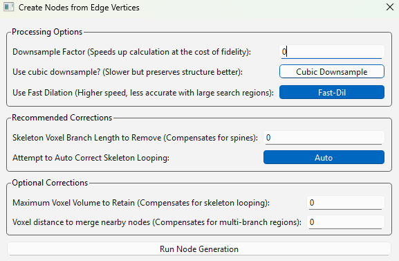

.. _process_menu:

==========
All Process Menu Options
==========

The Process Menu offers options for calculating networks and altering image contents.

* The first submenu is the calculate menu, which has functions for calculating the networks and their properties.

.. _connectivity_network:

'Process -> Calculate Network -> Calculate Connectivity Network...'
-------------------------------------------------------
* This method is used to connect objects in the nodes channel via objects in the edges channel.
* Please see :doc:`quickstart` for a detailed walkthrough about using this function.
* The vast majority of its parameters are optional, however a few of them are advised to be considered for use with each execution of this method.
* Selecting this function will show the following menu:

.. image:: _static/connectivity_network_menu.png
   :width: 800px
   :alt: Connectivity Network Menu

Parameter Explanations
~~~~~~~~~~~~~~~~~~~~~~~~~~~~~~~
#. xy_scale
    * Enter a float value here if you want your X/Y 2D plane pixel-scaling to correspond to some real world value. (ie, 5 microns per pixel). It is presumed to be 1 by default.
#. z_scale
    * Enter a float value here if you want your Z 3D voxel depth to correspond to some real world value. (ie, 5 microns per voxel). It is presumed to be 1 by default.
#. Node Search (float)
    * This value is the distance nodes will search the corresponding edge image for connections to other nodes. Note that this value is scaled corresponding to the xy_scale/z_scale parameters. (As in, if you set xy_scale/z_scale correctly, then treat this as a real-value, such as microns, for your image).
    * Note this value is 0 by default, which will only connect nodes that edges literally pass through.
#. Edge Reconnection Distance (float)
    * This value is the distance edges will dilate ('get inflated'). Note that this value is scaled corresponding to the xy_scale/z_scale parameters. (As in, if you set xy_scale/z_scale correctly, then treat this as a real-value, such as microns, for your image).
    * The point of this parameter is if your segmented edges are not continious structures, due to having holes from imaging/segmenting artifacts. Edges that are totally discrete in 3D space (ie, not touching), as one might expect, will not join together nodes through that pathway. Blowing them up will fill those holes.
    * Keep in mind that all edges get blown up - so if I have two edges that are ten microns apart, entering a value of 5 (microns) here will cause them to merge.
    * This method does NOT erode. It only dilates! This also enables edges to search a bit further than the Node Search parameter suggests, because they can then enter a node's search space!
    * Furthermore, there is an inherent trade off in using dilation to fill hole artifacts, since they also risk merging nearby edges that shouldn't be merged. Use at your own risk!
    * (FYI if there are holes I do like to use this param a little bit, however a more elegant solution is to run the filament tracer instead as it can fill gaps in your filaments without excessive merging).
    * Note this value is 0 by default, and shouldn't be anything if your edges don't have hole artifacts, or those were already corrected (such as via the filament tracer).
#. Re-Label Nodes...:
    * Makes NetTracer3D label objects in the nodes channel with a simple adjacency-labeling scheme (ie, all discrete objects in space aquire a unique number).
    * **DISABLE** this option if your nodes were already labeled elsewhere.
#. Times to remove Edge Trunks (int):
    * Parameters 6-9 mainly represent different ways to handle 'trunks' in your network. Trunks are edges that can be observed to connect to an excessive number of nodes, and will be common in anatomical structures, where all nerves and vessels increasingly merge to an originating central location. In your image, having every node connect through the trunk into a giant glob may not be desirable nor statistically valid. As such, here are some ways to get around that:
    * This first trunk handler has NetTracer3D remove the 'edge trunk' prior to network calculation. It will do this a number of times equal to the integer inputted here. So a value of 1 will remove the fattest trunk, then 2 will also remove the second fattest, etc.
    * Note: This occurs after NetTracer3D has discretized (split up) the edges. It functions similarly but NOT the same as removing the trunk from the network in-post. It will instead remove the highest-volume (literally, the largest) edge.
    * Meanwhile, removing the trunk from the network in post takes out the most interconnected edge. Many times this will have the same result, but not always. Just make sure you are using the version of trunk removal that you want.
#. Auto-Simplify Trunk Elements:
    * Simply removing the trunk can be a good way to ignore it and instead evaluate more legitimate local connections, but at the same time, you may still want to consider local connectivity through the trunk, just not let it connect everything from one end of the image to the other.
    * Enabling this option will essentially force the trunk to simplify itself to prefer local connections over longer ones, but will still permit distant connections if there aren't other closer nodes available along the path.
    * It does this by essentially re-computing this entirely 'Calculate Connectivity Network' but with the search regions for the nodes totally maxed out. This will cause all the nodes to systematically partition the trunk based on proximity. However, connections that are made in this new enlarged search that do not exist in your original search distance will then be dropped, ultimately returning a result that is valid for your desired search regions but with a simplified trunk.
    * Note that since this requires this recomputation, it will at the very minimum double the processing time of this algorithm. Furthemore, the fast-search will not be used for this maxed out search computation (aka voronoi diagram). This is because the fast search strategy of parallel-distance transform into flood labeling is both less accurate and slow at massive dilations. So this has to be computed with the single-core bound scipy.ndimage.distance_transform_edt to get a perfect voronoi and bypass flood labeling.
#. Use pre-labeled edges...:
    * This is a niche parameter to enable. Essentially, if you are interested in how your nodes are interacting with specific branches in your edges, you will first have to label your branches with the 'Process -> Generate -> Label Branches' function.
    * Next, load your nodes and labeled branches and enable this feature. Then, when the network is calculated, rather than connecting the nodes directly, your labeled edges will become nodes as well, and your original nodes will create a network between themselves and all the labeled branches.
    * The original 'nodes' and new 'edge branch nodes' receive distinct identities so they are still differentiable.
    * The output tends to be a very dense network in which your original node objects may not be that statistically relevant. But it can be used to evaluate how your nodes interact with discrete branch elements.
#. Edge -> Node:
    * The final trunk-handling parameter is probably the most robust one and the one I'd most often enable if I cared about handling the trunks between different images in a statistically-consistent manner.
    * If you enable this, rather than connecting all your nodes directly, your edges will also be treated as nodes. Trunks will become hub nodes rather than dense webs of connection.
    * The reason I'd prefer this over just removing the trunk is it's not biased over what a trunk actually is.
    * However the one downside is it may alter the dynamics of the network. Essentially, the network is forced to be less clustered as groups of nodes that you may consider connected (and thus would bear a high degree) instead all just connect to the edge that is connecting them (each getting a degree + 1). This is just something you should keep in mind when appraising statistics about the network.
    * You can also run this option in post from the modify network menu.
#. Downsample for Centroids (int)
    * Temporarily downsamples the image on the step to calculate centroids to speed that up (it can be somewhat slow on overly large images). The downsample will be performed in all three dimensions corresponding to the factor entered here.
    * Note that centroids calculated on downsampled images have to be approximated to the upsampled version, so they may not correspond *perfectly*, although they will generally be close enough.
    * Warning: for any downsample on an image containing small nodes, if those nodes' smallest dimension is smaller than this down factor, they run the risk of being kicked out of the downsampled image, which means their centroid will not be found.
        * Please use downsampling that corresponds to your node sizes.
    * (For larger images, I would generally set this param to something assuming your nodes are big enough.)
    * As a side note, the value here will also essentially enlarge the overlays from this method (assuming you opt to use them). Larger overlays may be desired for visualization purposes. Note that smaller overlays can still be generated from 'Image -> Overlays...' if this behavior is not desired.
#. Use fast search...:
    * Selecting this button will have the program attempt to use a faster search algorithm. Search regions and edge dilation are achieved using parallelization via the edt module instead of scipy. (This requires the edt module to be installed and working, see the installation doc for more info).
    * After search regions are obtained, they are labelled via flooding with the skimage watershed function. This results in slightly rougher search regions along adjacent searching borders, although it is not large enough to make much of a practical difference in output.
    * For comparison, the not selecting this will use scipy's distance_transform_edt function to solve the search region, which will yield an exact voxel-to-voxel labeling schema, but will be calculated on a single CPU core and thus potentially take a while for larger images. The program will always fall back to this if the parallel calculation fails somehow.
#. Generate Overlays:
    * If enabled, NetTracer3D will execute 'Image -> Overlay -> Create Network Overlay' and 'Image -> Overlay -> Create ID Overlay' (which will override Overay 1 and 2, respectively).
#. Update Node/Edge in NetTracer3D:
    * While calculating the edges and nodes, NetTracer3D will transform them somewhat based on these params and to discretize (split up) the edges.
    * When enabled, those new versions will replace what is currently in the nodes/edges channels.
    * For the edges particularly, this may have them be reloaded with a version that looks a bit chopped up and altered, albiet mostly the same. 
    * Generally it is recommended to enable this, because it will ensure the data in the images matches the network, which will be required for several NetTracer3D functions, although be sure to save your inputs first.

Algorithm Explanations
~~~~~~~~~~~~~~~~~~~~~~~~~~~~~~~
* The basic premise of this algorithm is demonstrated by this diagram:

1. Nodes are expanded based on their search distance. This expansion is accomplished through the use of a distance transform that assigns outer 'shell' regions a label corresponding to the internal labeled node they are closest to.
2. The search region is used to split the edges up. Edges outside the search region become 'outer edges', while those inside the search region become 'inner edges'. The edge pieces aquire unique labels, conveying their identity.
3. (If not using param 5), outer edges are still dilated a single time to force them to once more overlap the search region by a single voxel. The search region for every node can then be evaluated for what 'outer edge' it interacts with.
4. Since inner edges potentially course through many search regions, an additional step is required to find their node-to-node connections. The border of the search region is acquired via the skimage find_boundaries method. These node borders can be extracted and used to isolate the 'inner edge pieces' that exist inside of them, which all aquire unique label IDs. We can dilate those inner edge pieces once to evaluate which nodes touch them.
5. The group of edges that each node interacts with can then be sorted through. Any nodes that interact with the same edge are connected.
6. Finally, the connections are used to create a NetworkX graph object which can be used for network analysis.

* Press 'Run Calculate All' to run the method with the desired parameters. The output data populate their respective areas, ie the four channels for images that are loaded, or the right table widgets for any spreadsheet-style properties.

.. _proximity_network:

'Process -> Calculate Network -> Calculate Proximity Network...'
-------------------------------------------------------
* This method is used to connect objects in the nodes channel based on whether they are within some user-defined distance of each other.
* Please see :doc:`proximity` for a brief walkthrough about using this function.
* Selecting this function will show the following menu:

.. image:: _static/process1.png
   :width: 800px
   :alt: Proximity Network Menu

Parameter Explanations
~~~~~~~~~~~~~~~
#. Search Region Distance...
    * This value is the distance nodes will search for other nodes to connect to. Note that this value is scaled corresponding to the xy_scale/z_scale parameters. (As in, if you set xy_scale/z_scale correctly, then treat this as a real-value, such as microns, for your image).
#. xy_scale
    * Enter a float value here if you want your X/Y 2D plane pixel-scaling to correspond to some real world value. (ie, 5 microns per pixel). It is presumed to be 1 by default.
#. z_scale
    * Enter a float value here if you want your Z 3D voxel depth to correspond to some real world value. (ie, 5 microns per voxel). It is presumed to be 1 by default.
#. Execution Mode:
    * The dropdown menu will display two options.
        1. 'From Centroids...' - The search is done starting from centroids, looking for other centroids. The algorithm that this uses should be faster for larger datasets. It is ideal to use when your nodes can be represented well by centroids, such as if they are small or relatively homogenous spheroids. Note that because centroids are used, this option allows this function to run without any nodes image whatsoever, assuming the node_centroids property was loaded in. This might be useful when importing data that has already been extracted out of an image elsewhere, as a set of centroids, for example.
        2. 'From Morphological Shape...' - The search is done starting from each nodes' border in 3D space. This algorithm is slower but is better suited handling non-homogenous or oddly-shaped nodes.
#. Create Networks only from a specific Node Identity?
    * This option will only appear if something is assigned to the node_identities property.
    * If so, there will be a dropdown menu to select one of your defined node-identities subtypes.
    * (If not 'None): Whichever node identity subtype is selected - only those nodes will be used to make network connections (however, they will be able to connect to any other node type).
    * Use this to simplify network structures when you are only interested in one node subtypes' relationship to the rest of the nodes.
#. Generate Overlays
    * If enabled, NetTracer3D will execute 'Image -> Overlay -> Create Network Overlay' and 'Image -> Overlay -> Create ID Overlay' (which will override Overay 1 and 2, respectively).
#. (If Above): Downsample factor for drawing overlays...?
    * Entering a positive integer greater than 1 here will make the rendered overlays come out that many times larger.
#. If using centroid search:... Populate Nodes from Centroids?
    * If enabled and centroid search is run, the centroids will be used to create a new nodes image that will be placed in the nodes channel.
    * This new image will start at 0 in each dimension and be bounded by the highest value centroid in each dimension.
    * As described, the centroid search does not require a nodes image, but only that node_centroids is loaded in, so if centroids are extracted elsewhere and loaded in without an image, this method will allow the user to then create an image to explore other functions with.
#. (If using centroids): Max number of closest neighbors...
    * Restricts nodes from only making a number of connections to the integer value passed to this param.
    * They will connect to their n nearest neighbors within the search region.
    * This is a useful way to simplify dense networks.

Algorithm Explanations
~~~~~~~~~~~~~~~

* If using the centroid searcher:
#. This method first takes the centroids and normalizes them based on the xy/z_scalings if those differ. 
#. This method then searches through centroids directly for connections, optimized via the scipy.spatial KDTree class, which is a highly efficient data structure for exploring distances between points: https://docs.scipy.org/doc/scipy/reference/generated/scipy.spatial.KDTree.html
#. This method tends to be very fast. In fact, regarding very big data, this is likely the most feasible way to get networks.

* If using the morphological searcher:
#. The scipy.ndimage.find_objects() method is used to get bounding boxes around all the labeled objects in the nodes channel.
#. For each object, a subarray is cut out around it using its bounding box, that includes the object plus any additional space that it will need to perform a search/dilation.
#. The node object in question is boolen indexed within its subarray.
#. The scipy.ndimage.distance_transform_edt() method is used to get a distance transform for the object. This distance transform is thresholded based on the desired distance away from the node we want, then binarized.
#. The binary dilated mask is then multiplied against the original, non-indexed subarray to isolate other nodes specific to the dilated region.
#. These other nodes are stored in a growing node:neighbors dictionary that is used to make the network.
#. This process is paralellized across all available CPU cores. It *will* hog your entire machine if given a big task.

* Press 'Run Proximity Network' to run the method with the desired parameters. The output data populate their respective areas, ie the four channels for images that are loaded, or the right table widgets for any spreadsheet-style properties.

'Process -> Calculate Network -> Calculate Branchpoint Network...'
--------------------------------------
* This method is used to connect the branchpoints of a branchy binary segmented image (such as blood vessels), converting them into nodes of a network.
* This method brings up the menu to generate nodes from edge vertices. Once nodes are created, they search their immediate 3x3x3 neighborhood and assign connections based on which edges they encounter.
* The binary image must begin in the 'edges' channel, since nodes will be generated at the branchpoints.
* This method just forks the node generation from edges method with some suggested default parameters pre-selected, but see :ref:`generate nodes` for parameter and algorithm explanations.

'Process -> Calculate Network -> Calculate Branch Adjacency Network'
--------------------------------------------------------------------
* This method is used to connect the adjacent branches of a branchy binary segmented image (such as blood vessels), converting them the branches themselves (as opposed to the branchpoints) into nodes of a network.
* This method brings up the menu to label branches, followed by running a proximity network of distance = 1.
* The binary image must begin in the 'edges' channel.
* This method just forks the branch labelling method with some suggested default parameters pre-selected, but see :ref:`label branches` for parameter and algorithm explanations.

'Process -> Calculate Network -> Calculate Centroids...'
--------------------------------------
* This method is used to calculate and set the nodes or edge centroid properties.
* The centroid is the center of mass of an object and can be used as a low-memory way to track its general location.

Parameter Explanations
~~~~~~~~~~~~~~~

* This method has the following parameters:

#. Downsample Factor:
    * Temporarily downsamples the image to speed up centroid calculation. Downsampling is done in all three dimensions by the inputed factor.
    * Note that the centroids will be normalized for the full-sized image after calculation, and while not 100% accurate, will be close enough for most purposes.
    * Generally it is recommended to use some level of downsample for this with larger images, assuming the nodes can afford it.
    * Note that nodes with dimensions smaller than the downsample factor are at risk of being removed from the image during calculation, which will result in no centroid assignment for them.
    * Please use a downsample appropriate to your node size.
#. Execution Mode:
    * This dropdown menu has the following options:
        1. Nodes and Edges - Attempt to find centroids for both the node and edge channels.
        2. Nodes - Attempt to find centroids for just the nodes channel.
        3. Edges - Attempt to find centroids for just the edges channel.
#. Skip Node Centroids Without Identity Property?:
    * If checked, any nodes that do not have an identity will not get a centroid. Useful if I am not interested in those nodes.

* Press 'Run Calculate Centroids' to run the method with the desired parameters. The output data will be added to the tabulated data widget in the top right, while also setting the respective centroids property.
* Note that this method runs on whatever channel is designated as 'Active Image' in the bottom left.
* Many methods that require centroids will auto-prompt the user to run this method if they have not calculated any yet. They are advised to run the centroid method in such cases, or the other method may not run properly.

Algorithm Explanations
~~~~~~~~~~~~~~~
1. The array is subdivided across all CPU cores for parallel processing.
2. The indices of all objects in each array are found via the np.argwhere() method.
3. Once all the indexes have been found, the centroid for each labeled object is obtained by taking the mean of its indices.

* The second submenu is the image menu, which has various functions that can transform aspects about images.

'Process -> Image -> Resize'
-------------------------------------------------------
* This method is used to resize the image.
* Downsampling is especially useful for speeding up many process functions when resolution loss is not a major issue.
* Upsampling can likewise be used to restore an image to its original dimensions.
* Selecting this function will show the following menu:

Parameter Explanations
~~~~~~~~~~~~~~~~~~~~~~~

#. Resize Factor (All Dimensions)
    * Enter a float value greater than 0 to resize the image in all three dimensions by that factor.
    * Please note that while the majority of functions ask for a 'downsample factor', which uses a factor greater than 1 to apply a downsample, this function actually expects a decimal value between 0 and 1 for downsamples.
    * A positive value here will actually apply an upsample instead. So 0.33 will downsample my img in all dims by a factor of 3, but 3 will upsample my img in all dims by a factor of 3.
#. Resize Z Factor
    * The same as the resize factor, except the resample will only be applied in the Z-dimension, while the X and Y dimensions will remain the same.
    * Please note that entering any number for param 1 will override this value.
#. Resize Y Factor
    * The same as the resize factor, except the resample will only be applied in the Y-dimension, while the X and Z dimensions will remain the same.
    * Please note that entering any number for param 1 will override this value.
    * Also note that many NetTracer3D functions do not support accurate results on images that are scaled differently in the x and y dimensions, since it assumes your images had equal scaling in the 2D plane.
#. Resize X Factor
    * The same as the resize factor, except the resample will only be applied in the X-dimension, while the Z and Y dimensions will remain the same.
    * Please note that entering any number for param 1 will override this value.
    * Also note that many NetTracer3D functions do not support accurate results on images that are scaled differently in the x and y dimensions, since it assumes your images had equal scaling in the 2D plane.
#. Use cubic algorithm
    * Disable this to use the standard resample algorithm, which is quick and ideal for binary/labeled images.
    * Enable this to use the cubic resample algorithm, which is slower but may better preserve shapes for visualization purposes only. However, it will not preserve labeling and therefore should not be used on data intended for actual quantification.
#. Resample to orignal shape
    * When a downsample is performed (via this method, for example), NetTracer3D will keep track of the shape of the pre-downsampled image.
    * Pressing this button will return the images to that shape. For example, if I downsampled my images to speed up overlay generation, but wanted them to return to their original sizes, I could use this option.
    * Note that this option will only appear if images of different shapes have been loaded in during one session. Relatedly, it may not keep track of the correct shape 100% of the time if many heterogenous things are being loaded in and out.
    * Do note though that NetTracer3D can also do this by reloading the original-sized image, loading the resampled image in another channel, and accepting the option to resize the new channel to match the other one.
#. Normalize Scaling with upsample
    * The user can click this button to auto-run an upsample along the low-resolution dimension that normalizes the resolution.
    * Note that this option will only appear if the xy_scale =/= z_scale.
#. Normalize Scaling with downsample
    * Same idea as parameter 7, but instead a downsample is used on the high-resolution axis to normalize the resolution.
    * Note that this option will only appear if the xy_scale =/= z_scale.

Algorithm Explanations
~~~~~~~~~~~~~~~~~~~~~

* All resize algorithms in NetTracer3D simply use the scipy.ndimage.zoom method: https://docs.scipy.org/doc/scipy/reference/generated/scipy.ndimage.zoom.html

* Press 'Run Resize' to run the method with the desired parameters. (Although pressing params 5, 6, or 7 above will also execute the function as described above).
* Note that because NetTracer3D does not really support different sized images in its channels, this method will run on all channels/images currently in use.

'Process -> Image -> Clean Segmentation'
-------------------------------------------------------
* This method is just a small window that pulls up some methods that are helpful for cleaning up segmentations.

Parameter Explanations
~~~~~~~~~~~~~~~~~~~~~~~
#. Close
    * This method calls the dilation algorithm followed by the erosion algorithm (see their respective sections for more information). 
    * It is useful for filling small gaps in an image that may not be literal holes in a mask.
    * This is at the downside of potentially creating false connections and disfiguring the image if used with very large params.
#. Open
    * This method is the reverse of the above, eroding before dilating.
    * It is useful for eliminating noise, smoothing borders of objects, and severing small connections between objects that may not exist.
    * This is at the downside of potentially eliminating true small objects and disfiguring the image if used with very large params.
#. Connect Endpoints
    * Will prompt you to provide a distance. Next, all endpoints (as appraised by 3D skeletonization) in your segmentation within the specified distance will connect to each other. The connection will be a tapered cylinder of the same radii as the branches it merges.
    * This isn't the most useful method compared to 'Trace Filaments' as it will just merge any endpoints within in its distance, but its conceptually simpler and may be sufficient for certain uses.
#. Fill Holes
    * This just calls the fill holes method. Holes are gaps completely enveloped by a mask from the perspective of the 2D stack. Please reference the fill holes algorithm section for more info.
#. Trace Filaments
    * This calls the filament tracer (Normally in 'Process -> Generate -> Trace Filaments'), which can clean up segmentations of filamentous objects such as nerves or vessels.
#. Threshold Noise by Volume
    * This just brings up the threshold window to filter out objects of a desired volume range, ie to remove small noise. Please see the thresholding section for more info.

.. _dilation:

'Process -> Image -> Dilate'
-------------------------------------------------------
* This method is used to expand the objects in an image.
* It has a few variants available and is generally how NetTracer3D evaluates neighborhoods starting from morphological objects, meaning there are many functions that can fork this method.

Parameter Explanations
~~~~~~~~~~~~~~~~~~~~~~~

#. Dilation Radius
    * This is the amount we would like to dilate (or, expand our nodes in each dimension by).
    * Note that this value is scaled according to the scalings in your image (or that are assigned within the dilate window).
    * This means if I want 'dilation radius' to be 1-to-1 with voxels, I should set the scalings both to 1 in the window, but if I want 'dilation radius' to correspond to some true distance (ie microns), I should enter the corresponding scalings for my image, and the (for example, microns) distance as dilation radius.
#. xy_scale
    * The scaling per-pixel in the 2D xy plane I want to be applied on parameter 1. This box will auto-populate with the xy_scale property set for the images, however any number entered in the box will always be used regardless of the property.
#. z_scale
    * The depth per-voxel in the 3D z plane I want to be applied on parameter 1. This box will auto-populate with the z_scale property set for the images, however any number entered in the box will always be used regardless of the property.
#. Execution mode
    * This dropdown window provides several options for different dilation strategies.
        1. 'Parallel Distance Transform Based' - Attempts to use edt module to compute the dilation in parallel on your CPU. If edt is not installed or the parallel computation fails, the program will fall back to option 4 by default.
        2. 'Preserve Labels' - Use this to dilate objects without binarizing them, preserving labels. A new window for additional params will open, see below.
        3. 'Psuedo3D Binary Kernels' - Dilates in 2D in the XY and XZ planes, trying to simulate a 3D dilation. The image will be binarized prior to dilation. This is primarily meant for purely visualization purposes (not quantitative) for small-to-medium dilation. This option can save time but will not result in a perfect dilation due to not being able to 'see' diagonally. Note that for particularly large dilations (relative to the starting objects), this option may actually be slower than distance transform.
        4. 'Distance-Transform Based (Non-Parallel)' - Use this dilate objects via a distance transform, allowing for more perfect dilations, but often being slower. 

* Press 'Run Dilate' to run the method with the desired parameters. Note the channel refered to in 'Active Image' is the one that will be dilated, with the output also being returned there.
* If using 'Preserve Labels', an additional window will appear requesting more params:

#. Fast Dilation:
    * Selecting this button will have the program attempt to use a faster gray dilation algorithm. Binary dilation is first achieved using parallelization via the edt module instead of scipy. (This requires the edt module to be installed and working, see the installation doc for more info).
    * After binary dilation regions are obtained, they are labelled via flooding with the skimage watershed function. This results in slightly rougher search regions along adjacent searching borders, which may not be desirable.
    * For comparison, the not selecting this will use scipy's distance_transform_edt function to solve the gray dilation, which will yield an exact voxel-to-voxel labeling schema, but will be calculated on a single CPU core and thus potentially take a while for larger images. The program will always fall back to this if the parallel calculation fails somehow.
    * If disabled, it will use the scipy distance transform method.

Algorithm Explanations
~~~~~~~~~~~~~~~~~~~~~

**The Pseudo-3D Kernel Method**
    1. The psuedo-3D kernel method aims to combine serial dilations in both the XY and XZ planes to simulate a 3D dilation. First, the distance to search in the X vs Y vs Z dimensions is determined based on the scalings for each respective dim.
    2. This distance is used to generate dilation kernels that expand the pixels in the image until they encompass that search region. For the XY plane, this kernel is a circle (with the search distance being its radius), since NetTracer3D assumes the x and y scalings to always be equal. For the XZ plane, if the x and z scaling are not equal, this kernel is an ellipse instead, with the short axis being the shorter search distance, and the long axis being the longer search distance. (Doing it this way means we can ignore normalizing resolutions).
    3. The image is then chopped up along the Z-axis to allow 2D dilations to be performed in parallel until all the XY planes have been dilated via the openCV2 dilate algorith, a *quite* optimized function: https://opencv24-python-tutorials.readthedocs.io/en/latest/py_tutorials/py_imgproc/py_morphological_ops/py_morphological_ops.html.
    4. Likewise, a copy of the image is chopped up along the Y-axis to allow 2D dilations in parallel until all the XZ planes have been dilated via the openCV2 dilate algorithm.
    5. These outputs are combined to produce the psuedo-3D dilation.
* There are few things that must be noted about this method:
    1. In the instance that an array is 2D, this method always hands it off to a distance transform instead. This is because most of the distance transform algos are pretty good in 2D, even faster than 2D dilation in many cases.
    2. In the instance that the search region is explicitly 1 voxel in all dimensions, this method hands it off to the scipy.ndimage.binary_dilation() method (https://docs.scipy.org/doc/scipy/reference/generated/scipy.ndimage.binary_dilation.html) for dilation with a simple 3x3x3 cubic kernel. While this method can be slow, it generally handles small dilation with simple kernels okay.

* **Note** the psuedo-3D kernel method is actually rather bad at handling dilation regions much larger than the original node. I previously had an alternative to recursively call this method to preform serial dilations that handled this, but removed it after it became redundant compared to the distance transform method, since the psuedo-3D kernels produce large error with large dilations anyway.
* The psuedo 3D kernel would essentially be like turning these voxels: ········· into these ++++++++ en masse.

**The Distance Transform method:**

* Eventually I just opted to add a distance transform to get perfect dilations in-leui of true 3D kernel-based dilating, since the scipy 3D dilation option was already slow anyway.
* A distance transform converts an image into a map that conveys how far each non-zero pixel is from zero.

#. If we invert an image, we can obtain this distance transform on the inversion, which tells us how far away each background voxel is from our objects. This is done with the scipy.ndimage.distance_transform_edt() method: 
#. This dt can be turned into essentially a perfect binary dilation via boolean indexing.

* The downside is this method can be slow (although its slowness is independent of dilation size). For example, on images ~3 GB it might take twenty minutes to finish depending on your CPU.
* Therefore it exists as an option when we want to ensure accuracy, whereas psuedo-3D kernels are better for small dilations when we don't care about small error regions, or when we just want to know if other objects are in the general vicinity.
* This cartoon demonstrates how these algorithms work:

*Top left: Example of an object (cyan sphere) with its expansion kernel (red) for a small psuedo-3D kernel dilation. This isn't exactly what the output looks like, instead imagine if these kernels were applied on every single voxel in the image. To the right is what this kernel would look like with a large dilation in a space with different scalings. Applying this one would produce greater error, since the regions 'diagonal' to the sphere would inevitably be excluded. In the bottom is this same scenario but demonstrated with a distance transform, which more or less gives a perfect expansion.*

**If Preserving Labels:**

* If we are interested in preserving labels, we do an additional step that I refer to as 'smart dilate'.
1. Essentially, the same binary dilation as above is determined.
2. If we did the distance transform method, we also have it return the 'indices' (of the distance transform of the inverted array), which populates each index in the array with the index of the background value it was closest to. Note that this data structure is more cumbersome than just a distance transform. It occupies 3x as much RAM. But we can use it to essentially query any index in the array and see what 'node' it belongs to, since in our inverted image, the nodes became the background. 
3. The dilated regions are taken by subtracting out the original binary nodes from the binary dilated image. These shell regions are split up and paralellized across all CPU cores.
4. We then search through the indices of all the shell regions, get the index of the node it 'belongs' to from the distance transform index image, find the label of said node, and finally reassign the binary index in the dilated image to be its proper label instead.
5. The chunks are recombined to get the label-dilated array.

'Process -> Image -> Erode'
-------------------------------------------------------
* This method is used to shrink objects in an image and is essentially a reversal of dilation.

Parameter Explanations
~~~~~~~~~~~~~~~~~~~~~~~
#. Erosion Radius
    * This is the amount we would like to erode (or, shrink our nodes in each dimension by).
    * Note that this value is scaled according to the scalings in your image (or that are assigned within the dilate window).
    * This means if I want 'erosion radius' to be 1-to-1 with voxels, I should set the scalings both to 1 in the window, but if I want 'erosion radius' to correspond to some true distance (ie microns), I should enter the corresponding scalings for my image, and the (for example, microns) distance as erosion radius.
#. xy_scale
    * The scaling per-pixel in the 2D xy plane I want to be applied on parameter 1. This box will auto-populate with the xy_scale property set for the images, however any number entered in the box will always be used regardless of the property.
#. z_scale
    * The depth per-voxel in the 3D z plane I want to be applied on parameter 1. This box will auto-populate with the z_scale property set for the images, however any number entered in the box will always be used regardless of the property.
#. Execution mode
    * This dropdown window provides two erosion options.
        2. 'Parallel Distance-Transform Based' - Use this erode objects via a distance transform calculated in parallel with the edt module. If edt is not installed or the parallel calculation fails, it will fall back to the scipy version.
        2. 'Distance-Transform Based (Non-Parallel)' - Use the scipy non-parallel distance transform to perform the erosion.
        3. 'Preserve Labels (Parallel)' - Use edt to erode while maintaining object labels. Labeled objects that share a border will see that border get eroded as well.
        4. 'Preserve Labels (Non - Parallel)' - Use scipy non-parallel distance transform to erode while preserving labels. 

* Press 'Run Erode' to run the method with the desired parameters. Note the channel refered to in 'Active Image' is the one that will be eroded, with the output also being returned there.

Algorithm Explanations
~~~~~~~~~~~~~~~~~~~~~

* Erosion is accomplished by calculating the distance transform and then thresholding at the desired erosion distance.
* If labels are kept, the skimage find_borders method is used to boolean threshold out the borders so that the resulting distance transform can tell the labeled objects to move away from each other.
* As a side note, erosion can be combined with dilation to preform something called an 'Open' or 'Close' operation.
    * An Open operation is an erosion followed by an equivalent level of dilation, which can be a cheap way to split apart objects that are just barely touching, while also eliminating noise, although it can be a bit disfiguring on masks at large values.
    * A more useful operation is Close, which is a dilation followed by an equivalent erosion. The result will fuse together nearby objects while keeping the image mask a similar shape/size. This is useful for NetTracer3D specically as a way to fix segmentation artifacts (holes), without having to touch the 'diledge' parameter in the main method.
    * Both of these can be called from the 'Clean Segmentation' function.

'Process -> Image -> Fill Holes'
-------------------------------------------------------
* This method is used to fill holes in an image, namely in a binary segmentation, as a way to eliminate artifacts.

Parameter Explanations
~~~~~~~~~~~~~~~~~~~~~~~
1. Only Use 2D Slicing Dimensions
    * If disabled, the algorithm will attempt to fill holes in all 3 dimensional planes. If enabled, it will only attempt in the XY plane.
    * Note that enabling this may result in unusual artifacts in some segmentations, since they were likely segmented from a 2D XY perspective, although they typically can be removed via Opening.
2. Fill Small Holes Along Borders
    * If enabled, 'Hole' like things on the image border will be filled as long as the border they share with the image is less than 8% of the length of that border.
    * If disabled, no holes on the image border will be filled.
3. Place Hole Mask in Overlay 2...
    * This just puts the hole mask in overlay2 instead of directly filling. The idea is that this mask can then be thresholded or arbitrarily selected for more specific holes, then relayed back to the image by selecting the result (right click -> select all) and imposing it back onto the original image (right click with selection -> selection -> override channel with selection).

* Press 'Run Fill Holes' to run the method with the desired parameters. Note the channel refered to in 'Active Image' is the one that will be 'Filled', with the output also being returned there.

Algorithm Explanations
~~~~~~~~~~~~~~~~~~~~~
1. This algorithm iterates through the 2D planes of an image (Just XY by default, but also YZ and XZ if param 1 is enabled).
2. For each plane, the 2D image is inverted and the scipy.ndimage.label() method is used to find contiguous regions. https://docs.scipy.org/doc/scipy/reference/generated/scipy.ndimage.label.html
3. Regions that do not share a border are designated as holes and filled.
4. Regions that share a border are filled if they share less then 8% of the length of that border, unless param 2 is disabled.
5. The output of this image is always binary.

'Process -> Image -> Binarize'
-------------------------------------------------------
* This method is used to binarize an image, which sets all foreground regions to 255 (8bit max val), and background regions to 0.

Parameter Explanations
~~~~~~~~~~~~~~~~~~~~~~~
* 'Method' - Dropdown menu to select binarization method.
    1. Total Binarize - sets all nonzero regions to 255. This method is not really intended for raw data, but can be applied to labeled segmentations to reset them.
    2. Predict foreground - Uses Otsu's method to predict the foreground, setting it to 255, while predicted background regions are set to 0. This can be a quick option to segment data if the signal-to-noise is good enough.

Press 'Run Binarize' to run the method. Note the channel refered to in 'Active Image' is the one that will be binarized, with the output also being returned there.

'Process -> Image -> Label Objects'
-------------------------------------------------------
* This method is used to label objects an image, which assigns all touching, nonzero areas in the image a distinct numerical identity. 
* One typically would not label raw data, but it can be applied on binary images to reset them seperate them into unique nodes or domains.
* This method has no parameters. Simply press 'Run Label' to run the method. Note the channel refered to in 'Active Image' is the one that will be labeled, with the output also being returned there.

'Process -> Image -> Neighborhood Labels'
-------------------------------------------------------
* This method is used to label objects in one image based on their proximity to labeled objects in a second image. Essentially, all non-zero objects in the first image will take on the label of the closest labeled object in the second region.
* This is a useful way to define the relationship of objects in one image to another.

Parameter Explanations
~~~~~~~~~~~~~~~~~~~~~~~
1. Prelabeled Array
    * The dropdown menu where you will select the labeled image you want to use as the seeds to label the other image.
2. Binary Array
    * The dropdown menu where you will select the other image (presumably binary) that you want to use the first image to label.
3. Labeling Mode:
    * 'Label Individual Voxels based on proximity' - The default mode. Each non-zero voxel in the binary image is just assigned the label of the closest object in the labeled image.
    * 'Label Continuous Domains that border labels' - A more nuanced version that instead labels only nearby voxels that are continuous in space with each label. Binary voxel elements touching no labels get removed. This option is useful, for example, if a 'Binary Close' was used to refine a segmentation, that segmentation was labeled (or with the branch labeling algo), and then you wanted to re-label the original segmentation based on the 'Closed' one.
4. 'Correct Nontouching Labels in Post' - If the resultant labeled image has any labels that are not touching, the largest instance of that label will keep its label. All other labels will instead merge with the label they are touching the most, or take on a new label if they are touching none. Note that this is executed by default for the second mode in param 3. 

* Press 'Run Smart Label' to run the method with the desired parameters. Note the channel refered to in param 2 is the one that will be labeled, with the output also being returned there.

Algorithm Explanations
~~~~~~~~~~~~~~~~~~~~~~~
* This method is ostensibly the same one used in smart dilate but applied in a different context.
* In the case of the primary labeling mode:
1. The prelabeled array is binarized, inverted, and then a distance transform with indices is calculated for that array, providing a map of which indices 'belong' to labeled regions in the prelabeled array.
2. The binary array is split up and paralellized across all CPU cores.
3. We then search through the indices of all the positive binary array regions, get the index of the label it 'belongs' to from the distance transform index image, and finally reassign the binary index in the binary image to be its nearest label instead.
4. The chunks are recombined to get the label-dilated array.

* In the case of the second labeling mode:
1. Rather than just labeling the closest elements outright, the binary image is skeletonized first. The skeleton pieces then check which label they're touching and inherit that label. This labeled image is combined with the skeleton to give it 'extensions' into the nearby binary regions to allow for a more nuanced label.
2. The 'Correct Nontouching Labels' option is then always performed on top of this.

* For 'Correct Nontouching Labels'
1. Each label is evaluated whether it is contiguous in space. For those that are not, the largest volume of said label keeps its label. The other pieces evaluate which label they are touching the most and take on that label. If they are touching nothing, they get a new label entirely.

'Process -> Image -> Threshold/Segment'
-------------------------------------------------------
* This method calls the threshold/segmenter, which can be used for volumetric, intensity-based, or ML thresholding.
* This window is the same one that will be pulled up when the pencil widget is clicked. Previously I went over using these windows in :doc:`quickstart`, so see :ref:`segmenting` for a tutorial, however I will talk about more of their specifics here.

Parameter Explanations
~~~~~~~~~~~~~~~~~~~~~~~
1. Excecution Mode:
    * This dropdown window contains two options:
        1. Using Label/Brightness - Opens the threshold window for intensity-based thresholding
        2. Using Volumes - Opens the threshold window for volume-based thresholding
        3. Using Radii - Opens the threshold window for radius-based thresholding.
        4. Using Node Degree - Opens the threshold window for degree-based thresholding (ie number of network connections. Correspondingly, only applies to the nodes image and requires the network to be computed).
2. Select
    * Clicking this just starts the threshold window with whatever option was selected in param 1. The image in 'Active Image' will be the threshold target.
3. Machine Learning
    * Alternatively, clicking this option starts the Machine Learning segmenter, which is more suited for thresholding based on morphological patterns in the image.
    * The Macine Learning segmenter will always segment (and require) the image in the nodes channel. Furthermore, it will use Overlay1 to store training data, the Highlight Overlay to actually segment, and Overlay2 to place the output.
    * For these reasons, ML segmenting should be typically be done in unique sessions as compared to the rest of the analysis.

Algorithm Explanations
~~~~~~~~~~~~~~~~~~~~~~~

**If Using the Intensity-Based Segmenter**

* The intensity based segmenter simply takes the min and max values designated by the user and thresholds the array for values that fall in between.

**If Using the Volume-Based Segmenter**

* The volume thresholder first needs to find volumes for the designated image using the 'Analyze -> Stats -> Calculate Volumes' method, although if they were already calculated this step will be skipped.
* Note that if this volumes property was designated for a channel earlier, and the image was changed afterward, this method will likely not function properly, and the program should be reset.
* The volume based segmenter uses the calculated volumes to decide what label values lie between the min and max values designated by the user and thresholds the array for values that fall in between.

* **Note** that for both of the above segmenters, if the thresholder is closed without thresholding, the thresholded regions will instead be selected and highlighted with the highlight overlay, but only if the nodes/edges channels are the Active Images. This can be a good way to arbitrarily select regions by volume or intensity, for use in any function that runs on selected objects.

**If Using the Machine Learning Segmenter**

* The goal of the machine learning segmenter is to take user designated training regions, compute feature maps around them, then use the training regions' corresponding feature map points to train a Random Forest Classifier (which can later segment the entire image).
* The chunks used to make the feature maps are (as of writing) 49^3 for 3D neighborhoods, while 2D neighborhoods will only be chunked (in 2D) if the 2D plane is greater than 64^3 pixels (if it is, the 2D plane will get divided until each chunk is less than 64^3 pixels). Any time chunks are mentioned below, presume these are the sizes.
* A feature map is essentially some abstracted dataset (via some neighborhood-considering algorithm such as Gaussian Blur) that allows a coordinate in an image to somewhat inform about what its neighborhood looks like.

1. First, the sk.learn RandomForestClassifier class is initiated with the parameters n_estimators set to 100 and the param max_depth set to None. https://scikit-learn.org/stable/modules/generated/sklearn.ensemble.RandomForestClassifier.html
2. Whenever a model is trained, chunks around the training data are extracted and turned into mini feature maps. Positive training regions have their values from the feature maps fed to the random forest classifier as 'good' numbers while negative training regions have their values from the feature maps fed to the random forest classifier as 'bad' numbers.
3. When the volume is segmented, chunks are handed off to be converted into feature maps, and each voxel in the chunk shows its corresponding index in the feature map to the random forest classifier to determine whether it ought to be considered foreground.
4. When this process finishes, it places its output in Overlay2. Note that the Preview Segment method works similar, except it does not interrupt the user, instead initiating a parallel thread that processes chunks at the user's Z-plane, near their mouse position.

* The feature maps for the 'Quick Model' are as follows:

#. The original image.
#. Gaussian Blurs for sigma values 1, 2, 4, 8 (obtained via scipy.ndimage.gaussian_filter())
#. Difference of Gaussians for sigma values 1-2, 2-4, and 4-8.
#. The gradiant magnitude, obtained from scipy.ndimage.sobel() sobel kernels in each dimension.

* The feature maps for 'Detailed Model' are computed using multiple scales and morphological operators:

#. The original Image
#. Gaussian Blurs for sigma values 1, 2, 4, 8 (obtained via scipy.ndimage.gaussian_filter())
#. Difference of Gaussians (DoG) for sigma values 1-2, 2-4, and 4-8.
#. Gaussian Gradient Magnitudes - Computed for each sigma value using scipy.ndimage.sobel() kernels in all three dimensions (x, y, z). Magnitude calculated as sqrt(gx² + gy² + gz²) for each Gaussian-smoothed image. Captures edge strength at multiple scales.
#. Laplacian of Gaussian - Second-order derivative features computed using scipy.ndimage.laplace(). Applied to each Gaussian-smoothed image at different sigma values. Detects blob-like structures and zero-crossings.
#. Largest Hessian Eigenvalue - Computes the largest eigenvalue of the 3x3 Hessian matrix at each voxel. Uses second-order derivatives (hxx, hyy, hzz, hxy, hxz, hyz) via scipy.ndimage.gaussian_filter() with order parameters. Fully vectorized computation using numpy.linalg.eigvals() for all spatial locations simultaneously. Captures local curvature information and tubular/sheet-like structures.
#. Feature Normalization - Intensity features (original image, Gaussians, DoGs) are kept in raw form. Morphological features (gradients, Laplacians, Hessian eigenvalues) are normalized using z-score standardization. Normalization applied per-feature across all spatial dimensions to ensure balanced feature contributions.

* In general, the quick model is preferable for images with good SNR, while the detailed model weights morphology harder and so is better for poor SNR but typically requires more training.
* For RGB images, each channel is processed independently, meaning it requires 3x as many maps.
* Training by 2D patterns simply uses 2D alternatives to the above described maps.
* Training with GPU simply uses cupy methods to get the above described maps.

* Note these feature maps are computed in parallel, so while chunk processing is done sequentially to preserve RAM (especially due to feature map bloat), some speed can be recouped by parellel computing of the maps themselves.

'Process -> Image -> Mask Channel'
-------------------------------------------------------
* This method can be used for masking, or in otherwords, using the binarized version of one channel to mask another.

Parameter Explanations
~~~~~~~~~~~~~~~~~~~~~~~
1. Masker
    * The array that will be used to create a mask. The mask array will always be binarized first, with regions of the mask not equal to 0 serving as regions that will remain in the target array. Any of the four main channels may selected, or the highlight overlay.
2. To be Masked
    * The target array that will get masked. Any regions in this array that exist outside the mask will be excluded. Any of the four main channels may selected.
3. Output Location: 
    * Where the masked output will be placed. Any of the four main channels may selected, or the highlight overlay.

* Press 'Mask' to run the method with the desired parameters.

'Process -> Image -> Crop Channels'
-------------------------------------------------------
* This method can be used to crop all the avialable channels.
* Note that it can be auto-called for a target region by holding Shift while left clicking and dragging in the Image Viewer Window.

Parameter Explanations
~~~~~~~~~~~~~~~~~~~~~~~

* The parameters are just the min and max values in Z, Y, and X to include in the cropped output.

* Press run to crop the channel. This will crop all four channels but will do nothing to the current properties.
* To purge nodes that no longer exist from the centroids, identities, etc properties, centroids can be recalculated or any absent nodes can be removed from their properties more efficiently with 'Process -> Modify Network -> Remove Any Nodes not in Nodes Channel from Properties'

'Process -> Image -> Channel dtype'
-------------------------------------------
* This method can be used to change the data type of a channel.
* It can be useful to preserve memory, when larger data types are not needed.

Parameter Explanations
~~~~~~~~~~~~~~~~~~~~~~~
* This method has a single param.
1. Change to?:
    * This is the datatype that the 'Active Image' will be changed to. Options include unsigned 8bit int, unsigned 16bit int, unsigned 32bit int, 32bit float, or 64bit float.

* Press 'Run' to change the 'Active Image' to the desired datatype.

'Process -> Image -> Skeletonize'
-------------------------------------
* This method can be used to skeletonize an image, which reduces it to its most medial axis.
* Image skeletons are a good way to extract a simplified version the locations/shapes of image objects.

Parameter Explanations
~~~~~~~~~~~~~~~~~~~~~~~
1. Remove Branches Pixel Length...?
    * The length (in pixels/voxels, not scaled) of terminal branches (or spines) to remove from the skeleton output.
    * This method only removes terminal branches. Internal branches will never be effected regardless of how large this param is.
    * This method will not trim branches that are longer than the designated length.
    * However, it will punch holes into branchpoints to fully remove branches. Holes can be filled by dilating the image once, then skeletonizing it again/eroding it once. Currently, these holes are not filled by default.
2. Attempt to Auto Correct Skeleton looping
    * The skeletonize algo used here has a tendency to leave fat loop artifacts in thick regions of skeletonization.
    * Enabling this method will have NetTracer3D attempt to remove those artifacts and replace them with simple medial skeletons.

Algorithm Explanations
~~~~~~~~~~~~~~~~~~~~~~~
1. 3D skeletonization is achieved via the sklearn.morphology.skeletonize() algorithm: https://scikit-image.org/docs/stable/auto_examples/edges/plot_skeleton.html
2. If param 2 is enabled, NetTracer3D will run its 'Process -> Image -> Fill Holes' method, which will for the most part succesfully fill loop artifacts, returning them into 3D blobs. It will then just run the skeletonization again, which is often able to accurately skeletonize the blobs.
3. If param 1 is enabled, NetTracer3D will iterate along the skeleton and identify endpoints as those regions that only have one neighbor. It will 'crawl' up from those endpoints along the skeleton a number of times equal to the inputed value (or until it hits a junction), and remove all associated positive voxels. If a branch is too long though (and it never reaches its parent branch), it will not get trimmed at all. Because this will leave holes in the skeleton if a branch gets back to its parent branch, the method actually dilates the result once, then skeletonizes that an additional time, which will fill those holes. 

'Process -> Image -> Binary Watershed'
-------------------------------------
* This method can be used to watershed a binary image, which splits (via labeling) apart fused objects that 'look' like two seperate objects.
* It is meant to be applied to binary segmentations, not segmentations of raw images.
* This method is ideal for seperating overlapping objects in a binary segmentation, for example adjacent cells.

Parameter Explanations
~~~~~~~~~~~~~~~~~~~~~~~
Running Watershed 

#. Smallest Radius
    * The smallest radius of objects that you want to be split off by the watershed. Objects any smaller may get thresholded out - this value always overrides below 'proportion' param. Somewhat more intuitive param then below, use a conservative value a bit smaller than your smallest object's radius.
#. Proportion
    * Controls how 'aggressive' the watershed is. See algorithm explanation.
    * Proportion (0-1) of distance transform value set [ie unique elements] to exclude (ie 0.2 = 20% of the set of all values of the distance transform get excluded).Essentially, vals closer to 0 are less likely to split objects but also won't kick out small objects from the output, vals slightly further from 0 will split more aggressively, but vals closer to 1 become unstable, leading to objects being evicted or labelling errors. Recommend something between 0.05 and 0.4, but it depends on the data (Or just enter a smallest radius above to avoid using this). Will tell you in command window what equivalent 'smallest radius' this is.
#. Execution mode:
    1. Parallel - Use edt to solve the distance transform in parallel (faster). If edt is not found or the parallel calculation fails somehow, the program will fall back to the scipy version.
    2. Non-Parallel - Use scipy's non-parallel distance_transform_edt to do the watershed.

Algorithm Explanations
~~~~~~~~~~~~~~~~~~~~~~~
1. This algorithm computes a distance transform on the binary image, telling the computer what regions lie close to the background. 
2. These regions are then eroded based on the value 'Proportion' - Essentially for a proportion of 0.05 (default), only the internal distance values with in the top 5% of the set of all distance values will be kept, to be used as seed kernels for relabeling the image. If you opted to use the smallest radius parameter instead, the program will compute what 'proportion' that corresponds to.
3. These seed kernels are assigned unique labels with the scipy.ndimage.label() method, before they are used to relabel the original binary image.
4. The relabelling (and ultimate watershed) from the kernels unto the binary image is then completed with the skimage watershed method.

* This algorithm can be a bit slow on large images. The 'proportion' param is a bit hard to select; therefore, smallest radius is the better option, if it is known (The measurement points can be used to obtain this value). For proportion, 0.05 works rather well for many cases, but if watershed outputs are not quite right, please try varying values for 'proportion', increasing from 0.05 to around 0.5 typically.
* Below is an example:

*Before Watershedding*

*After Watershedding*

.. image:: _static/shed2.png
   :width: 600px
   :alt: Watershed Post

'Process -> Image -> Gray Watershed'
-------------------------------------
* This method can be used to watershed a grayscale image that has had its foreground segmented out, which seperates and labels objects based on their user-designated size and the object's blobbiness.
* This is best used as a quick way to segment cells without training ML models.
* The foreground must still be segmented out first, however. This can be easily done by intensity thresholding (accessible via the pencil widget).
    * If the foreground is not segmented, the entire image will end up getting labeled based on the peaks, which is typically not desired.

Parameter Explanations
~~~~~~~~~~~~~~~~~~~~~~~
#. Minimum Peak Distance...
    * This value is important to set correctly to make this function perform well. This 'minimum peak' is the shortest distance between labeled components. For cells, for example, you can measure the distance between two adjacent, touching cells (with the measurement points tool).
    * The 'peak' is based on the intensity of the cells so it would be between a pair of high intensity values on said cells. 
    * If this value is too small, groups of cells may be over-labelled. If it is too large, under-labelled.
#. Minimum Peak Intensity...
    * This value can be set to ignore any part of the image below this intensity when finding peaks.

Algorithm Explanations
~~~~~~~~~~~~~~~~~~~~~~
#. This skimage 'peaklocal_max' function is used to find the peaks in the image (regions of high intensity), separated by the above params.
#. These peaks are drawn onto a copy of the array.
#. The original array is binarized, and its cells are labeled by proximity to the peaks via the skimage watershed method.

'Process -> Image -> Invert'
-------------------------------------------------------
* This method inverts an image, which sets its high values to low values and vice versa.
* This method has no parameters. Simply press 'Run Inverted' to run the method. Note the channel refered to in 'Active Image' is the one that will be inverted, with the output also being returned there.

'Process -> Image -> Z-Project'
-------------------------------------------------------
* This method is used to Z-Project an image, which superimposes all XY slices into a single 2D slice.
* Its only parameter is 'Execution Mode'
    * These options control how the z-project is generated. 'max' assembles it from the maximum value at each location in the stack. 'mean' takes the means of the stack, 'min' uses the minimum value, 'sum' uses the sum of the values, and 'std' uses the standard deviation of the values.
* Press 'Run Z-Project' to run the method. Note this method projects all four channels.

* The third submenu is the generate menu, which has a few functions that use your data to create new datasets

'Process -> Generate -> Generate Nodes (From Node Centroids)'
-------------------------------------------------------------------
* This is a simple method that takes your node_centroids property and uses the centroids to populate a new image (where each centroid is assigned as a labeled point), and places this image in the nodes channel.
* The idea behind this method is if the user loaded the centroids property alone, for example from a previous session or extracted from another analysis tool, and then wanted to access the image functions.
* This method has no parameters. Simply press run it and the node centroids (if assigned) will become a new nodes image.

.. _generate nodes:

'Process -> Generate -> Generate Nodes (From 'Edge' Vertices)'
-------------------------------------------------------------------
* This method is designed to be used to create branchpoint networks. See :ref:`branchpoint` for a brief walkthrough.
* It takes a binary segmentation in the edges channel and skeletonizes it, before placing new nodes along any branchpoints in the skeleton.
* Selecting this function will show the following menu:

Parameter Explanations
~~~~~~~~~~~~~~~~~~~~~~~

#. Skeleton Voxel Branch Length to remove...
    * The length (in pixels/voxels, not scaled) of terminal branches (or spines) to remove from the skeleton output.
    * This method only removes terminal branches. Internal branches will never be effected regardless of how large this param is.
    * Branches that are completely removed will not result in a branchpoint. Therefore, this parameter is an effective way to handle artifacts due to spiny skeletons.
#. Amount to expand nodes...
    * If a numbered is entered here, branchpoint nodes will be enlarged before they are labeled, meaning nearby ones will merge. This can be a way to handle an abundance of nearby nodes resulting from odd skeleton structures, although I generally feel like it can be ignored.
#. Use fast dilation:
    * Selecting this button will have the program attempt to use parallelization to 'merge nodes' (presuming that is happening at all) via the edt module instead of scipy. (This requires the edt module to be installed and working, see the installation doc for more info).
    * For comparison, the not selecting this will use scipy's distance_transform_edt function to expand nodes, which will be calculated on a single CPU core and thus potentially take a while for larger images. The program will always fall back to this if the parallel calculation fails somehow.
#. Downsample Factor:
    * Temporarily downsamples the image to speed up calculation. Downsampling is done in all three dimensions by the inputed factor.
    * Note that for branch-related functions, downsampling doesn't just speed up calculation, but may also be useful in simplifying the skeletonization of thick objects. The trade off is losing resolution of thin objects, which should be considered if using the downsample to alter skeletonization specifically.

* Select 'Run Node Generation' to run this method with the desired parameters. The edges will be skeletonized, while the new nodes will load into the nodes channel.

Algorithm Explanations
~~~~~~~~~~~~~~~~~~~~~~~
1. 3D skeletonization is achieved via the sklearn.morphology.skeletonize() algorithm: https://scikit-image.org/docs/stable/auto_examples/edges/plot_skeleton.html
2. For 3D volumes, NetTracer3D will run its 'Process -> Image -> Fill Holes' method, which will for the most part succesfully fill loop artifacts, returning them into 3D blobs. It will then just run the skeletonization again, which is often able to accurately skeletonize the blobs.
3. If param 1 is enabled, NetTracer3D will iterate along the skeleton and identify endpoints as those regions that only have one neighbor. It will 'crawl' up from those endpoints along the skeleton a number of times equal to the inputed value (or until it hits a junction), and remove all associated positive voxels.
4. NetTracer3D will then iterate through the entire skeleton, exploring the immediate 3x3x3 neighborhood for each voxel. Branchpoints are identified by setting the center skeleton piece of the 3x3x3 neighborhood to 0, then using the scipy.ndimage.label() method to assign distinct IDs to all non-touching elements remaining. If there are at least 3 distinct elements, this location is considered a branchpoint and added to an output array.
5. If param 3 is enabled, the branchpoints are dilated as described, in order to merge nearby branchpoints. The resulting branchpoints are relabeled. Enabling fast dilation utilizes a parallelized (rather than single core) distance transform to calculate this.
6. The newly labeled branchpoint array is placed in the nodes channel to be used to make branchpoint networks.

.. _label branches:

'Process -> Generate -> Label Branches'
-------------------------------------------------------------------
* This method is designed to be used to label the branches of a binary mask (presumably, segmented from a branchy structure). See :ref:`branches` for a brief walkthrough.
* Labeling branches can be a way to create networks (via branch proximity), or to label an image with meaningful domains that can be used for connectivity networks, calculating radii, etc.
* Selecting this function will show the following menu:

.. image:: _static/process6.png
   :width: 800px
   :alt: Branch Menu

Parameter Explanations
~~~~~~~~~~~~~~~~~~~~~~~

#. Auto-Correct Internal Branches Mode:
    * If enabled, thick branches that get wrongly split up due to the skeletonization not handling them well (Usually due to messy segmentations) get handled by an additional algorithm that attempts to fix them by merging any branches not touching the background with nearby branch regions that are touching the background. The default setting 'Merge Internal Labels with All External Neighbors' will just cause any label that is not touching the background to combine, together with the external neighbors they touch, into a single label. This is generally the version that should be enabled. Changing this to 'Merge Internal Labels With Non-Branch-Like External Neighbors' will cause a similar merger, but will leave alone any 'external' branches touching the merging region if those branches appear to be more branch-like (this is based on the ratio of surface area bordering the merging region vs the background). This is particularly useful to set if it seems like the merge is causing obviously separate branches to merge with a label region, which is only really prevelant if param 3 is enabled. This option can also be disabled entirely.
#. Auto-Correct Nontouching Branches...?
    * Branches essentially get labeled by splitting up their skeleton at the branchpoints and assigning the skeleton pieces labels. The larger branch regions are then labeled just based on what internal filament each nonzero voxel is closest to. What this means is that a very thick branch that has small branches next to it may inadvertently assume the wrong label in its outer regions. I should note this is generally rather uncommon but it can happen. This option is a correction that takes any labels that are not physically joined in space and relabels them. The largest instance of the non-contiguous label keeps its label, but the other pieces inherit the label of the other label they border the most (or they get a new one if they border nothing). 
#. Reunify Main Branches
    * By default, a branch is just the structure between two branch points.
    * However, you might want to consider a 'large branch' a single object regardless of what's branching off of it. Such as a whole tree trunk rather than a bunch of trunk segments.
    * Enabling this will have the program attempt to reunify these contiguous branches.
    * Note that at each branchpoint junction, only a single pair can remake a connection.
#. (For Reunify) Minimum score to merge...?
    * This val only applies to the above parameter.
    * If you are doing the reunification, a more positive value here makes branch reconnections less likely to occur.
    * In my testing, only values 20-40 really made a difference. Those below 20 tended to always connect a pair at a branchpoint, while those above 40 made 0 reconnections.
#. Internal downsample...
    * Temporarily downsamples the image to speed up calculation. Downsampling is done in all three dimensions by the inputed factor.
    * Note that for branch-related functions, downsampling doesn't just speed up calculation, but may also be useful in simplifying the skeletonization of thick objects. The trade off is losing resolution of thin objects, which should be considered if using the downsample to alter skeletonization specifically.
#. Algorithm...
    1. Standard - Uses scipy's distance_transform_edt to compute what branch labels belong to which skeleton segment. This can be a slow calculation on large images but results in well-labeled borders.
    2. Fast - Uses skimage's watershed function to flood branch regions from their skeleton segments to achieve labeling. This is generally faster but will result in rougher labels along borders, where certain branches may have odd shapes there. Enable this for large images if processing time is more important than exactness along these borders.
#. Compute branch stats:
    * Will also calculate the branch lengths and tortuosities for each branch.
#. Generate Nodes from edges?
    * This method actually forks 'Process -> Generate -> Generate Nodes (From 'Edge' Vertices)' (above), and relies on the nodes it generates for its labeling scheme.
    * Usually when you run this you would leave this enabled (which will let it populate its own nodes), but in the instance you already ran 'Process -> Generate -> Generate Nodes (From 'Edge' Vertices)', and were satisfied with the result that was placed in the nodes channel, you could skip running it again by disabling this.

* Selecting 'Run Branch Label' will call the 'Process -> Generate -> Generate Nodes (From 'Edge' Vertices)' window, meaning all its corrections can additionally be applied. Please see the above section for info on 'Process -> Generate -> Generate Nodes (From 'Edge' Vertices)'.
* Select 'Run Node Generation' to run this method with the desired parameters. The edges will be branch-labeled, while the new nodes (branchpoints) will load into the nodes channel.

Algorithm Explanations
~~~~~~~~~~~~~~~~~~~~~~~
1. The branch labeler starts with the same set of steps as 'Process -> Generate -> Generate Nodes (From 'Edge' Vertices)', so please see its section above for an outline of those steps.
2. Once branchpoint nodes are generated, however, they are used as a mask to break up the skeleton. 
3. The broken skeleton pieces are labeled with the scipy.ndimage.label() method, which assigns nontouching objects unique label IDs. What results is (ideally) a skeleton piece with a unique ID within each branch.
4. The branches themselves then aquire the label of their branch piece via Smart Label. (see Process -> Image -> Neighbor Labels).
5. If the 'reunify parameter is being used' — each branchpoint junction of endpoints compares all branches that are considering reconnecting. The branches are scored based on shared characteristics, such as similar radii and similar direction. Those with the highest score get reconnected, so long as any are above the threshold.
6. See 'Analyze -> Stats -> Morphological -> Calculate Branch Stats' for information about how the branch stats are obtained.

'Process -> Generate -> Trace Filaments'
-------------------------------------------------
* This method is meant to be used on segmented data for filamentous structures (ie, nerves, vessels). They can either be binary or just have the background removed.
* It will attempt to trace a refined filamentous structure over the segmentation, serving as a way to remove noise, fill gaps, and smooth edges.
* The point of this is to refine filamental segmentations before branch labeling, in a way that is hopefully straightforward.
* Selecting this function will show the following menu:

.. image:: _static/filaments.png
   :width: 800px
   :alt: filament
   

Parameter Explanations
~~~~~~~~~~~~~~~~~~~~~~~
1. Kernel Spacing
    * Increase this value to utilize fewer kernels for tracing the filaments. This may slightly decrease accuracy but will generally speed it up in larger images quite noticeably.
2. Temporary Downsample Factor
    * Enter an integer greater than 1 to apply that level of downsample when tracing the filaments. Again, this is just a way to speed up the results at the cost of possible accuracy.
3. Max Distance to Consider Connecting Filaments
    * Each endpoint of a filament needs to evaluate each other nearby filament to decide if it should make a connection. By default, it will only look outward 20 voxels to do this. Increasing this value will allow for considerations of larger distances, but note that the task increases with cubic complexity since it's a sphere.
4. Gap Tolerance...
    * By default, the filaments will not like to connect over large distances even if searching across them. Increasing this parameter will make it more likely.
5. Connection Quality Threshold
    * Lower this value to make any sort of connection less likely to occur. Increase it to make connections more frequent.
6. Minimum Compoment Size to Include
    * After the filaments have all been connected, those with internal points fewer than this value will get filtered out. Essentially just a way to remove noise for small things.
7. Spherical Objects...
    * This represents the sphericity of filaments (after tracing) that should get removed. At the default value of 1.0, this param will actually do nothing and will skip the sphere filtering. But enter a lower value, and any objects with sphericities greater than that will get filtered out. Sphericities can be 0-1, with 1 representing more spherical. Of course, filaments should not be spherical usually, so this option exists to try to remove any such artifacts that arise.
8. If filtering spheroids...
    * If you enable the above option, only detected spheroids that are larger than the indicated volume in this parameter will actually get removed. This is because small objects are better handled in param 6, so this is more to get out any obviously incorrect large spheres.
9. Remove Branch Spines...?
    * When drawing filaments, enter a value here to remove spines along branches that are below the entered length. This can smooth out some potentially jagged filaments, although it usually can be skipped.

* As a demo, here is the filament tracer applied to the below image:

.. image:: _static/filament2.png
   :width: 800px
   :alt: filament2
*The gray image is an angiogram of a brain. I created a somewhat messy segmentation (green) of the cranial vessels. The results of the filament tracer are shown in red. These are with the default params. As we can see, it cleaned up the segmentation quite nicely.*

Algorithm Explanations
~~~~~~~~~~~~~~~~~~~~~~~
1. Remove small noise objects - Filter out tiny connected components (< 10 voxels)
2. Compute skeleton - Extract the 3D skeleton of the binary segmentation
3. Compute distance transform - Calculate distances to nearest background voxel for radius estimation
4. Sample kernel points - Select evenly-spaced points along the skeleton using topology-aware subsampling
5. Extract kernel features - Compute geometric features (radius, direction, endpoint status) for each kernel point
6. Build skeleton backbone graph - Connect all neighboring kernel points along the skeleton
7. Connect endpoints across gaps - Bridge gaps between disconnected endpoints that should be connected. This is accomplished by scoring each potential endpoint connection based on similar characteristics. For example, filaments traveling in the same direction with similarly sized radii are likely to get connected
8. Screen noise filaments - Remove entire connected components that are likely noise based on geometric scores
9. Reconstruct vessel structure - Draw tapered cylinders between connected kernels to create the final traced structure
10. Filter spherical artifacts (optional) - Remove large spherical blobs that don't match vessel morphology, by calculating sphericity in the manner described in 'Analyze -> Stats -> Morphological -> Calculate Sphericities'

'Process -> Generate -> Generate Voronoi Diagram'
-------------------------------------------------------------------
* This method can be used to generate a Voronoi digram from the node_centroids property.
* A voronoi diagram turns the centroids into an image where labeled cells now represent the region closest to said centroid.
* This can be used as an alternative way to define node neighborhoods, as opposed to using the distance transform, which can then be used for connectivity networks.
* Note that the Voronoi diagram is limited to defining neighborhoods surrounding centroids, however, so the above only applies for nodes that are small or homogenous spheroids.
* Voronoi diagrams have other uses in spatial mathematics but NetTracer3D only offers the option to generate one - it does not use it directly for anything.
* To run this method, simply select it from the menu bar. If node_centroids exist, their Voronoi diagram will be generated and loaded into Overlay2.

Algorithm Explanations
~~~~~~~~~~~~~~~~~~~~~~~
* This method now just runs smart dilate with a maximal dimension length of the image as the dilation parameter.

'Process -> Modify Network/Properties'
-------------------------------------
* The final option in 'Process' is 'Modify Network/Properties', which provides several options for transforming network structure post calculation.
* Selecting it shows the following menu:

.. image:: _static/process7.png
   :width: 800px
   :alt: Modify Menu

Parameter Explanations
~~~~~~~~~~~~~~~~~~~~~~~
#. Remove Unsassigned IDs from Centroid List?
    * Some of the ID-oriented functions expect all the nodes to have an id.
    * This method specifically removes all centroids of nodes that are not associated with an id.
    * Then we can use the centroids to make proximity networks without having to worry about unassigned ids.
#. Force Any Multiple IDs to Pick a Random Single ID?
    * If a node has multiple identities associated with it, it will randomly pick a single one to be.
    * This is useful with identity visualization (ie, code identities), when we have a lot of identity permutations but don't want them cluttering things.
#. Remove Any Nodes Not in Nodes Channel From Properties?
    * This method will remove any nodes from the node_centroids and node_identities properties if their label is not present in the image in the nodes channel.
    * This method is essentially here to support cropping datasets. If you crop an image and would like to eliminate any additional labels from the other properties that are no longer in the image, this is the way to do it.
#. Remove Trunk...?
    * Sometimes networks will have regions that are widely connected by a central trunk structure.
    * If we are interested in evaluating more downstream connections, it may be a good idea to remove the trunk, or otherwise it will dominate the network.
    * Selecting this option will remove the trunk (Which is defined as the most interconnected edge here) from the network.
#. Convert Trunk to Node...?
    * This is the same idea as above, but it converts the trunk into a new node instead.
    * Not only does this update the network structure, but it will also take said trunk from the edges image and write it into the nodes image.
    * Since this preserves network structure by considering trunks as a central hub rather than a series of connections, this can often be a better alternative to the above (which may instead shatter the network into subgraphs).
#. Convert 'Edges' to node objects?
    * Like Trunk -> Node, however the conversion will be done on all edges in the image. The edge image and the nodes image will resultantly be merged, while the network will be updated to pair nodes to the edge they previously shared (with the identified edge column being set to all 0s).
    * Due to the merge, edges will also be transposed to take on new labels that do not overlap with any previous node labels, if necesarry.
    * Furthermore, any edges (which are now nodes) will be updated in the node_identities menu to now have the identity 'edge'.
    * This method can be a good way to look at exact connectivity between two objects, especially for visualization via generating a network overlay.
#. Remove Network Weights?
    * Connectivity Networks that get generated by default assign additional weight to any nodes that are joined by multiple labeled edges.
    * Running this method removes those weights, reducing each edge to a parameter of absolute connectivity.
#. Prune connections between nodes of the same type...?
    * If the node_identities property is set, any two nodes with the same identity will have their connections removed.
    * This can be useful if we are only interested in connections between different types of nodes, rather than connections those nodes share with themselves.
#. Isolate Connections between two specific node types...?
    * If the node_identities property is set, the user will be prompted with another window that will ask them to select two of the node identities present in the image.
    * The network will then remove any connections belonging to nodes not of those two identities.
    * Identities between the selected node types (including within their own identity) will be kept.
#. Rearrange Community IDs by size?:
    * Assigns community IDs to be by the number of nodes they contain, starting with 1 for the largest community and so forth.
    * Equally sized communities will just be placed in arbitrary sequential order.
    * This can be used with the UMAP, for example, to assign more significance to the community IDs.
#. Convert communities to nodes?
    * If the nodes have been partitioned into communities, this method will replace the network between the nodes with a network between its communities instead.
    * Additionally, any labeled nodes in the nodes channel will take on a label belonging to their community, rather than their original ID.
#. Add/Remove Network Pairs
    * Opens a new window where the user can enter new pairs of nodes to add to (or remove from) the network (along with an optional edge ID associated with them if applicable).
    * Removing a pair of nodes without entering an edge ID will remove all examples of that node-pair (regardless of which edge), while specifying an edge ID will only remove the node pair that was joined by that edge.
    * This method allows arbitrary modification of the network, since the table widgets don't allow direct editing (although they can be exported, edited in something like Microsoft Excel, then reloaded, if desired).

* Press 'Make Changes' to run the selected modifications. If multiple modifications are selected, NetTracer3D will attempt to do them all, however this may lead to unpredictable results due to the serial order these transformations occur in. Because of this, doing one transformation at a time is advisable.

Next Steps
---------
This concludes the explanations of the analyze functions. Next, proceed to :doc:`image_menu` for information on the image menu functions.