.. _proximity:

============================================
Proximity Networks — Ideal for Cellular Data
============================================

.. contents:: On this page
   :local:
   :depth: 2

Generating a Network Based on Proximity
---------------------------------------

Proximity networks are simpler to produce than connectivity networks: they
require only nodes, and group nodes into connected pairs based on their distance
from one another.

Open a new instance of NetTracer3D and load the binary segmentation of the nodes
created previously. Use **Process → Image → Label Objects** to assign each binary
object a unique label, then select **Process → Calculate → Calculate Proximity
Network**.

.. image:: _static/proximity_menu.png
   :width: 800px
   :alt: Proximity Network Menu

*The proximity network menu. The search distance is set to 300, meaning nodes
will look 300 pixels out for connections (corresponding to your scalings). Two
search options are available in the dropdown next to 'Execution Mode': the first
searches from centroids and works well with big data, as the data structure is
far simpler; the second searches from object borders and is slower on large
images by comparison. The second option is used here because these objects are
heterogeneously sized. A number of nearest neighbors may be entered at the bottom
instead of a search distance, or the two parameters may be combined to find a set
number of neighbors within a specified distance. For more information on this
algorithm, see* :ref:`proximity_network`

After execution:

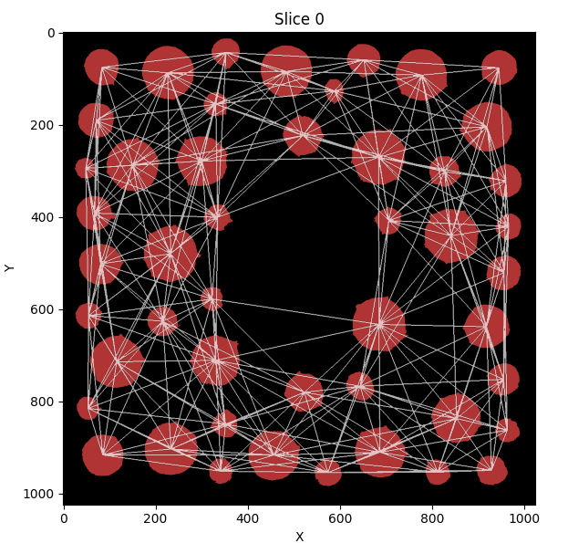

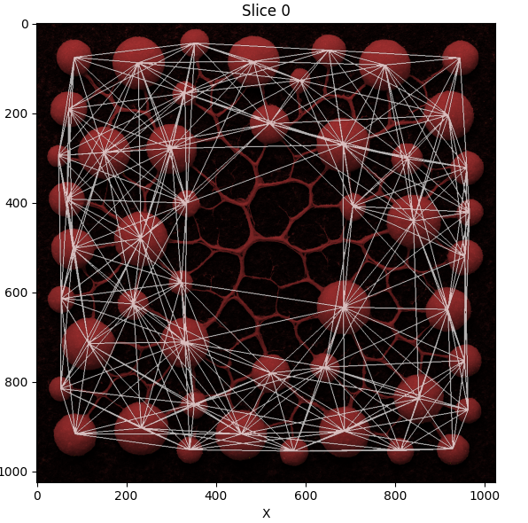

Proximity networks are a generic means of grouping objects in 3D space, well
suited to tasks such as identifying cellular neighborhoods. Those neighborhoods
can then be grouped into communities and analysed for composition.

Cellular Data — Modalities of Analysis
--------------------------------------

There are two primary approaches to analysing cellular data in NetTracer3D. Both
begin with the same preparatory steps:

1. Segment your cells beforehand (for example in Cellpose) from a DAPI and/or
   membrane channel, or generate hexagonal nodes from the Generate menu.
2. Load the segmented cells into the nodes channel. Assemble the channels of
   interest into a folder, then use **File → Images → Node Identities → Assign
   Node Identities from Overlap with Other Images**. This calculates the average
   expression of each node across your channels — save the resulting spreadsheet.
   Thresholding is also used here to assign each node its channel identities.

**Option 1 — spatial neighborhoods.** Create a proximity network from cells
bearing node identities; some number of nearest neighbors (20, for example)
within a reasonable distance works well. Then use **Analyze → Network → Create
Communities Based on Node's Immediate Neighbors** to group cells according to
recurrent neighbor patterns. This differs from the default community clustering
from the network, which reveals spatial aggregates based on literal clumpiness in
the tissue and may be inappropriate for dense cellular arrangements.

**Analyze → Network → Calculate Community Composition...** then shows what each
community comprises. Many channels are needed for this to work well — the more
channels, the more distinct the tissue regions that emerge. Below is the result
of this community detection applied to a lymph node:

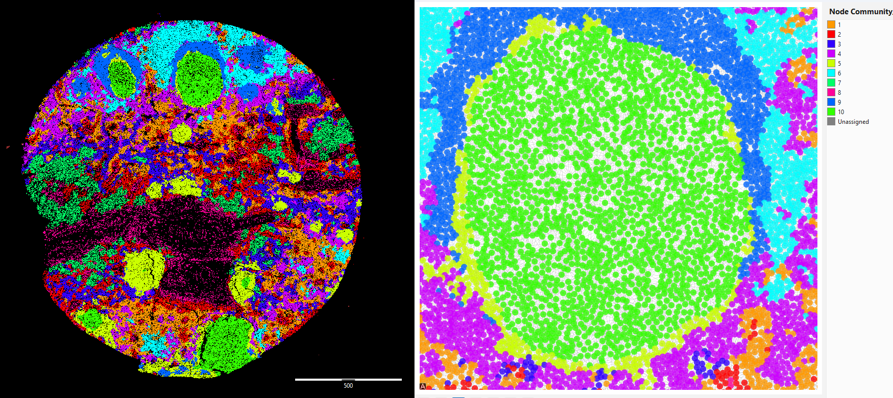

*This approach is good for classifying tissue.*

**Option 2 — expression profiles.** This uses the intensities spreadsheet created
earlier. Select **Analyze → Stats → Show Identity Violins...** and locate the
spreadsheet. In the menu that appears, find the clustering option and enter a
number of communities to create based on the fluorescent expression profile of
each cell. Keeping the intensity heatmap checked is recommended, as it shows what
the resulting communities are composed of.

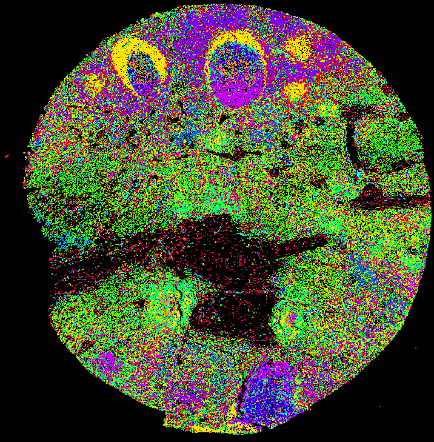

*This approach is good for finding cell types.*

Advanced Cellular Neighborhood Analysis — CODEX Walkthrough
-----------------------------------------------------------

Proximity networks make the best use of the *node identities* property, which
allows groups of nodes to be lassoed into neighborhoods sharing local expression
of similar cell types. Node identities can represent anything about a node — what
it is, its qualities, and so on. They may be loaded directly from a spreadsheet
(see :doc:`excel_helper`) or pulled from images.

Multiplexing, where a tissue is imaged repeatedly across many markers, is a
particularly useful setting for this. The following CODEX dataset serves as an
example, obtained from: Canela, V.H., Bowen, W.S., Ferreira, R.M. et al. A
spatially anchored transcriptomic atlas of the human kidney papilla identifies
significant immune injury in patients with stone disease. Nat Commun 14, 4140
(2023). https://doi.org/10.1038/s41467-023-38975-8

The image is of a renal papilla, stained here with DAPI (nuclei):

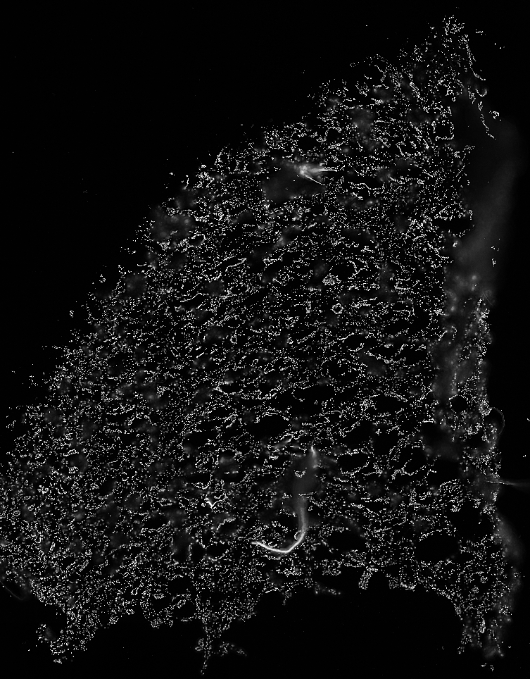

Obtaining anchor nodes
~~~~~~~~~~~~~~~~~~~~~~

Several options exist for getting multiple channels into the same set of nodes.
The first is to merge the nodes directly with **File → Images → Node Identities →
Merge Labeled Images into Nodes**. Where segmentations of separate objects
already exist (different cells or different FTUs), this pulls them into
NetTracer3D as different identities. It does not work when the nodes in each
channel sit on top of one another — the same cell with a different marker — or
when segmenting each is too burdensome.

We therefore use the second option, **File → Images → Node Identities → Assign
Node Identities From Overlap With Other Images**, which is designed specifically
for CODEX-type images. It takes a primary segmentation of all nodes, typically
from a DAPI stain, and assigns each node an identity based on which labeled
markers from the other channels the node overlaps.

This first requires an initial set of segmented nodes to act as anchors, usually
obtained by segmenting the DAPI channel. NetTracer3D's binary ML segmenter can be
used as in the previous example, followed by direct labeling if the cells do not
overlap, or binary watershedding if they do. A third option is to segment out the
background with the intensity thresholder and use gray-watershedding to split the
foreground into labeled nodes. See :doc:`process_menu` for explanations of each.

These options suit certain data types and give quick results, but dedicated tools
segment cells with higher specificity. One such tool is Cellpose3: Stringer, C.,
Pachitariu, M. Cellpose3: one-click image restoration for improved cellular
segmentation. Nat Methods 22, 592–599 (2025).
https://doi.org/10.1038/s41592-025-02595-5

Cellpose3 can be bundled into the NetTracer3D package, though GPU use is
effectively mandatory. For the most accurate results, segment clustered nuclei
with a user-trained model in Cellpose3:

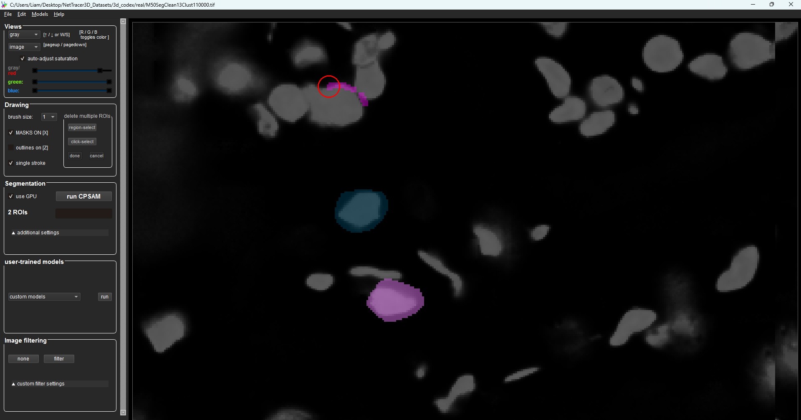

*See https://cellpose.readthedocs.io/en/latest/ for instructions on installing
and using Cellpose.*

If segmenting cells is not possible or not desired, artificial hexagonal nodes
can be generated from the Generate menu to partition the tissue similarly.

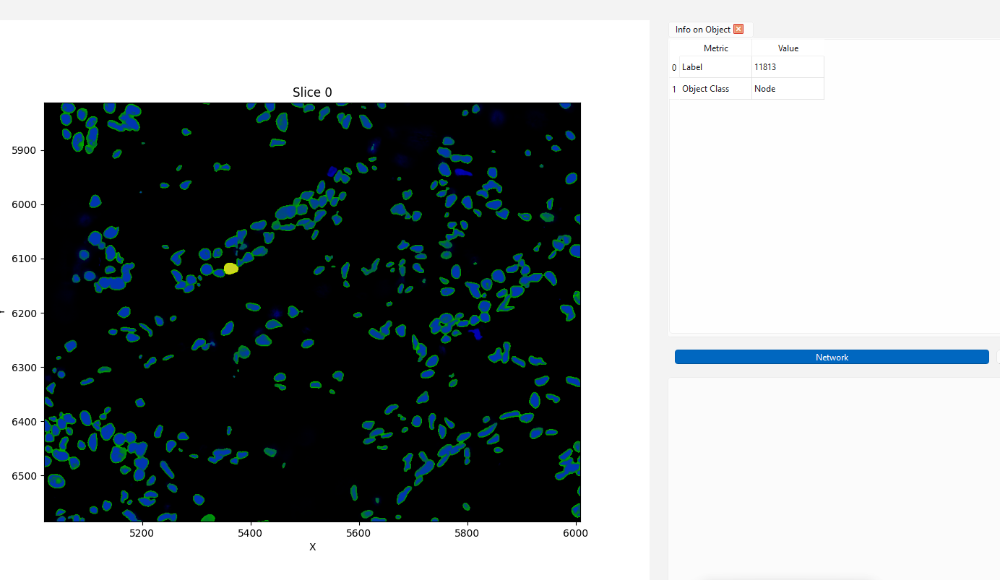

*DAPI-segmented nuclei (green borders) over the original DAPI channel in
NetTracer3D, with one selected in yellow.*

Assigning identities from channels
~~~~~~~~~~~~~~~~~~~~~~~~~~~~~~~~~~

However they are obtained, load the segmented DAPI nuclei into the nodes channel.
A fast and error-robust route for the remaining channels is **File → Images →
Node Identities → Assign Node Identities From Overlap With Other Images** with
**Manual** selected as the binarization strategy.

First place all channels of interest into a folder as separate ``.tif``/``.tiff``
images; ImageJ can easily split channels saved as a stack. For this mode the
channels should be raw rather than segmented. Then set the following options and
select your folder:

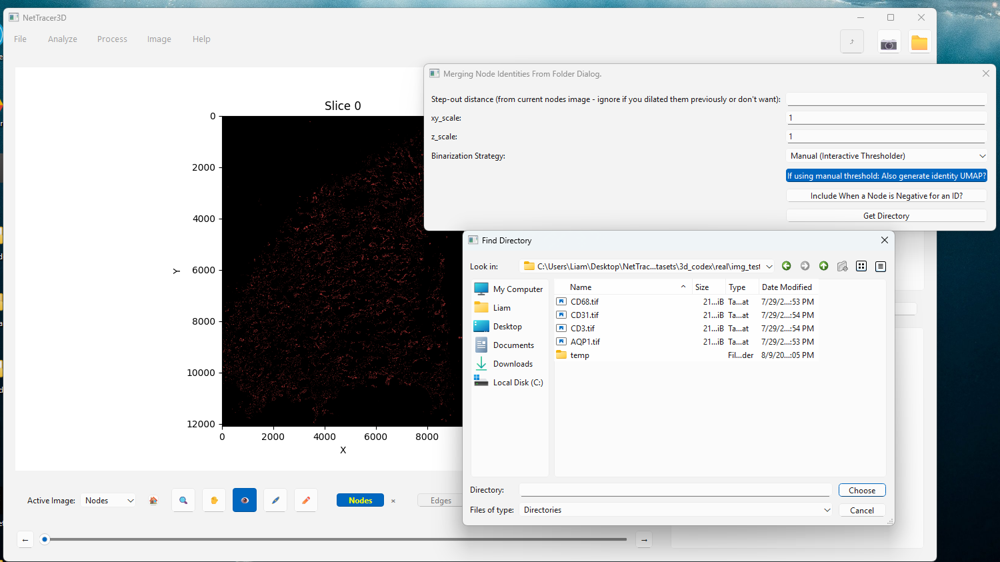

*The step-out distance parameter optionally makes each cell consider a wider
area, accounting for staining beyond the nuclei. This can be skipped if membranes
were segmented or the behaviour is not wanted.*

NetTracer3D evaluates each cell for the average intensity it expresses in each
channel. You are then prompted to threshold each image manually, indicating which
subset of cells should receive that identity based on their relative intensities.
The example below uses CD68, which stains macrophages:

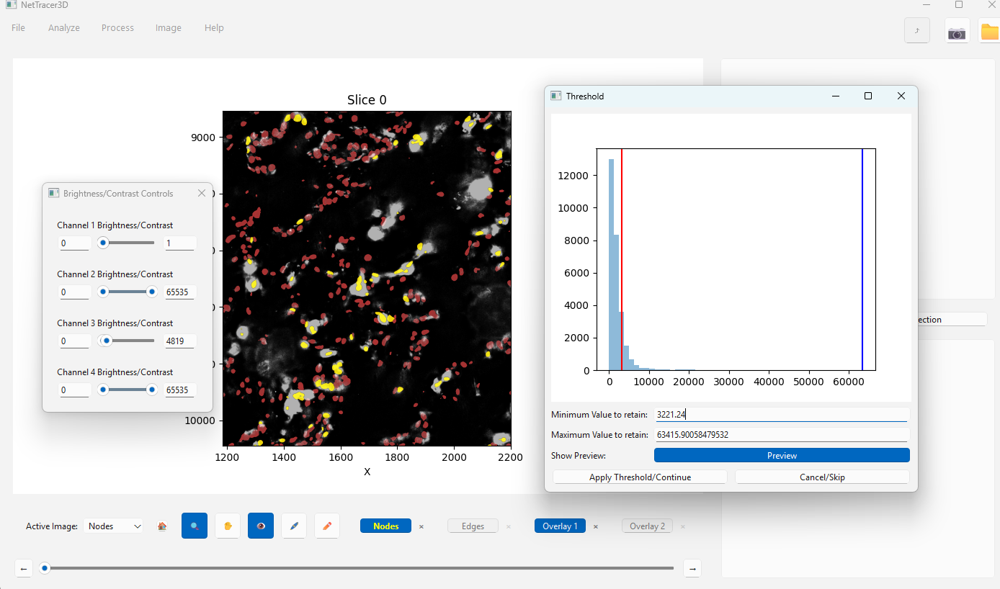

*NetTracer3D's image canvas remains interactive during thresholding. Nodes/cells
stay in the Nodes channel while each channel being thresholded is temporarily
rendered in Overlay1. Brightness/contrast controls make them more visible; the
thresholder on the right then selects the cell nuclei that genuinely overlap with
the channel data, highlighted in yellow. This repeats for every channel in the
folder.*

Once all channels are thresholded, the nodes are assigned identities as shown in
the upper right table. If manual assignment was used and the UMAP option was
selected at the start, a UMAP is also produced comparing the Z-score of each
marker across the cells pulled out for identity assignment.

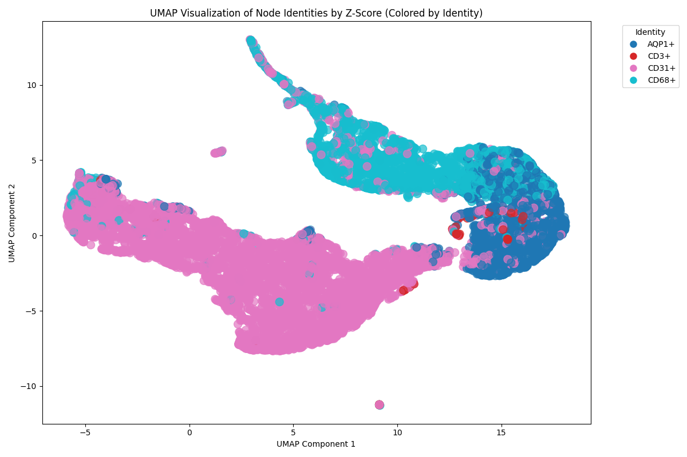

*The UMAP adds an extra processing step but is a reasonable validation option. If
cells overlap where they should not, either the thresholding step or the image
itself was poor.*

Because the mean intensity of each node is considered with the user in the loop —
rather than auto-assigning based on overlap with a channel's segmented foreground
— this method guards effectively against phenotyping errors.

Grouping Cells By Shared Expression Profile
~~~~~~~~~~~~~~~~~~~~~~~~~~~~~~~~~~~~~~~~~~~

On completion, you are prompted to save a spreadsheet containing the average
intensity of each channel for each cell. Save it, along with your progress so far
— the assigned node identities are especially important not to lose. Use **File →
Save As → Save Network3D Object As** to save the current session.

Next, select **Analyze → Stats → Cellular-Esque Analysis** and locate the
intensities spreadsheet, which opens this menu:

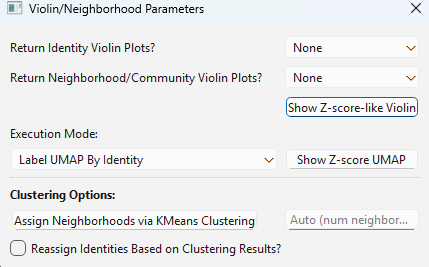

Violin plots can be generated for each marker, normalized against the lower-end
threshold called as valid for that identity. As an example, here is the plot for
all cells called CD68:

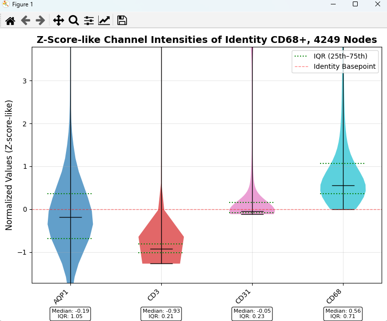

Any value above 0 represents a valid representation of that identity from the
assignment phase. The CD68 violin sits entirely above 0, since only cells already
assigned CD68 are shown. Any portion of the other plots above 0 therefore
indicates that these CD68 cells also show valid expression of that marker — here,
the greatest overlap is with CD31.

From the previous menu, cells can be grouped into neighborhoods based on the
overlap of their channel markers. These neighborhoods can then relabel the
earlier UMAP:

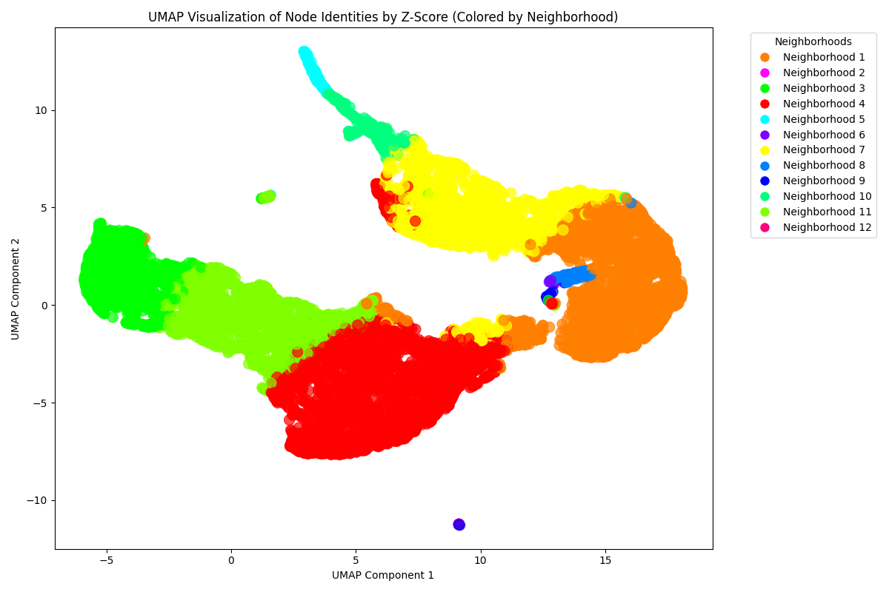

Violin plots can likewise be produced for communities or neighborhoods:

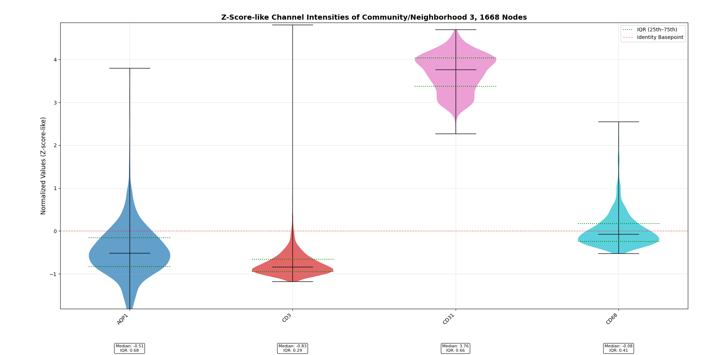

This neighborhood shows strong CD31 expression but weaker expression of the other
markers, likely representing blood vessels — an effective way to query unique
cell phenotypes in an image.

Grouping Cells By Neighborhood
~~~~~~~~~~~~~~~~~~~~~~~~~~~~~~

Moving beyond marker-based analysis, NetTracer3D's spatial capabilities can be
evaluated over a broader set of markers. The system is primarily designed around
the user-in-the-loop per-channel thresholder, but more nuanced segmentations can
be brought in through auto-assignment: pre-binarized channels where the
foreground is already segmented, a neural network (which can be trained during
manual thresholding and reused), or reapplication of previous threshold settings.

Calculate a proximity network again — here with a search region limit of 100
microns and the nearest 20 neighbors within that area. Although not used here,
**Create Networks only from a specific node identity** restricts connections to
originate from a given identity, allowing highly specific analysis.

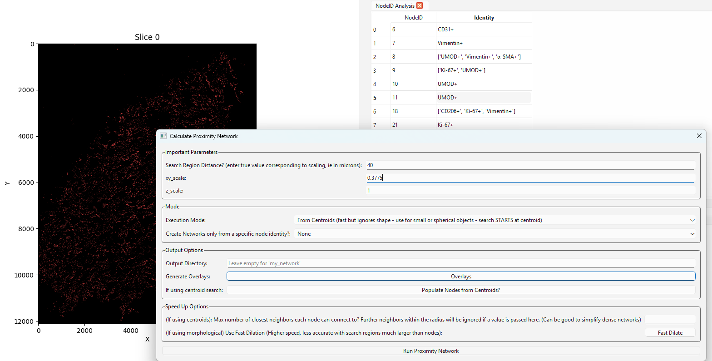

*Centroids are used for this proximity network, which is acceptable when objects
are circuloid or cuboid. Centroids can be obtained with 'Process → Calculate
Network → Calculate Centroids'; if they do not exist when the network is run,
NetTracer3D prompts to calculate them. The Calculate Centroids window is here set
to 'Skip ID-less centroids', excluding centroids for nodes without an assigned
identity and excluding those nodes from the network. Leave this option off to
retain ID-less nodes, for instance to represent tissue architecture. 'Process →
Modify Network/Properties' can remove centroids lacking identities later.*

The network itself:

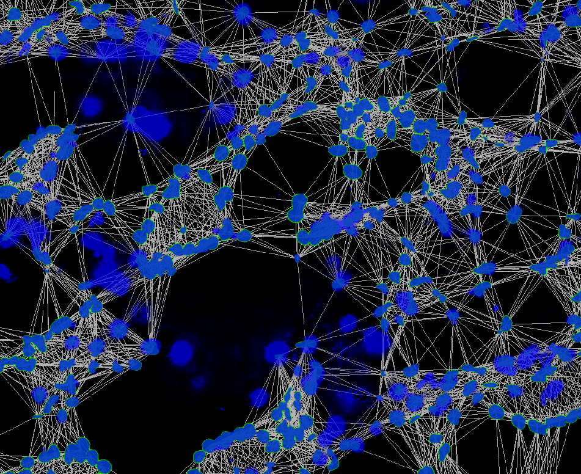

To cluster nodes by their network participation, use **Analyze → Network → Create
Communities Based on Node's Immediate Neighbors...**:

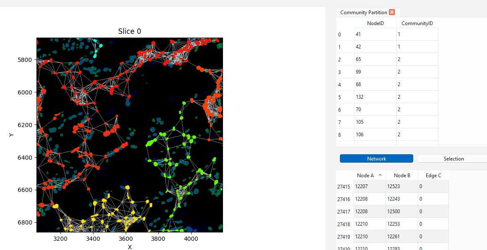

*Nodes assigned a community position based on network involvement via the Louvain
algorithm. For proximity networks this groups nodes by spatial relationship. The
colored overlay is produced with 'Analyze → Data/Overlays → Code Communities'.*

**Analyze → Network → Calculate Community Composition** then shows the relative
composition of each community or neighborhood, including heatmaps such as this:

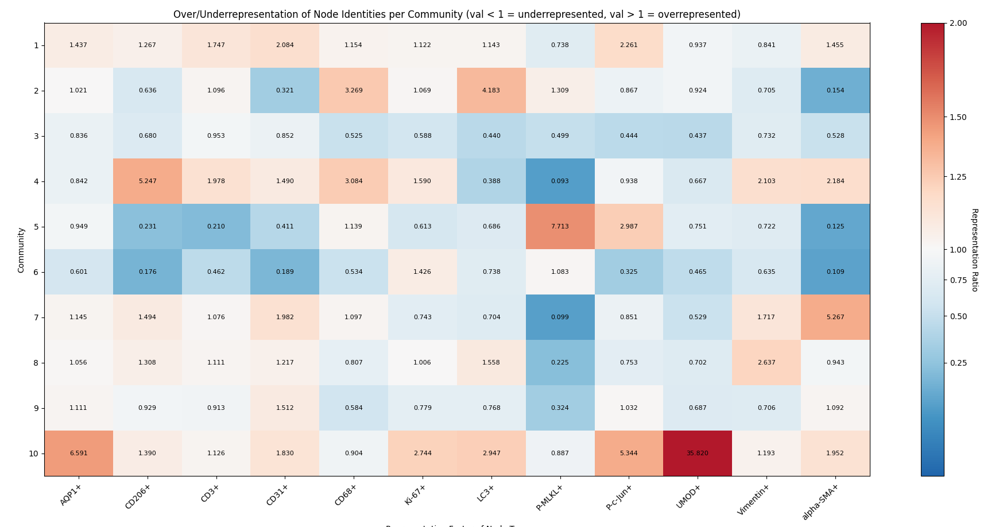

*This graph shows the log-normalized over- and under-expression of each label in
a community. Values greater than one (red) are over-represented in that
community; values less than one (blue) are under-represented.*

Communities can also be assigned from the network itself, though this is less
specific for cellular datasets and better suited to finding spatial aggregates of
objects. If network communities are used and similarity clustering is wanted,
**Analyze → Network → Convert Network into Supercommunities** converts them into
supercommunities — bearing in mind that this reports something entirely different
from the cellular analysis pipeline recommended above.

Optional — Reassigning Node Identities for Tailored Analysis
~~~~~~~~~~~~~~~~~~~~~~~~~~~~~~~~~~~~~~~~~~~~~~~~~~~~~~~~~~~~

After identities are assigned, nodes carrying multiple identities may warrant
reassignment to their own class — a group of markers may represent a distinct
cell type, and since co-expression of markers is common, this yields more
specific categories (T-cell rather than lymphocyte). This supports more targeted
downstream analysis on a single cell class, such as building proximity networks
from that class alone to evaluate what tends to appear around it.

The simplest route is **Process → Modify Network/Properties → Change/Remove
Identities**.

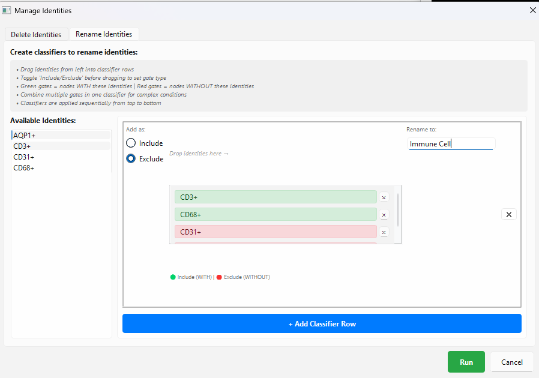

*Drag the identities the renamed nodes should carry from the left into the middle
with 'Include' enabled. 'Exclude' instead finds only nodes lacking that identity.
Assign a new name on the right and choose 'Run'.*

Alternatively, nodes may already carry identities assigned in another program such
as QuPath. In either case, the node identity information needs to be in a
spreadsheet — right click the upper right table to save the node identities
spreadsheet. **File → Load → Load From Excel Helper** then reassigns the
identities and pulls them back into NetTracer3D:

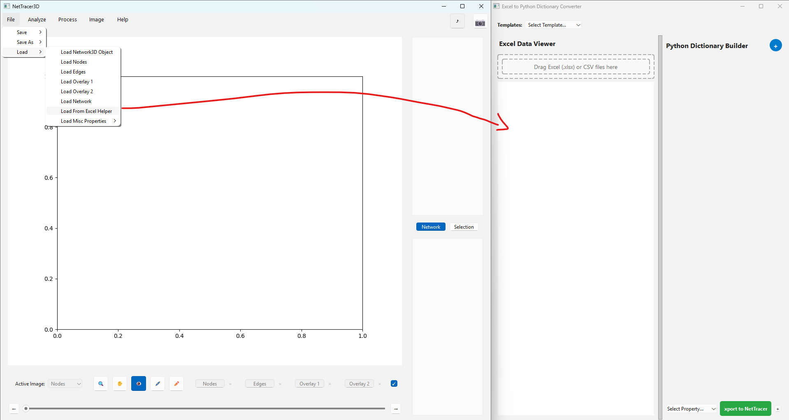

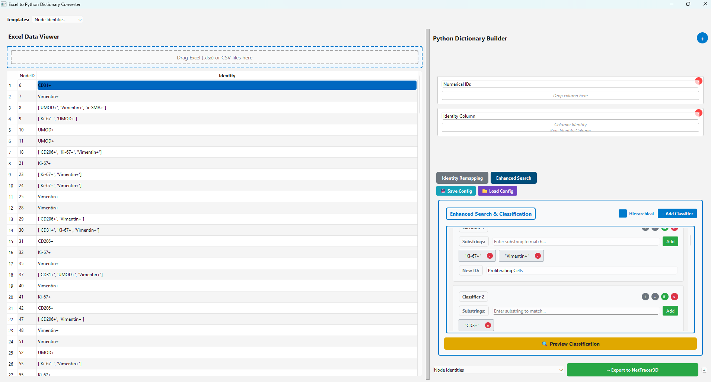

*Here NetTracer3D is told to reassign anything containing the terms 'Ki-67+' and
'Vimentin+' to the identity 'Proliferating Cells'.*

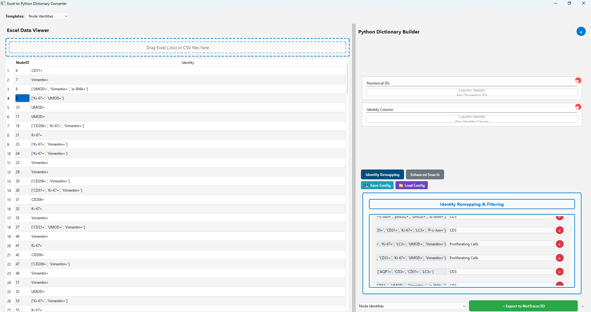

*Pressing 'Preview Classification' assigns all combinations of identities
containing the configured string classifications to their new ID. The green
'Export' button then sends this data into NetTracer3D's main window.* See
:doc:`excel_helper` for more information on using this tool.

If multiple identities per node are unwanted and the excel loader is more effort
than desired, **Process → Modify Network/Properties → Force Any Multiple IDs to
Pick a Single Random ID** forces each multiple-ID node to randomly adopt one of
its sub-identities. The result with all cells forced to a single identity is
shown below. This step is unnecessary for most analytical functions, but the
visualization functions work better with fewer identity groups.

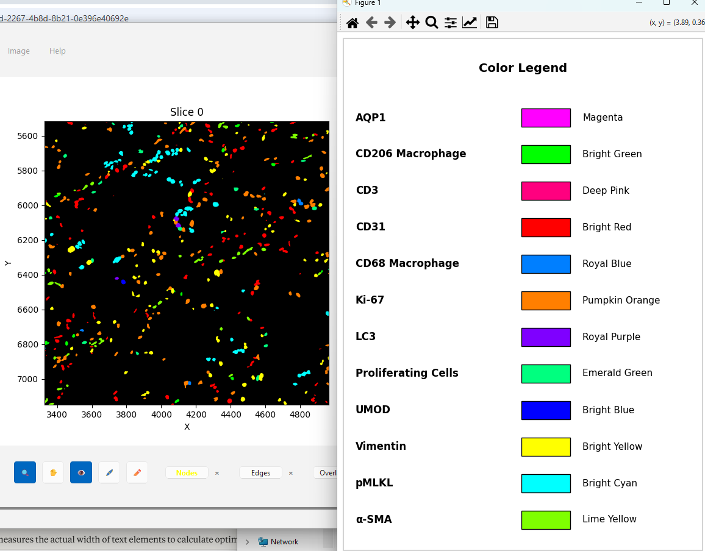

*This overlay is produced with 'Analyze → Data/Overlays → Code Identities'.*

Next Steps
----------

Once you are comfortable generating the default network types, proceed to
:doc:`branches` to learn about labeling branches of objects and creating branch
networks.
