.. _quickstart:

=================================================================
Quickstart — Segmenting Data and Generating Connectivity Networks
=================================================================

This guide introduces NetTracer3D by walking through a complete worked example,
from loading an image through segmentation to generating and analysing a
connectivity network.

.. contents:: On this page
   :local:
   :depth: 2

Launching NetTracer3D
---------------------

After :doc:`installation`, launch NetTracer3D from the command line:

.. code-block:: bash

    nettracer3d

This opens the main application window.

Interface Overview
------------------

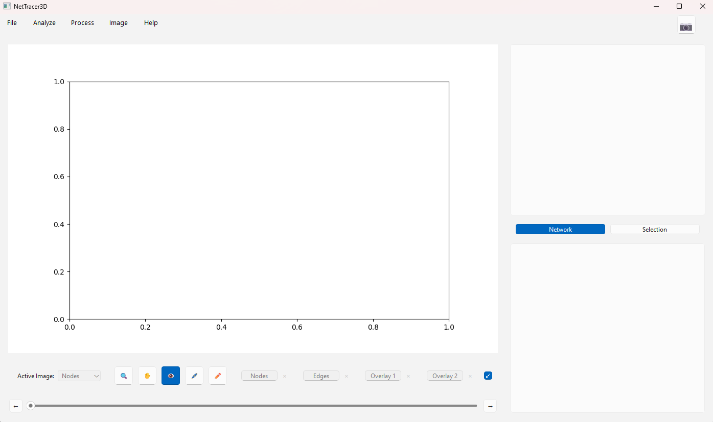

The interface is divided into five regions:

* **Canvas / Main Visualization Area** (left): the image viewer window, where the
  3D stack is displayed as 2D slices.
* **Control Panel** (bottom): widgets for interacting with the image viewer.
* **Tabulated Data** (top right): where data tables from analysis are placed.
* **Network Data** (bottom right): the network graph visualization, any
  subselections, and tables for both.
* **Menu Bar** (top): options to load/export data and run analysis.

Four elements of the top right of the menu bar are worth noting:

1. The **⤴** button ejects the main canvas and control panel into a separate
   window, allowing them to be enlarged without the tables getting in the way.
2. The **camera** button saves a 2D TIFF of whatever is currently displayed in
   the canvas.
3. The **file** button prompts for a ``.xlsx``/``.csv`` spreadsheet to load into
   the top right data tables. Since some tables can be used to interact with the
   nodes, reloading them is often useful.
4. The menu bar also displays dynamic information: your active session on the
   left if you are working out of a specific directory, and on the right the xy
   and z resolutions, the current slice, and — when the scalebar is toggled on —
   the current mouse coordinates.

.. note::

   When running from the command line, check the command window for printed
   updates on what NetTracer3D is doing. This does not apply to the compiled
   version.

The Control Panel
-----------------

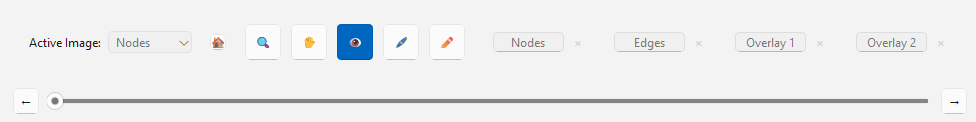

The control panel along the bottom contains the following widgets:

#. **Active Image**

   Click the carat to select which image is *active*. Most processing and
   analysis functions run on the active image by default, and clicking or drawing
   in the image viewer window references the active image.

#. **Scale bar**

   Click to add a scale bar to the canvas, scaled by your xy resolution to
   represent true distance. Click again to add an unscaled tiled grid
   representing voxel positions; again to remove the scalebar while retaining the
   grid; and once more to remove the grid and return to the default view.

#. **Home**

   Resets the view to default, useful if you become stuck in an unusual zoom
   state. Shortcut: :kbd:`Shift` + right click while in zoom mode.

#. **Zoom** (magnifying glass — shortcut :kbd:`Z`)

   The mouse wheel zooms in any mode, but a dedicated widget is provided
   primarily for laptops. Press :kbd:`Z` or click the magnifying glass to enter
   zoom mode: left click zooms in, right click zooms out, and dragging zooms to a
   specific area.

#. **Pan** (hand — shortcut middle mouse)

   Press the middle mouse button or click the hand widget to enter pan mode, then
   drag along the image viewer window to move around the image.

#. **Highlight overlay display** (eye — shortcut :kbd:`X`)

   Press :kbd:`X` or click the eye widget to toggle visibility of the highlight
   overlay. Clicking objects in the nodes or edges channels (and certain other
   functions) generates a yellow highlight denoting the current selection.

#. **Image markup** (pen)

   Click the pen widget to enter markup mode. Clicking the active image writes
   values of 255 directly into the image data at the clicked location. Additional
   functionality in pen mode:

   1. Left click erases positive data, writing 0 directly into the image.
   2. :kbd:`Ctrl` + mouse wheel enlarges the draw/erase area.
   3. Press :kbd:`F` to swap to the fill can. Clicking with the fill can writes
      255 into the entirety of any background (0-value) region connected to the
      clicked point. In fill can mode only, :kbd:`Ctrl` + :kbd:`Z` undoes the
      most recent action.
   4. Press :kbd:`D` in either pen or fill can mode to enable the 3D version of
      these tools. The 3D pen draws across several slices at once; the number
      displayed above the 3D pen indicates the span (a value of 5 writes into the
      current slice, two above, and two below), adjustable with the mouse wheel.
      The 3D fill can fills the entirety of a 3D void — essentially any
      continuous hole in 3D. As with the 2D fill can, :kbd:`Ctrl` + :kbd:`Z`
      undoes the last action while still in fill can mode.

#. **Threshold / segment** (pencil)

   Opens the menu for intensity thresholding or machine-learning segmentation.
   See the Threshold/Segment guide for details.

#. **Channel widgets** (Nodes, Edges, Overlay1, Overlay2)

   Toggle channel visibility. The **x** widget beside each channel button prompts
   to delete that channel.

#. **Scrollbar**

   Drag the central knob to scroll through the 3D image stack, or use the arrows
   on either side to advance one frame at a time. :kbd:`Shift` + mouse wheel also
   scrolls the stack; :kbd:`Ctrl` + :kbd:`Shift` + mouse wheel scrolls faster.

Loading an Image
----------------

Select **File → Load**, or drag images into the active image directly from the
file explorer. The load menu offers:

1. Load Network3D Object
2. Load Nodes
3. Load Edges
4. Load Overlay 1
5. Load Overlay 2
6. Load Network
7. Load from excel helper
8. Load Misc Properties

Options 2–5 correspond to the four image viewing channels supported by
NetTracer3D. When beginning with a new image to segment, load it into the nodes
channel with **Load Nodes**. This prompts you to browse for an image in ``.tif``
/ ``.tiff`` (for microscopic data), ``.nii`` (if nibabel is installed), or
``.jpg`` / ``.jpeg`` / ``.png`` format.

.. important::

   If your image has real value scaling (i.e. microns per pixel), those values
   will not populate automatically and should be assigned in
   **Image → Properties** before any processing occurs.

We begin by loading a cartoon rendition of a slime mold as our example:

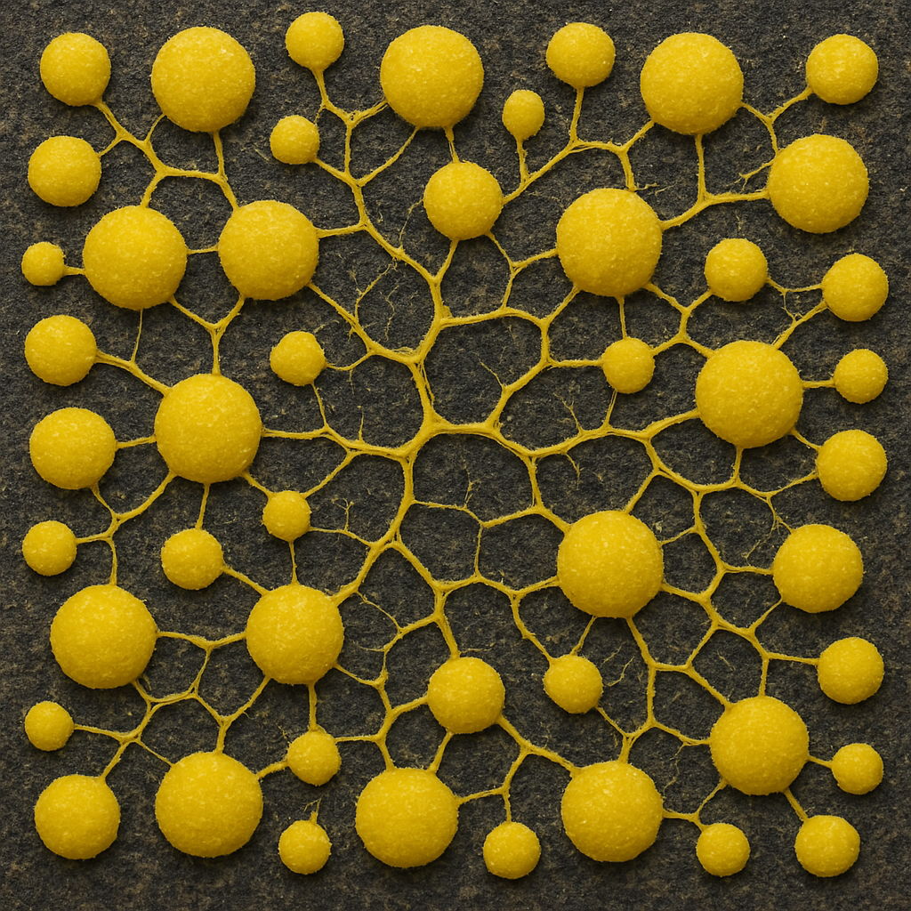

Use **File → Load Nodes**. Because this is an RGB image, answer *yes* to the
prompt asking whether it is a color image, so that it is converted to grayscale.

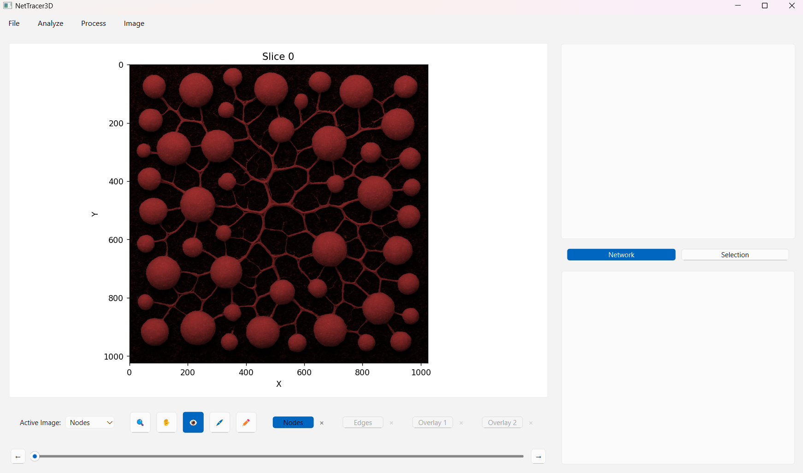

Note that the image viewer window displays nodes images through a red filter by
default, although this can be changed.

Navigating the Image Viewer Window
----------------------------------

The image viewer window displays four channels plus a highlight overlay:

* **Nodes**: the image representing the objects to be grouped into a network.
  Loads images in grayscale.
* **Edges**: the image used as a reference when grouping node objects together.
  The branch-labeling algorithms are also executed on the edge image. Loads
  images in grayscale.
* **Overlay1**: an optional overlay (supports color images).
* **Overlay2**: a second optional overlay (supports color images).

The highlight overlay is a special image used to convey selected objects to the
user.

If you have trouble seeing your image data, use **Image → Adjust
Brightness/Contrast** to modify the brightness of each channel.

Only the Nodes and Edges channels may be interacted with in the image viewer
window, and only while that channel is set as the active image. Clicking an
object selects all elements in the corresponding image sharing that numerical
value — for example, clicking a voxel of grayscale value 1 selects every voxel
containing the value 1.

* The selection is shown in the highlight overlay, with information presented in
  the tabulated data widget in the top right.
* Selected nodes and edges are bolded and highlighted in the network table widget
  in the bottom right.
* Specific functions may be run on selected objects; many are available by right
  clicking in the image viewer window. See :doc:`right_clicking` for details.
* Clicking the background (value 0) deselects all objects.
* :kbd:`Ctrl` + click selects an additional object while maintaining the previous
  selection.
* Click and drag to select multiple objects at once (also supports :kbd:`Ctrl` +
  click).
* To zoom, select the magnifying glass (or press :kbd:`Z`) and left click; right
  click zooms back out, and click-drag zooms to a specific region.
* To pan, select the hand (or middle mouse) and drag within the window.

.. _segmenting:

Segmenting Data
---------------

Most algorithms in NetTracer3D expect either binary images (all values 0 or
positive) or labeled images — grayscale images in which objects have been grouped
into distinct labels (1, 2, 3, and so on). Presegmented data can be used
directly; our data is not yet segmented, so we will use NetTracer3D's
segmentation options to process it.

Click the pencil widget to begin. The following window appears:

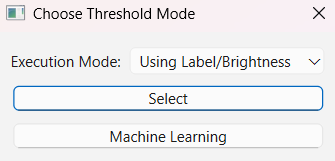

**Execution mode** selects between direct intensity thresholding (for images with
good SNR, or to sort out specific labels) and volume-based thresholding (for
already segmented images, to remove noise or select a specific size range of
objects). Press **Select** to open the corresponding threshold window.

**Machine Learning** segments by feature morphology and is the more general
option, applicable to most image types. We will use it here.

Using the Machine Learning Segmenter
~~~~~~~~~~~~~~~~~~~~~~~~~~~~~~~~~~~~

Machine learning segmentation can be executed on any image in the nodes channel.
It requires the use of Overlay1, Overlay2, and the highlight overlay, so
segmenting images in a session separate from binary data processing is
recommended.

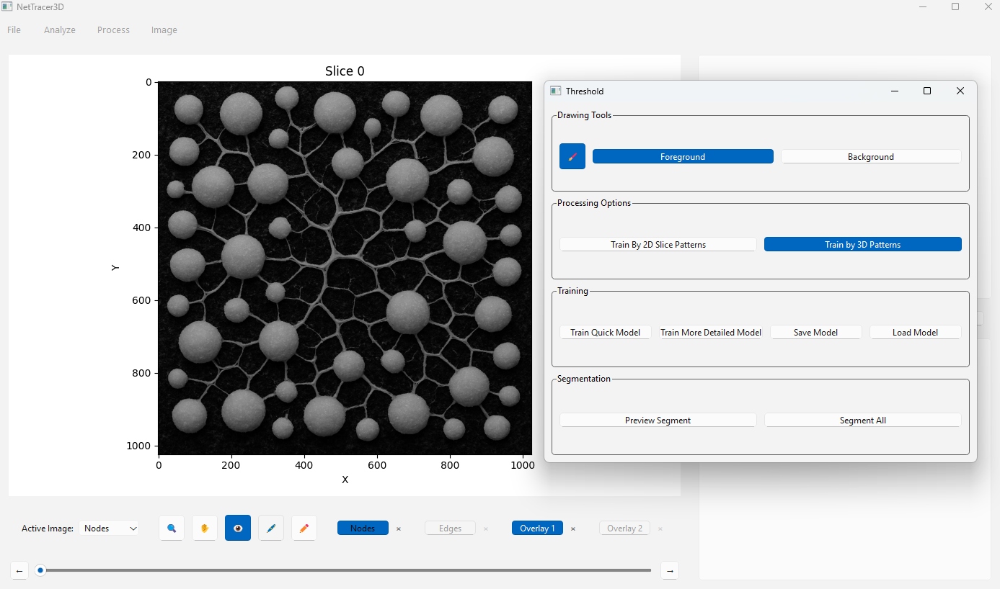

Referencing the image above, the segmenter uses the following channels and
options:

* **Nodes**: contains the data of the image being segmented.
* **Overlay1**: contains the training data.
* **Overlay2**: receives the final segmentation once generated.
* **Highlight Overlay**: displays segmentation previews.
* **Brush** (Drawing Tools): enters brush mode, which works like the pen mode
  described above but without the 3D and fill can features. Click in the image
  viewer window to mark objects to keep (foreground) and objects to exclude
  (background). This training data is written directly into Overlay1, with values
  of 1 representing foreground and 2 background. Right click erases markings, and
  :kbd:`Ctrl` + mouse wheel changes the brush size.
* **Foreground** (Drawing Tools): sets the brush to mark foreground, denoted by
  green markings. Press :kbd:`A` to toggle with background.
* **Background** (Drawing Tools): sets the brush to mark background, denoted by
  red markings. Press :kbd:`A` to toggle with foreground.
* **GPU**: with a working CUDA toolkit and NetTracer3D installed with the cupy
  option, segmentation runs on the GPU. This speeds up **Segment All**
  considerably, though model training and preview segmentation are slightly
  slower due to numpy-to-cupy bottlenecking. Since **Segment All** is the
  limiting step, GPU use is strongly recommended where available — for
  reference, a 6.5 GB image took roughly 10 minutes on a 5070 Ti.
* **Train by 2D Slice Patterns** (Processing Options): trains the model using 2D
  feature maps.
* **Train by 3D Patterns** (Processing Options): trains the model using 3D
  feature maps.
* **Train Quick Model** (Training): trains the model to segment your image based
  on the regions marked in your training data.
* **Train More Detailed Model** (Training): as above, with additional feature
  training.
* **Preview Segment** (Segmentation): segments the image as a preview without
  interrupting the current training session, allowing you to assess whether the
  model needs further training. The preview appears in the highlight overlay,
  with foreground in yellow and background in blue.
* **Pause/Resume** (Segmentation): pauses or resumes the preview segmenter.
* **Segment All** (Segmentation): after a warning, pauses the training session
  and segments the entire image with the current model, placing the binary result
  in Overlay2. Save your images first (**File → Save Network 3D Object As**), as
  the process can only be interrupted by terminating the program.
* **Save Model** (Saving/Loading): saves only the extracted training data from
  the current model, as an ``.npz`` file.
* **Load Model** (Saving/Loading): loads saved training data into a new model,
  which can then receive additional training from separate images while retaining
  its previous data. Loaded quick models can only be layered onto new quick
  models, and loaded detailed models onto new detailed models; combining model
  types causes the previous model data to be ignored.
* **Load Image...** (Saving/Loading): loads a new image into the nodes channel
  for segmentation. This load option supports RGB images (H&E stains, for
  example), which are not normally permitted in the nodes channel.

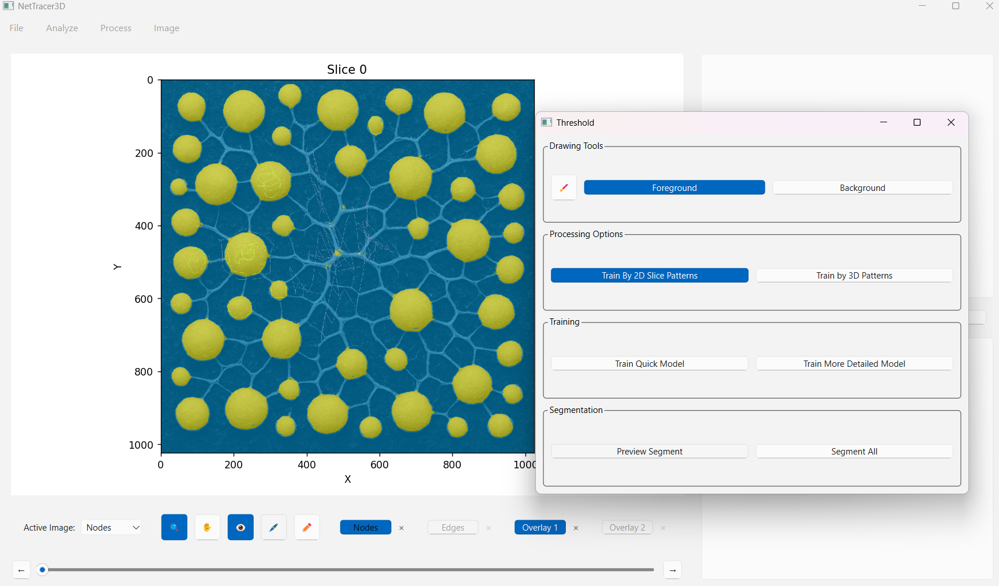

*Above: an ML segmentation in progress. Foreground is marked in green and
background in red. Yellow regions have been selected by the current model as
foreground and blue as background. Longer training sessions produce more specific
segmentation results.*

To save the resulting segmentation, use **File → Save Overlay2 As**. To save the
training data for later reuse or retraining, use **File → Save Overlay1 As**.
**File → Save Network3D Object As** saves all images together.

We will save the segmentation above for use as the nodes in our network.

Denoising the Segmentation
~~~~~~~~~~~~~~~~~~~~~~~~~~

Some noise has slipped through the segmentation. NetTracer3D offers several
options for cleaning up binary segmentations; here we use volume thresholding.

1. Open a new instance of NetTracer3D and load the binary slime mold segmentation
   into the nodes channel.
2. Click the pencil widget, change **Execution Mode** to **Using Volumes**, and
   choose **Select** to open the volume threshold window.
3. When prompted, allow the system to label the nodes, assigning each binary
   object a distinct numerical value.

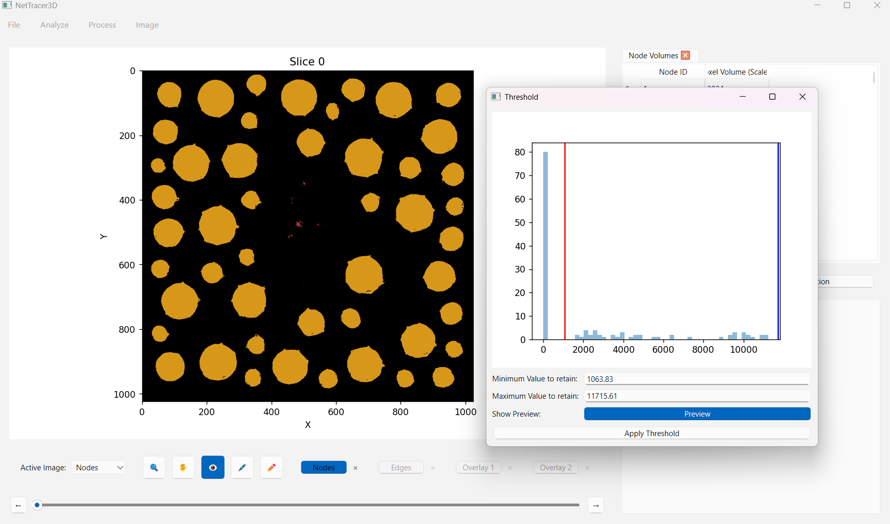

*Above: de-noising with the volume thresholder. The red bar excludes the small
objects; on the left, the objects to be kept are shown in yellow.*

The displayed histogram represents the distribution of object volumes in the
image. Drag the red bar to exclude low-volume objects and the blue bar to exclude
high-volume ones.

* Minimum and maximum values to retain may also be entered manually.
* **Preview** shows the included objects in yellow in the highlight overlay.
* **Apply Threshold** segments the image as shown in the preview.

Applying this threshold and then using **Process → Image → Fill Holes** to close
any remaining holes in the binary image yields the finished segmentation:

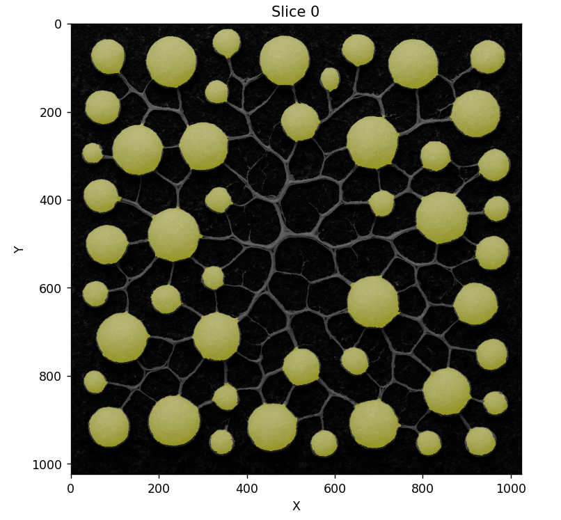

Types of Networks
-----------------

NetTracer3D can produce four flavors of network, each converting a static image
into an undirected network graph.

1. **The connectivity network** — node objects are connected via a second image
   (the edges image).

   * Ideal for objects such as cells or functional tissue units (ganglions,
     glomeruli, liver lobules) interconnected by a secondary structure such as
     nerves, blood vessels, or lymphatics.
   * Requires two images, each segmented.

2. **The proximity network** — nodes are connected based on distance to one
   another.

   * Ideal for evaluating general spatial arrangement, such as cells in an H&E
     stain or in microscopy data such as CODEX.
   * Less useful for chaotically arranged objects (for example, every cell in a
     poorly differentiated neuroendocrine tumor), though restricting the network
     to a single cell type can reduce the chaos.

3. **The branchpoint network** — nodes are created at branch vertices and
   connected based on adjacency within the branch.

   * Ideal for branched structures such as nerves, vessels, lymphatics, or roots.
     These should be segmented into binary first; NetTracer3D handles branch
     assignment.
   * Describes branching behaviour well, but loses morphological information.

4. **The branch adjacency network** — branches themselves become nodes.

   * Similar to the above, but connections are based on whether an entire branch
     touches another branch.
   * More useful than the branchpoint network for interacting with branches
     directly, though the branching structure is partly obscured, since the order
     in which branches arise is not preserved.

The Connectivity Network
------------------------

As with the nodes, the edges are segmented from the image — the same steps as
above, selecting the connection regions rather than the nodes. This is the image
through which the nodes will be connected; in practice it is often a different
channel, such as an overlapping image of nerves or vessels. In this demonstration
the same image is used for both.

Load the edges with **File → Load Edges**, then select **Process → Calculate →
Calculate Connectivity Network**.

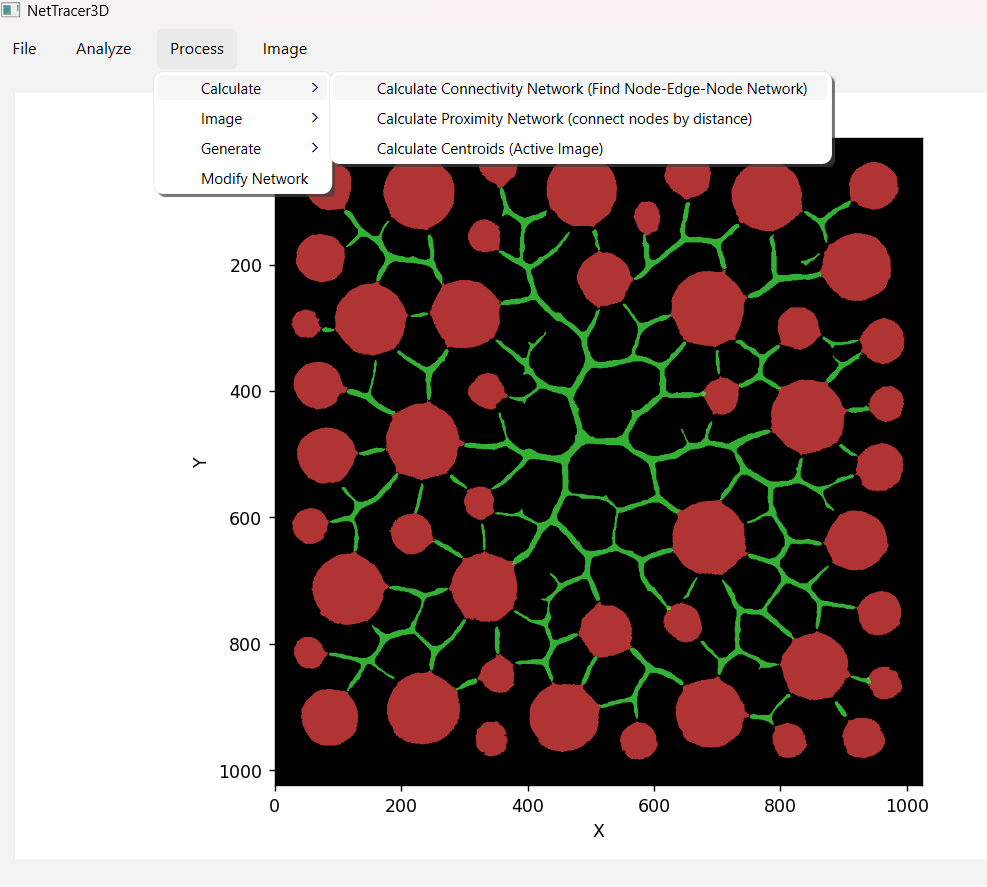

Enter the following parameters and execute the network generation:

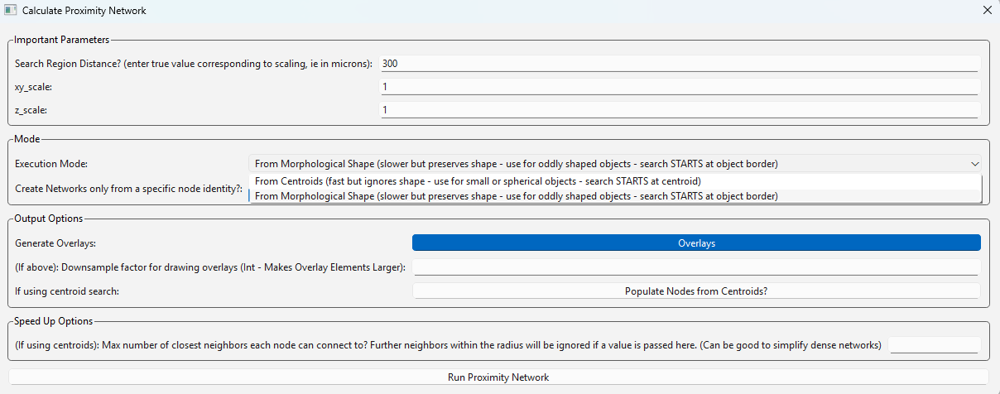

*These parameters tell the nodes to search 30 pixels outwards (node search param)
for edges to connect to. Nodes sharing an edge are connected in the resulting
network. For more information on this algorithm, see* :ref:`connectivity_network`

This yields the following network:

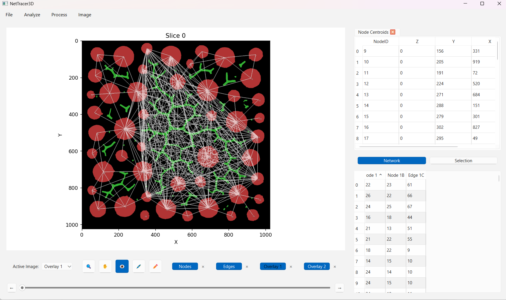

The nodes and edges images are adjusted according to how the network search
parameter used them, ensuring consistency with the output. Overlay1 receives a
binary overlay displaying the direct network connections as white lines. In the
bottom right table, the first two columns give the IDs of the linked nodes and
the third gives the ID of each pair's associated edge. In this case the majority
of nodes are joined through a large hub edge in the center, while nodes along the
sides have less direct connections.

Dealing With Trunks
~~~~~~~~~~~~~~~~~~~

In biological images, nodes in connectivity networks often merge into central
trunks, since nerves and blood vessels eventually return to a central structure.
Trunks may vastly overrepresent connectivity in such networks; whether this is
true of a given dataset requires appraisal. Several strategies are available.

**Converting all edges to nodes**

The most robust approach is to convert all edges in the network into nodes.
Select the **Edge → Node** option when first computing the network, or apply it
afterwards through **Process → Modify Network**:

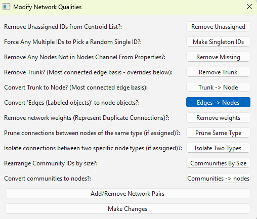

The result is shown below. All edges have become nodes, and the new edge-derived
nodes retain an edge identity in the ``node_identities`` property.

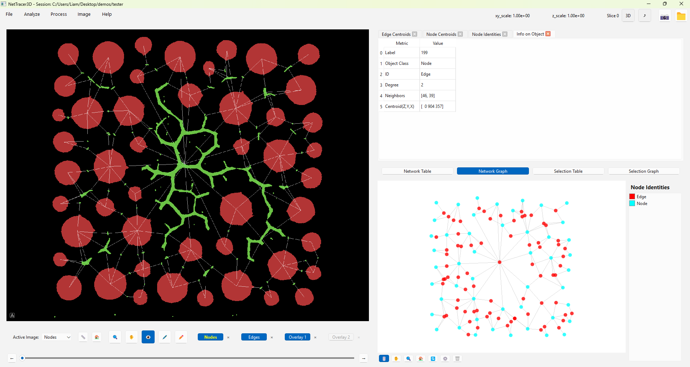

*Using edges as nodes alters the network dynamics somewhat: clustered regions
become oriented around hubs instead. This is worth keeping in mind when computing
statistics.*

**Auto-Trunk**

The **Auto-Trunk** button in the **Calculate Connectivity Network** menu handles
trunk elements automatically, forcing them to prefer connections among local
nodes while still permitting connections between distant nodes through the trunks
when no closer nodes are present. This option is slower, but handles trunk
elements logically without converting edges to nodes or arbitrarily converting or
removing trunks. The result in this case:

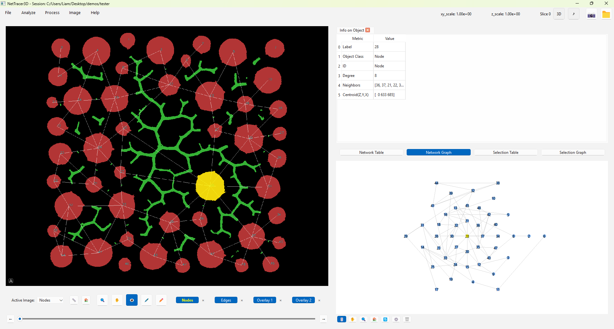

**Converting the trunk to a single node**

The central edge trunk can also be converted into a single node using **Process →
Modify Network**:

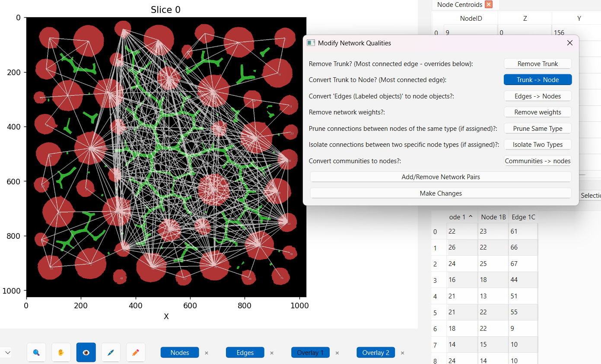

The trunk becomes a node. The resulting image with network overlay, alongside a
graph of the network, is shown below:

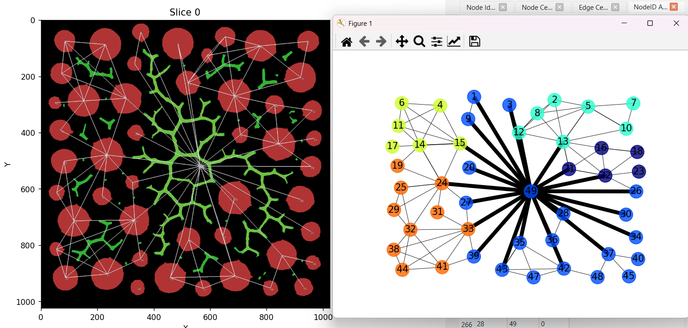

*This network was displayed using the 'Analyze → Show Network' option with
louvain community detection.*

Trunks may also be removed entirely, before or after network generation, if their
presence seems unnecessary — though the options above are generally preferable.

Loading the original image back in with the overlay shows how the image
information has been compressed into a set of connected integers:

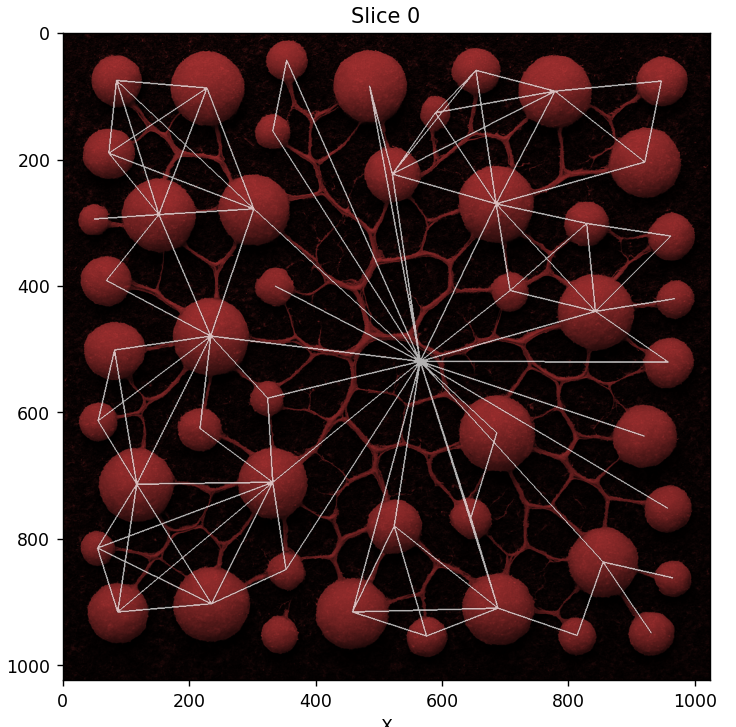

An image like this would not be difficult to label manually, but the same task
across thousands or tens of thousands of nodes in a 3D image is another matter.
This is where NetTracer3D excels. The image below shows one such application:
neural networks between groups of glomeruli in the human kidney, generated from
3D lightsheet images.

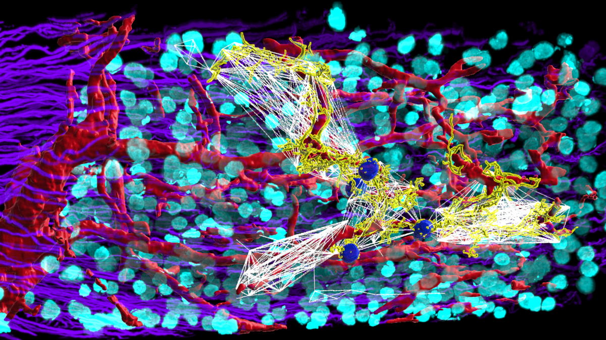

Analysis
--------

Several straightforward approaches are available for analysing connectivity
network data. From the analyze menu, choose **Stats → Network Related → Network
Statistics Histograms** to generate histograms describing the network:

.. image:: _static/network_histos.png
   :width: 400px
   :alt: histogram menu

Each green button yields a histogram of the nodal distribution of a network
property. Some are slow to compute for large networks, and some may be skewed
when the graph contains multiple disconnected components — any affected histogram
notes this in its title. To remove small, isolated components, right click the
largest component in the network graph view in the bottom right and choose
**Isolate Component**.

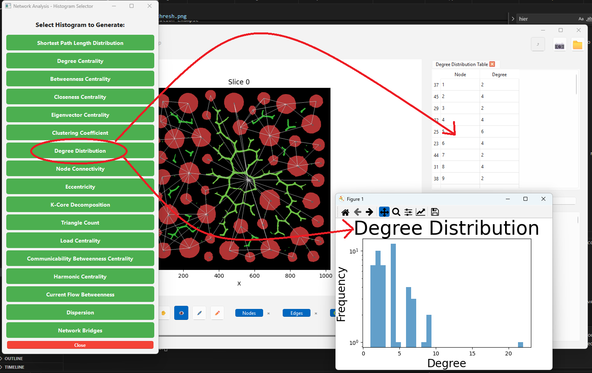

Histograms can be compared between datasets to identify observable differences,
and can also be used to threshold the nodes to find objects of interest. In the
example below, the degree distribution shows how many connections each node
makes; the underlying data is placed in the top right table.

NetTracer3D is designed to be highly interactive. Any upper right table with the
structure ``{col 1 - integers : col 2 - numbers}`` can be used to threshold the
nodes, which includes all of these network histograms.

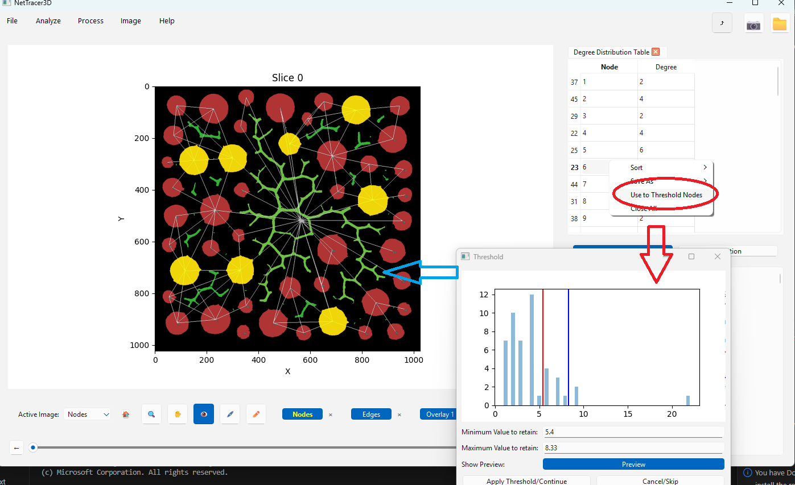

Right click the table and choose **Use to Threshold Nodes**, then select the
region of the histogram to keep in the interactive thresholder. Pressing **Apply
Threshold** reduces the nodes channel to that set of nodes — back up your original
nodes first. This does not alter the underlying network data. To keep the
selection without eliminating any nodes, simply close the threshold window; the
selection remains in the highlight overlay, where it can be exported or used for
anything else the highlight overlay supports.

If the nodes channel is the active channel, the subgraph of connections between
the selected objects is sent to the selection table in the lower right, which is
useful for pulling out a specific subregion of the network.

Right clicking the upper right table also offers the option to save the table as
a spreadsheet. The folder button in the top right loads spreadsheets in the same
format, allowing a saved table to be reused for thresholding.

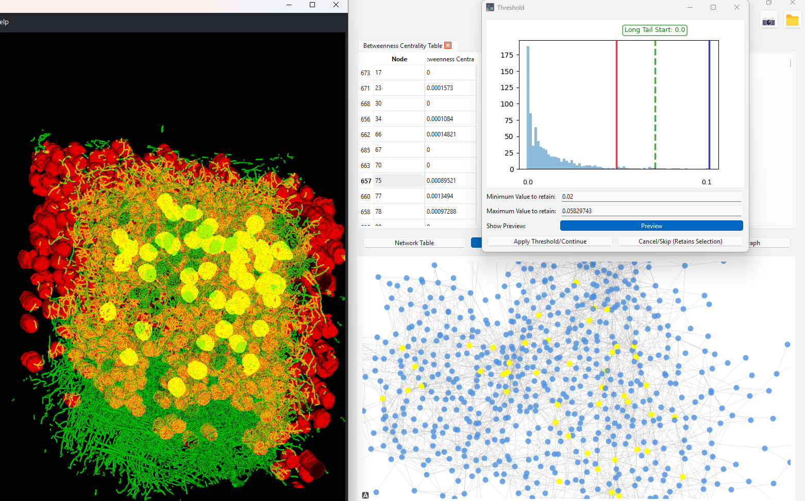

*Above: thresholding for objects with high betweenness centrality in a
kidney-glomeruli neural network.*

If you are unsure which histogram to create, use **Compute all analysis and
export to CSV** to view them all together.

Nodes may also be grouped into communities, which for a network may represent
functional groups. Use **Analyze → Create Communities Based on Network** to
assign them.

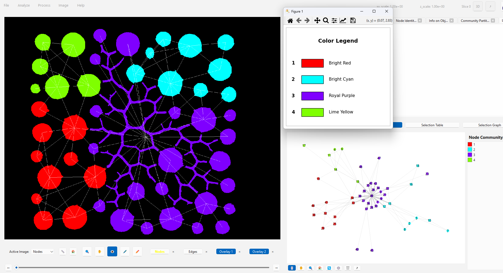

*Nodes with communities*

Exporting Data
--------------

Use **File → Save As** to export any channels generated or edited in NetTracer3D
in ``.tif`` format. For a bulk save, **Save As Network3D Object** dumps most of
the active data into a new folder in a format that can later be reloaded with
**Load Network3D Object**.

Tables and networks can be exported by right click as either ``.csv`` or
``.xlsx`` files for outside analysis. Networks additionally offer export options
for use with other network analysis software such as Gephi.

NetTracer3D is designed for a degree of end-to-end functionality, but exporting
allows downstream analysis in other software such as ImageJ or Microsoft Excel.

Using Network and Image Data in Python
~~~~~~~~~~~~~~~~~~~~~~~~~~~~~~~~~~~~~~

NetTracer3D is primarily designed for GUI use, but its properties can be
extracted for use in a Python script. This is most valuable for the network
property, which is stored as a networkx graph object, giving access to the entire
networkx toolbox for custom analysis pipelines. See https://networkx.org/ for
information on using the networkx graph object.

Many properties are organised into the ``Network_3D`` class. The simplest export
route is to save the ``Network_3D`` object from the GUI, then create a new
``Network_3D`` object in Python, load its components from the saved data, and
access the properties directly:

.. code-block:: python

   from nettracer3d import nettracer as n3d

   my_network = n3d.Network_3D() #Declare a new Network_3D object
   my_network.load_network(file_path = 'path/to/my/network/file/that/netracer3d_gui/had/saved/output_network.csv') #If we just want to load the networkx graph
   my_network.assemble(directory = 'path/to/my/directory/where/netracer3d_gui/saved/the/network3d_object') #If we want to load all the properties. Note that this function looks for the files with the names that the 'Save (As) Network 3D Object' option assigned them.
   
   #Using the properties in code directly (Note these will return None if they had not been assigned to anything - ie, if the file used to .assemble() was missing them):
   nodes = my_network.nodes #The nodes channel data, as a numpy array
   edges = my_network.edges #The edges channel data, as a numpy array
   overlay_1 = my_network.network_overlay #The overlay1 channel data, as a numpy array
   overlay_2 = my_network.id_overlay #The overlay2 channel data, as a numpy array
   network = my_network.network #The network data, as a network x graph object
   node_centroids = my_network.node_centroids #Centroids of nodes, as a python dictionary
   edge_centroids = my_network.edge_centroids #Centroids of edges, as a python dictionary
   node_communities = my_network.communities #Communities of nodes, as a python dictionary
   node_identities = my_network.node_identities #Identities of nodes, as a python dictionary
   xy_scale = my_network.xy_scale #The dimensional scaling of the flat xy plane that corresponds to the image used to generate this network, as a float.
   z_scale = my_network.z_scale #The z step size of the 3D stack that corresponds to the image used to generate this network, as a float.

   #If I do something to the above properties, and want to save, the contents of the Network_3D object can be saved with this method:
   my_network.dump(directory = 'path/to/save/the/outputs')

Next Steps
----------

Once you are comfortable generating connectivity networks, proceed to
:doc:`proximity` to learn about building networks based on proximity, which is
useful for analysing the spatial arrangement of cells.
